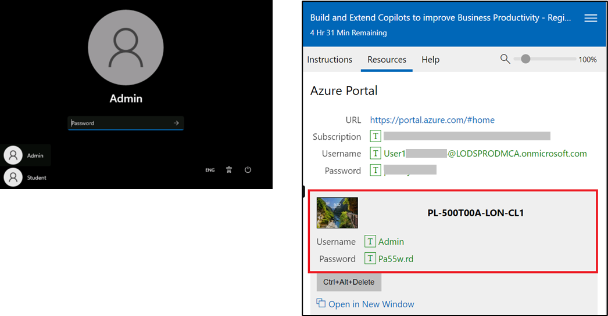
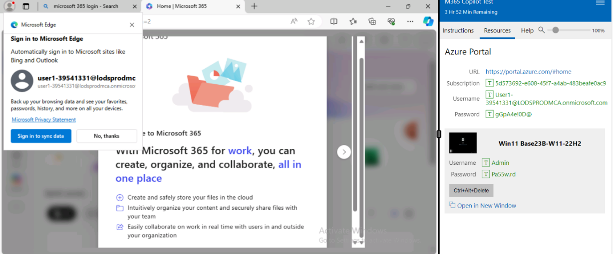
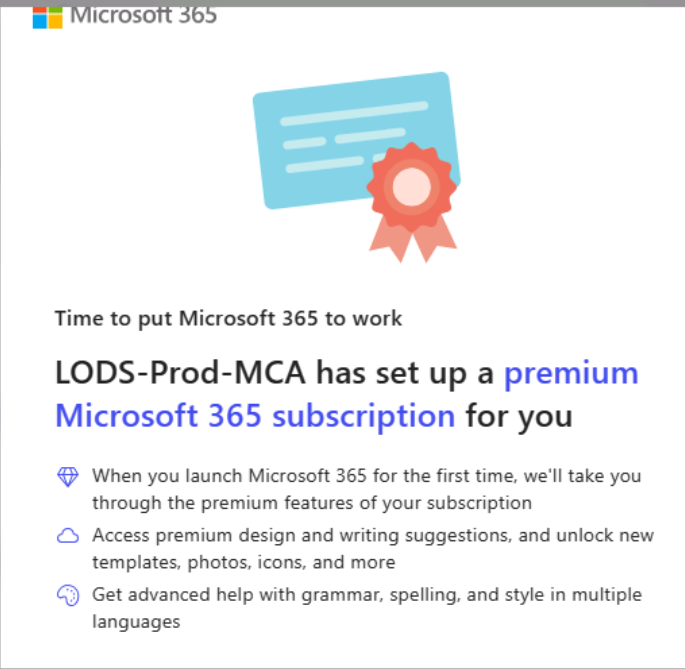
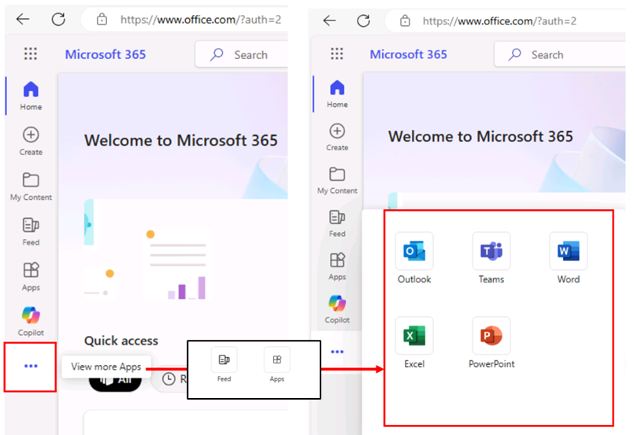
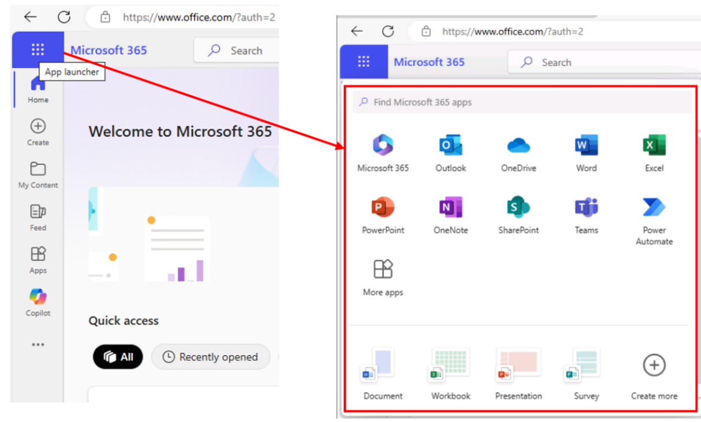
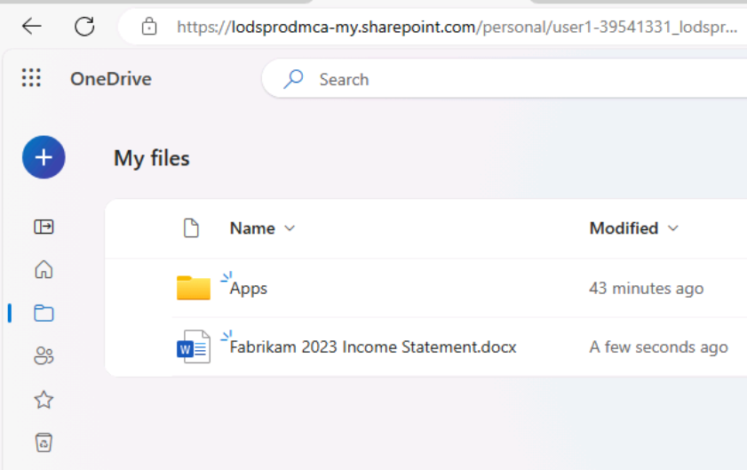

# Laboratorio 0: Preparazione all'esecuzione del laboratorio

## Accedere alla macchina virtuale del laboratorio

Nella schermata di accesso, selezionare l'account **Admin** nell'angolo in basso a sinistra dello schermo per accedere alla macchina virtuale del laboratorio utilizzando le credenziali fornite sotto **PL-500T00A-LON-CL1** nella **scheda Resources** a destra (vedere schermata).

**Nota**: non utilizzare il login **Studente**.

## Completare la configurazione dell'abbonamento a Microsoft 365 e accedere a Copilot per Microsoft 365

1.  Se nel browser Microsoft Edge è aperta una scheda di Microsoft 365, selezionatela subito; altrimenti, aprite una nuova       scheda e inserite il seguente URL:+++**https://portal.office.com**+++

2.  Per effettuare l'accesso, utilizzare le **credenziali di Microsoft 365** fornite nella sezione Azure Portal nella            **scheda Resources** a destra (vedere schermata).

    

    

    Ora potrete accedere a tutte le applicazioni di Microsoft 365 e avrete accesso a **Copilot per Microsoft 365**.

## Accedere e lanciare le applicazioni Microsoft 365

È possibile accedere e lanciare le applicazioni di produttività da:

- Link **View more Apps** (nel riquadro di navigazione a sinistra)

- **App Launcher** (disponibile in alto a sinistra appena sopra il riquadro di navigazione sinistro)

**Nota: a causa degli aggiornamenti del prodotto, il posizionamento delle icone di Office potrebbe essere diverso da quello 
indicato sopra.**

1.  Per avviare un'applicazione da **View more Apps:**

    Nel riquadro di navigazione in basso a sinistra, selezionare **View more Apps** (icona a forma di ellisse...) Apps per
    selezionare e aprire le applicazioni per ufficio con cui si desidera lavorare.

     

2.  Per lanciare un'applicazione da **App launcher**:

    Il programma di avvio delle applicazioni di Microsoft 365 è un menu di applicazioni e servizi per i quali si dispone di 
    una licenza e si apre quando si seleziona l'icona del programma di avvio delle applicazioni sulla pagina Microsoft 365. 
    Il programma di avvio delle app semplifica l'apertura e il passaggio da un'app all'altra, evidenziando le app utilizzate 
    di recente e fornendo un accesso rapido ai documenti Office online più recenti.

    

    **Nota**: se non si trova un'applicazione nel pop-up, selezionare l'icona **More apps** per selezionarla.

## Caricare le risorse del laboratorio su OneDrive

Gli asset del laboratorio (documenti di riferimento) che verranno utilizzati in questa sessione di laboratorio pratico sono 
disponibili in **C:\LabFiles.**

**Nota**: quando si deve fare riferimento a un file (un documento Word, un file Excel, ecc.) in un prompt di Copilot, il 
file DEVE essere salvato in un account OneDrive. Non è possibile collegarsi a un file memorizzato localmente sul PC.

1.  Nel riquadro di navigazione di Microsoft 365, selezionare OneDrive per aprirlo.

2.  Sfogliare la cartella **C:\LabFiles** per selezionare e caricare una copia dei documenti su OneDrive.

    **Nota**: è possibile scegliere di caricare una copia di tutti i documenti o i documenti relativi a un particolare 
    laboratorio.

     

     

     

     Ora i documenti sono disponibili in **Microsoft OneDrive** per lavorare con **Microsoft 365 Copliot** Lab.
