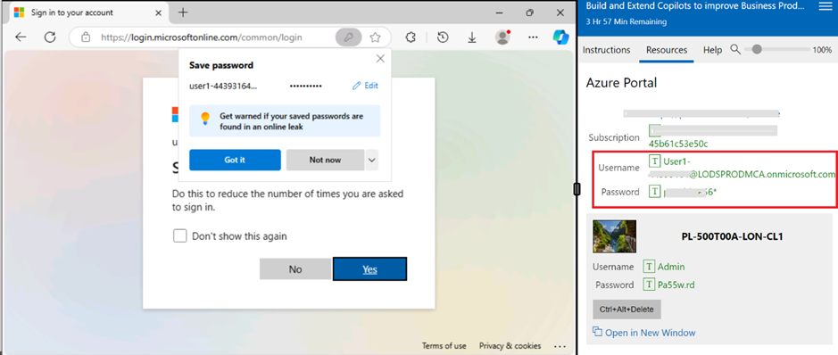
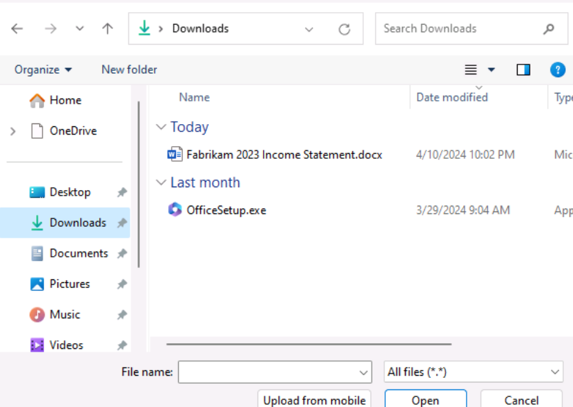

# Laboratorio 0: Preparación para la ejecución del laboratorio

## Inicie sesión en su máquina virtual de laboratorio

En la pantalla de inicio de sesión, seleccione **Admin** account en la esquina inferior izquierda de la pantalla para iniciar sesión en la máquina virtual de laboratorio utilizando las credenciales proporcionadas en **PL-500T00A-LON-CL1** en la pestaña Resources de la derecha (véase la captura de pantalla).

**Nota**: No utilice el login de **Student**.

## Complete la configuración de la suscripción a Microsoft 365 y acceda a Copilot para Microsoft 365

1.  Si tiene una pestaña de Microsoft 365 abierta en el navegador Edge, selecciónela ahora; de lo contrario, abra una nueva pestaña e introduzca la     
    siguiente URL:+++https://portal.office.com+++

2.  Utilice las **credenciales de Microsoft 365** proporcionadas en la sección Azure Portal de la **pestaña Resources** de la derecha (consulte la captura       de pantalla) para iniciar sesión.

    

    

    Ahora podrá acceder a todas las aplicaciones de Microsoft 365 y tendrá acceso a **Copilot para Microsoft 365**.

## Acceder e iniciar aplicaciones de Microsoft 365

Puedes acceder e iniciar las aplicaciones de productividad desde:

- El enlace **View more Apps**(en el panel de navegación de la izquierda)

- **App Launcher**(disponible en la parte superior izquierda, justo encima del panel de navegación izquierdo)

**Nota: Debido a las actualizaciones del producto, la colocación de los iconos de office puede ser diferente a la mencionada anteriormente**

1.  Para lanzar una aplicación desde **View more Apps:**

    En el panel de navegación de la parte inferior izquierda, seleccione **View more Apps** (icono de     
    elipsis ...) Aplicaciones para seleccionar y abrir        las aplicaciones ofimáticas con las que 
    necesite trabajar.

    

2.  Para lanzar una aplicación desde **App launcher**:

    El iniciador de aplicaciones de **Microsoft 365** es un menú de aplicaciones y servicios para los que 
    tienes licencia, y se abre cuando seleccionas el icono del iniciador de aplicaciones en la página de 
    Microsoft365. El App launcher facilita la apertura y el cambio entre aplicaciones, ya que resalta 
    las aplicaciones utilizadas recientemente y proporciona acceso rápido a los documentos recientes de 
    Office en línea.

    

    **Note**: Si no encuentra una aplicación en la ventana emergente, seleccione el icono **More Apps** 
    para seleccionarla.

## Cargar activos de laboratorio en OneDrive

Los activos de laboratorio (documentos de referencia) que utilizará en esta sesión práctica de laboratorio están disponibles en **C:\LabFiles.**

**Nota**: Cuando necesite hacer referencia a un archivo (un documento de Word, un archivo de Excel, etc.) en una consulta de Copilot, el archivo DEBE estar guardado en una cuenta de OneDrive. No puedes enlazar a un archivo almacenado localmente en tu PC.

1.  En el panel de navegación de **Microsoft 365**, seleccione **OneDrive** para abrirlo.

2.  Vaya a la carpeta C:\LabFiles para seleccionar y cargar una copia de los documentos en **OneDrive**.

    **Nota**: Puede optar por cargar una copia de todos los documentos o los documentos relacionados con el 
    laboratorio en cuestión.

     

     

     

    Ahora tendrá los documentos en **OneDrive** para trabajar con Copilot para laboratorios de
    **Microsoft 365**.
