# Laboratorio 1A: Capacitar a los ejecutivos para hacer más

## Objetivo:

En este laboratorio

- Utiliza Copilot en Word para crear un discurso que piensas pronunciar
  ante los accionistas de la empresa.

- Utilice Copilot en PowerPoint para crear una presentación en
  PowerPoint basada en el discurso que ha creado.

##  Ejercicio nº 1: Crear un discurso utilizando Copilot en Word

En este ejercicio, usted le indica a Copilot en Word que escriba un
discurso para usted basado en el Estado de Resultados de su empresa, el
cual está almacenado como un documento de Word. Este ejercicio le guiará
a través de una serie de instrucciones que puede utilizar para que
Copilot en Word genere su discurso y luego lo actualice en función de
los cambios sugeridos.

**Nota**: Cuando necesite hacer referencia a un
archivo (como la cuenta de resultados de su empresa) en una consulta de
Copilot, el archivo DEBE estar guardado en una cuenta de OneDrive. No
puede enlazar a un archivo almacenado localmente en su PC.

Puede hacer referencia/vincular un archivo en el
indicador de Copilot utilizando uno de los siguientes métodos:

- Seleccione el archivo de la lista de archivos **Most
  Recently Used** (MRU).

- Abra el archivo y copie su ruta utilizando la
  opción **Share**, luego pegue la ruta en el prompt siguiendo la barra
  oblicua (/).

- Copie la ruta del archivo desde el File Explorer y
  péguela en prompt después de la barra oblicua (/).

En este ejercicio, se selecciona Income Statement de
la empresa de la lista de ficheros MRU.

Realizará los siguientes pasos para que Copilot en Word cree un discurso
para usted basado en la Income Statement de su empresa:

1.  Si tiene una pestaña de Microsoft 365 abierta en el navegador Edge,
    selecciónela ahora; de lo contrario, abra una nueva pestaña e introduzca la siguiente 
    URL:+++https://www.office.com/+++ para ir a la página de inicio de **Microsoft 365**.

    **Nota**: Debe iniciar sesión (si se le solicita) utilizando las
    **Microsoft 365 Credentials** que se proporcionan en la pestaña
    **Resources** de la derecha.

2.  En el panel de navegación de **Microsoft 365**, seleccione
    **OneDrive** para abrirlo.

    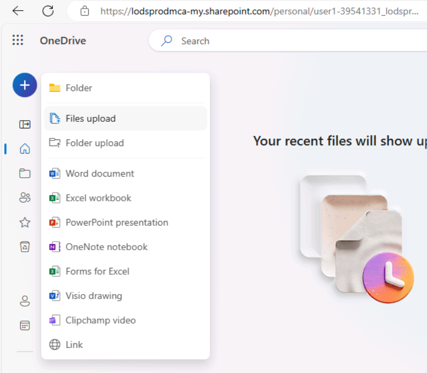

3.  Vaya a la carpeta **C:\LabFiles** para seleccionar y cargar una
    copia del documento **Fabrikam 2023 Income Statement** en
    **OneDrive**.

    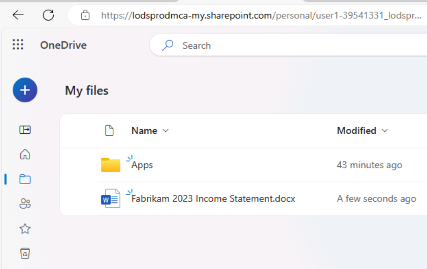

    **Nota**: Si ya ha cargado todos los recursos del laboratorio en
    OneDrive como se indica en **Preparación para la ejecución del
    laboratorio** (**Laboratorio 0**), puede omitir este paso.

4.  Abre y cierra el **Fabrikam 2023 Income Statement** (que
    has subido a **OneDrive**) para que aparezca en tu lista de archivos
    utilizados más recientemente (MRU).

    **Nota**: Si el documento abierto recientemente no aparece en la lista
    MRU, cierre la sesión de **Microsoft 365** y vuelva a iniciarla.

5.  En **Microsoft 365**, abra **Microsoft Word** y, a continuación,
    abra un nuevo documento en blanco. Haga clic en el icono Copilot que
    aparece como se muestra en la captura de pantalla.

    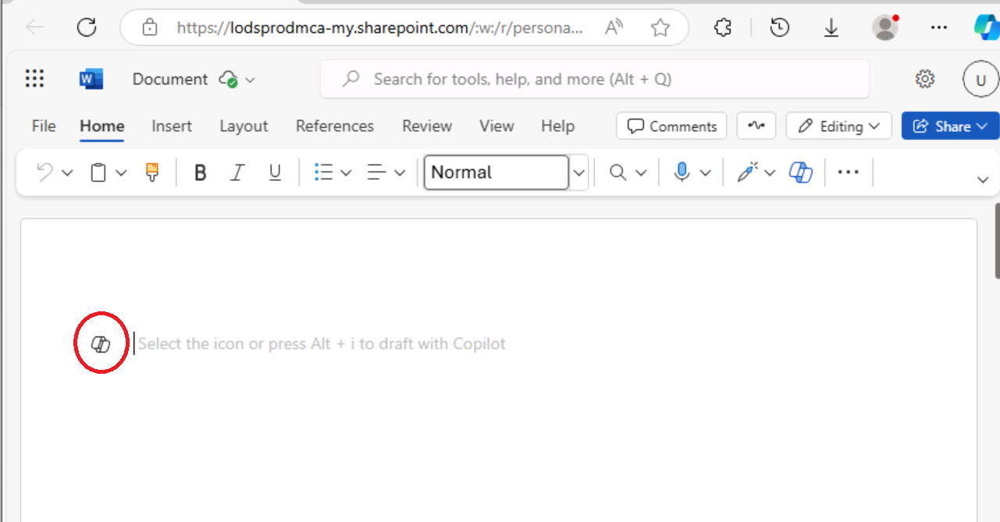

    Si pasa el ratón por encima del icono Copilot, verá la tooltip **Draft
    with Copilot**. Haga clic en el icono para mostrar la ventana **Draft
    with Copilot**.

    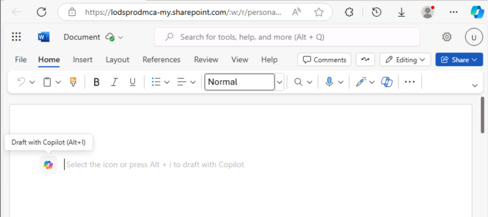

6.  En la ventana **Draft with Copilot** que aparece en la parte
    superior del documento en blanco, introduzca el siguiente prompt:

    ++Write a speech for the Fabrikam stakeholders that summarizes the results of the company's 2023   
    income statement found in the attached file.++

7.  En la ventana **Draft with Copilot**, seleccione el botón
    **Reference your content**. En la ventana emergente que aparece,
    seleccione el archivo.

    Si, por alguna razón, el archivo no se muestra, haga clic en **Browse
    files from cloud** en la ventana emergente.

    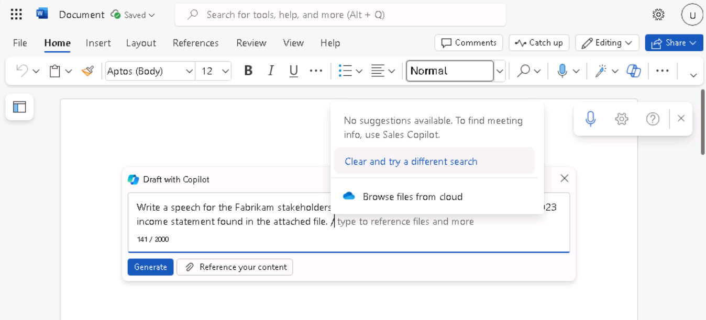

8.  En la ventana **Pick a file** que aparece, en la lista Archivo
    **Recent**, seleccione el archivo **Fabrikam 2023 Income
    Statement.docx** y, a continuación, seleccione el botón **Attach**.

    

9.  Observe cómo aparece el archivo en la pantalla. Seleccione
    **Generate**.

    

    **Nota**: Si, por alguna razón, sigue apareciendo el error **Something
    went wrong** al pulsar el botón **Generate** después de adjuntar el
    documento de referencia, haga dismiss en el error y continúe con el
    siguiente paso.

    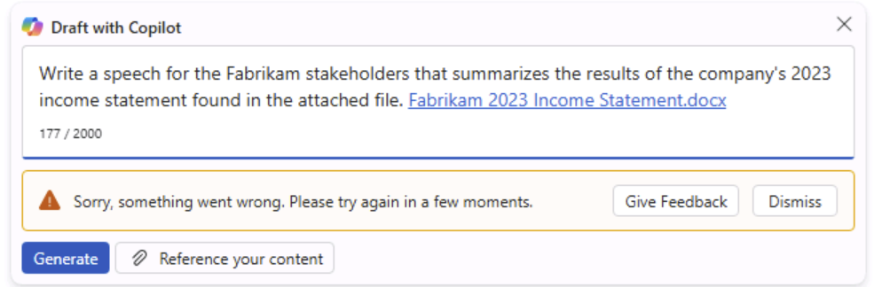

    Abra el archivo en un navegador y copie su ruta utilizando la opción
    Share, luego pegue la ruta en el prompt siguiendo la barra oblicua
    (/).

    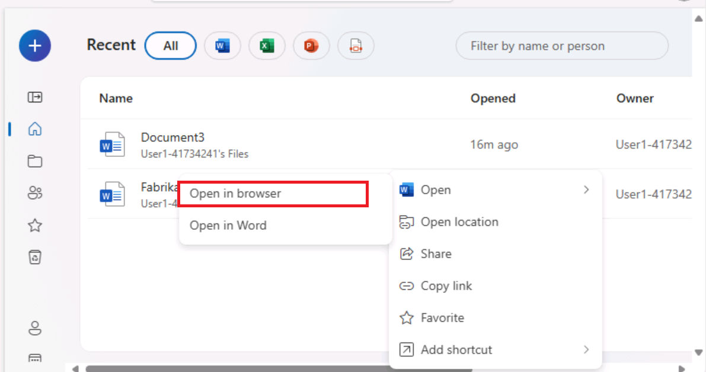

    

    **Importante**: Incluso después de intentarlo con
    la opción alternativa, si ve la misma excepción de "something went
    wrong", entonces en lugar de usar el cliente web de Word intente usar
    la versión de escritorio de Word.

    Si funciona cuando se utiliza la versión de
    escritorio de Word, por favor, siga el mismo en los próximos
    laboratorios, si usted ve el "something went wrong" excepción al hacer
    clic en el botón **Generate**.

10. En este punto, Copilot extrae los resultados financieros de la
    cuenta de resultados y redacta un discurso.

    

11. Después de revisar el discurso, decides que es un buen punto de
    partida, aunque hay algunas áreas que quieres modificar. En la
    ventana Copilot, al final del discurso, selecciona el botón
    **Conservarlo**.

12. Para empezar, revise los cambios sugeridos por el Copilot Editor.
    Seleccione el icono Editor que aparece en la barra de menús de la
    parte superior de la página.

    **Nota**: Podrá ver el icono **Editor** en la cinta
    de opciones clásica y no en la cinta de opciones de línea
    única.

    

13. En el panel **Editor** que aparece, fíjese en las categorías que
    aparecen bajo las secciones **Corrections** o **Refinements** y que
    muestran un número (que indica el número de problemas de esa
    categoría). Estas cuestiones suelen estar relacionadas con el tono
    del estilo de redacción utilizado en el documento.

    Debajo de la **Editor Score** hay un campo que le permite seleccionar
    el tono utilizado al escribir el discurso. Actualmente muestra
    **Formal Writing**, que es el tono predeterminado que Copilot utilizó
    al escribir este discurso. Cuando no indica qué estilo de escritura
    utilizar en su indicación, la **Formal Writing** es el tono
    predeterminado que utiliza Copilot. Seleccione este campo para ver sus
    opciones. Usted prefiere un tono que suene profesional, así que
    seleccione **Professional** en el menú desplegable. Observe si cambia
    **Editor Score**.

14. En las categorías que aparecen en las secciones **Corrections** o
    **Refinements**, puede revisar los cambios que se produjeron en las
    categorías en función del cambio del estilo de redacción de Formal a
    Professional. Seleccione cada categoría que muestre un número
    (indicando el número de problemas para esa categoría). Al hacerlo,
    podrá revisar las sugerencias en todo el documento para esa
    categoría. Para cada sugerencia, seleccione el cambio sugerido o
    **Ignore**. Repita este proceso hasta que todas las categorías
    muestren una marca de verificación.

    Cambie el estilo de redacción a **Casual** y compruebe si cambia la
    **Editor Score**. Si alguna categoría muestra un número, revise la
    categoría y vea lo que el Editor ha marcado. Si desea mantener el
    estilo de redacción como Profesional, seleccione **Ignore** los
    cambios sugeridos. Revise todos los cambios sugeridos para ver las
    diferencias marcadas entre los estilos Profesional y Casual.

    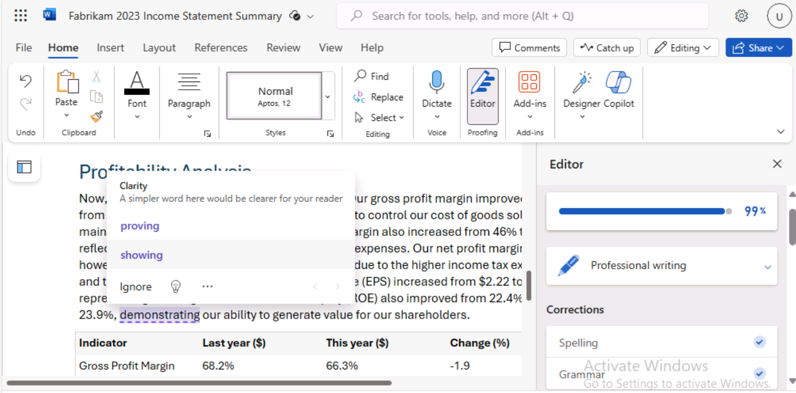

15. Guarde el archivo en su cuenta de OneDrive con el siguiente nombre
    de archivo: **Fabrikam 2023 Financial presentation.docx**. El
    siguiente ejercicio utiliza este documento.

    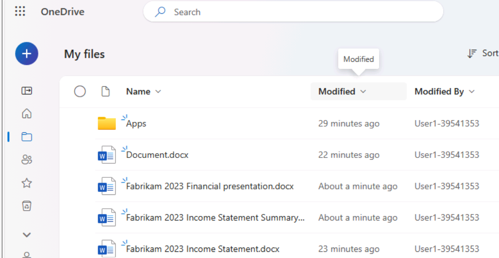

    **Importante**: Asegúrese de guardar el archivo en **OneDrive** y no
    en su PC local. En el siguiente ejercicio, utilice Copilot en
    PowerPoint para crear una presentación de diapositivas basada en este
    documento. El documento debe estar en **OneDrive** para que Copilot
    pueda acceder a él.

16. Cierre la pestaña que contiene este documento en su navegador
    Microsoft Edge.

## Ejercicio nº 2: Crear una presentación de diapositivas con Copilot en PowerPoint

En este ejercicio, utilizará Copilot en PowerPoint para crear una
presentación de diapositivas basada en su discurso (a los accionistas
basado en Income Statement) que creó utilizando Copilot en Word para
escribir su discurso.

En el ejercicio anterior, accedió a Income Statement de la empresa en
Copilot accediendo al archivo desde la lista de archivos utilizados más
recientemente (MRU). En este ejercicio, va a adquirir experiencia
accediendo a un archivo utilizando un proceso diferente. En lugar de
utilizar la lista MRU, usted planea acceder al discurso copiando el
enlace al archivo **Fabrikam 2023 Financial presentation.docx** que creó
en el ejercicio anterior.

Realice los siguientes pasos para que Copilot en PowerPoint cree un
borrador de su presentación:

1.  Si tiene una pestaña de Microsoft 365 abierta en el navegador Edge,
    selecciónela ahora; de lo contrario, abra una nueva pestaña e
    introduzca la siguiente URL:+++https://www.office.com/+++ para ir a la
    página de inicio de **Microsoft 365**.

    **Nota**: Debe iniciar sesión (si se le solicita) con las
    **credenciales de Microsoft 365** que se proporcionan en la pestaña
    **Resources** de la derecha.

2.  En el panel de navegación de **Microsoft 365**, seleccione **Word**
    para abrir la página de archivos de Word.

3.  En la página de archivos de **Word**, desplácese hasta la lista de
    archivos recientes y seleccione **Fabrikam 2023 Financial
    presentation.docx** para abrirlo en una nueva pestaña del navegador
    Microsoft Edge.

    

4.  Copie la URL del documento seleccionando el botón **Share** en
    la esquina superior derecha, encima de la cinta y seleccionando
    **Copy link** en el menú desplegable que aparece.

    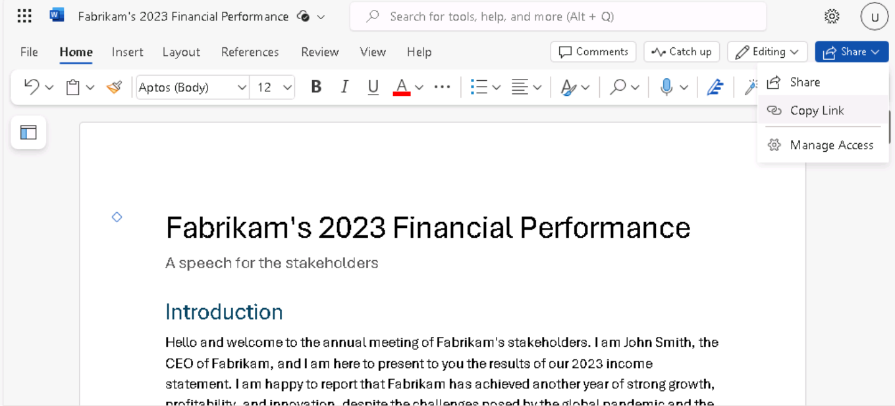>

    **Nota**: Puede que ocasionalmente tengas problemas al utilizar la URL
    desde la barra de direcciones. Copie el enlace desde la bandeja Share
    para obtener mejores resultados.

5.  Cierre el cuadro de diálogo **Link Copied** que aparece en Word.

    

6.  Cierre la pestaña de este documento en tu navegador Microsoft Edge.
    Volverá a la pestaña **Word | Microsoft 365**.

7.  En la página del archivo Word, seleccione el icono **PowerPoint** en
    el panel **App Launcher** de la parte superior izquierda

    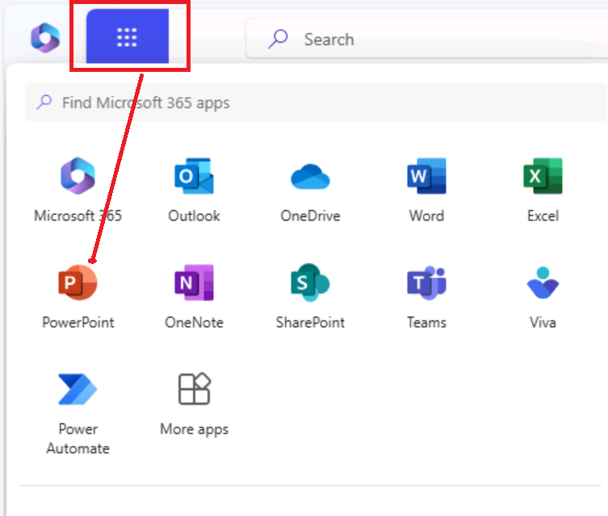

8.  En **PowerPoint**, abra una nueva presentación en blanco.

9.  Seleccione el icono **Copilot** (resaltado en rojo como se muestra
    en la captura de pantalla)

    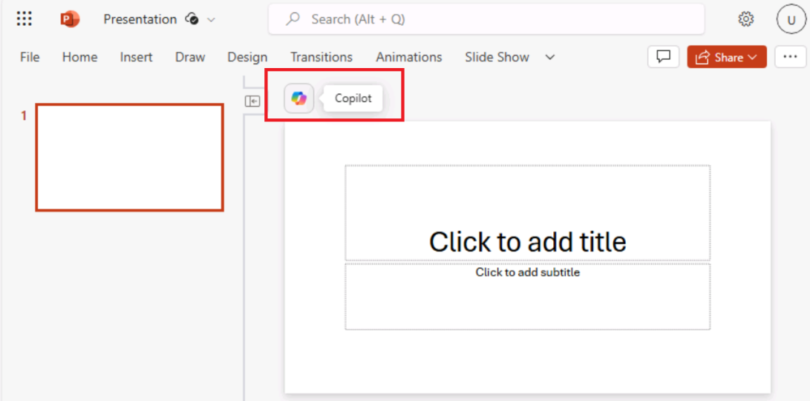

    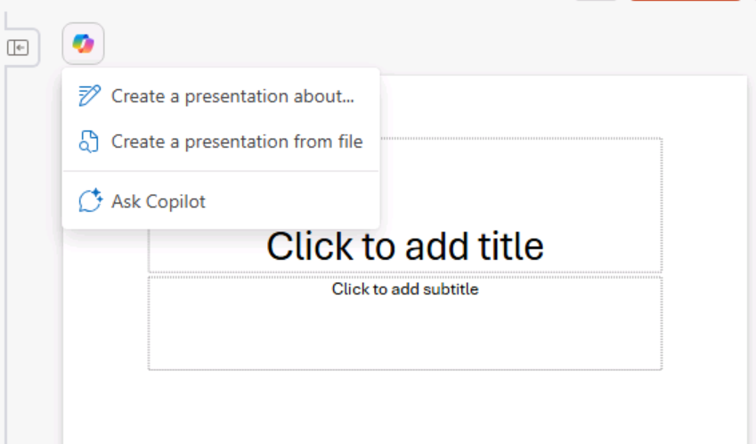

10. En el panel **Copilot** que aparece, puede elegir entre varios
    mensajes predefinidos.

11. Seleccione la opción **Create presentation from file**.

    **Nota**: En el ejercicio anterior, usted vinculó un archivo a un
    prompt seleccionando el archivo de la lista MRU. En este ejercicio,
    usted ganará experiencia vinculando un archivo a un prompt utilizando
    otro método.

    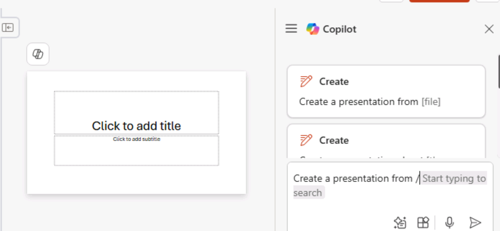

12. Encima del campo de prompt, en la parte inferior del panel de
    **Copilot**, aparecerá una ventana de **Suggestions** que contiene
    los tres archivos utilizados más recientemente.

    Normalmente, el archivo **Fabrikam 2023 Financial presentation.docx**
    que creó en el ejercicio anterior aparecerá en la lista MRU. Si no es
    así, debe pegar el enlace (que copió en el paso 5) al archivo en el
    campo de prompt.

    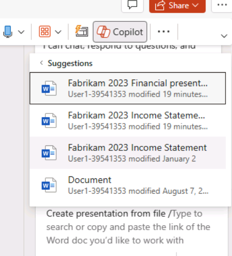

13. En el campo de prompt, Copilot escribe automáticamente **Crear
    presentación a partir de archivo /**. Coloque el cursor después de
    la barra oblicua e introduzca **Ctrl+V** para pegar el enlace a este
    documento en la consulta.

    

14. Seleccione el icono **Send**.

15. Este mensaje hace que Copilot cree una presentación de diapositivas
    basada en el documento. Al hacerlo, muestra el esquema de la
    presentación y una lista de las características incluidas en la
    presentación. Estas características pueden incluir notas del orador,
    imágenes, diseños para organizar las diapositivas y una etiqueta de
    sensibilidad General.

    

16. Ahora puede revisar las diapositivas y realizar las actualizaciones
    necesarias. Puede utilizar la herramienta **Designer** para ajustar
    los diseños.

    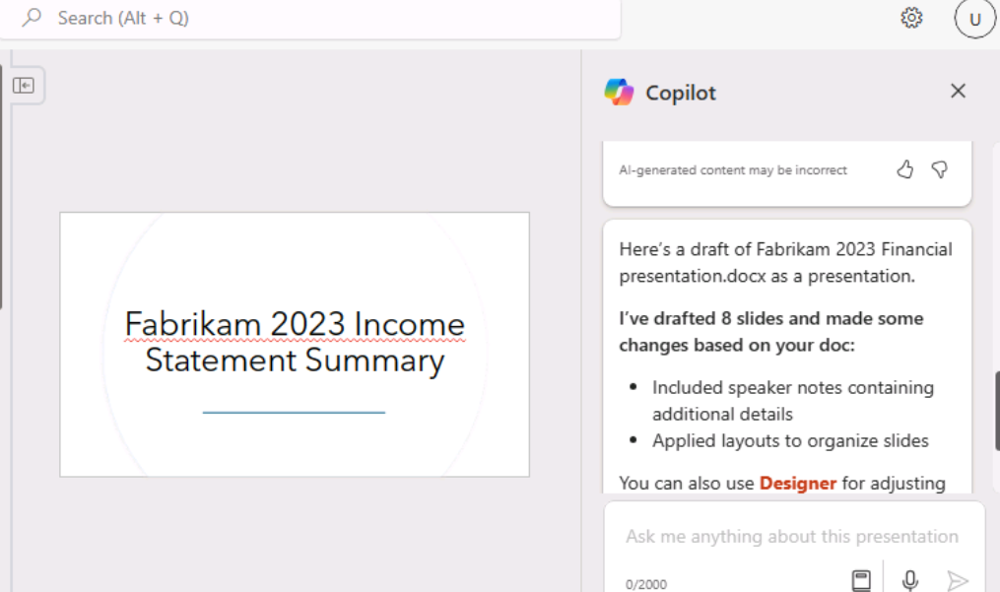

17. Cuando revise las diapositivas, esté atento a las referencias a "the
    speaker" o a cualquier otro elemento que deba cambiar.

    

    Atención: Preste atención a la referencia a "The speaker" junto con la
    segunda frase que comienza con "La presentación resumirá...". que
    puede ser creada por Copilot.

    **Ejemplo**: El ponente introduce una presentación sobre los aspectos
    más destacados de la cuenta de resultados de Fabrikam en 2023, en la
    que se informa de un sólido rendimiento y crecimiento a pesar de los
    retos derivados de la pandemia mundial y la competencia del mercado.
    La presentación resumirá los principales resultados y explicará cómo
    se alinean con la visión y los objetivos estratégicos de la empresa.

    Debería eliminar este tipo de referencias, ya que son más aplicables
    como notas de orador que como texto destinado al público.

18. Revise las notas del orador que Copilot ha añadido a la
    presentación. Compruebe que indican los puntos que quiere destacar
    durante la presentación.

19. Pruebe a utilizar Copilot para actualizar la presentación. Por
    ejemplo, introduzca la siguiente solicitud:

    ++Añada una nueva diapositiva después de la diapositiva 1. Esta
    diapositiva debería tener una imagen de un pico de montaña en los
    Alpes. Hacia la parte inferior de la diapositiva, añada un cuadro de
    texto que diga: El lema de la empresa Fabrikam: " We overcome every
    obstacle ". Añade notas del orador a esta nueva diapositiva que hablen
    de cómo Fabrikam trabaja diligentemente para resolver las peticiones
    de cada cliente, sin dejar nunca que ningún obstáculo se interponga en
    su camino hacia el éxito.++

    

    Revise la nueva diapositiva creada. Aunque en los ejercicios de
    laboratorio restantes no se utiliza esta presentación, puede descartarla
    o guardarla si lo desea para futuras consultas.

## Resumen

En este laboratorio, ha visto

- La utilización de las funciones de Microsoft Copilot en Word para
  redactar un discurso completo que incluya la generación de contenidos
  que comuniquen eficazmente mensajes clave y actualizaciones de la
  empresa.

- Cómo aprovechar Microsoft Copilot en PowerPoint para transformar el
  discurso creado en Word en una presentación visualmente atractiva e
  informativa, creando diapositivas que destacaran los puntos
  principales del discurso, utilizando Copilot para garantizar la
  coherencia y claridad del formato de la presentación.
