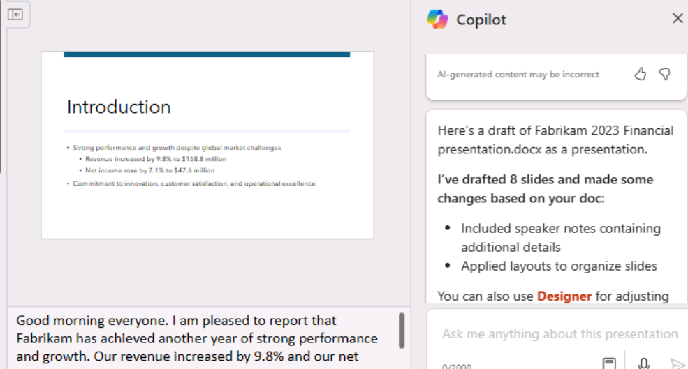

# ラボ1A：エグゼクティブのエンパワーメント

## 目的

このラボでは

- WordのCopilotを使って、会社の株主に対して行う予定のスピーチを作成します。

- PowerPointのCopilotを使用して、作成したスピーチを基にPowerPointプレゼンテーションを作成します。

## 練習1：WordでCopilotを使ってスピーチを作成する

この演習では、Word
文書として保存されている会社の損益計算書に基づいてスピーチを作成するよう、Word
の Copilot
に指示します。この演習では、一連のプロンプトを使用して、Copilot in Word
でスピーチを作成し、提案された変更に基づいてスピーチを更新します。

**注**：Copilotプロンプトでファイル（会社の損益計算書など）を参照する必要がある場合、ファイルはOneDriveアカウントに保存する必要があります。PC
にローカルに保存されているファイルにリンクすることはできません

Copilotプロンプトでファイルを参照/リンクするには、次のいずれかの方法を使用します：

- MRU（Most Recently Used）ファイルリストからファイルを選択します。

- ファイルを開き、**共有**オプションを使用してパスをコピーし、フォワードスラッシュ（/）に続くプロンプトにパスを貼り付 
  けます。

- ファイルエクスプローラーからファイルのパスをコピーし、フォワードスラッシュ（/）に続くプロンプトに貼り付ける。

この演習では、MRUファイルリストから会社の損益計算書を選択します。

Copilot（Word）を使用して、会社の損益計算書に基づいてスピーチを作成するには、次の手順を実行します：

1.  EdgeブラウザでMicrosoft 365のタブを開いている場合は、今すぐ選択します。
    そうでない場合は、新しいタブを開き、次のURLを入力します。**https://www.office.com
    Microsoft 365のホームページに移動します。**

> **注**: 右側の に**ある \[リソース\] タブで**提供される **Microsoft 
> 365 認証情報を**使用してサインインする必要があります
> (プロンプトが表示された場合)。

2.  **Microsoft 365の**ナビゲーションペインで、**OneDriveを**選択して開きます。

    

3.  **C:♪LabFiles** フォルダを参照して、 **Fabrikam 2023 Income
    Statement 文書** のコピーを選択し、**OneDrive**
    にアップロードします。

    

    **注**：「**ラボ実施の準備**（**ラボ0**）」の指示に従って、すべてのラボ資産を OneDrive にアップロード済みの場合 
    は、この手順を省略できます。

4.  **Fabrikam 2023 Income
    Statement文書**（**OneDriveに**アップロードしたもの）を開いて閉じ、最近使用したファイル（MRU）リストに表示します。

**注**: 最近開いたドキュメントが MRU
リストに表示されない場合は、**Microsoft 365**
からログアウトし、再度サインインしてください。

5.  **Microsoft 365でMicrosoft
    Wordを**開き、新しい空白の文書を開きます。スクリーンショットのように表示されるCopilotアイコンをクリックします。

> Copilotアイコンにマウスカーソルを合わせると、**Draft with
> Copilotツールチップが表示さ**れます。アイコンをクリックすると、Draft
> with Copilotウィンドウが表示されます。
>
> 

6.  白紙文書の上部に表示される「**Copilotで下書き」**ウィンドウで、次のプロンプトを入力します：

> **ファブリカムのステークホルダー向けに、添付ファイルにある
> 2023 年の損益計算書の結果を要約したスピーチを書いて**ください。

7.  **Draft with Copilot］**ウィンドウで、［**Reference your
    content］**ボタンを選択します。表示されるポップアップウィンドウで、ファイルを選択します。

> 何らかの理由でファイルが表示されない場合は、ポップアップウィンドウで**「クラウドからファイルを参照**」をクリックします。
>
> 

8.  表示された「**Pick a file」**ウィンドウで、「**Recent**
    file」リストの下にある「**Fabrikam 2023 Income
    Statement.docx」**ファイルを選択し、**「Attach」**ボタンを選択します。

> 

9.  プロンプトにどのようにファイルが表示されるかに注意してください。**Generateを**選択する。

> 
>
> **注**：何らかの理由で、参照ドキュメントを添付した後に**「Generate」**ボタンをクリックすると、「**Something
> went
> wrong」**エラーが表示され続ける場合は、そのエラーを解除して次のステップに進んでください。
>
> 
>
> ブラウザでファイルを開き、共有オプションを使用してパスをコピーし、フォワードスラッシュ（/）に続くプロンプトにパスを貼り付けます。
>
> 
>
> 
>
> **重要**：代替オプションを試しても、同じ「something
> went
> wrong」例外が表示される場合は、Wordのウェブクライアントを使用するのではなく、Wordのデスクトップバージョンを使用してみてください。
>
> デスクトップ版のWordを使用しているときにうまくいく場合、**生成**ボタンをクリックしたときに「something
> went
> wrong」という例外が表示される場合は、今後のラボでも同じようにしてください。

10. この時点で、Copilotは損益計算書から財務結果を抽出し、スピーチを作成します。

> 

11. スピーチを確認した後、修正したい部分がいくつかあるものの、良い出発点であると判断します。スピーチの最後にあるCopilotウィンドウで、**Keep
    it**ボタンを選択します。

12. Copilot
    Editorから提案された変更点を確認することから始めます。ページ上部のメニューバーに表示される**Editor**アイコンを選択します。

> **注**：エディターアイコンはクラシックリボンに表示され、シングルラインリボンには表示されません。
>
> 

13. 表示される**「エディター」**ペインで、「**修正」**または「**リファインメント」**セクションの下に表示されるカテゴリーに注目してください。これらの問題は、多くの場合、文書で使用されている文体のトーンと関連しています。

> **Editor
> Scoreの**下には、スピーチを書くときに使用したトーンを選択するフィールドがあります。現在、「**Formal
> writing**」と表示されていますが、これは Copilot
> がこのスピーチを作成するときに使用したデフォルトのトーンです。プロンプトで使用する文体を指定しない場合、Copilot
> がデフォルトで使用するトーンは **Formal writing**
> です。このフィールドを選択すると、オプションが表示されます。プロフェッショナルな口調を希望する場合は、ドロップダウンメニューから**「Professional**」を選択します。**Editor
> Score］が**変化するかどうかを確認してください。

14. **Corrections** or
    **Refinements**セクションの下に表示されるカテゴリーでは、ライティングスタイルをFormalからProfessionalに変更したことに基づいて、カテゴリーで発生した変更を確認することができます。数字（そのカテゴリの問題数を示す）が表示されている各カテゴリを選択します。そうすることで、そのカテゴリに関する文書全体の提案を確認することができます。各提案について、提案された変更を選択するか、「**無視」を**選択します。すべてのカテゴリーにチェックマークが表示されるまで、このプロセスを繰り返します。

> ライティングスタイルを**カジュアルに**変更し、**エディタースコアが**変化するかどうかを確認する。カテゴリーに数字が表示されている場合は、そのカテゴリーを見直し、エディターがどのようなフラグを立てたかを確認します。文章スタイルをプロフェッショナルに保ちたい場合は、「提案された変更を**無視する**」を選択します。提案された変更点をすべて確認し、プロフェッショナルスタイルとカジュアルスタイルの間でフラグが立てられた違いを確認します。
>
> 

15. このファイルを次のファイル名で OneDrive アカウントに保存します：
    **Fabrikam 2023 Financial
    presentation.docx**.次の演習では、この文書を使用します。

> 
>
> **重要**:
> ファイルはローカルPCではなく**OneDriveに**保存するようにしてください。次の実習では、PowerPointのCopilotを使用して、このドキュメントに基づいてスライドプレゼンテーションを作成します。Copilotがドキュメントにアクセスするには、ドキュメントが**OneDriveに**ある必要があります。

16. Microsoft
    Edgeブラウザで、このドキュメントが含まれているタブを閉じます。

練習その2：PowerPointでCopilotを使用してスライドプレゼンテーションを作成する

この演習では、PowerPoint の Copilot を使用して、Word の Copilot
を使用して作成したスピーチ (損益計算書に基づく株主へのスピーチ)
に基づくスライド・プレゼンテーションを作成します。

前回の演習では、Copilot の \[MRU (Most Recently Used)\] ファイル
リストからファイルにアクセスして、会社の損益計算書にアクセスしました。この演習では、別のプロセスを使用してファイルにアクセスする経験を積みます。MRU
リストを使用する代わりに、前の演習で作成した **Fabrikam 2023 Financial
presentation.docx**
ファイルへのリンクをコピーして、スピーチにアクセスする予定です。

PowerPointのCopilotにプレゼンテーションの下書きを作成させるには、以下の手順を実行します：

1.  EdgeブラウザでMicrosoft
    365のタブを開いている場合は、今すぐ選択します。そうでない場合は、新しいタブを開き、次のURLを入力します：[**https://www.office.com
    Microsoft
    365のホームページに移動します。**](https://www.office.com/)

> **注**: 右側の**「Resources」タブで**提供される **Microsoft 365
> 認証情報を**使用してサインインする必要があります
> (プロンプトが表示された場合)。

2.  **Microsoft
    365の**ナビゲーションペインで**Wordを**選択し、Wordファイルのページを開きます。

3.  **Wordの**ファイルページで、最近のファイルのリストまでスクロールダウンし、**Fabrikam
    2023 Financial presentation.docxを**選択してMicrosoft
    Edgeブラウザの新しいタブで開きます。

> 

4.  リボンの上にある右上の**共有**ボタンを選択し、表示されるドロップダウンメニューから**リンクをコピーを**選択して、ドキュメントのURLをコピーします。

> 
>
> **注**：アドレスバーからURLを使用する際、問題に出くわすことがあります。最良の結果を得るためには、共有トレイからリンクをコピーしてください。

5.  Wordに表示される**「コピーしたリンク」**ダイアログボックスを閉じる。

> 

6.  Microsoft
    Edgeブラウザでこのドキュメントタブを閉じます。**Word｜Microsoft
    365**」タブに戻ります。

7.  Wordファイルページで、左上の**App
    Launcher**ペインにある**PowerPoint**アイコンを選択します。

> 

8.  **PowerPointで**、新しい空白のプレゼンテーションを開きます。

9.  **Copilot**アイコンを選択します（スクリーンショットのように赤くハイライトされています）。

> 
>
> 

10. 表示される**Copilot**ペインでは、いくつかの定義済みプロンプトから選択できます。

11. **ファイルからプレゼンテーションを作成\]**プロンプトを選択します。

> **メモ**：前の演習では、MRUリストからファイルを選択してプロンプトにリンクした。この演習では、別の方法でファイルをプロンプトにリンクする方法を学びます。
>
> 

12. **Copilot**ペインの下部にあるプロンプトフィールドの上に、最近使用した3つのファイルを含む**Suggestions**ウィンドウが表示されます。

> 通常、前の演習で作成した **Fabrikam 2023 Financial presentation.docx**
> が MRU
> リストに表示されます。表示されない場合は、ファイルへのリンク（ステップ5でコピーしたもの）をプロンプトフィールドに貼り付ける必要があります。
>
> 

13. プロンプトフィールドに、Copilotが自動的に「**Create presentation
    from file /」と**入力します。
    スラッシュの後にカーソルを置き、**Ctrl+Vを**入力して、このドキュメントへのリンクをプロンプトに貼り付けます。

> 

14. **送信**アイコンを選択します。

15. このプロンプトを表示すると、Copilotがドキュメントに基づいてスライドプレゼンテーションを作成します。その際、プレゼンテーションのアウトラインと、プレゼンテーションに含まれる機能のリストが表示されます。これらの機能には、発言者ノート、画像、スライドを整理するためのレイアウト、および一般的な感度ラベルが含まれます。

> 

16. これでスライドを自由に見直し、必要な更新を行うことができます。**デザイナー**ツールを使ってレイアウトを調整できます。

> 

17. スライドを見直しながら、"the
    speaker"（講演者）への言及や、変更が必要な項目がないか注意してください。
    

> 警告Copilotによって作成された可能性のある、"The speaker
> "への言及と、"The presentation will summarize...
> "で始まる第2文に注意してください。
>
> 例世界的なパンデミックと競争市場という課題にもかかわらず、好調な業績と成長を報告するファブリカムの2023年損益計算書ハイライトに関するプレゼンテーションを紹介する。プレゼンテーションでは、主な業績を要約し、それらが会社の戦略的ビジョンと目標にどのように合致しているかを説明する。
>
> このような言及は、聴衆向けの文章というより、講演者用のメモとしてより適切なので、削除すべきです。

18. Copilotがプレゼンテーションに追加したスピーカーノートを確認します。プレゼン中に強調したいポイントを確認してください。

19. Copilotを使用してプレゼンテーションを更新してみる。たとえば、次のプロンプトを入力します：

> **スライド1の後に新しいスライドを追加する。このスライドには、アルプスの山頂の画像を載せます。スライドの一番下に、次のようなテキストボックスを追加します：Fabrikamの社是 -
> "We overcome every
> obstacle."（私たちはあらゆる障害を克服します）。この新しいスライドに、Fabrikamがいかに顧客のあらゆる要望を解決するために真摯に取り組み、いかなる障害にも決して立ち向かわずに成功を収めているかについて語るスピーカーノートを追加します**。
>
> 

作成された新しいスライドを見直す。残りのラボ演習ではこのプレゼンテーションは使用しませんが、将来の参考のために破棄するか、保存しておくことができます。

概要

このラボでは

- Microsoft
  CopilotのWord機能を活用し、キーメッセージや会社の最新情報を効果的に伝えるコンテンツの作成を含む、包括的なスピーチの草稿を作成。

- MicrosoftのCopilotをPowerPointで活用し、Wordで作成したスピーチを視覚的に魅力的で情報量の多いプレゼンテーションに変換。Copilotを使用してプレゼンテーション形式の一貫性と明瞭性を確保しながら、スピーチの要点を強調するスライドを作成した。
