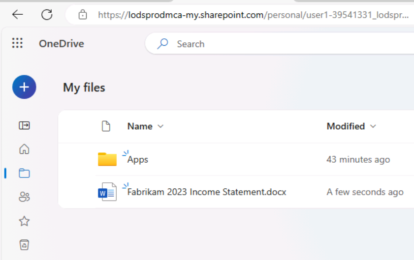
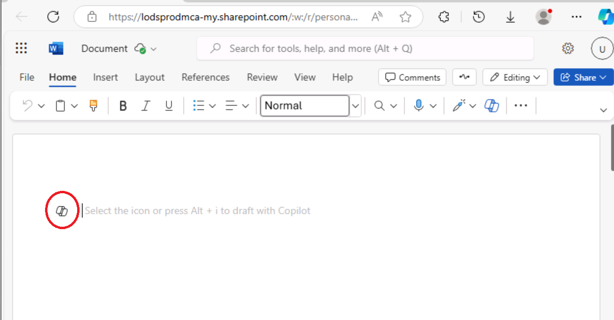
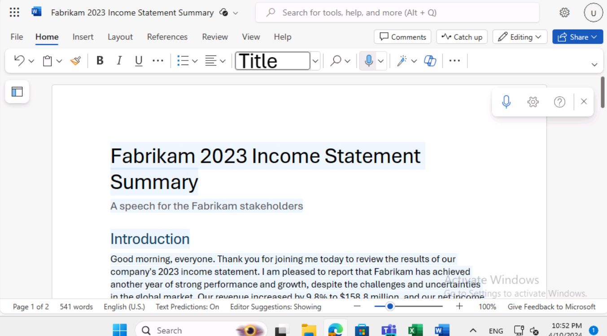
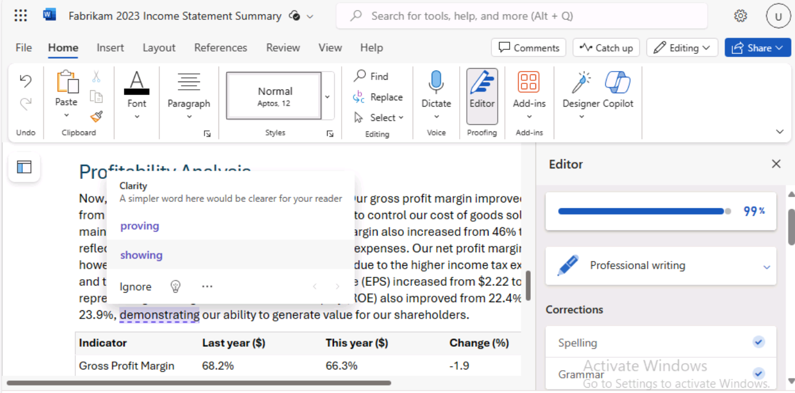
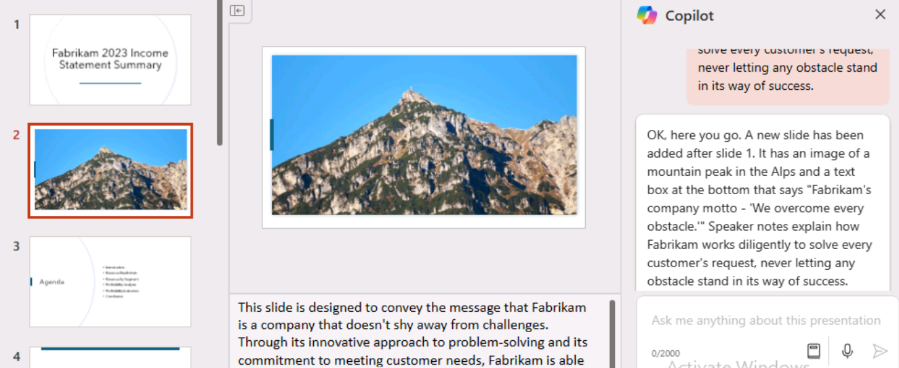

# Laboratorio 1A: Dare ai dirigenti la possibilità di fare di più

## Obiettivo:

In questo laboratorio

- Utilizzate Copilot in Word per creare un discorso che intendete tenere
  agli azionisti della società.

- Utilizzate Copilot in PowerPoint per creare una presentazione in
  PowerPoint basata sul discorso creato.

## Esercizio n. 1: Creare un discorso utilizzando Copilot in Word

In questo esercizio, si chiede a Copilot in Word di scrivere un discorso
basato sul conto economico dell'azienda, memorizzato in un documento
Word. L'esercizio illustra una serie di suggerimenti che possono essere
utilizzati per far sì che Copilot in Word generi il discorso e lo
aggiorni in base alle modifiche suggerite.

**Nota**: quando si deve fare riferimento a un file
(ad esempio il conto economico della società) in un prompt di Copilot,
il file DEVE essere salvato in un account OneDrive. Non è possibile
collegarsi a un file salvato localmente sul PC.

È possibile fare riferimento/link a un file nel
prompt di Copilot utilizzando uno dei seguenti metodi:

- Selezionare il file dall'elenco dei file utilizzati
  più di recente (MRU).

- Aprite il file e copiate il suo percorso usando
  l'opzione **Share**, quindi incollate il percorso nel prompt dopo la
  barra in avanti (/).

- Copiate il percorso del file da Esplora file e
  incollatelo nel prompt dopo la barra in avanti (/).

In questo esercizio, si seleziona il conto economico
della società dall'elenco dei file MRU.

Per far sì che Copilot in Word crei per voi un discorso basato sul conto
economico della vostra azienda, dovrete eseguire i seguenti passaggi:

1.  Se nel browser Microsoft Edge è aperta una scheda di Microsoft 365,
    selezionatela ora; altrimenti, aprite una nuova scheda e inserite il
    seguente URL: +++https://www.office.com+++ per accedere alla home page di **Microsoft 365**.

    **Nota**: è necessario effettuare l'accesso (se richiesto) utilizzando
    le **credenziali Microsoft 365** fornite nella **scheda Resources**
    sulla destra .

2.  Nel riquadro di navigazione di **Microsoft 365**, selezionare
    **OneDrive** per aprirlo.

    

3.  Passare alla cartella **C:\LabFiles** per selezionare e caricare su
    **OneDrive** una copia del **documento** **Fabrikam 2023 Income
    Statement** .

    

    **Nota**: se avete già caricato tutti gli asset del laboratorio su
    OneDrive come indicato in **Preparazione all'esecuzione del
    laboratorio** (**Lab 0**), potete saltare questo passaggio.

4.  Aprite e chiudete il file **Fabrikam 2023 Income Statement**
    (caricato su **OneDrive**) per inserirlo nell'elenco dei file
    utilizzati più di recente (MRU).

    **Nota**: se il documento aperto di recente non compare nell'elenco MRU,
    uscire da **Microsoft 365** e accedere nuovamente.

5.  In **Microsoft 365**, aprire **Microsoft Word** e aprire un nuovo
    documento vuoto. Fare clic sull'icona di Copilot che appare come
    mostrato nell'immagine.

    

    Se si passa il mouse sull'icona Copilot, viene visualizzata **Draft
    with Copilot tooltip**. Fare clic sull'icona per visualizzare la
    finestra Bozza con Copilot.
    

6.  Nella finestra **Draft with Copilot** che appare nella parte
    superiore del documento vuoto, inserire la seguente prompt:

    **Write a speech for the Fabrikam stakeholders that
    summarizes the results of the company's 2023 income statement found in
    the attached file**.

7.  Nella finestra **Draft with Copilot**, selezionare il pulsante
    **Reference your content**. Nella finestra a comparsa che appare,
    selezionare il file.

    Se per qualche motivo il file non viene visualizzato, fare clic su
    **Browse files from cloud** nella finestra pop-up.

    

8.  Nella finestra **Pick a file**, nell'elenco File **Recent**,
    selezionare il file **Fabrikam 2023 Income Statement.docx** e poi
    selezionare il pulsante **Attach**.

    

9.  Notate come il file viene visualizzato nel prompt. Selezionare
    **Generate**.

    

    **Nota**: se, per qualche motivo, si continua a ricevere l'errore
    **Something went wrong (Qualcosa è andato storto**) quando si fa clic
    sul pulsante **Generate** dopo aver allegato il documento di
    riferimento, eliminare l'errore e procedere con il passaggio
    successivo.

    

    Aprite il file in un browser e copiate il suo percorso utilizzando
    l'opzione Condividi, quindi incollate il percorso nel prompt dopo la
    barra in avanti (/).

    

    

    **Importante**: anche dopo aver provato con
    l'opzione alternativa, se si verifica la stessa eccezione "qualcosa è
    andato storto", invece di utilizzare il client Web di Word provare a
    utilizzare la versione desktop di Word.
    Se funziona con la versione desktop di Word,
    seguite la stessa procedura nei prossimi laboratori, se vedete
    l'eccezione "qualcosa è andato storto" quando fate clic sul pulsante
    **Generate**.

10. A questo punto, Copilot estrae i risultati finanziari dal conto
    economico e redige un discorso.

    

11. Dopo aver esaminato il discorso, si decide che è un buon punto di
    partenza, anche se ci sono alcune aree che si desidera modificare.
    Nella finestra Copilot for Windows, alla fine del discorso,
    selezionate il pulsante **Keep it**.

12. Per cominciare, è opportuno rivedere le modifiche suggerite
    dall'Editor di Copilot. Selezionare l'icona **Editor** che appare
    nella barra dei menu in alto nella pagina.

    **Nota**: l'icona **Editor** sarà visibile nella
    barra multifunzione classica e non in quella a riga singola.

    

13. Nel riquadro dell'**editor** che appare, notare le categorie che
    appaiono sotto le sezioni **Corrections** o **Refinements** e che
    mostrano un numero (che indica il numero di problemi per quella
    categoria). Questi problemi sono spesso legati al tono dello stile
    di scrittura utilizzato nel documento.

    Sotto il **Editor Score** si trova un campo che consente di
    selezionare il tono utilizzato per scrivere il discorso. Attualmente
    viene visualizzato **Formal writing**, che è il tono predefinito
    utilizzato da Copilot per scrivere questo discorso. Quando non si
    indica lo stile di scrittura da utilizzare nel prompt, il tono di
    **Formal writing** è il tono predefinito di Copilot. Selezionare
    questo campo per visualizzare le opzioni disponibili. Se si preferisce
    un tono professionale, selezionare **Professional** dal menu a
    discesa. Notate se il **Editor Score** cambia.

14. Nelle categorie che appaiono sotto le sezioni **Corrections** o
    **Refinements**, è possibile esaminare le modifiche apportate alle
    categorie in base alla modifica dello stile di scrittura da Formale
    a Professionale. Selezionare ogni categoria che mostra un numero
    (che indica il numero di problemi per quella categoria). In questo
    modo è possibile rivedere i suggerimenti presenti nel documento per
    quella categoria. Per ogni suggerimento, selezionare la modifica
    suggerita o selezionare **Ignore**. Ripetere questa procedura fino a
    quando tutte le categorie visualizzano un segno di spunta.

    Cambiare lo stile di scrittura in **Casual** e verificare se il
    **Editor Score** cambia. Se alcune categorie visualizzano un numero,
    rivedete la categoria e verificate cosa ha segnalato l'Editor. Se si
    desidera mantenere lo stile di scrittura Professionale, selezionare
    **Ignore** le modifiche suggerite. Rivedere tutte le modifiche
    suggerite per vedere le differenze segnalate tra gli stili
    Professionale e Casual.

    

15. Salvate il file nel vostro account OneDrive con il seguente nome:
    **Fabrikam 2023 Financial presentation.docx**. Il prossimo esercizio
    utilizza questo documento.

    

    **Importante**: assicurarsi di salvare il file su **OneDrive** e non
    sul PC locale. Nell'esercizio successivo, si utilizza Copilot in
    PowerPoint per creare una presentazione basata su questo documento. Il
    documento deve trovarsi in **OneDrive** perché Copilot possa
    accedervi.

16. Chiudere la scheda contenente questo documento nel browser Microsoft
    Edge.

## Esercizio n. 2: Creare una presentazione di diapositive utilizzando Copilot in PowerPoint

In questo esercizio, utilizzerete Copilot in PowerPoint per creare una
presentazione di diapositive basata sul vostro discorso (agli azionisti
sulla base del Conto economico) che avete creato utilizzando Copilot in
Word per scrivere il vostro discorso.

Nell'esercizio precedente, si è acceduto al conto economico dell'azienda
in Copilot accedendo al file dall'elenco dei file utilizzati più di
recente (MRU). In questa esercitazione, si farà esperienza nell'accesso
a un file utilizzando un processo diverso. Invece di utilizzare l'elenco
MRU, si intende accedere al discorso copiando il link al file **Fabrikam
2023 Financial presentation.docx** creato nell'esercizio precedente.

Per far sì che Copilot in PowerPoint crei una bozza della presentazione,
è necessario eseguire le seguenti operazioni:

1.  Se nel browser Microsoft Edge è aperta una scheda di Microsoft 365,
    selezionatela subito; altrimenti, aprite una nuova scheda e inserite
    il seguente URL: +++https://www.office.com+++ per accedere
    alla pagina iniziale di **Microsoft 365**.

    **Nota**: è necessario effettuare l'accesso (se richiesto) utilizzando
    le **credenziali Microsoft 365** fornite nella **scheda Resources**
    sulla destra.

2.  Nel riquadro di navigazione **di Microsoft 365**, selezionare
    **Word** per aprire la pagina del file Word.

3.  Nella pagina del file in **Word**, scorrere l'elenco dei file
    recenti e selezionare **Fabrikam 2023 Financial presentation.docx**
    per aprirlo in una nuova scheda del browser Microsoft Edge.

    

4.  Copiare l'URL del documento selezionando il pulsante **Share**
    nell'angolo in alto a destra, sopra la barra multifunzione, e
    selezionando **Copy Link** dal menu a discesa che appare.

    

    **Nota**: a volte si possono riscontrare problemi nell'utilizzo
    dell'URL dalla barra degli indirizzi. Per ottenere risultati migliori,
    copiate il link dalla barra delle condivisioni.

5.  Chiudere la finestra di dialogo **Link copied** visualizzata in
    Word.

    

6.  Chiudere la scheda del documento nel browser Microsoft Edge. In
    questo modo si ritorna alla scheda **Word \| Microsoft 365**.

7.  Nella pagina del file Word, selezionare l'icona **PowerPoint** nel
    riquadro **App Launcher** in alto a sinistra.

    

8.  In **PowerPoint**, aprite una nuova presentazione vuota.

9.  Selezionate l'icona **Copilot** (evidenziata in rosso, come mostrato
    nella schermata).

    

    

10. Nel riquadro **Copilot** che appare, sono disponibili diversi prompt
    predefiniti tra cui scegliere.

11. Selezionate la prompt **Create presentation from file**.

    **Nota**: nell'esercizio precedente si è collegato un file a un prompt
    selezionandolo dall'elenco MRU. In questa esercitazione si farà
    esperienza nel collegare un file a un prompt utilizzando un altro
    metodo.

    

12. Sopra il campo di richiesta nella parte inferiore del riquadro
    **Copilot**, apparirà una finestra **Suggestions** che contiene i
    tre file utilizzati più di recente.

    Normalmente, il file **Fabrikam 2023 Financial presentation.docx**
    creato nell'esercizio precedente apparirà nell'elenco MRU. In caso
    contrario, è necessario incollare il link (copiato al punto 5) al file
    nel campo di richiesta.

    

13. Nel campo di prompt, Copilot digita automaticamente **Create
    presentation from file /.** Posizionare il cursore dopo la barra in
    avanti e digitare **Ctrl+V** per incollare il link a questo
    documento nel prompt.

    

14. Selezionare l'icona **Send.**

15. Questa richiesta fa sì che Copilot crei una presentazione basata sul
    documento. In questo modo, visualizza lo schema della presentazione
    e un elenco di caratteristiche incluse nella presentazione. Queste
    caratteristiche possono includere note del relatore, immagini,
    layout per organizzare le diapositive e un'etichetta di Sensitivity
    Label generale.

    

16. Ora siete liberi di rivedere le diapositive e di apportare gli
    aggiornamenti necessari. È possibile utilizzare lo strumento
    **Designer** per regolare i layout.

    

17. Durante la revisione delle diapositive, fate attenzione ai
    riferimenti all'"oratore" o a qualsiasi altro elemento che potrebbe
    essere necessario modificare.

    

    Attenzione: Fate attenzione al riferimento a "L'oratore" e alla
    seconda frase che inizia con "La presentazione riassumerà...". che può
    essere creata da Copilot.
    **Esempio**: L'oratore introduce una presentazione sui dati salienti
    del Fabrikam's 2023 income statement, riportando una forte performance
    e crescita nonostante le sfide poste dalla pandemia globale e dalla
    competitività del mercato. La presentazione riassumerà i risultati
    principali e spiegherà come si allineano alla visione e agli obiettivi
    strategici dell'azienda.
    È opportuno eliminare questo tipo di riferimenti, in quanto sono più
    applicabili come note del relatore che come testo destinato al
    pubblico.

18. Esaminate le note del relatore che Copilot ha aggiunto alla
    presentazione. Verificate che richiamino i punti che desiderate
    sottolineare durante la presentazione.

19. Provare a utilizzare Copilot per aggiornare la presentazione. Ad
    esempio, immettere il seguente prompt:

    ++**Add a new slide after slide 1. This slide should have an image of a
    mountain peak in the Alps. Towards the bottom of the slide, add a text
    box that says: Fabrikam's company motto - "We overcome every
    obstacle." Add speaker notes to this new slide that talk about how
    Fabrikam works diligently to solve every customer's request, never
    letting any obstacle stand in its way of success**.++
    
    

Esaminate la nuova diapositiva creata. Sebbene i restanti esercizi di
laboratorio non utilizzino questa presentazione, è possibile scartarla o
salvarla per riferimenti futuri.

## Sintesi

In questo laboratorio, avete

- Ha utilizzato le funzionalità di Microsoft Copilot in Word per
  redigere un discorso completo che include la generazione di contenuti
  che comunicano efficacemente i messaggi chiave e gli aggiornamenti
  aziendali.

- Ha utilizzato Microsoft Copilot in PowerPoint per trasformare il
  discorso creato in Word in una presentazione visivamente coinvolgente
  e informativa, creando diapositive che evidenziano i punti principali
  del discorso, utilizzando Copilot per garantire coerenza e chiarezza
  nel formato della presentazione.
