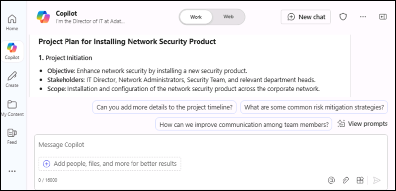
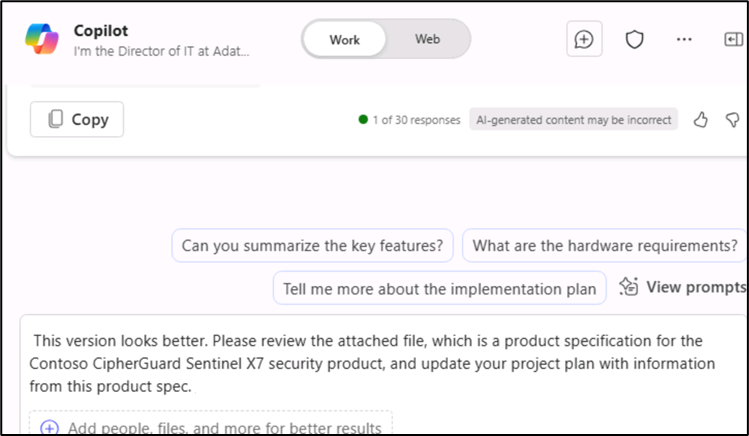
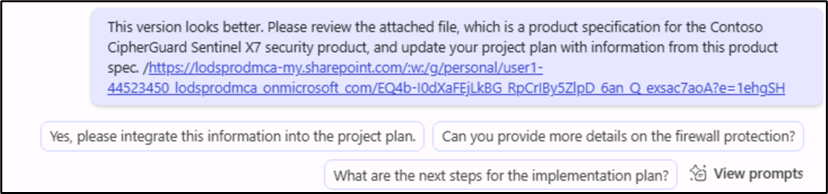
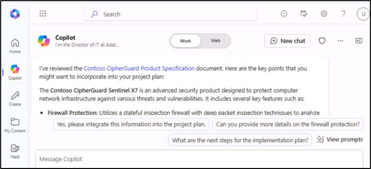
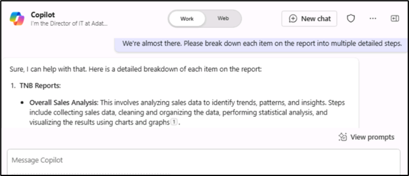
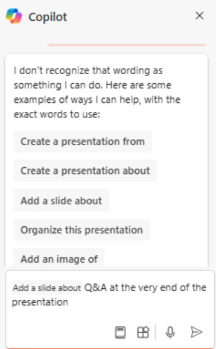

Laboratorio 1B: Capacitar a los gestores de proyectos y al personal
informático

Objetivo:

Copilot para Microsoft 365 funciona como un asistente de escritura
impulsado por AI que comprende el contexto, sugiere frases y ayuda a
generar contenido, todo lo cual puede mejorar la calidad de su trabajo.
En este laboratorio, utilizará:

- Microsoft Copilot para resumir la información de una especificación de
  producto y crear un plan de proyecto para implantar el producto.

- Copilot en PowerPoint para crear una presentación basada en el plan de
  proyecto que ha creado.

- Copilot en Word para modificar un informe de especificaciones
  técnicas.

Ejercicio nº 1: Crear un plan de proyecto con Microsoft Copilot

Con Microsoft Copilot se integra perfectamente en Microsoft 365 y ofrece
una sólida plataforma para que los profesionales de TI mejoren el
trabajo en equipo, compartan información y aceleren la resolución de
problemas dentro del ecosistema de TI. Permite a los profesionales de TI
conectarse al instante, compartir información y coordinar esfuerzos de
forma eficiente.

Como director de TI de Adatum Corporation, ha estado revisando un
informe de especificaciones de producto para el producto de seguridad de
red Contoso CipherGuard Sentinel X7. Usted planea instalar este
producto, que proporciona una protección de seguridad avanzada que está
mucho más allá de lo que Adatum tiene hoy.

En este ejercicio utilizará Microsoft Copilot en Bing

- Analice un informe de especificaciones de un nuevo producto de
  seguridad de red que tiene previsto instalar.

- Actualice el plan del proyecto con la información del informe de
  especificaciones del producto.

**Nota**: Al final de este ejercicio, debe guardar su plan de proyecto
en su cuenta de OneDrive. El siguiente ejercicio utiliza este archivo.

1.  Si tiene una pestaña de Microsoft 365 abierta en el navegador
    Microsoft Edge, selecciónela ahora; de lo contrario, abra una nueva
    pestaña e introduzca la siguiente URL:
    **+++https://www.office.com+++** para ir a la página de inicio de
    Microsoft 365.

**Nota**: Debe iniciar sesión (si se le solicita) con las **credenciales
de Microsoft 365** que se proporcionan en la **pestaña Recursos de** la
derecha.

2.  Vaya a la carpeta **C:\LabFiles** para seleccionar y cargar una
    copia de **Contoso CipherGuard Product Specification report.docx**
    en **OneDrive**.

**Nota**: Puede omitir este paso si ya ha cargado una copia de todos
los documentos (que utilizará en esta sesión práctica de laboratorio
desde **C:\LabFiles** como se indica en el **Laboratorio 0**)**.**

3.  Abra y cierre el archivo **Contoso CipherGuard Product Specification
    report.docx** (que cargó en **OneDrive**) para incluirlo en la lista
    de archivos Most Recently Used (MRU).

4.  En **Microsoft Edge**, navegue hasta Microsoft Bing introduciendo la
    siguiente URL: **+++https://bing.com+++.**

5.  **En la página de inicio de Microsoft Bing**, en la lista de
    pestañas que aparecen en la parte superior de la página, seleccione
    **Copilot**. Al hacerlo, se abrirá **Microsoft Copilot**.

>
**Nota:** Si no ve la lista de pestañas en la parte superior de la
página, siga los pasos que se indican a continuación para ver la lista
de pestañas.

- Asegúrese de haber iniciado sesión con las **credenciales de Microsoft
  365** (disponibles en la pestaña **Resources**).

- Activar la opción **Show menu bar** (en rojo resaltado)

6.  Ahora seleccione **Copilot**. Al hacerlo, se abrirá Microsoft
    Copilot.

7.  En la página **Copilot**, en el conmutador **Work/Web** de la parte
    superior de la página, seleccione **Work**.

8.  De forma predeterminada, la opción **Work** limita el alcance de
    Copilot a los datos de su organización de Microsoft 365. Sin
    embargo, puesto que también desea que Copilot acceda a las
    directrices de la web pública al instalar un producto de seguridad
    de la red corporativa, debe habilitar el plugin de **Web content**.
    Para ello, en el campo de prompt de la parte inferior de la página,
    debe observar dos iconos: el icono del clip, que sirve para adjuntar
    archivos, y un icono de bloques apilados. Este último icono es el
    icono Plugins. Seleccione este icono **Plugins**.

9.  Seleccione el icono **Plugins** y active el plugin de **Web
    content**.

>

10. Ya está listo para utilizar Copilot. Introduzca el siguiente prompt,
    que indica a Copilot que acceda a datos web públicos a través del
    plugin de **contenido web** de Microsoft Copilot y, a continuación,
    seleccione la flecha **Submit** situada en la esquina inferior del
    campo de prompt:

**I'm the Director of IT at Adatum Corporation. Create a project plan
for installing a new network security product into a corporate
network. Base this plan on IT industry guidelines for installing
network security
products.**

11. Revise el plan de proyecto creado por Copilot.

12. No está satisfecho de que abarque todas las áreas que debería.
    Introduzca la siguiente pregunta para que Copilot modifique su plan
    e incluya las áreas que le interesan específicamente. Si alguna de
    las áreas incluidas en esta pregunta ya figura en la respuesta
    anterior de Copilot, elimínela de esta pregunta para que Copilot no
    la duplique:

**While that was a good start, I feel like it's missing important
areas. Please add the following items to the existing list: testing
and QA, training, communication, document and reporting, stakeholder
analysis, project timeline, and risk assessment and mitigation.**
>

>

13. Revise el plan de proyecto modificado. Está satisfecho con la
    amplitud de los temas tratados, así que ahora quiere que Copilot
    actualice el plan con la información de la especificación del
    producto de seguridad Contoso CipherGuard Sentinel X7. Introduzca el
    siguiente prompt, pero no la envíe todavía, ya que primero debe
    vincular el archivo al prompt en el siguiente paso:

**This version looks better. Please review the attached file, which is
a product specification for the Contoso CipherGuard Sentinel X7
security product, and update your project plan with information from
this product spec.**
>

14. En el campo de prompt, introduzca un espacio después de la consulta
    y, a continuación, escriba una barra inclinada (/). Debe introducir
    el espacio antes de la barra oblicua para que Copilot lo reconozca
    como una solicitud de adjuntar algo al mensaje. El siguiente paso
    depende de si Copilot abre una ventana para que seleccione el
    archivo:

- Si Copilot abre una ventana después de introducir la barra diagonal
  (/), seleccione la pestaña **Archivos**. Al hacerlo, aparecerá la
  lista de archivos MRU. Seleccione el archivo **Contoso CipherGuard
  Product Specification** y, a continuación, seleccione el icono
  **Submit**.

- Si Copilot no ha hecho nada después de introducir la barra diagonal
  (/), tendrá que copiar y pegar el enlace al archivo de **Contoso
  CipherGuard Product Specification**. Para ello, localice el archivo en
  su cuenta de OneDrive, ábralo en **Word**, seleccione el botón
  **Share** que aparece encima de la cinta de Word, seleccione **Copy
  link** en el menú desplegable que aparece y, de nuevo en este campo,
  pegue el enlace después de la barra diagonal y seleccione el icono
  **Submit**.

>
**Nota**: Si Copilot no puede acceder directamente
a los documentos o revisarlos, cierre la sesión del usuario que ha
iniciado sesión y vuelva a iniciarla para continuar desde el paso
9.
>

>

>
**Nota**: Si usted no puede ver y referenciar el
documento de **Contoso CipherGuard Product Specification**, entonces
proceda al siguiente ejercicio. El documento del plan del proyecto
está disponible para que usted proceda con la actividad de laboratorio
restante.

15. Revise cómo Copilot insertó características de la especificación del
    producto en el plan del proyecto.

16. Aunque todo parece correcto, usted cree que el plan del proyecto
    carece de detalles específicos. Para resolver este problema,
    introduzca el siguiente prompt:

**We're almost there. Please break down each item on the report into
multiple detailed steps**.
>

17. Revise los resultados.

18. Ahora que el plan del proyecto está creado, DEBE guardarlo en un
    documento de Word. **Utilizará este documento de plan de proyecto en
    el siguiente ejercicio**. En la parte inferior de la respuesta final
    de Copilot, seleccione el botón **Copy** para copiar y pegar la
    respuesta en un documento de Word.

19. Guarde el archivo como **Contoso CipherGuard project plan.docx** en
    su cuenta de OneDrive que contiene el documento de especificación
    del producto que utilizó en este ejercicio. Utilizará este archivo
    en el siguiente ejercicio.

Ejercicio nº 2: Crear una presentación del plan del proyecto utilizando
Copilot en PowerPoint

Copilot en PowerPoint actúa como un colaborador inteligente, ofreciendo
sugerencias y mejoras en tiempo real a medida que los profesionales de
TI elaboran sus presentaciones:

- Presentar sus ideas o propuestas a su equipo o a la dirección.

- Formar a nuevos empleados o hacer demostraciones de nuevos programas o
  equipos informáticos a los clientes.

- Explicar conceptos técnicos complejos a públicos no técnicos, como
  partes interesadas o inversores.

- Mostrar su trabajo o promocione sus servicios entre clientes
  potenciales.

Con Copilot en PowerPoint, puede crear una presentación a partir de un
documento de Word existente. Cuando proporcione a Copilot en PowerPoint
el enlace a su documento de Word, podrá generar diapositivas, aplicar
diseños y elegir un tema por usted.

En este ejercicio, utilizará Copilot en PowerPoint para crear una
presentación de diapositivas basada en el plan de proyecto que creó en
el ejercicio anterior. Esta presentación se utilizará para explicar el
plan del proyecto al personal de TI y, en última instancia, a la
dirección de la empresa.

**Nota**: Si ha completado el ejercicio anterior y ha
creado un archivo Contoso CipherGuard project plan.docx, asegúrese de
haberlo guardado en su cuenta de OneDrive y continúe con el siguiente
paso. Sin embargo, si no pudo crear este plan de proyecto en el
ejercicio anterior, entonces cargue una copia del documento **Contoso
CipherGuard project plan.docx** disponible en **C:\LabFiles**.

1.  Si tiene una pestaña de Microsoft 365 abierta en el navegador Edge,
    selecciónela ahora; de lo contrario, abra una nueva pestaña e
    introduzca la siguiente URL:
    [<u>https://www.office.com</u>](https://www.office.com) para ir a la
    página de inicio **de Microsoft 365.**

2.  Abra y cierre el archivo **Contoso CipherGuard project plan.docx**
    (que guardó en **OneDrive**) para incluirlo en la lista de archivos
    utilizados más recientemente (MRU).

3.  En el panel de navegación de **Microsoft 365**, seleccione
    **PowerPoint**. En PowerPoint, abra una nueva presentación en
    blanco.

4.  Seleccione el icono **Copilot** (resaltado en rojo como se muestra
    en la captura de pantalla). En el panel **Copilot** que aparece,
    podrá elegir entre varios mensajes predefinidos.

>

5.  Seleccione la opción **Create presentation from file**.

6.  Copilot introduce automáticamente el texto en el campo de consulta
    situado en la parte inferior del panel **Copilot**: **Create
    presentation from file /**. La barra inclinada es el indicador
    universal de Copilot para introducir un enlace a un archivo. En este
    caso, hace que Copilot abra una ventana **de Sugerencias** que
    muestra tres de los archivos utilizados más recientemente.

- Si su archivo aparece aquí, selecciónelo ahora y continúe con el
  siguiente paso.

- Si el archivo no es uno de los tres que se muestran, seleccione la
  flecha hacia la derecha **(**\>) en la esquina superior derecha de la
  ventana **Suggestions** para ver una lista ampliada de archivos MRU.
  Si el archivo aparece aquí, selecciónelo ahora y continúe con el
  siguiente paso.

- Si no ve su archivo en la lista MRU ampliada, debe copiar el enlace al
  informe y pegarlo en el campo de solicitud. Para ello:

  1.  Seleccione la pestaña del navegador **Microsoft 365** y seleccione
      **Word** en el panel de navegación.

  2.  En la página de inicio de Word, en la lista de archivos recientes,
      seleccione el informe para abrirlo en Word.

  3.  En el informe en Word, en el extremo derecho por encima de la
      cinta, seleccione el botón **Share**. En el menú desplegable que
      aparece, seleccione **Copy link.** Espere a que aparezca la
      ventana **Link copied**, que es la garantía de que el enlace al
      archivo se ha copiado en el portapapeles.

  4.  Cambie a la pestaña **PowerPoint** y, en la parte inferior del
      panel **Copilot**, el campo de consulta debería seguir mostrando
      **Create presentation from file /**. Sitúe el cursor después de la
      barra inclinada (**/**) y, a continuación, pegue (**Ctrl+V**) el
      enlace al informe.

7.  Observe cómo aparece el archivo en el campo de consulta. Seleccione
    el icono **Send** en el campo de solicitud. Copilot creará una
    presentación de diapositivas basada en el documento. Al hacerlo,
    primero muestra el esquema de la presentación. A continuación,
    mostrará una ventana separada con una lista de viñetas de algunos de
    los cambios que ha realizado en la presentación basándose en el
    documento.

8.  Ahora puede revisar las diapositivas y hacer las actualizaciones
    necesarias. Preste atención a los cambios realizados por el Copilot
    a partir del documento. Puede utilizar la herramienta **Designer**
    para ajustar los diseños

9.  Observe que no hay una diapositiva al final para una sesión de
    preguntas y respuestas. Para corregir este error, introduzca el
    siguiente prompt:

**Add a Q&A slide at the very end of the presentation with an
appropriate image**.

10. Revise la nueva diapositiva creada. No le gusta la imagen que
    Copilot ha utilizado para esta diapositiva, así que introduzca el
    siguiente mensaje solicitando a Copilot que cambie la imagen:

**I don't like the image you used on the Q&A slide. Please replace it
with a different image**.
>

11. ¿Qué respuesta recibió? A veces Copilot no reemplaza la imagen y
    devolvía el siguiente mensaje.

>
**Nota:** Copilot puede mostrar alguna excepción
(recuerde que Copilot es todavía un trabajo en curso) como la de
arriba.

16. Intente reformular la pregunta o utilice las preguntas sugeridas,
    como la siguiente.

17. Seleccione el comando **Add a slide about** y añada **Q&A at the
    very end of the presentation** (como se muestra en la captura de
    pantalla)

18. Haga clic en Send para comprobar lo que ocurre. Copilot ha añadido
    una diapositiva de preguntas y respuestas siguiendo las
    instrucciones.

19. Ahora inténtelo con otro prompt:

**Add a slide about** lo que el público puede preguntar sobre la
presentación.

20. Una vez que haya terminado con la presentación final, puede
    guardarla para futuras consultas o descartarla.

21. Independientemente de cómo hayan ido los últimos pasos al tratar la
    diapositiva de preguntas y respuestas, decides seguir adelante e
    intentar una última cosa. Al revisar la presentación, decides que
    quieres cambiar el tema de la presentación por algo más apropiado
    debido a la naturaleza técnica del tema. Introduce el siguiente
    mensaje:

**Change the theme of this presentation to something more technical**.
>

22. Tome nota de la respuesta de Copilot.

>
Este escenario es una de esas situaciones en las que hay que recordar
la práctica recomendada de avisar: **Comprender las limitaciones de
Copilot**. En este caso, no se trata tanto de comprender una
limitación como de entender cómo funciona Copilot. En este caso,
Copilot le remite a una función existente de PowerPoint en lugar de
duplicar lo que hace esa función.

23. Aunque en el resto de ejercicios de formación de este módulo no se
    utiliza esta presentación, puede descartarla o guardarla si la desea
    para futuras consultas.

Ejercicio nº 3: Actualizar un informe técnico con Copilot en Word

Copilot en Word puede ayudar a los profesionales de TI a ahorrar tiempo
y esfuerzo al crear documentos. Puede ayudarle a generar contenido,
reescribir texto y proporcionar sugerencias útiles. Gracias a su
asistencia para la redacción basada en IA, Copilot puede ayudarle a
crear documentos de forma más eficiente y eficaz.

Cuando creas un documento nuevo o trabajas en uno ya existente, Copilot
puede ayudarte de distintas formas.

- En un documento nuevo, en blanco, o cuando quieras añadir contenido a
  un documento existente, puede decirle a Copilot sobre qué quieres
  escribir, y él genera el contenido en consecuencia.

- En un documento con contenido existente, Copilot puede ayudarle a
  transformar el contenido. Puede reescribir el contenido seleccionado o
  incluso transformarlo en una tabla.

En este ejercicio, utilizará Copilot en Word para actualizar un
documento existente. Copilot añadirá texto nuevo, reescribirá el texto
existente y transformará el texto en una tabla.

1.  Si tiene una pestaña de Microsoft 365 abierta en el navegador
    Microsoft Edge, selecciónela ahora; de lo contrario, abra una nueva
    pestaña e introduzca la siguiente URL:
    [**<u>https://www.office.com</u>**](https://www.office.com/) para ir
    a la página de inicio de Microsoft 365.

**Nota**: Debe iniciar sesión (si se le solicita) con las **credenciales
de Microsoft 365** que se proporcionan en la **pestaña Resources de** la
derecha.

2.  Vaya a la carpeta **C:\LabFiles** para seleccionar y cargar una
    copia de **Trey Research - VPN Technical Overview.docx** en
    **OneDrive**.

**Nota**: Puede omitir este paso si ya ha cargado una copia de todos
los documentos (que utilizará en esta sesión práctica de laboratorio
desde **C:\LabFiles** como se indica en el **Laboratorio 0**)**.**

3.  Abra y cierre el archivo **Trey Research - VPN Technical
    Overview.docx** (que cargó en **OneDrive**) para incluirlo en la
    lista de archivos utilizados más recientemente (MRU).

4.  En **Microsoft 365**, abra **Microsoft Word**.

5.  Abra el archivo **Trey Research - VPN Technical Overview.docx**.

6.  En la cinta de **Word**, seleccione el botón **Copilot** para abrir
    el panel Copilot.

7.  En el panel **Copilot**, introduzca la siguiente instrucción y, a
    continuación, seleccione el icono de flecha (**Enviar**):

**Write a new section for this document about the types of VPNs. Discuss
the pros and cons of each type. This content is for a technical
audience, so please provide specific details.**

8.  Copilot no añade contenido nuevo directamente a un documento.
    Muestra el contenido en una ventana de respuesta en el panel
    Copilot. Sin embargo, dispone de un botón **Copy** en la parte
    inferior de cada ventana de respuesta, así que seleccione el botón
    **Copy** para copiar su contenido en el portapapeles. Al mirar el
    documento, decide pegar el contenido debajo del párrafo de apertura.
    Pegue el contenido ahora.

**Consejo**: Cuando selecciona el botón **Copy** para una ventana de
respuesta, se copia TODO el contenido, incluidos los comentarios de
Copilot que están destinados a usted. Este tipo de comentarios suelen
estar al principio y al final de la respuesta. Asegúrese de eliminar
estos comentarios una vez que pegue la respuesta en su documento. Lo
más probable es que la fuente y el tamaño de la fuente del nuevo
contenido no coincidan con la fuente y el tamaño existentes utilizados
en todo el documento. Por lo tanto, debes cambiarlos para que
coincidan.

9.  Tras revisarlo, se da cuenta de que no se mencionan las políticas de
    seguridad relacionadas con el uso de VPN. Este tema es un área clave
    que desea incluir, así que introduzca la siguiente solicitud:

**Please write a new section for this document about security policies
related to VPN usage. This content is for a technical audience, so
please provide specific details.**

10. Copie y pegue el contenido de esta respuesta en el documento.
    Colóquelo justo antes de la sección **Risks and mitigations** y, a
    continuación, edita el contenido según sea necesario. Si es
    necesario, añada un encabezado para esta sección titulado **Security
    policies related to VPN usage**.

11. Cuando revisó el informe, también identificó un área de contenido
    que, en su opinión, debía reescribirse. En la sección de **Risks and
    mitigations**, el primer punto cubre tanto las VPN domésticas como
    las empresariales. Usted quiere que sólo se refiera a las VPN de
    empresa. Sin embargo, dada la forma en que está escrito el
    contenido, no parece que sea una solución fácil. Decide que Copilot
    reescriba el contenido por usted.

**Consejo**: Para que Copilot reescriba el contenido, primero debe
resaltar el contenido que desea que Copilot reescriba.

12. Resalte el contenido de la primera viñeta de la sección **Risks and
    mitigations** y, a continuación, introduzca la siguiente solicitud:

**The highlighted content discusses the risks of using VPNs in both
home and enterprise networks. Remove the content related to home
networks and focus solely on the risks of VPNs in enterprise
networks.**
>

13. Compruebe la respuesta de Copilot. A veces esta funcionalidad de
    reescritura no funcionaba. Cuando no funcionaba, Copilot devolvía la
    siguiente respuesta. Si se da esta situación, copie y pegue su
    respuesta e inténtelo de nuevo (recuerde, iterar, iterar, iterar).

14. Después de hacer una revisión final del documento, decides que las
    secciones sobre los Pros y los Contras de implementar VPNs quedarían
    mejor en una tabla en lugar de como listas con viñetas. Ya que
    resaltó una sección para ser reescrita, decide resaltar estas dos
    secciones. Resalte ambas secciones y luego ingrese el siguiente
    mensaje:

**Please rewrite the highlighted content by placing it in a table**.

.

15. Observe la respuesta del Copilot.

16. Reformatear contenido en una tabla es diferente a reescribir
    contenido. En lugar de resaltar el contenido que desea colocar en
    una tabla, debe describir en su consulta qué secciones de contenido
    desea incluir en la tabla. Esta vez, ingrese el siguiente prompt:

**Place the content from the Pros and Cons of implementing VPNs into a
table**
>

17. Observe la respuesta de Copilot. En lugar de reescribir o sustituir
    el contenido existente en el documento por una tabla, muestra la
    tabla en su respuesta. Usted debe sustituir el contenido copiando y
    pegando la tabla en el documento. En la respuesta, seleccione el
    botón **Copy** y, a continuación, en el documento, resalte las
    secciones Pros y Contras y pegue la tabla. Asegúrese de añadir un
    encabezado de sección antes de la tabla que diga: **Pros and Cons of
    implementing VPNs.** Lo más probable es que también tenga que
    cambiar la fuente y el tamaño de la fuente del contenido de la tabla
    para que coincidan con la fuente y el tamaño existentes utilizados
    en todo el documento.

18. Ahora, cree que el documento está completo. Sin embargo, para ir
    sobre seguro, decide preguntar a Copilot si cree que el documento
    debería incluir alguna otra información. Introduzca la siguiente
    pregunta:

**¿Is there anything missing in this document that you would recommend
adding?**

19. Observe la respuesta del Copilot. En nuestras pruebas, nos dijo que
    no faltaba nada. Inténtelo de nuevo para ver si Copilot proporciona
    una respuesta diferente.

20. Si Copilot le recomienda que añada más contenido a su documento,
    cree un prompt que se lo pida. A continuación, puede copiar y pegar
    el nuevo contenido en el documento.

Resumen:

En este laboratorio, exploró cómo Copilot para Microsoft 365 mejora la
calidad de su trabajo al

- Usar Microsoft Copilot para destilar la información clave de un
  documento de especificación de producto y desarrollar un plan de
  proyecto completo para implementar el producto.

- Aprovechar Copilot en PowerPoint para diseñar una presentación basada
  en el plan de proyecto que ha creado, asegurándose de que sea
  visualmente atractiva y comunique eficazmente los detalles del plan.

- Utilizar Copilot en Word para revisar y mejorar un informe de
  especificaciones técnicas, mejorando la claridad, la coherencia y la
  calidad general.
