# ラボ1B：プロジェクトマネージャーとIT人材の強化

## 目的

Microsoft 365のCopilotは、AI-poweredライティングアシスタントとして機能し、文脈を理解し、フレーズを提案し、コンテンツの生成を支援します。このラボでは、以下を使用します：

- Microsoft
  Copilotを使用して製品仕様書の情報を要約し、製品を実装するためのプロジェクト計画を作成します。

- PowerPointのCopilotで、作成したプロジェクト計画に基づいてプレゼンテーションを作成する。

- WordのCopilotで技術仕様書を修正。

## 練習1：Microsoft Copilotを使用してプロジェクト計画を作成する。

Microsoft Copilotは、Microsoft 365にシームレスに統合され、ITプロフェッショナルがチームワークを強化し、洞察を共有し、ITエコシステム内の問題解決を加速するための堅牢なプラットフォームを提供します。これにより、IT担当者は即座につながり、情報を共有し、効率的に作業を調整できます。

Adatum Corporation の IT 部長として、あなたは Contoso CipherGuard Sentinel X7
ネットワークセキュリティ製品の仕様書を検討していました。アダタムが現在持っているものをはるかに超える高度なセキュリティ保護を提供するこの製品の導入を計画しています。

この演習では、BingのMicrosoft Copilotを使用します。

- 導入を計画している新しいネットワークセキュリティ製品の製品仕様書を分析する。

- 製品スペックレポートの情報でプロジェクト計画を更新する。

**注意**：この演習の最後に、プロジェクト計画を OneDrive
アカウントに保存してください。次の演習では、このファイルを使用します。

1.  Microsoft EdgeブラウザでMicrosoft 365のタブを開いている場合は、今すぐそれを選択します。そうでない場合は、新し 
    い タブを開き、次のURLを入力します：+++https://www.office.com+++ Microsoft 365のホームページに移動します。

    **注**: 右側の**「Resources」タブで**提供される **Microsoft 365 認証情報を**使用してサインインする必要があり 
    ま す (プロンプトが表示された場合)。

2.  **C:∕LabFiles** フォルダを参照し、**Contoso CipherGuard 製品仕様書
    report.docx** を選択して **OneDrive** にアップロードします。

    **注**: すべてのドキュメントのコピー（実習ラボ セッションで使用するもの）を、実習ラボ 0 の指示に従って
    **C:∕LabFiles** からすでにアップロードしている場合は、この手順を省略できます.

3.  **Contoso CipherGuard 製品仕様書 report.docx（OneDrive**
    にアップロードしたファイル）を開いて閉じ、最近使用したファイル（MRU）リストに表示します。

    

4.  **Microsoft Edgeで**、以下のURLを入力してMicrosoft
    Bingに移動します：+++https://bing.com+++

    

5.  **Microsoft
    Bingのホームページで**、ページの上部に表示されるタブの一覧で、**Copilotを**選択します。**Microsoft
    Copilotが**開きます。

    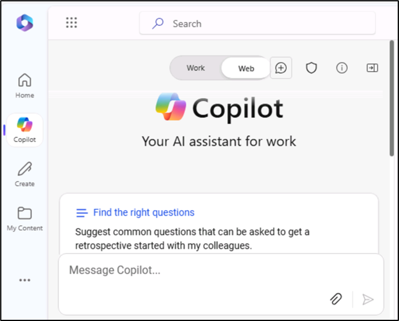

    **注：**ページ上部にタブのリストが表示されない場合は、以下の手順でタブのリストを表示してください。

    - **Microsoft 365 認証情報を**使用してサインインしていることを確認します（\[**リソース**\]
      タブで利用可能）。

      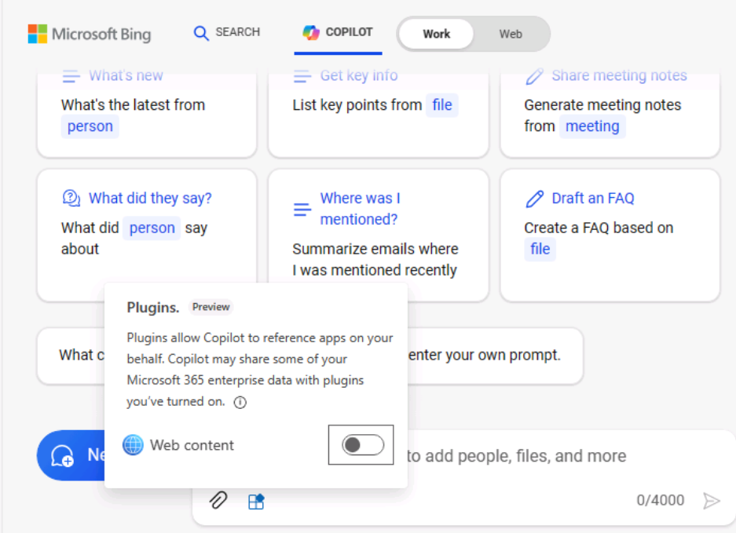

    - **メニューバーを表示する**オプションを有効にする（赤いハイライト部分）

      

      

6.  **Copilotを**選択します。Microsoft Copilotが開きます。

7.  **Copilot**ページの上部にある**Work/Web**トグルスイッチで、**Workを**選択する。

8.  デフォルトでは、\[**作業\]**オプションを選択すると、Copilotのアクセス範囲がMicrosoft 365の組織データに制限され 
    ます。ただし、Copilotが企業ネットワークセキュリティ製品のインストールに関するパブリックWebガイドラインにもアクセ 
    スできるようにするには、**Web**コンテンツプラグインをEnableにする必要があります。そのためには、ページ下部のプロ 
    ン プトフィールドに、ファイルを添付するためのペーパークリップのアイコンと、ブロックを積み重ねたアイコンの2つのア 
    イ コンが表示されているはずです。後者のアイコンはプラグインのアイコンです。この**プラグインの**アイコンを選択しま 
    す。

    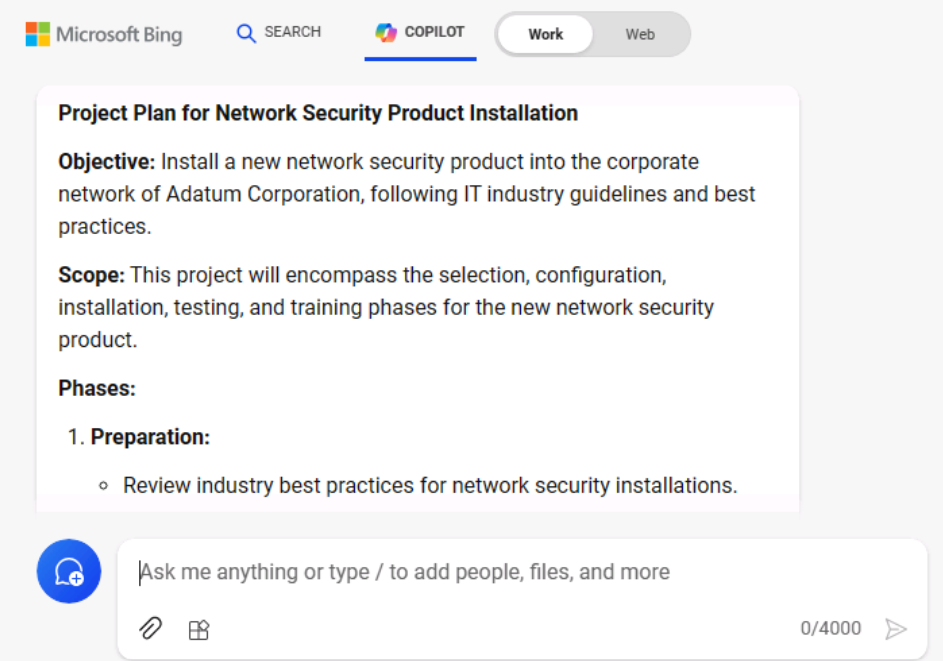

9.  この**Plugins**アイコンを選択し、**Web**コンテンツプラグインを有効にします。

    

    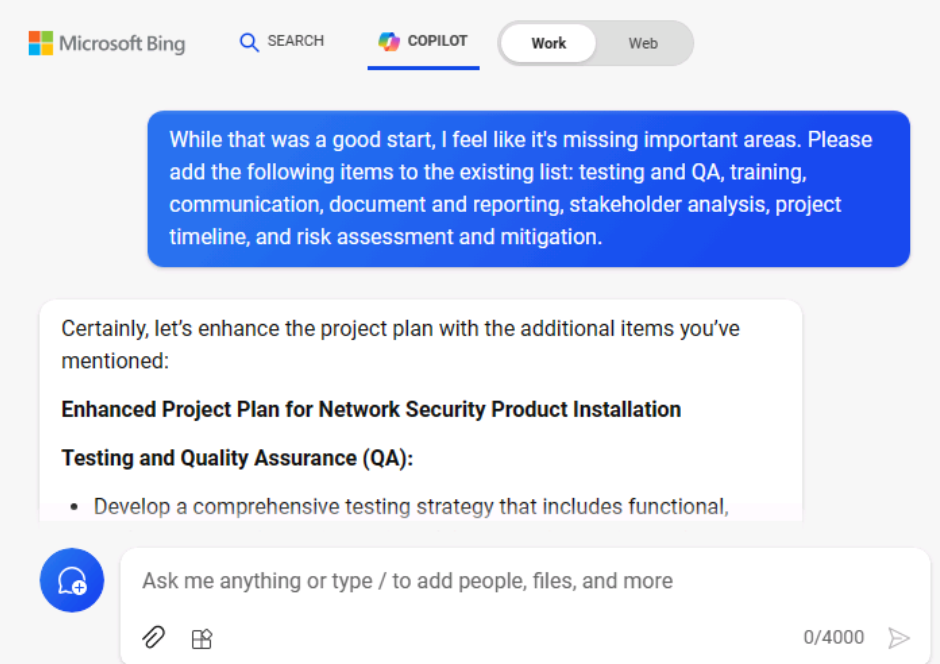

10. これで、Copilot を使用する準備ができました。Copilotが**Web**コンテンツプラグインを介して公開Webデータにアクセス 
    するようにMicrosoft Copilotに指示する次のプロンプトを入力し、プロンプトフィールドの下隅にある\[**Submit\]**矢 
    印 を選択します：

    ++**I'm the Director of IT at Adatum Corporation. Create a project plan for installing a new network  security product into a corporate network. Base this plan on IT industry guidelines for installing network security products**.++

    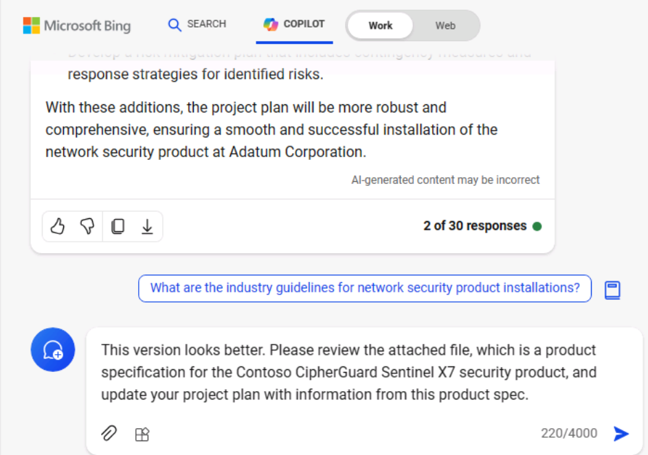

11. Copilotが作成したプロジェクト計画を確認します。

    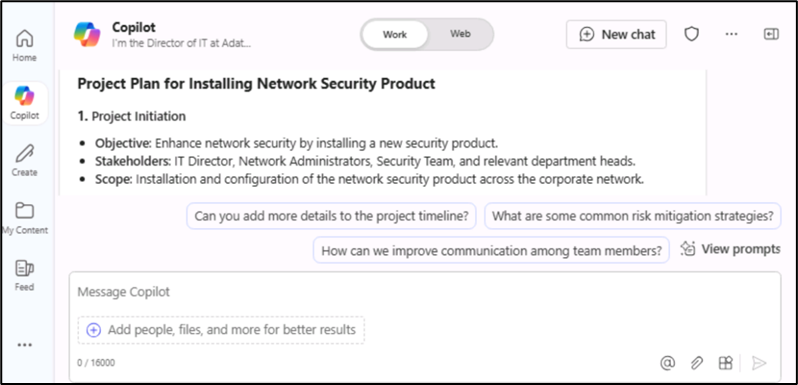

12. そのプランがすべての地域を網羅していることに満足していない。次のプロンプトを入力すると、特定の関心分野を含めて計  
    画 を修正できます。このプロンプトに含まれる分野がCopilotの前回の回答にすでに含まれている場合は、Copilotが重複し 
    ないように、このプロンプトから削除してください：

    ++**While that was a good start, I feel like it's missing important areas. Please add the following 
    items to the existing list: testing and QA, training, communication, document and reporting, 
    stakeholder analysis, project timeline, and risk assessment and mitigation**.++

    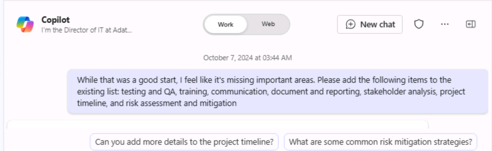

    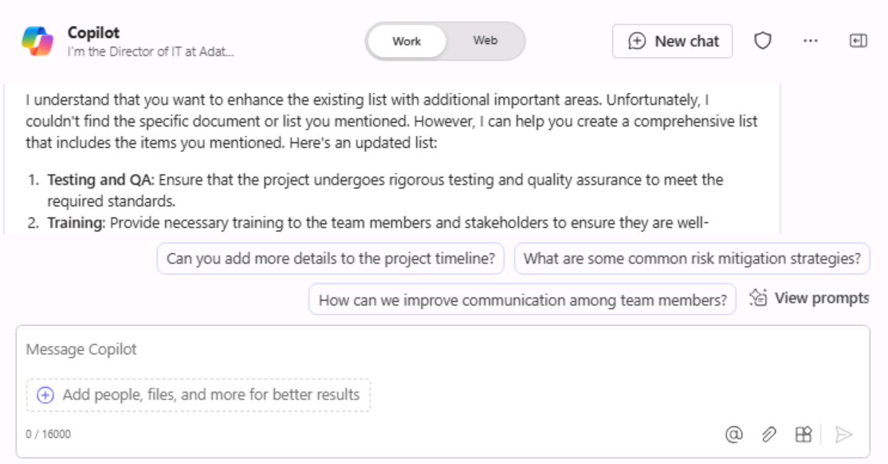

13. 修正されたプロジェクト計画を確認します。カバーするトピックの幅に満足したので、Copilot
    に Contoso CipherGuard Sentinel X7 セキュリティ製品の製品仕様の情報で計画を更新してもらいます。次のプロンプト 
    を 入力しますが、次のステップでファイル を プロンプトにリンクする必要があるため、まだ送信しないでください：

    ++**This version looks better. Please review the attached file, which is a product specification for 
    the Contoso CipherGuard Sentinel X7 security product, and update your project plan with information 
    from this product spec**.++

   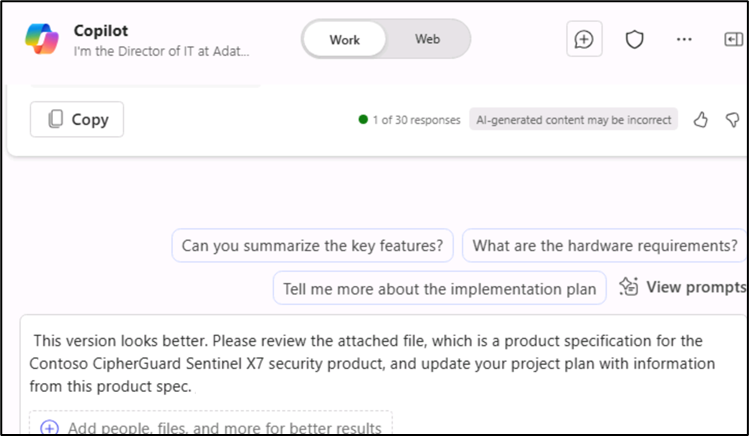

14. プロンプトフィールドで、プロンプトの後にスペースを入力してから、フォワードスラッ
    シュ（/）を入力します。プロンプトに何かを添付する要求としてCopilotに認識させるため、フォワードスラッシュの前にス 
    ペースを入力する必要があります。次の手順は、Copilotがファイルを選択するためのウィンドウを開くかどうかによって異 
    な ります：

  - フォワードスラッシュ（/）を入力した後にCopilotがウィンドウを開いたら、**Files** タブを選択します。MRU
    ファイルのリストが表示されます。**Contoso CipherGuard Product Specification** ファイルを選択し、**Submit** 
    アイコンを選択します。

    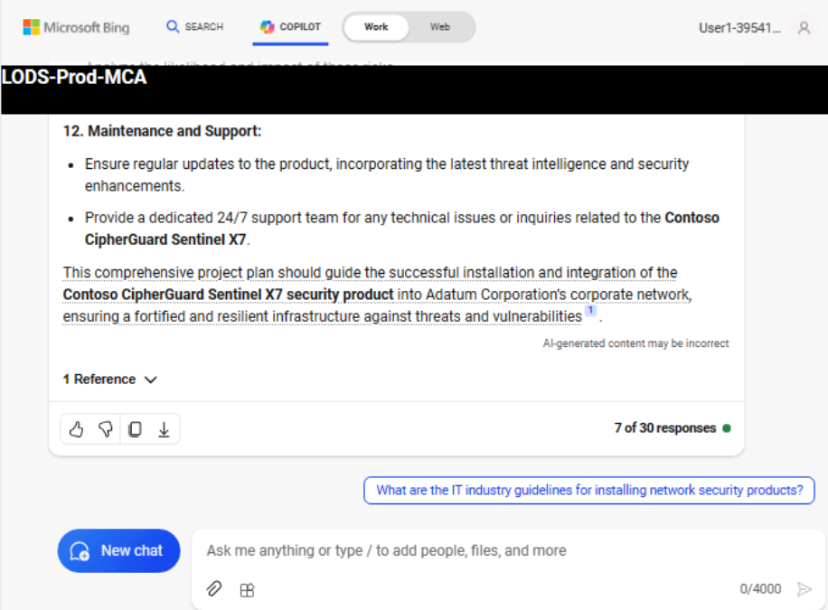

  - Copilotがフォワードスラッシュ（/）を入力した後に何もしなかった場合は、**Contoso CipherGuard Product 
    Specification**ファイルへのリンクをコピーして貼り付ける必要があります。そのためには、OneDriveアカウントでファイ 
    ルを見つけ、**Wordで**開き、Wordリボンの上に表示される**［共有］**ボタンを選択し、表示されるドロップダウンメニ 
    ュ ーで**［リンクをコピー］を**選択し、このプロンプトフィールドに戻ってフォワードスラッシュに続くリンクを貼り付 
    け、［**送信］**アイコンを選択します。

    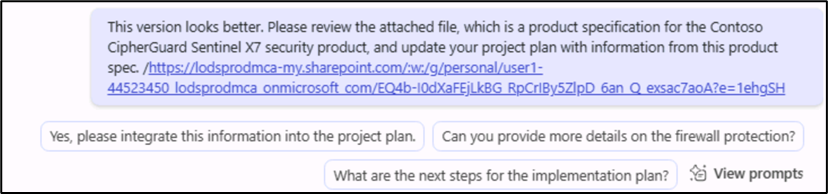

    **注**：Copilotが文書に直接アクセスしたりレビューしたりできない場合は、ログインしているユーザーをサインアウトし 
    て もう一度サインインし、手順9からやり直してください。

    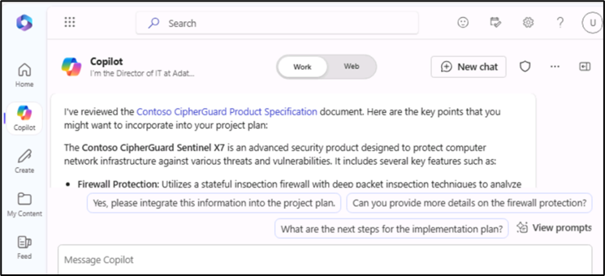

    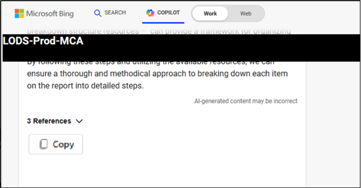

    **注**： **Contoso CipherGuard Specification**書を表示および参照できない場合は、次の演習に進んでください。プ 
    ロジェクト計画書は、残りのラボのアクティビティに進むために利用できます。

15. Copilotがどのように製品仕様の機能をプロジェクト計画に挿入したかを確認する。

    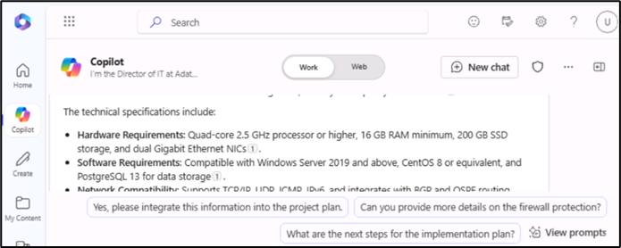

16. しかし、あなたはこのプロジェクトプランに具体的な詳細が欠けていると感じている。この問題に対処するために、次のプロ 
    ン プトを入力してください：

    ++**We're almost there. Please break down each item on the report into multiple detailed steps**.++

    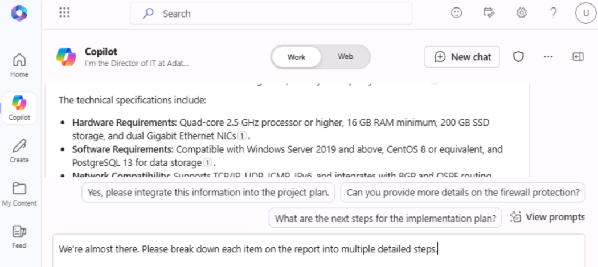

17. 結果を見直す。

    

18. プロジェクト計画書を作成したら、Word文書に保存しなければなりません。**このプロジェクト計画書は、次の演習で使用し 
    ます**。Copilot の最終回答の下部にある**コピー**ボタンを選択し、回答をコピーして **Word** 文書に貼り付けます。

    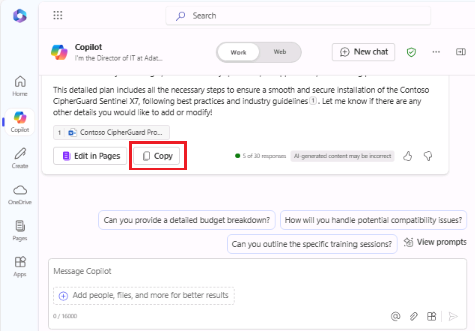

    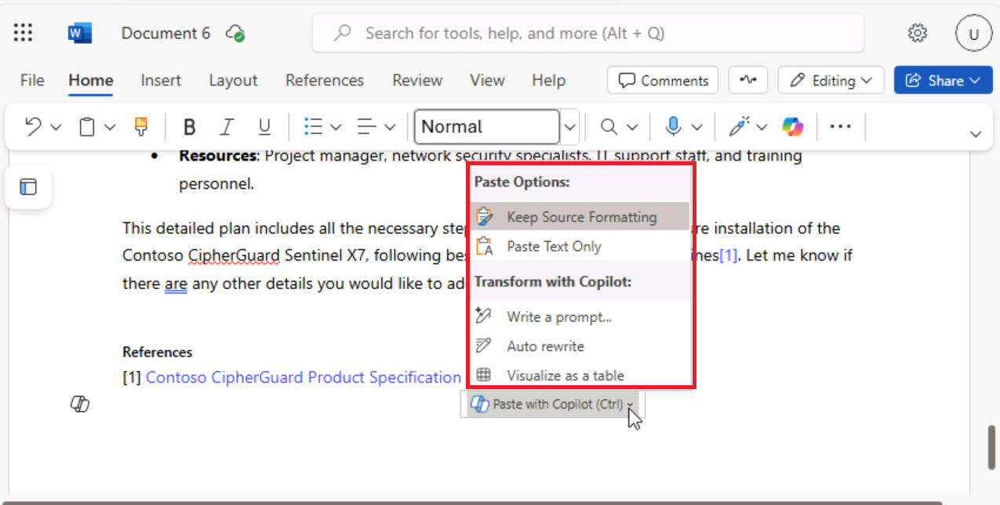

19. この演習で使用した製品仕様書を含む OneDrive アカウントに +++**Contoso CipherGuard project plan**+++
    としてファイルを保存します。このファイルは次の演習で使用します。

    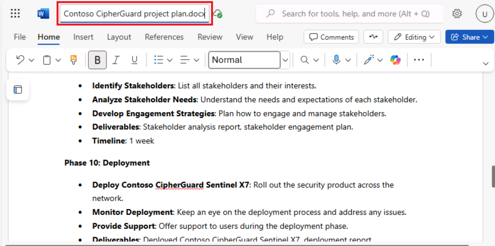

    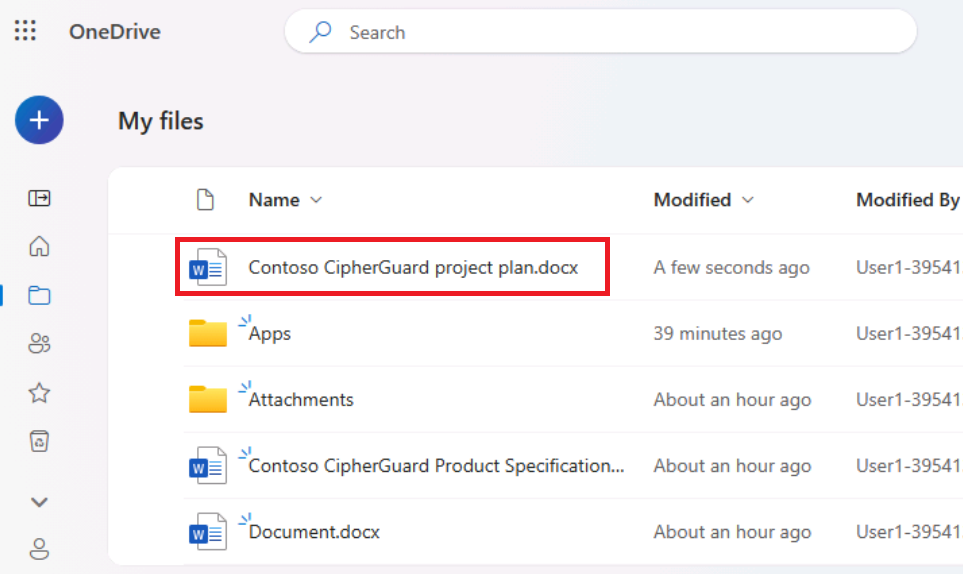

## 練習2: PowerPointでCopilotを使用してプロジェクトプランのプレゼンテーションを作成する

PowerPointのCopilotはインテリジェントな共同作業者として機能し、ITプロフェッショナルがプレゼンテーションを作成する際に、リアルタイムで提案や改善を行います：

- 自分のアイデアや提案をチームや経営陣にプレゼンテーションする。

- 新入社員のトレーニングや、新しいソフトウェアやハードウェアのデモンストレーションを顧客に行う。

- 複雑な技術的概念を、利害関係者や投資家など技術者以外の聴衆に説明する。

- 自分の仕事を紹介したり、潜在的な顧客に自分のサービスを宣伝する。

Copilot in PowerPoint を使用すると、既存の Word 文書からプレゼンテーションを作成できます。Copilot in PowerPoint に Word 文書へのリンクを渡すと、スライドの生成、レイアウトの適用、テーマの選択が行われます。

この演習では、PowerPointのCopilotを使用して、前の演習で作成したプロジェクト計画に基づいてスライドプレゼンテーションを作成します。このプレゼンテーションを使用して、ITスタッフ、そして最終的には企業の経営陣にプロジェクト計画を説明します。

**注**: 事前の演習を完了し、**Contoso CipherGuard Project plan.docx** ファイルを作成した場合は、OneDrive アカウ 
ントに保存したことを確認して次のステップに進んでください。ただし、事前の演習でこのプロジェクト計画を作成できなかった 
場 合は、**C:\LabFiles**ある **Contoso CipherGuard Project plan.docx** のコピーをアップロードしてください。

1.  EdgeブラウザでMicrosoft 365のタブを開いている場合は、今すぐ選択します。そうでない場合は、新しいタブを開き、次の 
    URLを入力します：+++https://www.office.com+++ 
    Microsoft 365のホームページに移動します

2.  **Contoso CipherGuard プロジェクト計画書.docx**（**OneDrive**
    に保存したもの）を開いて閉じ、最近使用したファイル（MRU）リストに追加します。

3.  **Microsoft
    365の**ナビゲーションペインで、**PowerPointを**選択します。PowerPointで、新しい空白のプレゼンテーションを開き 
    ま す。

4.  リボンアイコンの~~右側にある~~**［Copilot］**~~オプションを~~選択します（スクリーンショットのように赤色で強調表 
    示されます）。表示される**Copilot**ペインでは、いくつかの定義済みプロンプトから選択できます。

    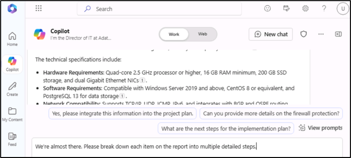

    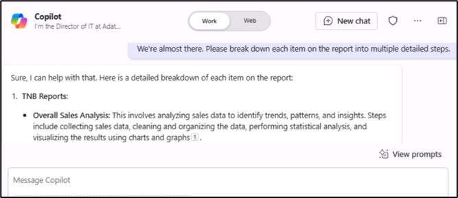

5.  **ファイルからプレゼンテーションを作成する**プロンプトを選択します。

    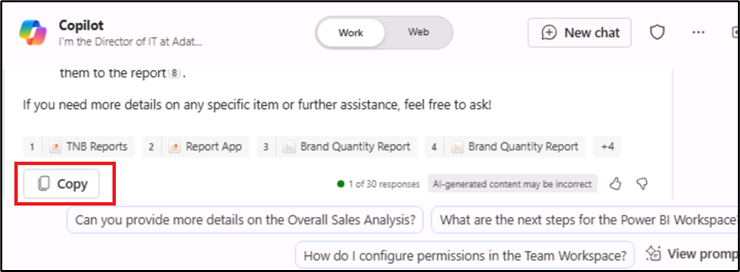

6.  **Copilot** ペインの下部にあるプロンプトフィールドに、Copilot が自動的にテキストを入力します：スラッシュは、フ 
    ァ イルへのリンクを入力するための Copilot 共通のインジケータです。この場合、このスラッシュを入力すると、Copilot 
   が**Suggestions**ウィンドウを開き、最近使用したファイルを3つ表示します。

  - ファイルがここに表示されたら、それを選択して次のステップに進みます。

  - ファイルが表示されている3つのうちの1つでない場合、**Suggestions**
    ウィンドウの右上隅にある右矢印 **(\>)** を選択すると、拡張 MRU
    ファイルリストが表示されます。ここでファイルが表示されたら、今すぐ選択して次のステップに進みます。

  - 拡張されたMRUリストにファイルが表示されない場合は、レポートへのリンクをコピーし、プロンプトフィールドに貼り付け 
    る 必要があります。そのためには

    a. **Microsoft 365**ブラウザタブを選択し、ナビゲーションペインで**Wordを**選択します。

    b.  **Wordの**ホームページの最近のファイルのリストで、レポートを選択してWordで開く。

    c.  Wordのレポートで、リボンの上の右端にある「**共有」**ボタンを選択します。表示されるドロップダウンメニューで、 
        ** リンクをコピー」を**選択します。ファイルへのリンクがクリップボードにコピーされたことを確認するウィンドウ 
        が 表示されます。

    d. **PowerPoint**タブに切り替え、**Copilot**ペインの下部にあるプロンプトフィールドに「**Create
       presentation from file/（ファイルからプレゼンテーションを作成）**」と表示されているはずです。
      スラッシュ**（/）の**後にカーソルを置き、レポートへのリンクを貼り付けます（**Ctrl+V**）。

7.  プロンプトフィールドにファイルが表示されます。プロンプトフィールドで**［送信］**アイコンを選択します。このプロン 
    プ トにより、Copilotはドキュメントに基づいてスライドプレゼンテーションを作成します。その際、まずプレゼンテーショ 
    ンのアウトラインが表示されます。次に、ドキュメントに基づいてプレゼンテーションに加えた変更の一部を箇条書きにした 
    リ ストが別のウィンドウに表示されました。

    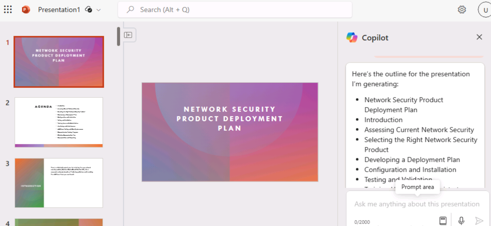

8.  これでスライドを自由に見直し、必要な更新を行うことができます。Copilotがドキュメントに基づいて行った変更には特に 
    注 意してください。**デザイナー**ツールを使用して、レイアウトを調整できます。

    

9.  最後に質疑応答（Q&A）セッション用のスライドがないことに気づきました。この見落としを修正するには、次のプロンプト 
    を 入力します：

    +++**Add a Q&A slide at the very end of the presentation with an appropriate image**.+++

    

10. 作成された新しいスライドを確認します。Copilotがこのスライドに使用した画像が気に入らないので、次のプロンプトを入 
    力 してCopilotに画像の変更を依頼します：

    +++**I don't like the image you used on the Q&A slide. Please replace it with a different image**.+++

    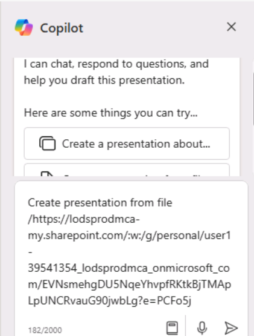

11. どのような反応がありましたか？Copilotが画像を置き換えず、次のようなメッセージを返すことがありました。

    

    **注** Copilotは上のような例外を表示することがあります（Copilotはまだ開発中であることを忘れないでください）。

12. プロンプトを言い換えてみるか、以下のようなプロンプト候補を使ってみてください。

    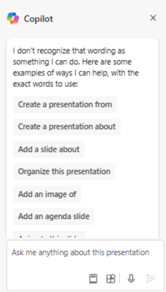

13. コマンド Add a slide about を選択し、次の内容をプレゼンテーションの最後に追加します: +++**Q&A at the very end 
    of the presentation**+++（スクリーンショットに示されているように）。

    

14. 送信をクリックして、何が起こるか確認してください。Copilotは指示通りにQ&Aスライドを追加しました。

15. 次のプロンプトでも試してみましょう:

    **Add a slide about** プレゼンテーションに関して聴衆が質問しそうな内容。

16. 最終的なプレゼンテーションが終了したら、将来の参考のために保存したり、このプレゼンテーションを破棄することができ 
    ま す。

17. Q&Aスライドを扱う最後の数ステップがどうであったかにかかわらず、前に進み、最後のことを試してみることにした。プレゼ 
    ンテーションを見直す中で、トピックの技術的な性質から、プレゼンテーションのテーマをより適切なものに変更したいとあ 
    な たは考えます。次のプロンプトを入力します：

    +++**Change the theme of this presentation to something more technical**.+++ 

    

18. Copilotの反応に注目。

    

    このシナリオは、プロンプトのベストプラクティスを思い出すべき状況の1つです：**Copilotの制限を理解すること**。こ 
    の 場合、Copilot がどのように機能するかを理解する必要があります。この場合、CopilotはPowerPointの既存の機能を紹 
    介します。

19. このモジュールの残りのトレーニング演習ではこのプレゼンテーションは使用しませんが、将来参照するために必要であれ 
    ば、 破棄するか保存しておくことができます。

## 練習その3：WordのCopilotを使用して技術レポートを更新する

WordのCopilotは、ITプロフェッショナルが文書を作成する際の時間と労力を節約するのに役立ちます。Copilotは、コンテンツの生成、テキストの書き換え、役立つ提案の提供を支援します。CopilotはAI-poweredライティングアシスタントを備えており、文書をより効率的かつ効果的に作成できます。

新しい文書を作成したり、既存の文書に手を加えたりするとき、Copilotはさまざまな方法で役立ちます。

- 新規の白紙の文書や、既存の文書にコンテンツを追加する場合、Copilotに書きたい内容を伝えると、それに応じてコンテンツが生成されます。

- 既存のコンテンツがあるドキュメントでは、Copilot
  を使用してコンテンツを変換できます。選択したコンテンツを書き換えたり、選択したコンテンツを表に変換したりすることもできます。

この実習では、WordのCopilotを使用して既存の文書を更新します。Copilotに指示して、新しいテキストを追加し、既存のテキストを書き直し、テキストを表に変換します。

1. Microsoft Edge ブラウザーで Microsoft 365 のタブを開いている場合は、今すぐそのタブを選択してください。そうでな 
   い 場合は、新しいタブを開き、次の URL を入力して Microsoft 365 ホームページにアクセスしてください: 
   +++https://www.office.com/+++

    **注**: 右側の**Resources** タブで 提供される **Microsoft 365 認証情報を**使用してサインインする必要があり 
    ま す(プロンプトが表示された場合)。

2.  **C:\LabFiles**フォルダを参照し、**Trey Research - VPN Technical Overview.docxを**選択して**OneDriveに** 
    ア ップロードします。

    **注**: すべてのドキュメントのコピー（実習ラボ セッションで使用するもの）を、**実習ラボ 0** の指示に従って
    **C:\LabFiles** からすでにアップロードしている場合は、この手順を省略できます。

3.  **Trey Research - VPN Technical Overview.docx**（**OneDriveに**アップロードしたファイル）を開いて閉じ、最近 
    使用したファイル（MRU）リストに表示します。

4.  **Microsoft 365で**、**Microsoft Wordを**開きます。

5.  **Trey Research - VPN Technical Overview.docxファイルを**開きます。

    

6.  **Wordの**リボンで**Copilot**ボタンを選択し、Copilotペインを開きます。

    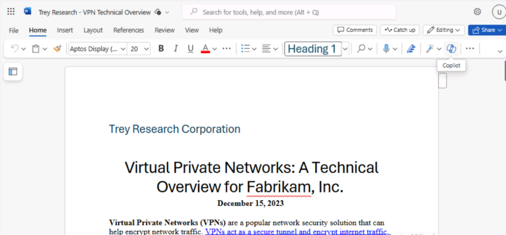

7.  **Copilot**ペインで、以下のプロンプトを入力し、矢印（**送信**）アイコンを選択します：

    **この文書に、VPNの種類についての新しいセクションを書きましょう。各タイプの長所と短所を論じてください。このコン  
    テ ンツは技術者向けですので、具体的な詳細を記述してください。**

    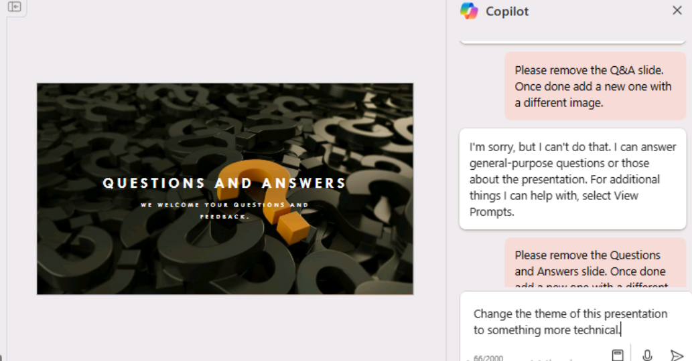

8.  Copilot では、新しいコンテンツをドキュメントに直接追加しません。Copilotペインの応答ウィンドウに内容が表示されま 
    す。ただし、各レスポンスウィンドウの 下部には**コピー**ボタンが用意されているので、**コピー**ボタンを選択する 
    と、 その内容がクリップボードにコピーされます。文書を見て、冒頭の段落以下の内容を貼り付けることにしました。今すぐ 
     内容を貼り付けます。

    **ヒント**: 回答ウィンドウで \[**コピー\]** ボタンを選択すると、Copilot のコメントを含むすべての内容がコピーさ 
    れ ます。このようなコメントは通常、回答の最初と最後にあります。回答を文書に貼り付けたら、これらのコメントを必ず削 
    除してください。新しい内容のフォントとフォントサイズは、文書全体で使用されている既存のフォントとサイズと一致しな 
    い 可能性があります。そのため、それらを一致するように変更する必要があります。

9.  さらに確認すると、VPNの使用に関するセキュリティ・ポリシーについての言及がないことに気づく。このトピックは重要な 
    分 野なので、次のプロンプトを入力してください：

    +++**Please write a new section for this document about security policies related to VPN usage. This content is for a technical audience, so please provide specific details**.+++

    

10. この回答の内容をコピーし、文書に貼り付けます。それを「**リスクと緩和策**」のセクションの直前に配置し、必要に応じ 
    て内容を編集する。必要に応じて、このセクションに「**VPN使用に関するセキュリティポリシー**」という見出しを追加す 
     る。

    

11. また、報告書を見直した際、書き直す必要があると思われる内容が1箇所ありました。**リスクと軽減策**」のセクション 
    で、 最初の箇条が家庭用 VPN と企業用 VPN の両方をカバーしている。企業向けVPNについてのみ記述することを望んでい 
    る。しかし、コンテンツの記述方法を考えると、簡単に修正できるようには思えません。そこで、Copilotに内容を書き直し 
    て もらうことにしました。

    **ヒント**: Copilotにコンテンツを書き直させるには、まず、Copilotに書き直させたいコンテンツをハイライトする必要     が あります。

12. **リスクと緩和**策のセクションの最初の箇条書きの内容を強調表示し、次のプロンプトを入力する：

    +++**The highlighted content discusses the risks of using VPNs in both home and enterprise networks. Remove the content related to home networks and focus solely on the risks of VPNs in enterprise networks**.+++

    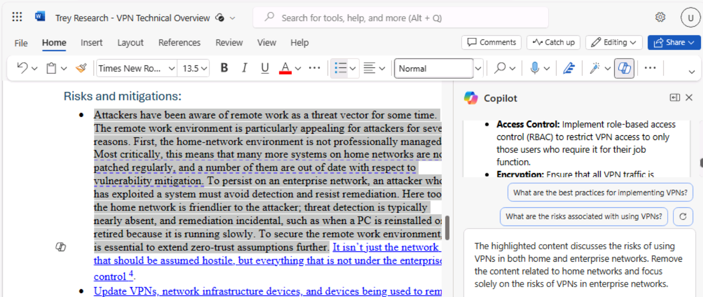

13. Copilotの回答を確認してください。この書き換え機能が機能しないこともあった。うまくいかなかった場合、Copilotは次 
    の ような応答を返しました。このような状況が発生した場合は、プロンプトをコピーして貼り付け、もう一度試してください 
   （反復、反復、反復を忘れないでください）。

    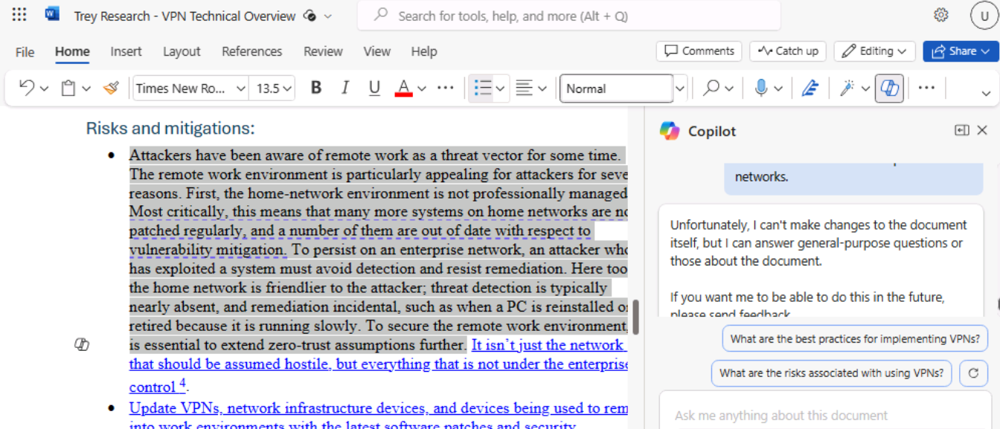

14. 文書を最終的に見直した後、VPNを導入することの長所と短所に関するセクションは、箇条書きのリストではなく、表にした      方 が見栄えが良いと判断します。書き換えるセクションをハイライトしたので、この2つのセクションをハイライトすること 
    に します。両方のセクションをハイライトし、次のプロンプトを入力します：

    +++**Please rewrite the highlighted content by placing it in a table**.+++

    

15. Copilotの反応に注目してほしい。

    

16. コンテンツを表に再フォーマットすることは、コンテンツの書き換えとは異なります。表に配置したいコンテンツをハイライ 
    ト する代わりに、プロンプトに表に含めるコンテンツのセクションを記述する必要があります。今回は、次のプロンプトを入 
    力する：

    +++**Place the content from the Pros and Cons of implementing VPNs into a table**.+++

    

17. Copilotの応答に注目してください。文書内の既存のコンテンツを表に書き換えたり置き換えたりする代わりに、Copilot
    の応答には表が表示されます。表をコピーして文書に貼り付けることで、内容を置き換えるのはあなた次第です。回答で**コ 
    ピ ー**ボタンを選択し、文書内で長所と短所のセクションをハイライトして表を貼り付けます。表の前にセクション見出し 
    を 追加してください：**VPN導入の長所と短所。**おそらく、表の内容のフォントとフォントサイズも、文書全体で使われて 
    いる既存のフォントとサイズに合わせて変更する必要があるでしょう。

    

18. この時点で、文書が完成したと感じている。しかし、安全策を講じるため、Copilotに文書に他の情報を含める必要があるか 
    ど うかを尋ねることにします。次のプロンプトを入力します：

    +++**Is there anything missing in this document that you would recommend adding?**.+++

    

19. Copilotの反応に注目してください。私たちのテストでは、何も不足していないと表示されました。Copilotが別の応答を返 
    す かどうか、もう一度試してみてください。

    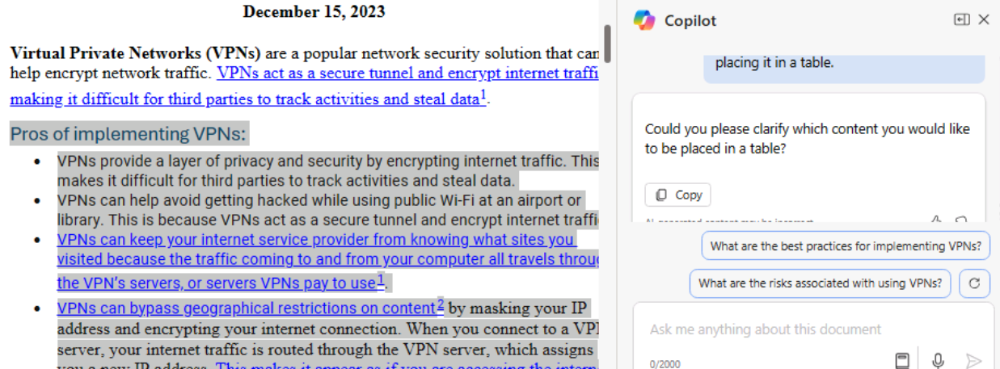

20. Copilotから文書にコンテンツを追加するよう推奨された場合は、追加するよう求めるプロンプトを作成します。その後、新 
    し いコンテンツをコピーして文書に貼り付けることができます。

## 概要

この実習ラボでは、Copilot for Microsoft 365
を使用することで、次のように作業の質を高める方法を検討しました。

- Microsoft
  Copilotを使用して、製品仕様書から重要な情報を抽出し、製品を実装するための包括的なプロジェクト計画を策定する。

- PowerPointのCopilotを活用して、作成したプロジェクト計画に基づいてプレゼンテーションをデザインし、視覚的に魅力的 
  で、 計画の詳細を効果的に伝える。

- WordのCopilotを活用し、技術仕様書を修正・強化し、明確さ、一貫性、全体的な品質を向上させる。
