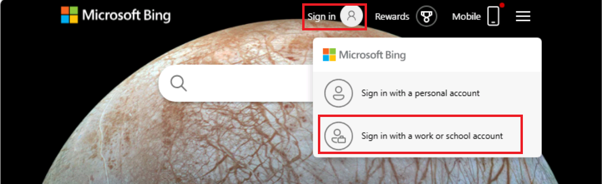
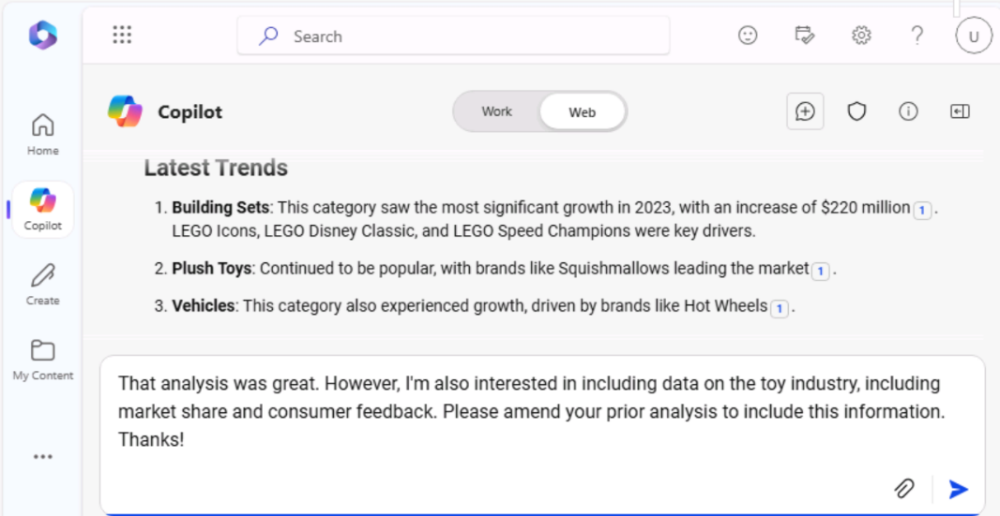
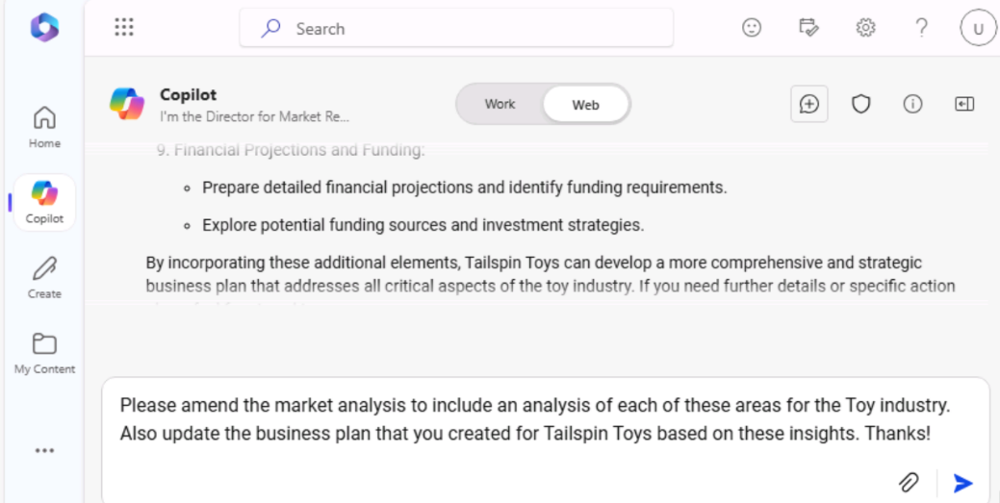
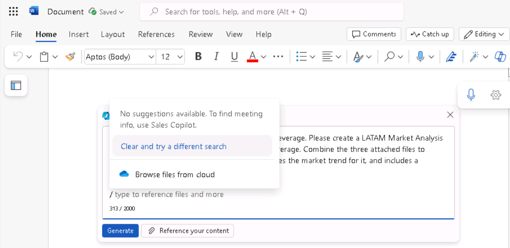
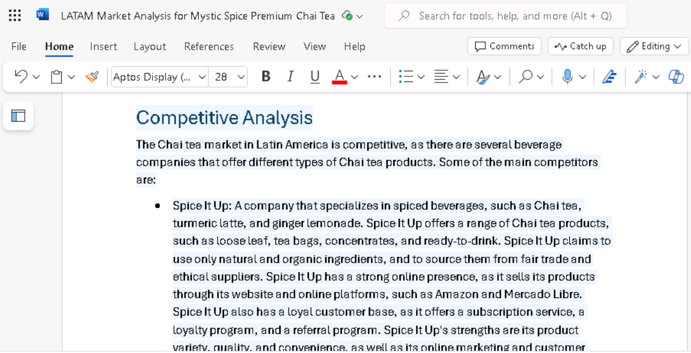
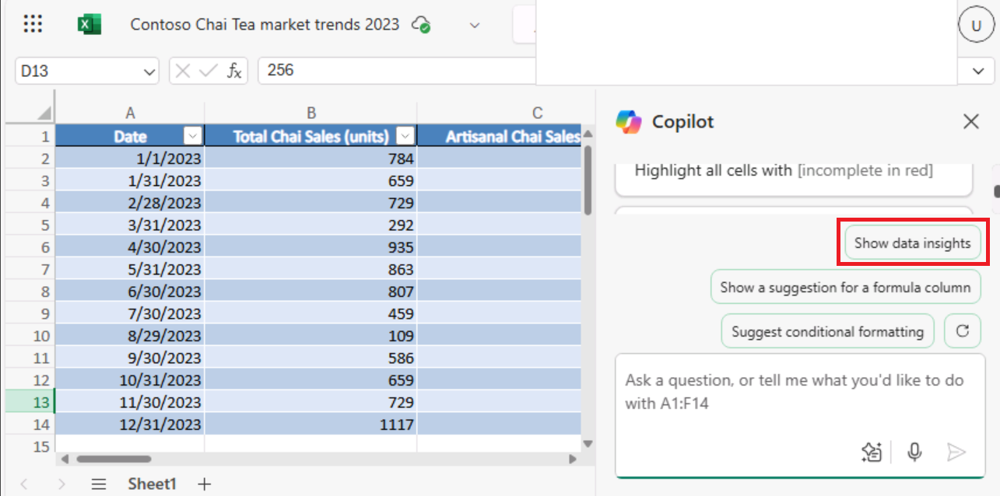
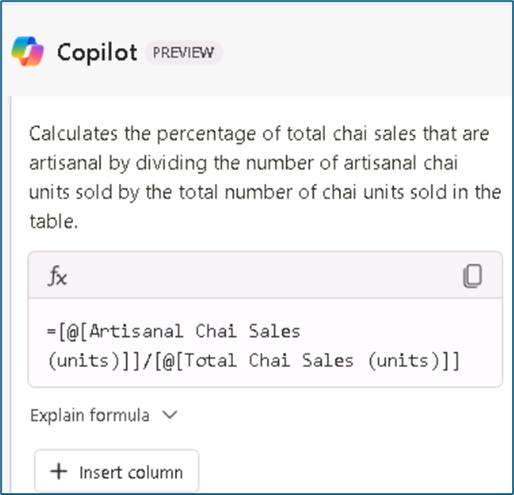
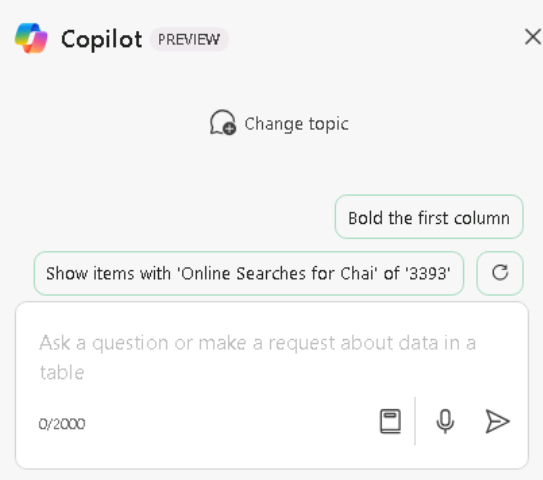

# Laboratorio 1C: Mejorar la productividad de ventas y marketing

## Objetivo:

Los profesionales de marketing y ventas pueden utilizar Copilot for
Microsoft 365 para generar contenido para sus campañas, mejorar la
productividad, obtener información sobre sus campañas, colaborar de
forma más eficaz y automatizar tareas repetitivas como dar formato,
añadir tablas y gráficos e incluso corregir documentos.

En este laboratorio utilizarás:

- Microsoft Copilot (modo Bing/Web) para analizar las tendencias del
  mercado, proporcionar previsiones de ventas e identificar nuevas
  oportunidades de venta.

- Copilot en Word para combinar varios informes de marketing.

- Copilot en Excel para analizar las tendencias del mercado en una hoja
  de cálculo.

## Ejercicio nº 1: Realizar un análisis de mercado con Microsoft Copilot

Microsoft Copilot (dentro de Bing) es un servicio de IA generativa
basado únicamente en datos de la web pública en el índice de búsqueda de
Microsoft Bing. No tiene acceso a los recursos de la organización ni al
contenido de Microsoft 365 Graph.

Como director de estudios de mercado de Tailspin Toys, quiere realizar
un análisis de mercado del sector del juguete para presentarlo al equipo
directivo de la empresa (SLT). Su objetivo es identificar las últimas
tendencias, las preferencias de los consumidores y los juguetes más
populares del mercado.

En este ejercicio utilizarás la funcionalidad de chat de Microsoft
Copilot en Bing. Cuando utilice Microsoft Copilot, es importante que
proporciones contexto y recursos al elaborar sus solicitudes. La calidad
de la respuesta depende de cómo elabore la solicitud siguiendo los
consejos y eligiendo el estilo de conversación adecuado (Más creativo,
Más equilibrado o Más preciso).

1.  En **Microsoft Edge**, abra una nueva pestaña e introduce la
    siguiente URL: **+++https://bing.com+++**

2.  En **Microsoft Bing**, en la lista de pestañas de la parte superior
    de la página, seleccione **Copilot**. Al hacerlo, se abrirá
    Microsoft Copilot.

    

    **Nota:** Si no ve la lista de pestañas en la parte superior de la
    página, siga los pasos que se indican a continuación para ver la lista
    de pestañas.

  - Asegúrese de haber iniciado sesión con las **credenciales de Microsoft 365**
    (disponibles en la pestaña **Resources**).

    

  - Activar la opción **Show menú bar** (en rojo resaltado)

    

    

3.  Ahora seleccione **Copilot**. Al hacerlo, se abrirá Microsoft
    Copilot.

    

4.  En la página de **Copilot**, fíjese en el interruptor de la parte
    superior de la página que le permite seleccionar **Work** o **Web**.
    Aunque su solicitud es una tarea relacionada con el trabajo,
    necesita que Copilot acceda a la Web para realizar su análisis de
    mercado del sector del juguete. Si es necesario, seleccione **Web**.

    

    

    **Nota**: El selector de tono conversacional **More Creative -More Balanced- More Precise** presente 
    en la versión anterior de Copilot se ha suprimido en la última versión.

5.  En el campo de consulta, introduzca la siguiente consulta y, a
    continuación, seleccione el icono **Enviar**:

    **I'm the Director for Market Research for Tailspin Toys, a U.S. based
    toy manufacturer. Conduct a market analysis of the toy industry to
    identify sales figures, the latest trends, consumer preferences, and
    the most popular toys in the market**.

    

6.  Revise el análisis de mercado generado por Copilot. Se da cuenta de
    que una solicitud general como la que ha enviado proporciona
    información básica como las tendencias del mercado, las preferencias
    de los consumidores y las tendencias de los juguetes. Sin embargo,
    también está interesado en recopilar datos sobre la industria del
    juguete, incluida la cuota de mercado y las opiniones de los
    consumidores. Se da cuenta de que fue un poco impreciso en su
    solicitud anterior, ya que no pidió esta información específica.
    Recuerde las sugerencias de buenas prácticas de su formación
    anterior: sea educado e itere, itere, itere. Introduzca el siguiente
    mensaje para modificar el análisis de mercado:

    **That analysis was great. However, I'm also interested in including
    data on the toy industry, including market share and consumer
    feedback. Please amend your prior analysis to include this
    information. Thanks**.

    

    

    

7.  Se da cuenta de que se está acercando a su objetivo, pero aún le
    falta información clave. Tras revisar sus prompts anteriores, se ha
    dado cuenta de que ha proporcionado a Copilot su objetivo general,
    el alcance del análisis y los datos que necesitaba. Sin embargo, no
    le ha pedido a Copilot que analice toda esta información para que
    pueda tomar decisiones informadas sobre el plan de negocio de
    Tailspin Toys para el próximo año. Para corregir esta deficiencia,
    introduzca la siguiente prompt:

    **I think all the data is complete. With all the information that you
    captured, please analyze the data and identify patterns, trends, and
    insights that can help me determine what Tailspin Toy's business plan
    should be for the upcoming year**.

    

    

8.  Le gusta mucho la información que le ha proporcionado Copilot. Sin
    embargo, como este proyecto es su primera oportunidad de
    proporcionar un informe de análisis de mercado al SLT de su empresa,
    no está seguro de si está cubriendo todo lo que podría interesarles.
    Decide que Copilot le ayude a determinar si le falta algo.
    Introduzca el siguiente prompt:

    **Please analyze the data in this market analysis and business plan.
    Is there any other information that a toy company would typically
    request for market analysis and business plans that I failed to
    request? If so, can you please amend your responses to include this
    information. Thank you**.

    

    

9.  Basándose en la información que Copilot le proporciona, se da cuenta
    de que puede maximizar realmente la eficacia de sus informes
    haciendo que Copilot incluya un análisis de estas áreas. Para dar el
    toque final a sus informes, introduzca la siguiente consulta:

    **Please amend the market analysis to include an analysis of each of
    these areas for the Toy industry. Also update the business plan that
    you created for Tailspin Toys based on these insights. Thanks!**.

    

    

10. El análisis de mercado y el plan de negocio que Copilot generó para
    usted se basaron en un estilo de conversación predefinido. Es ideal
    para usuarios que buscan un equilibrio entre precisión y
    creatividad.

    Si tiene curiosidad por saber cómo quedarían los informes con el
    estilo **More Creative** (respuestas más imaginativas y creativas),
    puedes ajustar manualmente los prompts para establecer el tono o el
    enfoque, en función de si quieres resultados precisos, creativos o
    equilibrados:

    **Puntos para tener en cuenta**:

    - **Para respuestas precisas**: Utilice consultas claras, específicas y
      detalladas. Indique que desea respuestas objetivas, concisas y
      centradas en la precisión.

    - **Para respuestas creativas**: Utilice preguntas abiertas,
      exploratorias o imaginativas. Fomente la lluvia de ideas o sugiera
      soluciones cuando se requiera originalidad.

    - **Para respuestas equilibradas:** Utilice preguntas moderadamente
      abiertas que requieran una combinación de detalles objetivos y algo de
      creatividad. Puede pedir tanto información analítica como
      exploratoria.

## Exportar una respuesta Copilot

Cuando utilices Microsoft Copilot en Bing para investigar diferentes
cosas o responder a diferentes preguntas, puede que decidas que una
respuesta es tan buena que quieras guardarla para consultarla en el
futuro.

1.  Seleccione el botón **Copy** en la parte inferior de una respuesta
    rápida para copiar la respuesta y pegar la respuesta copiada en un
    editor de texto.

>
Si desea consolidar varias respuestas en un único documento, deberá
copiar y pegar manualmente cada respuesta en un editor de texto y
guardar el archivo.

## Ejercicio nº 2: Consolidar varios informes de marketing utilizando Copilot en Word

Copilot en Word, un asistente de escritura impulsado por AI, puede
ayudarle a reescribir el contenido existente, o incluso a transformar el
contenido seleccionado en una tabla.

Como director de marketing para Latinoamérica (LATAM) de Contoso
Beverage, una división de Contoso, Ltd., su jefe de producto le ha
proporcionado tres informes distintos sobre la bebida Mystic Spice
Premium Chai Tea de la empresa. Sin embargo, le resulta difícil analizar
la información, ya que salta constantemente de un documento a otro.

Usted decide combinar los informes en un único informe de LATAM Market
Analysis para Chai Tea Premium Mystic Spice. En este ejercicio utilizará
Copilot para crear el informe combinado, revisarlo y posiblemente
actualizarlo con otra información que Copilot pueda encontrar sobre el
mercado del Chai Tea en Latinoamérica.

1.  Si tiene una pestaña de **Microsoft 365** abierta en el navegador
    Microsoft Edge, selecciónela ahora; de lo contrario, abra una nueva
    pestaña e introduzca la siguiente URL:
    [**<u>https://www.office.com</u>**](https://www.office.com/) para ir
    a la página de inicio **de Microsoft 365**.

**Nota**: Debe iniciar sesión (si se le solicita) con las **credenciales
de Microsoft 365** que se proporcionan en la **pestaña Resources de** la
derecha.

2.  Vaya a la carpeta **C:\LabFiles** para seleccionar y cargar una
    copia de los siguientes documentos en **OneDrive**.

- **Descripción del producto Mystic Spice Premium Chai Tea**

- **Tendencias del mercado del Chai Tea Contoso 2023**

- **Plan de promoción del Chai Tea en América Latina**

**Nota**: Puede omitir este paso si ya ha cargado una copia de todos
los documentos (que utilizará en esta sesión práctica de laboratorio
desde **C:\LabFiles** como se indica en el **Laboratorio 0**).

3.  En este ejercicio, se accede a los documentos desde la lista de
    archivos utilizados más recientemente. Para que los archivos
    aparezcan en la lista MRU, abra cada uno de los tres documentos y
    luego ciérrelos.

4.  En **Microsoft 365**, abra **Microsoft Word** y, a continuación,
    abra un nuevo documento en blanco.

5.  En la ventana **Draft with Copilot** que aparece en la parte
    superior del documento en blanco, introduzca la siguiente solicitud,
    pero no seleccione el botón **Generate** hasta después de vincular
    los tres archivos a la consulta:

**I'm the LATAM Marketing Director for Contoso Beverage. Please create
a LATAM Market Analysis report for our Mystic Spice Premium Chai Tea
beverage. Combine the three attached files to create a report that
describes the product, analyzes the market trend for it, and includes
a promotion plan for Latin America**.
>

6.  Ahora debe adjuntar los tres documentos a la solicitud. En la
    ventana **Draft with Copilot**, seleccione el botón R**eference your
    content**. En el menú desplegable que aparece, si el archivo
    **Mystic Spice Premium Chai Tea product description.docx** aparece
    en la lista de archivos, selecciónelo. De lo contrario, seleccione
    **Browse files from cloud**, seleccione el archivo de la lista de
    archivos **Recent** y, a continuación, seleccione el botón
    **Attach**. Observe cómo aparece el archivo en el prompt.

7.  Repita el paso anterior tanto para el archivo **Contoso Chai Tea
    market trends 2023.docx** como para el archivo **Plan for Chai Tea
    in Latin America.docx**. En este punto, los enlaces a los tres
    archivos deberían aparecer en la pantalla.

8.  Seleccione **Generate**. Una vez hecho esto, Copilot extrae la
    información pertinente de los tres archivos y redacta un informe que
    los combina en un único informe de Análisis de Mercado para Mystic
    Spice Premium Chai Tea.

9.  Tras revisar este primer borrador del informe de Análisis de
    Mercado, reconoces que le falta información fundamental. Le gustaría
    que incluyera una sección titulada **Competitive analysis**. Quiere
    que Copilot analice la competencia. Para ello, escriba lo siguiente
    en la ventana de Copilot situada en la parte inferior del informe y,
    a continuación, seleccione la flecha **Generate**:

>
**This report looks good. However, please add a section titled
Competitive Analysis. Review the beverage companies in Latin America
that sell Chai Tea and then provide information in this section on the
strengths and weaknesses of these competitors, their market share, and
their pricing strategies**.
>

10. Tras revisar este segundo borrador del informe que contiene la nueva
    sección Análisis de la competencia, se da cuenta de que falta una
    última cosa. Quiere que Copilot añada una sección sobre
    **Distribution Channels**. Esta sección debe analizar los canales de
    distribución utilizados para vender Chai Tea en América Latina. Para
    ello, escriba lo siguiente en la ventana de Copilot situada en la
    parte inferior del informe y, a continuación, seleccione la flecha
    **Generate**:

>
**Nice job! One last thing. Please add a section titled Distribution
Channels. Review the distribution channels used to sell Chai Tea in
Latin America and then provide information in this section on the
types of retailers, wholesalers, and distributors used**.

11. Después de revisar este último borrador que contiene la nueva
    sección Distribution channels, está satisfecho con el informe y está
    listo para guardarlo. En la ventana de Copilot situada en la parte
    inferior del documento, seleccione el botón **Keep it** para
    convertirlo de borrador de Copilot a documento de Word.

12. Revise el documento. Si quiere hacer algún cambio manual, puede
    hacerlo ahora. Una vez que esté satisfecho con él, no dude en
    guardar el documento en su OneDrive si desea conservarlo para
    futuras consultas, o simplemente descartarlo.

13. Cierre esta pestaña en su navegador Microsoft Edge.

## Ejercicio nº 3: Analizar una hoja de cálculo de tendencias de mercado
utilizando Copilot en Excel

Copilot en Excel es una potente herramienta que puede ayudar a los
profesionales del marketing a crear, editar, comprender y visualizar sus
datos con facilidad y obtener información sobre su negocio.

Las funciones de AI-powered de Copilot pueden ayudar a los profesionales
del marketing a ahorrar tiempo y esfuerzo automatizando las tareas
repetitivas (analizar los resultados trimestrales de la empresa, resumir
las tendencias clave, aplicar códigos de colores a las tablas, crear
modelos, escenarios, filtrar y ordenar, y añadir gráficos con un clic
del ratón) y proporcionando información valiosa que puede ayudarles a
tomar decisiones informadas.

Como Director de Marketing de Contoso Beverage, una división de Contoso,
Ltd., ha recibido una hoja de cálculo de tendencias de mercado que
muestra la actividad mensual del producto Chai Tea de Contoso. Desea
utilizar las funciones de Copilot en Excel para analizar el informe y
proporcionar un análisis detallado de las tendencias de marketing
mensuales.

En este ejercicio, utilizará Copilot en Excel para analizar una hoja de
cálculo de tendencias de mercado que ya tiene definida una tabla de
Excel.

**Nota**: Cuando utilice Copilot en Excel, debe
tener una tabla de Excel que incluya datos en una hoja de cálculo.
Puede convertir rápidamente un rango de celdas en una tabla de Excel
siguiendo estos pasos:

- Seleccione la celda o el rango en los datos.

- Seleccione **Home** \> **Format como
  tabla**.

- En el cuadro de diálogo **Format as Table**,
  seleccione la casilla de verificación situada junto a **My table has
  headers** si desea que la primera fila del rango sea la fila de
  encabezado.

- Seleccione **OK**.

1.  Si tiene una pestaña de **Microsoft 365** abierta en el navegador
    Microsoft Edge, selecciónela ahora; de lo contrario, abra una nueva
    pestaña e introduzca la siguiente URL:
    [**<u>https://www.office.com</u>**](https://www.office.com/) para ir
    a la página de inicio **de Microsoft 365**.

**Nota**: Debe iniciar sesión (si se le solicita) con las
**credenciales de Microsoft 365** que se proporcionan en la **pestaña
Resources de** la derecha.

2.  Vaya a la carpeta **C:\LabFiles** para seleccionar y cargar una
    copia de **Contoso Chai Tea market trends 2023.xlsx** en
    **OneDrive.**

**Nota**: Puede omitir este paso si ya ha cargado una copia de todos
los documentos (que utilizará en esta sesión práctica de laboratorio
desde **C:\LabFiles** como se indica en el **Laboratorio 0**)**.**

3.  Abre y cierra el archivo **Contoso Chai Tea market trends
    2023.xlsx** (que subiste a **OneDrive**) para que aparezca en su
    lista de archivos utilizados más recientemente (MRU).

4.  En la página de inicio de **Microsoft 365**, seleccione el icono de
    **Excel** en el panel de navegación de la izquierda.

5.  En **Excel**, en la página **Archivo**, seleccione **Contoso Chai
    Tea market trends 2023.xlsx** de la lista de archivos.

6.  Seleccione la opción **Copilot** en la parte derecha de la cinta.

7.  En el panel **Copilot** que aparece, puede elegir entre varias
    preguntas predefinidas. Seleccione el botón **Mostrar información
    sobre los datos**.

>

8.  Observe el gráfico pivotante que generó. Cuando probamos este
    ejercicio, Copilot siempre creó un gráfico de líneas de la **Social
    Media Engagement (views) by Date**. ¿Qué tipo de gráfico creó
    Copilot para usted? Debajo del gráfico que Copilot creó para usted,
    seleccione el botón **+ Add to a new sheet**.

9.  Aunque Copilot dice que ha añadido el gráfico a la Hoja 2, la Hoja 2
    no es visible en la hoja de cálculo.

10. Pruebe con la hoja de Excel maximizada y repita el paso 11. La **Add
    to sheet function** funcionó bien ahora.

11. Seleccione **Sheet 2**. Revise la nueva hoja de datos creada por
    Copilot. Copilot incluyó tanto el gráfico como la columna de datos
    de la hoja de cálculo que fue la base de este gráfico. Mantenga el
    cursor sobre el gráfico y observe la ventana que aparece y que
    indica el tipo de gráfico que ha generado Copilot.

14. Observe cómo en el panel Copilot ya no aparece la lista de avisos
    predefinidos. Esta situación se debe a que Copilot aún no funciona
    con tablas dinámicas (observe el mensaje que indica este problema).
    Seleccione **la Sheet 1**, que le devuelve a la tabla Excel. Observe
    cómo aparecen las preguntas predefinidas.

15. En las sugerencias predefinidas que aparecen sobre el campo de
    sugerencias, seleccione el botón **Show suggestions for formula
    columns**.

16. Observe la sugerencia de Copilot. La siguiente imagen muestra la
    sugerencia que Copilot proporcionó durante nuestras pruebas.

17. En la sugerencia que ha recibido, seleccione la flecha desplegable
    **Explain formula**. Revise la explicación de Copilot que describe
    el cálculo. Seleccione el botón **+Insert column** para insertar
    esta columna en su tabla de Excel.

18. Observe cómo Copilot ha añadido esta columna de datos al final de su
    tabla Excel en **la Sheet 1**. ¿Le intriga esta función? Puede que
    quiera ver qué otras sugerencias de fórmulas proporciona. Seleccione
    de nuevo el botón **Show suggestions for formula columns.** Observe
    la sugerencia. Seleccione el botón **+Insert column** para insertar
    esta columna sugerida en tu tabla de Excel.

19. En las preguntas predefinidas que aparecen sobre el campo de
    pregunta, seleccione el botón **How can I highlight, filter, and
    sort data?**

20. Observa la lista de acciones que puedes emprender.

21. En este punto, las indicaciones predefinidas que muestra Copilot ya
    no le interesan. Por lo tanto, desea ver un nuevo conjunto de
    prompt. Seleccione el botón **Refresh** que aparece encima del campo
    de prompt.

22. Revise la lista revisada de avisos predefinidos que aparecen ahora.
    La siguiente imagen muestra ejemplos de los prompts que se
    mostraron.

23. El objetivo de este ejercicio es familiarizarse con los distintos
    tipos de acciones predefinidas que puede realizar Copilot. Por lo
    tanto, seleccione diferentes indicaciones para ver qué ocurre. Por
    ejemplo

    - Si aparece el mensaje **Ordenar**, selecciónelo ahora. Observe
      cómo Copilot ha ordenado los datos.

    - Si aparece la indicación **Negrita**, selecciónela ahora. Observe
      cómo Copilot pone en negrita los elementos de la columna que
      menciona y deja los demás sin negrita.

24. Seleccione de nuevo el botón **Actualizar** que aparece encima del
    campo de consulta.

25. Revise el nuevo conjunto de indicaciones que muestra. Seleccione el
    botón **Refresh** varias veces para ver los distintos tipos de
    avisos que ofrece Copilot.

26. No dude en seleccionar cualquier otra opción para ver qué hace
    Copilot. Cuando haya terminado, cierre la pestaña del navegador
    Microsoft Edge.

## Resumen:

En este laboratorio has utilizado

- Microsoft Copilot (modo Bing/Web) para analizar las tendencias del
  mercado

- Copilot en Word para combinar varios informes de marketing en un
  documento coherente.

- Copilot en Excel para analizar las tendencias del mercado dentro de
  una hoja de cálculo.

A través de estas actividades, puede agilizar los procesos y mejorar la
eficacia general de sus campañas de marketing.
