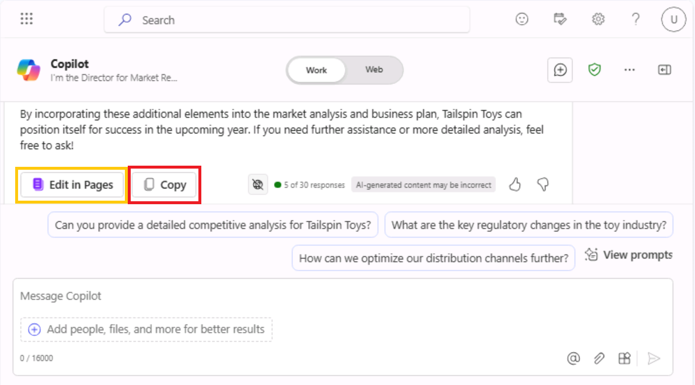

# ラボ1C：営業とマーケティングの生産性向上

## 目的

マーケティングおよびセールス担当者は、Copilot for Microsoft
365を活用することで、キャンペーン用のコンテンツを作成し、生産性を向上させ、キャンペーンに関する洞察を得て、コラボレーションを効率化し、書式設定、図表の追加、文書の校正などの繰り返し作業を自動化することができます。

このラボでは、以下のものを使用する：

- Microsoft
  Copilot（Bing/Webモード）による市場動向の分析、販売予測、新規販売機会の特定。

- WordのCopilotで複数のマーケティングレポートを結合。

- ExcelのCopilotを使用し、スプレッドシートで市場動向を分析。

## 練習1：Microsoft Copilotを使った市場分析の実施

Microsoft Copilot（Bing内）は、Microsoft Bing検索インデックス内のパブリックウェブのデータのみを根拠とする 
Generative AIサービスである。Microsoft 365 Graph内の組織リソースやコンテンツにはアクセスできない。

Tailspin Toysの市場調査担当ディレクターとして、あなたは玩具業界の市場分析を行い、会社のシニア・リーダーシップ・チー 
ム （SLT）に提供したいと考えています。あなたの目標は、最新のトレンド、消費者の嗜好、市場で最も人気のある玩具を特定す 
 る ことです。

この演習では、BingのMicrosoft Copilotチャット機能を使用します。Microsoft Copilotを使用する場合、プロンプトを作成するときにコンテキストとリソースを提供することが重要です。回答の質は、ヒントに従ってどのようにリクエストを作成し、適切な会話スタイル（More Creative、More Balanced、More Preciseのいずれか）を選択するかによって決まります。

1.  **Microsoft Edgeで**新しいタブを開き、以下のURLを入力する：+++https://bing.com+++

2.  **Microsoft Bingで**、ページ上部のタブの一覧から**Copilotを**選択します。Microsoft
    Copilotが開きます。

    

    **注：**ページ上部にタブのリストが表示されない場合は、以下の手順でタブのリストを表示してください。

    - **Microsoft 365 認証情報を**使用してサインインしていることを確認します（\[**リソース**\]
      タブで利用可能）。

      

    - **メニューバーを表示する**オプションを有効にする（赤いハイライト部分）

      

      

3.  **Copilotを**選択します。Microsoft Copilotが開きます。

    

4.  **Copilotの**ページで、ページ上部のトグルスイッチに注目してください。リクエストは仕事に関連するタスクですが、 
    Copilotが玩具業界の市場分析を行うにはWebにアクセスする必要があります。必要に応じて、**Webの**トグルスイッチを選 
    択してください。

    

    

    注：旧バージョンのCopilotにあった会話トーンセレクター「**More Creative - More Balanced - More Precise**」 
    は、最 新バージョンでは廃止されています。

5. プロンプトフィールドに以下のプロンプトを入力し、**Submit**アイコンを選択する：

    ++**I'm the Director for Market Research for Tailspin Toys, a U.S. based toy manufacturer. Conduct a   
    market analysis of the toy industry to identify sales figures, the latest trends, consumer 
    preferences, and the most popular toys in the market**.++

     

6.  Copilotが作成した市場分析を確認してください。提出したリクエストのような一般的なリクエストでは、市場動向、消費者 
    の 嗜好、玩具のトレンドなどの基本的な情報が得られることを理解しています。しかし、市場シェアや消費者の声など、玩具 
    業界に関するデータも収集したいと考えています。このような具体的な情報を要求していなかったため、事前のプロンプトで 
    は 少し漠然としすぎていたことに気づきました。礼儀正しく、反復、反復、反復。次のプロンプトを入力し、市場分析を修正 
    する：

    ++**That analysis was great. However, I'm also interested in including data on the toy industry, 
    including market share and consumer feedback. Please amend your prior analysis to include this 
    information. Thanks**!++

    

    

    

7.  目標に近づいていることに気付きましたが、まだ重要な情報が不足しています。事前のプロンプトを確認した後、Copilotに 
    全 体的な目的、分析の範囲、必要なデータを提供したことに気付きました。しかし、Tailspin
    Toysの次年度の事業計画について十分な情報を得た上で意思決定できるように、Copilotにこれらの情報をすべて分析するよ 
    う依頼できませんでした。この欠点を修正するには、次のプロンプトを入力します：

    ++**I think all the data is complete. With all the information that you captured, please analyze the 
    data and identify patterns, trends, and insights that can help me determine what Tailspin Toy's 
    business plan should be for the upcoming year**.++

    

    

8.  Copilotが提供してくれた情報はとても気に入っています。しかし、このプロジェクトはSLTに市場分析レポートを提供する初 
    めての機会であるため、SLTが関心を持ちそうな情報をすべて網羅しているかどうか確信が持てません。そこで、Copilot
    に不足しているものがないかどうかを判断してもらうことにしました。次のプロンプトを入力します：

    ++**Please analyze the data in this market analysis and business plan. Is there any other information 
    that a toy company would typically request for market analysis and business plans that I failed to 
    request? If so, can you please amend your responses to include this information. Thank you**!++

    

    

9.  Copilot が提供する情報に基づき、Copilot にこれらの領域の分析を含めることで、レポートの効果を最大限に高めること 
    が できます。レポートの仕上げを行うには、次のプロンプトを入力します：

    ++**Please amend the market analysis to include an analysis of each of these areas for the Toy 
    industry. Also update the business plan that you created for Tailspin Toys based on these insights. 
    Thanks**!++

    

    

10. Copilotが作成した市場分析と事業計画は、事前に定義された会話スタイルに基づいています。正確さと創造性のバランスを 
    求 めるユーザーに最適です。

     **よりクリエイティブな**スタイル（より想像的で創造的な回答）を使用したレポートがどのように見えるか興味がある場 
     合 は、プロンプトを調整して、正確な出力、創造的な出力、またはバランスの取れた出力のいずれを求めるかによって、ト 
     ー ンまたはフォーカスを手動で設定することができます：

     **注意すべき点**

      - **的確な**回答の**ために**明確で具体的、かつ詳細志向のプロンプトを使用する。正確さを重視し、事実に基づいた 
         簡 潔な回答を求めていることを示す。

      - **創造的な回答のために**：自由形式、探索的、または想像的なプロンプトを使用する。独創性が必要な場合は、ブレー 
        ンストーミングを奨励したり、解決策を提案する。

      - **バランスのとれた回答のために**事実の詳細と創造性を織り交ぜた、適度な自由形式のプロンプトを使用する。分析的 
        な意見と探求的な意見の両方を求めることができます。

## Copilot レスポンスのエクスポート 
BingのMicrosoft Copilotを使用してさまざまなことを調べたり、さまざまな質問に答えたりするとき、ある回答が非常に優れていると判断して、将来の参考のために保存したくなることがあります。

プロンプト応答の下部にある**コピー**ボタンを選択すると、応答がコピーされ、コピーされた応答がテキストエディタに貼 
り 付けられます。
    
**注**: Edit in Pages ボタンが表示されます。このボタンは、より多くの機能を提供し、チームコラボレーションを促進 
し ます。ただし、この演習では Edit in Pages は使用しません。

複数の回答を1つの文書にまとめたい場合は、各回答をテキストエディタで手動でコピー＆ペーストし、ファイルを保存する必 
要があります。

## 練習その2：WordのCopilotを使用して複数のマーケティングレポートを統合する

WordのCopilotは、AI-poweredライティングアシスタントで、既存のコンテンツを書き直したり、選択したコンテンツを表に変換することもできます。

Contoso, Ltd.の一部門であるContoso Beverageのラテンアメリカ（LATAM）マーケティングディレクターであるあなたは、プロダクトマネージャーから、同社のミスティックスパイス・プレミアム・チャイティー飲料に関する3つの報告書を受け取りました。しかし、あなたは常に書類を行ったり来たりしているため、情報を分析するのが難しいと感じています。

このレポートを 1 つにまとめ、Mystic Spice Premium Chai Tea
のラテンアメリカ市場分析レポートを作成することにしました。この演習では、Copilot
を使用して結合レポートを作成し、それをレビューして、ラテンアメリカのチャイティー市場に関するその他の情報を更新します。

1.  Microsoft Edgeブラウザで**Microsoft
    365の**タブを開いている場合は、今すぐ選択します。そうでない場合は、新しいタブを開き、次のURLを入力します：
    +++https://www.office.com+++ Microsoft 365のホームページに移動します。

    **注**: 右側の に**ある \[リソース\] タブで**提供される **Microsoft 365 認証情報を**使用してサインインする必 
    要 があります (プロンプトが表示された場合)。

2.  **C:\LabFiles**フォルダを参照し、以下のドキュメントのコピーを選択して**OneDriveに**アップロードします。

    - **Mystic Spice Premium Chai Tea product description**

    - **Contoso Chai Tea market trends 2023**

    - **Promotion Plan for Chai Tea in Latin America**

     **注**: すでに Preparing for the lab execution セクションで提案されたように、すべてのラボ資産を OneDrive 
     に アップロードしている場合は、この手順をスキップできます。

3.  この練習では、"最近使用したファイル "リストからドキュメントにアクセスします。MRUリストにファイルを表示させるに 
    は、3つのドキュメントをそれぞれ開いてから閉じます。

    

4.  **Microsoft 365でMicrosoft Wordを**開き、新しい空白の文書を開きます。

5.  空白ドキュメントの上部に表示される「**Copilotを使用した下書き」**ウィンドウで、次のプロンプトを入力します。ただ 
    し、3つのファイルをプロンプトにリンクするまでは、**「生成」**ボタンを選択しないでください：

    +++**I'm the LATAM Marketing Director for Contoso Beverage. Please create a LATAM Market Analysis 
    report for our Mystic Spice Premium Chai Tea beverage. Combine the three attached files to create a 
    report that describes the product, analyzes the market trend for it, and includes a promotion plan for 
    Latin America**.+++

    

6.  ここで、3 つの文書をプロンプトに添付する必要があります。**Draft with Copilot** ウィンドウで、**Reference your 
    content** ボタンを選択します。表示されるドロップダウンメニューで、ファイルの一覧に
    **Mystic Spice Premium Chai Tea product description.docx** ファイルが表示されている場合は、それを選択しま 
    す。そうでない場合は、**Browse files from cloud** を選択し、**最近使用した**ファイル
    リストからファイルを選択して、**Attach** ボタンを選択します。プロンプトにファイルがどのように表示されるかに注意 
    し てください。

    

7.  **Contoso Chai Tea market trends 2023.docx**ファイルと**Promotion Plan for Chai Tea in Latin
    America.docx**ファイルの両方について、前のステップを繰り返します。この時点で、3つのファイルへのリンクがプロンプ 
    トに表示されるはずです。

    

8.  **生成\]を**選択します。そうすると、Copilotは3つのファイルから適切な情報を抽出し、それらを1つのレポートにまとめ 
    て、Mystic Spice Premium Chai Teaの市場分析レポートを作成します。

    

9.  市場分析レポートの第一稿を見直した結果、重要な情報が欠けていることに気づきました。**競合分析**」というタイトルの 
    セクションが必要です。Copilotに競合を分析させたい。そのためには、レポート下部の Copilot ウィンドウに次のプロン 
    プ トを入力し、\[**Generate\] (生成)** 矢印を選択します：

    

    +++**This report looks good. However, please add a section titled Competitive Analysis. Review the   
    beverage companies in Latin America that sell Chai Tea and then provide information in this section on 
    the strengths and weaknesses of these competitors, their market share, and their pricing 
    strategies**.+++

    

10. 新しい「競合分析」セクションを含むレポートの第2稿を見直した後、最後に1つだけ欠けていることに気付きます。Copilot 
    に **Distribution Channels** のセクションを追加してほしいのです。このセクションでは、ラテンアメリカでチャイテ 
    ィ ーを販売 するために使用される流通チャネルを分析する必要があります。そのためには、レポート下部のCopilotウィン 
    ド ウに次のプ ロ ンプトを入力し、**Generate**矢印を選択します：

    

    +++**Nice job! One last thing. Please add a section titled Distribution Channels. Review the 
    distribution channels used to sell Chai Tea in Latin America and then provide information in this 
    section on the types of retailers, wholesalers, and distributors used**.+++

11. 新しい \[販売チャネル\]
    セクションを含む最新の草稿を確認した後、レポートに満足して保存する準備ができました。ドキュメントの下部にある
    Copilot ウィンドウで \[**Keep it\]** ボタンを選択し、Copilot
    ドラフトから Word ドキュメントに変換します。

    

12. 文書を見直す。手動で変更したい場合は、今すぐ変更できます。ご満足いただけたら、今後の参考のために文書を保存してお 
    き たい場合は、OneDriveに保存してください。

13. Microsoft Edgeブラウザでこのタブを閉じます。

演習3:エクセルのCopilotを使用して市場トレンドのスプレッドシートを分析する

ExcelのCopilotは、マーケティング担当者がデータを簡単に作成、編集、理解、視覚化し、ビジネスに関する洞察を得るのに役立つ強力なツールです。

CopilotのAI-powered機能は、反復的なタスク（四半期業績の分析、主要トレンドの要約、表の色分け、モデルの作成、シナリオの作成、フィルタリングと並べ替え、マウスのクリックによるグラフの追加）を自動化することで、マーケティング担当者の時間と労力を節約し、情報に基づいた意思決定に役立つ貴重な洞察を提供します。

Contoso, Ltd.の一部門であるContoso
Beverage社のマーケティング部長であるあなたは、Contoso社のチャイ紅茶製品の月ごとの活動を示す市場動向のスプレッドシートを受け取りました。Excel
の Copilot
の機能を使用してレポートを分析し、毎月のマーケティング傾向の詳細な分析を行いたいとします。

この演習では、ExcelのCopilotを使用して、すでにExcelテーブルが定義されている市場トレンドのスプレッドシートを分析します。

  class="mark"
**注**: Excel で Copilot

 を使用する場合は、ワークシートのデータを含む Excel

 テーブルが必要です。次の手順を実行すると、セル範囲を Excel

 テーブルにすばやく変換できます：

-  class="mark"
データ内のセルまたは範囲を選択します。

-  class="mark"
**Home** \
 **Format as Table** を選択する。

-  class="mark"
**表としてフォーマット**
  ダイアログボックスで、範囲の最初の行をヘッダー行にしたい場合は、**My
  table has headers** の横のチェックボックスを選択する。

-  class="mark"
**OKを**選択する。

1.  Microsoft Edgeブラウザで**Microsoft
    365の**タブを開いている場合は、今すぐそれを選択します。そうでない場合は、新しいタブを開き、次のURLを入力します：[**<u
https://www.office.com
    Microsoft
    365のホームページに移動します。</u
**](https://www.office.com/)

 **注**: 右側の**「Resources」タブで**提供される **Microsoft 365

 認証情報を**使用してサインインする必要があります

 (プロンプトが表示された場合)。

2.  **C:「LabFiles」**フォルダを参照し、「**Contoso Chai Tea market
    trends 2023.xlsx**」を選択し、**OneDriveに**アップロードします**。**

 **注**: すべてのドキュメントのコピー（実習ラボ

 セッションで使用するもの）を、**実習ラボ 0** の指示に従って

 **C:∕LabFiles**

 からすでにアップロードしている場合は、この手順を省略できます**。**

3.  **Contoso Chai Tea market trends
    2023.xlsx**（**OneDriveに**アップロードしたファイル）を開いて閉じると、Most
    Recently Used（MRU）ファイルリストに表示されます。

 

4.  **Microsoft 365 の**ホームページで、左側のナビゲーション
    ペインにある **Excel** アイコンを選択します。

5.  **Excelの「ファイル**」ページで、ファイルリストから**「Contoso Chai
    Tea market trends 2023.xlsx」を**選択する。

6.  リボンの右側にある**Copilot**オプションを選択します。

7.  表示される **Copilot**
    ペインでは、いくつかの定義済みプロンプトから選択できます。**Show
    data insights**］ボタンを選択します。

 

 

8.  生成されたピボットチャートに注目してください。この演習をテストしたとき、Copilot
    は常に**日付ごとのソーシャルメディア関与（ビュー**）の折れ線グラフを作成しました。Copilot
    はどのようなグラフを作成しましたか?Copilot
    が作成したチャートの下にある \[**+新しいシートに追加\]**
    ボタンを選択します。

 

9.  Copilotはチャートをシート2に追加したと言っていますが、スプレッドシートにはシート2が表示されていません。

 

10. エクセルシートを最大化し、ステップ11を繰り返します。**シートへの追加機能は**正常に動作するようになりました。

 

11. **シート 2** を選択します。Copilot
    が作成した新しいデータシートを確認します。Copilot
    には、グラフと、このグラフの基となったスプレッドシートのデータ列の両方が含まれています。グラフにカーソルを合わせると、Copilot
    が作成したグラフの種類を示すウィンドウが表示されます。

 

14. Copilot
    ペインで、定義済みのプロンプトのリストが表示されなくなったことに注意してください。このような状況が発生するのは、Copilot
    がまだピボットテーブルで動作していないためです
    (この問題を示すメッセージに注意してください)。**シート 1**
    を選択すると、Excel
    テーブルに戻ります。定義済みのプロンプトが表示されることに注意してください。

 

15. プロンプトフィールドの上に表示される定義済みのプロンプトで、\[**数式列の候補を表示\]**
    ボタンを選択します。

16. Copilotが提供する提案に注意してください。次の画像は、テスト中にCopilotが提示した提案です。

 

17. 表示された提案で、\[**数式の説明\]**
    ドロップダウン矢印を選択します。計算について説明する Copilot
    の説明を確認します。**列の挿入］**ボタンを選択して、この列を Excel
    テーブルに挿入します。

 

18. Copilotが**シート1の**Excel表の最後にこのデータ列を追加したことに注目してください。この機能に興味を持ちましたか?他の数式の候補を確認することもできます。**数式列の候補を表示\]**ボタンをもう一度選択します。提案に注目してください。**列の挿入\]**ボタンを選択し、この提案された列をエクセルの表に挿入します。

19. プロンプトフィールドの上に表示される定義済みのプロンプトで、［**データの強調表示、
    フィルタリング、並べ替えの方法**］ボタンを選択します。

 

20. あなたが取ることができるアクションのリストに注意してください。

 

21. この時点で、Copilotが表示する事前定義されたプロンプトに興味がなくなりました。そのため、新しいプロンプトを表示する必要があります。プロンプトフィールドの上に表示される**［Refresh］**ボタンを選択します。

 

22. 表示されるようになった定義済みプロンプトのリストを確認します。以下の画像は、表示されたプロンプトの例を示しています。

 

23. この練習の目的は、Copilotが実行できるさまざまなタイプの定義済みアクションの感触をつかむことです。そのため、さまざまなプロンプトを選択して、何が起こるかを確認します。たとえば

    - **並べ替え**プロンプトが表示されたら、それを選択します。Copilotがデータをどのように並べ替えたかを確認してください。

    - **太字の**プロンプトが表示されたら、それを選択します。Copilotが言及した列の項目を太字にし、それ以外の項目を太字にしなかったことに注意してください。

24. 再度、プロンプトフィールドの上に表示される**「更新」**ボタンを選択する。

 

25. 表示される新しいプロンプトのセットを確認します。Copilotが表示するさまざまな種類のプロンプトを確認するには、\[**Refresh\]**ボタンを数回選択します。

26. 他のプロンプトを自由に選択して、Copilotの動作を確認します。終了したら、Microsoft
    Edgeブラウザのタブを閉じます。

概要

このラボでは

- Microsoft Copilot（Bing/Webモード）による市場動向の分析

- WordのCopilotを使用して、複数のマーケティングレポートをまとまりのある文書にまとめる。

- ExcelのCopilotでスプレッドシート内の市場動向を分析。

これらの活動を通じて、プロセスを合理化し、マーケティング・キャンペーン全体の効果を向上させることができます。
