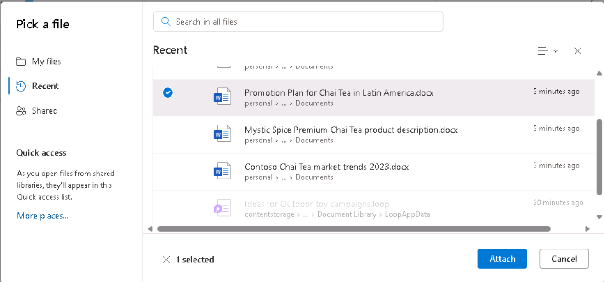

# Laboratorio 1C: Migliorare la produttività delle vendite e del marketing

## Obiettivo:

I professionisti del marketing e delle vendite possono utilizzare
Copilot per Microsoft 365 per generare contenuti per le loro campagne,
migliorare la produttività, ottenere approfondimenti sulle loro
campagne, collaborare in modo più efficace e automatizzare attività
ripetitive come la formattazione, l'aggiunta di grafici e tabelle e
persino la correzione di documenti.

In questo laboratorio si utilizzerà:

- Microsoft Copilot (modalità Bing/Web) per analizzare le tendenze del
  mercato, fornire previsioni di vendita e identificare nuove
  opportunità di vendita.

- Copilot in Word per combinare più rapporti di marketing.

- Copilot in Excel per analizzare le tendenze del mercato in un foglio
  di calcolo.

## Esercizio n. 1: condurre un'analisi di mercato con Microsoft Copilot

Microsoft Copilot (all'interno di Bing) è un servizio di AI generativa
basato su dati provenienti dal web pubblico, esclusivamente nell'indice
di ricerca di Microsoft Bing. Non ha accesso alle risorse organizzative
o ai contenuti del Microsoft Graph.

In qualità di direttore delle ricerche di mercato di Tailspin Toys,
desiderate condurre un'analisi di mercato del settore dei giocattoli da
fornire al Senior Leadership Team (SLT) dell'azienda. Il suo obiettivo è
identificare le ultime tendenze, le preferenze dei consumatori e i
giocattoli più popolari sul mercato.

In questo esercizio si utilizzerà la funzionalità di chat di Microsoft
Copilot in Bing. Quando si utilizza Microsoft Copilot, è importante
fornire il contesto e le risorse quando si creano le richieste. La
qualità della risposta è funzione del modo in cui si realizza la
richiesta, seguendo i suggerimenti e scegliendo il giusto stile di
conversazione (più creativo, più equilibrato o più preciso).

1.  In **Microsoft Edge**, aprire una nuova scheda e inserire il
    seguente URL: **+++https://bing.com+++**

2.  In **Microsoft Bing**, nell'elenco delle schede nella parte
    superiore della pagina, selezionare **Copilot**. In questo modo si
    apre Microsoft Copilot.

>  style="width:4.24478in;height:3.02287in" />
>
> **Nota:** se non si vede l'elenco delle schede nella parte superiore
> della pagina, seguire i passaggi seguenti per visualizzarlo.

- Assicurarsi di aver effettuato l'accesso utilizzando le **credenziali
  di Microsoft 365** (disponibili nella scheda **Resources**).

>  style="width:5.14864in;height:1.57919in" />

- Abilitare l'opzione **Show menu bar** (evidenziata in rosso)

>  style="width:2.18413in;height:2.61283in" />

3.  Selezionare ora **Copilot**. In questo modo si apre Microsoft
    Copilot.

>  alt="A screenshot of a computer Description automatically generated" />

4.  Nella pagina di **Copilot**, si noti l'interruttore a levetta in
    alto che consente di selezionare **Work** o **Web**. Sebbene la
    richiesta sia legata al lavoro, è necessario che Copilot acceda al
    Web per condurre l'analisi di mercato dell'industria dei giocattoli.
    Se necessario, selezionare l'interruttore **Web**.

>  style="width:4.04086in;height:2.44768in" />
>
>  style="width:3.38548in;height:2.86143in" />
>
> Nota: il selettore del tono di conversazione **Più creativo - Più
> equilibrato - Più preciso** presente nella precedente versione di
> Copilot è stato eliminato nell'ultima versione.

5.  Nel campo di prompt, inserire la seguente richiesta e selezionare
    l'icona **Submit:**

> **I'm the Director for Market Research for Tailspin Toys, a U.S. based
> toy manufacturer. Conduct a market analysis of the toy industry to
> identify sales figures, the latest trends, consumer preferences, and
> the most popular toys in the market**.
>
>  style="width:5.33427in;height:2.19325in" />

6.  Esaminare l'analisi di mercato generata da Copilot. Vi rendete conto
    che una richiesta generale come quella che avete presentato fornisce
    informazioni di base come le tendenze del mercato, le preferenze dei
    consumatori e le tendenze dei giocattoli. Tuttavia, siete anche
    interessati a raccogliere dati sul settore dei giocattoli, comprese
    le quote di mercato e il feedback dei consumatori. Vi siete resi
    conto di essere stati un po' troppo vaghi nella vostra richiesta
    precedente, poiché non avete richiesto queste informazioni
    specifiche. Ricordate i suggerimenti sulle migliori pratiche della
    formazione precedente: siate gentili e iterate, iterate, iterate.
    Inserite il seguente prompt per modificare l'analisi di mercato:

> **That analysis was great. However, I'm also interested in including
> data on the toy industry, including market share and consumer
> feedback. Please amend your prior analysis to include this
> information. Thanks**!
>
>  style="width:5.10146in;height:2.63366in" />
>
> 
>
>  style="width:4.72414in;height:2.4304in" />

7.  Vi rendete conto che vi state avvicinando al vostro obiettivo, ma vi
    mancano ancora alcune informazioni chiave. Dopo aver rivisto le
    richieste precedenti, vi siete resi conto di aver fornito a Copilot
    il vostro obiettivo generale, la portata dell'analisi e i dati di
    cui avevate bisogno. Tuttavia, non avete chiesto a Copilot di
    analizzare tutte queste informazioni in modo da poter prendere
    decisioni informate sul piano aziendale di Tailspin Toys per l'anno
    successivo. Per correggere questa lacuna, inserite il seguente
    prompt:

> **I think all the data is complete. With all the information that you
> captured, please analyze the data and identify patterns, trends, and
> insights that can help me determine what Tailspin Toy's business plan
> should be for the upcoming year**.
>
>  style="width:5.3955in;height:2.83168in" />
>
>  style="width:5.13826in;height:2.39906in" />

8.  Vi piacciono molto le informazioni fornite da Copilot. Tuttavia,
    poiché questo progetto è la vostra prima opportunità di fornire un
    rapporto di analisi di mercato all'SLT della vostra azienda, non
    siete sicuri di aver coperto tutto ciò che potrebbe essere di loro
    interesse. Decidete di chiedere a Copilot di aiutarvi a determinare
    se vi manca qualcosa. Inserite il seguente prompt:

> **Please analyze the data in this market analysis and business plan.
> Is there any other information that a toy company would typically
> request for market analysis and business plans that I failed to
> request? If so, can you please amend your responses to include this
> information. Thank you**!
>
>  style="width:4.94213in;height:2.23041in" />
>
>  style="width:4.89333in;height:2.5297in" />

9.  Sulla base delle informazioni fornite da Copilot, ci si rende conto
    che è possibile massimizzare l'efficacia dei rapporti facendo
    includere a Copilot un'analisi di queste aree. Per dare il tocco
    finale ai vostri rapporti, inserite la seguente prompt:

> **Please amend the market analysis to include an analysis of each of
> these areas for the Toy industry. Also update the business plan that
> you created for Tailspin Toys based on these insights. Thanks**!
>
>  style="width:4.72996in;height:2.38168in" />
>
>  style="width:5.00562in;height:2.66729in" />

10. L'analisi di mercato e il business plan che Copilot ha generato per
    voi si basano su uno stile di conversazione predefinito. È ideale
    per gli utenti che desiderano un equilibrio tra precisione e
    creatività.

> Se siete curiosi di vedere come apparirebbero i rapporti utilizzando
> lo stile **Più creativo** (risposte più fantasiose e creative), potete
> regolare i vostri prompt per impostare manualmente il tono o
> l'attenzione, a seconda che desideriate risultati precisi, creativi o
> equilibrati:
>
> **Punti da notare**:

- **Per risposte precise**: Utilizzate richieste chiare, specifiche e
  orientate ai dettagli. Indicate che volete risposte concrete e
  concise, con particolare attenzione all'accuratezza.

- **Per risposte creative**: Usare spunti aperti, esplorativi o
  fantasiosi. Incoraggiate il brainstorming o suggerite soluzioni quando
  è necessaria l'originalità.

- **Per risposte equilibrate:** Utilizzate domande moderatamente aperte
  che richiedano un mix di dettagli fattuali e di creatività. Potete
  chiedere un contributo sia analitico che esplorativo.

Esportazione di una risposta Copilot

Quando si usa Microsoft Copilot in Bing per fare ricerche o rispondere a
domande diverse, si può decidere che una risposta è così buona che la si
vuole salvare per riferimenti futuri.

1.  Selezionare il pulsante **Copy** in fondo a una risposta richiesta
    per copiare la risposta e incollare la risposta copiata in un editor
    di testo.

>  style="width:5.24434in;height:2.71287in" />
>
> Se si desidera consolidare più risposte in un unico documento, è
> necessario copiare e incollare manualmente ogni risposta in un editor
> di testo e salvare il file.

Esercizio n. 2: consolidare più rapporti di marketing utilizzando
Copilot in Word

Copilot in Word, un assistente di scrittura AI-powered, può aiutarvi a
riscrivere i contenuti esistenti o persino a trasformare i contenuti
selezionati in tabelle.

In qualità di direttore marketing per l'America Latina (LATAM) di
Contoso Beverage, una divisione di Contoso, Ltd., il vostro product
manager vi ha fornito tre rapporti distinti riguardanti la bevanda
Mystic Spice Premium Chai Tea dell'azienda. Tuttavia, avete difficoltà
ad analizzare le informazioni, poiché saltate continuamente da un
documento all'altro.

Decidete di combinare i rapporti in un unico rapporto di analisi del
mercato LATAM per il tè Chai Premium di Mystic Spice. In questo
esercizio utilizzerete Copilot per creare il rapporto combinato,
rivederlo ed eventualmente aggiornarlo con altre informazioni che
Copilot può trovare sul mercato del tè Chai in America Latina.

1.  Se nel browser Microsoft Edge è aperta una scheda di **Microsoft
    365**, selezionatela subito; altrimenti, aprite una nuova scheda e
    inserite il seguente URL:
    [**<u>https://www.office.com</u>**](https://www.office.com/) per
    accedere alla home page di **Microsoft 365**.

**Nota**: è necessario effettuare l'accesso (se richiesto) utilizzando
le **credenziali Microsoft 365** fornite nella **scheda Resources**
sulla destra .

2.  Sfogliare la cartella **C:\LabFiles** per selezionare e caricare una
    copia dei seguenti documenti su **OneDrive**.

- **Descrizione del prodotto Mystic Spice Premium Chai Tea**

- **Tendenze del mercato del tè Chai Contoso 2023**

- **Piano di promozione del tè Chai in America Latina**

> **Nota**: potete saltare questo passaggio se avete già caricato una
> copia di tutti i documenti (che userete in questa sessione di
> laboratorio pratico da **C:\LabFiles** come indicato nel **Laboratorio
> 0**).

3.  In questo esercizio, si accede ai documenti dall'elenco dei file
    utilizzati più di recente. Per far apparire i file nell'elenco MRU,
    aprire ciascuno dei tre documenti e poi chiuderli.

>  alt="A screenshot of a computer Description automatically generated" />

4.  In **Microsoft 365**, aprire **Microsoft Word**, quindi aprire un
    nuovo documento vuoto.

5.  Nella finestra **Draft with Copilot** che appare nella parte
    superiore del documento vuoto, inserite la seguente richiesta, ma
    non selezionate il pulsante **Genera** se non dopo aver collegato i
    tre file alla prompt:

> **I'm the LATAM Marketing Director for Contoso Beverage. Please create
> a LATAM Market Analysis report for our Mystic Spice Premium Chai Tea
> beverage. Combine the three attached files to create a report that
> describes the product, analyzes the market trend for it, and includes
> a promotion plan for Latin America**.
>
>  alt="A screenshot of a computer Description automatically generated" />

6.  A questo punto è necessario allegare i tre documenti alla richiesta.
    Nella finestra **Draft with Copilot**, selezionare il pulsante
    **Reference your content**. Nel menu a discesa che appare, se il
    file **Mystic Spice Premium Chai Tea product description.docx**
    compare nell'elenco dei file, selezionarlo. Altrimenti, selezionare
    **Browse files from cloud**, selezionare il file dall'elenco dei
    file **Recent** e quindi selezionare il pulsante **Attach**. Notate
    come il file viene visualizzato nel prompt.

>  alt="A screenshot of a computer Description automatically generated" />

7.  Ripetete il passaggio precedente sia per il file **Contoso Chai Tea
    market trends 2023.docx** che per il file **Promotion Plan for Chai
    Tea in Latin America.docx**. A questo punto, nel prompt dovrebbero
    comparire i link a tutti e tre i file.

>  alt="A screenshot of a computer Description automatically generated" />

8.  Selezionare **Generate**. A questo punto, Copilot estrae le
    informazioni pertinenti dai tre file e redige un rapporto che li
    combina in un unico rapporto di analisi di mercato per Mystic Spice
    Premium Chai Tea.

>  alt="A screenshot of a computer Description automatically generated" />

9.  Dopo aver esaminato la prima bozza del rapporto sull'analisi di
    mercato, vi rendete conto che mancano alcune informazioni
    fondamentali. Vorreste che includesse una sezione intitolata
    **Competitive Analysis**. Si desidera che Copilot analizzi la
    concorrenza. Per farlo, inserite la seguente prompt nella finestra
    di Copilot in fondo al rapporto e poi selezionate la freccia
    **Generate**:

>  alt="A screenshot of a computer Description automatically generated" />
>
> **This report looks good. However, please add a section titled
> Competitive Analysis. Review the beverage companies in Latin America
> that sell Chai Tea and then provide information in this section on the
> strengths and weaknesses of these competitors, their market share, and
> their pricing strategies**.
>
>  alt="A screenshot of a computer Description automatically generated" />

10. Dopo aver esaminato questa seconda bozza del rapporto che contiene
    la nuova sezione Analisi della concorrenza, vi rendete conto che
    manca un'ultima cosa. Volete che Copilot aggiunga una sezione sui
    **Distribution Channels**. Questa sezione dovrebbe analizzare i
    canali di distribuzione utilizzati per vendere il tè Chai in America
    Latina. Per farlo, inserite la seguente prompt nella finestra di
    Copilot in fondo al rapporto e poi selezionate la freccia
    **Generate**:

>  alt="A screenshot of a computer Description automatically generated" />
>
> **Nice job! One last thing. Please add a section titled Distribution
> Channels. Review the distribution channels used to sell Chai Tea in
> Latin America and then provide information in this section on the
> types of retailers, wholesalers, and distributors used**.

11. Dopo aver esaminato quest'ultima bozza contenente la nuova sezione
    Canali di distribuzione, si è soddisfatti del rapporto e si è pronti
    a salvarlo. Nella finestra Copilot in fondo al documento,
    selezionare il pulsante **Keep it** per convertirlo da bozza Copilot
    a documento Word.

>  alt="A screenshot of a computer Description automatically generated" />

12. Rivedere il documento. Se si desidera apportare modifiche manuali, è
    possibile farlo ora. Una volta soddisfatti, potete salvare il
    documento in OneDrive se desiderate conservarlo per riferimenti
    futuri, oppure eliminarlo.

13. Chiudere questa scheda nel browser Microsoft Edge.

## Esercizio n. 3: Analizzare un foglio di calcolo sull'andamento del
mercato utilizzando Copilot in Excel.

Copilot in Excel è un potente strumento che può aiutare i professionisti
del marketing a creare, modificare, comprendere e visualizzare i dati
con facilità e a ottenere informazioni sulla propria attività.

Le funzionalità AI-powered di Copilot possono aiutare i professionisti
del marketing a risparmiare tempo e fatica automatizzando le attività
ripetitive (analisi dei risultati aziendali trimestrali, riepilogo delle
tendenze chiave, applicazione di codici colore alle tabelle, creazione
di modelli, scenari, filtri e ordinamenti e aggiunta di grafici con un
semplice clic del mouse) e fornendo preziosi approfondimenti che possono
aiutare a prendere decisioni informate.

In qualità di direttore marketing di Contoso Beverage, una divisione di
Contoso, Ltd., avete ricevuto un foglio di calcolo sulle tendenze di
mercato che mostra l'attività mensile per il prodotto Chai Tea di
Contoso. Si desidera utilizzare le funzioni di Copilot in Excel per
analizzare il rapporto e fornire un'analisi dettagliata delle tendenze
di marketing mensili.

In questo esercizio si utilizzerà Copilot in Excel per analizzare un
foglio di calcolo sull'andamento del mercato che ha già una tabella
Excel definita.

> **Nota**: quando si utilizza Copilot in Excel, è
> necessario disporre di una tabella Excel che includa i dati in un
> foglio di lavoro. È possibile trasformare rapidamente un intervallo di
> celle in una tabella di Excel seguendo i seguenti passaggi:

- Selezionare la cella o l'intervallo nei
  dati.

- Selezionare **Home** \> **Format as Table**.

- Nella finestra di dialogo **Format as Table**,
  selezionare la casella di controllo accanto a **My table has headers**
  se si desidera che la prima riga dell'intervallo sia la riga di
  intestazione.

- Selezionare **OK**.

1.  Se nel browser Microsoft Edge è aperta una scheda di **Microsoft
    365**, selezionatela ora; altrimenti, aprite una nuova scheda e
    inserite il seguente URL:
    [**<u>https://www.office.com</u>**](https://www.office.com/) per
    accedere alla home page di **Microsoft 365**.

> **Nota**: è necessario effettuare l'accesso (se richiesto) utilizzando
> le **credenziali Microsoft 365** fornite nella **scheda Resources**
> sulla destra.

2.  Sfogliare la cartella **C:\LabFiles** per selezionare e caricare una
    copia di **Contoso Chai Tea market trends 2023.xlsx** su
    **OneDrive.**

> **Nota**: potete saltare questo passaggio se avete già caricato una
> copia di tutti i documenti (che userete in questa sessione di
> laboratorio pratico da **C:\LabFiles** come indicato nel **Laboratorio
> 0**)**.**

3.  Aprire e chiudere il file **Contoso Chai Tea market trends
    2023.xlsx** (caricato su **OneDrive**) per inserirlo nell'elenco dei
    file utilizzati più di recente (MRU).

>  alt="A screenshot of a computer Description automatically generated" />

4.  Nella pagina iniziale di **Microsoft 365**, selezionate l'icona
    **Excel** nel pannello di navigazione a sinistra.

5.  In **Excel**, nella pagina **File**, selezionare **Contoso Chai Tea
    market trends 2023.xlsx** dall'elenco dei file.

6.  Selezionare l'opzione **Copilot** sul lato destro della barra
    multifunzione.

7.  Nel riquadro **Copilot** che appare, sono disponibili diversi prompt
    predefiniti tra cui scegliere. Selezionare il pulsante **Show data
    insights**.

>  alt="A screenshot of a computer Description automatically generated" />
>
>  style="width:2.99219in;height:2.96791in" />

8.  Si noti il grafico pivot generato. Quando abbiamo testato questo
    esercizio, Copilot ha sempre creato un grafico a linee del **Social
    Media Engagement (views) by Date**. Che tipo di grafico ha creato
    Copilot per voi? Sotto il grafico creato da Copilot, selezionare il
    pulsante **+Add to a new sheet**.

>  alt="A screenshot of a computer Description automatically generated" />

9.  Anche se Copilot dice di aver aggiunto il grafico al foglio 2, il
    foglio 2 non è visibile nel foglio di calcolo.

>  alt="A screenshot of a computer Description automatically generated" />

10. Provare con il foglio excel massimizzato e ripetere il passaggio 11.
    La **Add to sheet function** (**funzione Aggiungi al foglio)** ora
    funziona bene.

>  alt="A screenshot of a computer Description automatically generated" />

11. Selezionare **Sheet 2**. Esaminare il nuovo foglio dati creato da
    Copilot. Copilot ha incluso sia il grafico sia la colonna di dati
    del foglio elettronico che è alla base del grafico. Tenere il
    cursore sul grafico e notare la finestra visualizzata che indica il
    tipo di grafico generato da Copilot.

>  alt="A graph with a line Description automatically generated" />

14. Si noti che nel riquadro Copilot non appare più l'elenco dei prompt
    predefiniti. Questa situazione si verifica perché Copilot non
    funziona ancora sulle tabelle pivot (notare il messaggio che indica
    questo problema). Selezionate il **Sheet 1** per tornare alla
    tabella di Excel. Notate come appaiono i prompt predefiniti.

>  alt="A screenshot of a chat Description automatically generated" />

15. Nelle richieste predefinite che appaiono sopra il campo di
    richiesta, selezionare il pulsante **Show suggestions for formula
    columns**.

16. Si noti il suggerimento fornito da Copilot. L'immagine seguente
    mostra il suggerimento fornito da Copilot durante i nostri test.

>  style="width:3.02624in;height:2.91475in" />

17. Nel suggerimento ricevuto, selezionare la freccia a discesa
    **Explain formula**. Leggere la spiegazione di Copilot che descrive
    il calcolo. Selezionare il pulsante **+Insert Column** per inserire
    la colonna nella tabella di Excel.

>  style="width:4.6763in;height:2.13905in" />

18. Notate come Copilot ha aggiunto questa colonna di dati alla fine
    della vostra tabella Excel nel **Sheet 1**. Questa funzione vi
    incuriosisce? Potreste voler vedere quali altri suggerimenti di
    formula fornisce. Selezionate nuovamente il pulsante **Show
    suggestions for formula columns**. Notate il suggerimento.
    Selezionate il pulsante **+Insert Column** per inserire la colonna
    suggerita nella tabella di Excel.

19. Nelle richieste predefinite che appaiono sopra il campo di
    richiesta, selezionare il pulsante **How can I highlight, filter,
    and sort data**?

>  style="width:2.81961in;height:2.40686in" />

20. Si noti l'elenco delle azioni che si possono intraprendere.

>  alt="A screenshot of a chat Description automatically generated" />

21. A questo punto, i messaggi predefiniti visualizzati da Copilot non
    interessano più. Si desidera quindi visualizzare una nuova serie di
    messaggi. Selezionare il pulsante **Refresh** che appare sopra il
    campo dei prompt.

>  alt="Screenshot showing the Refresh prompt button." />

22. Esaminare l'elenco rivisto dei prompt predefiniti che ora vengono
    visualizzati. L'immagine seguente mostra alcuni esempi di prompt
    visualizzati.

>  alt="A screenshot of a chat Description automatically generated" />

23. L'obiettivo di questo esercizio è quello di conoscere i vari tipi di
    azioni predefinite che Copilot può eseguire. Pertanto, selezionare
    diversi prompt per vedere cosa succede. Ad esempio:

    - Se appare una prompt di **Sort**, selezionarla subito. Si noti
      come Copilot ha ordinato i dati per voi.

    - Se appare una prompt di **Bold**, selezionarla subito. Si noti che
      Copilot ha messo in grassetto le voci della colonna citata e ha
      lasciato le altre senza grassetto.

24. Selezionate nuovamente il pulsante **Refresh** che appare sopra il
    campo di richiesta.

>  alt="Screenshot showing the Refresh prompt button." />

25. Esaminare la nuova serie di messaggi visualizzati. Selezionare più
    volte il pulsante **Refresh** per vedere i diversi tipi di messaggi
    che Copilot fornisce.

26. Selezionate pure qualsiasi altra richiesta per vedere cosa fa
    Copilot. Al termine, chiudere la scheda del browser Microsoft Edge.

## Sintesi:

In questo laboratorio sono stati utilizzati

- Microsoft Copilot (modalità Bing/Web) per analizzare le tendenze del
  mercato

- Copilot in Word per combinare più rapporti di marketing in un
  documento coeso.

- Copilot in Excel per analizzare le tendenze del mercato all'interno di
  un foglio di calcolo.

Grazie a queste attività, è possibile snellire i processi e migliorare
l'efficacia complessiva delle campagne di marketing.
