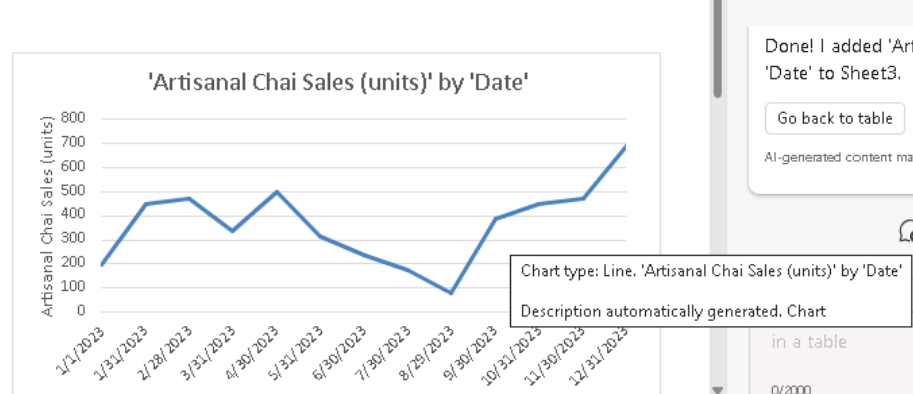
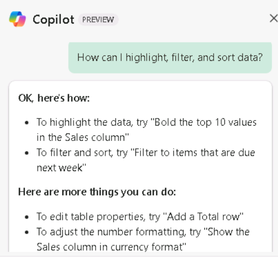

# Lab 1C: Improving Sales and Marketing productivity

Objective:

Marketing and Sales professionals can utilize Copilot for Microsoft 365
to generate content for their campaigns, improve productivity, get
insights into their campaigns, collaborate more effectively and
automating repetitive tasks such as formatting, adding charts and
graphs, and even proofreading documents.

In this lab you will use:

- Microsoft Copilot (Bing/Web mode) to analyze market trends, provide
  sales forecasts, and identify new sales opportunities.

- Copilot in Word to combine multiple marketing reports.

- Copilot in Excel to analyze market trends in a spreadsheet.

## Exercise \#1: Conduct market analysis using Microsoft Copilot

Microsoft Copilot (within Bing) is a generative AI service grounded in
data from the public web in the Microsoft Bing search index only. It
doesn't have access to organizational resources or content within the
Microsoft 365 Graph.

As the Director for Market Research at Tailspin Toys, you want to
conduct a market analysis of the toy industry to provide to the
company's Senior Leadership Team (SLT). Your goal is to identify the
latest trends, consumer preferences, and the most popular toys in the
market.

In this exercise you will utilize the Microsoft Copilot chat
functionality in Bing. When you use Microsoft Copilot, it's important to
provide context and resources when you craft your prompts. The quality
of the response is a function of how you craft the request by following
the tips and choosing the right conversation style (either More
Creative, More Balanced, or More Precise).

1.  In **Microsoft Edge**, open a new tab and enter the following
    URL: **[https://bing.com](https://bing.com/).**

2.  In **Microsoft Bing**, in the list of tabs across the top of the
    page, select **Copilot**. Doing so opens Microsoft Copilot.

3.  On the **Copilot** page, note the toggle switch at the top of the
    page that allows you to select either **Work** or **Web**. While
    your request is a work-related task, you need Copilot to access the
    Web to conduct its market analysis of the Toy industry. If
    necessary, select the **Web** toggle switch.

4.  Below the list of predefined prompt examples, you can choose a
    conversation style. Select the **More Balanced** option if it isn't
    already selected by default.

5.  In the prompt field, enter the following prompt and then select
    the **Submit** icon:

> **I'm the Director for Market Research for Tailspin Toys, a U.S. based
> toy manufacturer. Conduct a market analysis of the toy industry to
> identify sales figures, the latest trends, consumer preferences, and
> the most popular toys in the market**.
>

6.  Accept the **Terms of use and policy** to proceed further.

7.  Review the market analysis that Copilot generated. You realize that
    a general request such as the one you submitted provides basic
    information such as market trends, consumer preferences, and toy
    trends. However, you're also interested in gathering data on the toy
    industry, including market share and consumer feedback. You realized
    that you were a little too vague in your prior prompt since you
    failed to request this specific information. You remember the best
    practice suggestions from your earlier training - Be polite and
    iterate, iterate, iterate. Enter the following prompt to amend the
    market analysis:

> **That analysis was great. However, I'm also interested in including
> data on the toy industry, including market share and consumer
> feedback. Please amend your prior analysis to include this
> information. Thanks**!

8.  You realize that you're getting closer to your goal, but you're
    still missing some key information. After reviewing your prior
    prompts, you realized that you provided Copilot with your overall
    objective, the scope of the analysis, and the data that you needed.
    However, you failed to ask Copilot to analyze all this information
    so that you can make informed decisions on Tailspin Toys’ business
    plan for the upcoming year. To correct this shortcoming, enter the
    following prompt:

> **I think all the data is complete. With all the information that you
> captured, please analyze the data and identify patterns, trends, and
> insights that can help me determine what Tailspin Toy's business plan
> should be for the upcoming year**.
>

9.  You really like the information that Copilot provided. However,
    since this project is your first opportunity to provide a market
    analysis report to your company's SLT, you're not sure if you're
    covering everything that might be of interest to them. You decide to
    have Copilot help you determine if you're missing anything. Enter
    the following prompt:

> **Please analyze the data in this market analysis and business plan.
> Is there any other information that a toy company would typically
> request for market analysis and business plans that I failed to
> request? If so, can you please amend your responses to include this
> information. Thank you**!

10. Based on the information that Copilot provides, you realize that you
    can really maximize the effectiveness of your reports by having
    Copilot include an analysis of these areas. To put the finishing
    touch on your reports, enter the following prompt:

> **Please amend the market analysis to include an analysis of each of
> these areas for the Toy industry. Also update the business plan that
> you created for Tailspin Toys based on these insights. Thanks**!

11. The market analysis and business plan that Copilot generated for you
    was based on a **More Balanced** conversation style. It's ideal for
    users who want a balance between precision and creativity. This
    style provides responses that are longer and more descriptive than
    the **More Precise** style. As for your reports, you wanted longer
    and more descriptive responses, since you felt that your SLT expects
    that level of detail. However, you're curious as to how the reports
    would look using the **More Creative** style. This style provides
    responses that are more imaginative and creative.

12. Let's explore how Copilot's responses would be different using
    the **More Creative** style. Open a new tab in your **Microsoft
    Edge** browser and enter the following
    URL: [**https://bing.com**](https://bing.com/)

13. In **Microsoft Bing**, select **Copilot** to open Microsoft Copilot.

14. On the **Copilot** page, you still want to be in **Web** mode, but
    this time you decide to try the **More Creative** conversation
    style. Repeat steps 4-10. Copy and paste in each prompt. Pay
    particular attention to the tone that Copilot uses when responding
    to each prompt. Also note how each response is different from its
    corresponding response that was based on the **More
    Balanced** conversation style.

Export a Copilot response

When you use Microsoft Copilot in Bing to research different things or
answer different questions, you may decide that a response is so good
that you want to save it for future reference. 

1.  Select **Copy** button at the bottom of a prompt response to copy
    the response and paste the copied response in a text editor.

> If you want to consolidate multiple responses into a single document,
> you need to manually copy and paste each response in a text editor and
> save the file.

Exercise \#2: Consolidate multiple marketing reports using Copilot in
Word

Copilot in Word, an AI-powered writing assistant, can help you rewrite
existing content, or even transform selected content into a table.

As the Latin America (LATAM) Marketing Director for Contoso Beverage, a
division of Contoso, Ltd., your product manager provided you with three
separate reports involving the company's Mystic Spice Premium Chai Tea
beverage. However, you’re finding it difficult to analyze the
information, since you’re constantly jumping back and forth between
documents.

You decide to combine the reports into a single LATAM Market Analysis
report for Mystic Spice Premium Chai Tea. In this exercise you will use
Copilot to creates the combined report, review it and possibly update it
with other information that Copilot can find on the Chai Tea market in
Latin America.

1.  If you have a **Microsoft 365** tab open in your Microsoft Edge
    browser, then select it now; otherwise, open a new tab and enter the
    following
    URL: [***https://www.office.com***](https://www.office.com/) to go
    to the **Microsoft 365** home page.

**Note**: You need to sign-in (if prompted) using the **Microsoft 365
Credentials** provided under the **Resources tab** on the right.

2.  Browse to the **C:\LabFiles** folder to select and upload a copy of
    the following documents to **OneDrive**.

- **Mystic Spice Premium Chai Tea product description**

- **Contoso Chai Tea market trends 2023**

- **Promotion Plan for Chai Tea in Latin America**

> **Note**: You can skip this step, if you have already uploaded a copy
> of all the documents (that you will be using in this hands-on lab
> session from **C:\LabFiles** as instructed in **Lab 0**).

3.  In this exercise, you access the documents from the Most Recently
    Used file list. To get the files to appear in the MRU list, open
    each of the three document and then close them.

4.  In **Microsoft 365**, open **Microsoft Word**, and then open a new
    blank document.

5.  In the **Draft with Copilot** window that appears at the top of the
    blank document, enter the following prompt, but don't select
    the **Generate** button until after you link the three files to the
    prompt:

> **I'm the LATAM Marketing Director for Contoso Beverage. Please create
> a LATAM Market Analysis report for our Mystic Spice Premium Chai Tea
> beverage. Combine the three attached files to create a report that
> describes the product, analyzes the market trend for it, and includes
> a promotion plan for Latin America**.

6.  You now must attach the three documents to the prompt. In
    the **Draft with Copilot** window, select the **Reference your
    content** button. In the drop-down menu that appears, if
    the **Mystic Spice Premium Chai Tea product description.docx** file
    appears in the list of files, select it. Otherwise, select **Browse
    files from cloud**, select the file from the **Recent** file list,
    and then select the **Attach** button. Note how the file is
    displayed in the prompt.

7.  Repeat the prior step for both the **Contoso Chai Tea market trends
    2023.docx** file and the **Promotion Plan for Chai Tea in Latin
    America.docx** file. At this point, links to all three files should
    appear in the prompt.

8.  Select **Generate**. Upon doing so, Copilot extracts the pertinent
    information from the three files and drafts a report that combines
    them into a single Market Analysis report for Mystic Spice Premium
    Chai Tea.

9.  After reviewing this first draft of the Market Analysis report, you
    recognize that it's missing some critical information. You would
    like to see it include a section titled **Competitive Analysis**.
    You want Copilot to analyze the competition. To do so, enter the
    following prompt in the Copilot window at the bottom of the report
    and then select the **Generate** arrow:

> **This report looks good. However, please add a section titled
> Competitive Analysis. Review the beverage companies in Latin America
> that sell Chai Tea and then provide information in this section on the
> strengths and weaknesses of these competitors, their market share, and
> their pricing strategies**.
>

10. After reviewing this second draft of the report that contains the
    new Competitive Analysis section, you realize that one last thing is
    missing. You want Copilot to add a section on **Distribution
    Channels**. This section should analyze the distribution channels
    used to sell Chai Tea in Latin America. To do so, enter the
    following prompt in the Copilot window at the bottom of the report
    and then select the **Generate** arrow:

> **Nice job! One last thing. Please add a section titled Distribution
> Channels. Review the distribution channels used to sell Chai Tea in
> Latin America and then provide information in this section on the
> types of retailers, wholesalers, and distributors used**.

11. After reviewing this latest draft that contains the new Distribution
    Channels section, you're satisfied with the report and you're ready
    to save it. In the Copilot window at the bottom of the document,
    select the **Keep it** button to convert it from a Copilot draft to
    a Word document.

12. Review the document. If you want to make any manual changes, you can
    do so now. Once you're satisfied with it, feel free to save the
    document to your OneDrive if you wish to keep it for future
    reference, or just discard it.

13. Close this tab in your Microsoft Edge browser.

Exercise \#3: Analyze a market trend spreadsheet using Copilot in Excel

Copilot in Excel is a powerful tool that can help Marketing
professionals create, edit, understand, and visualize their data with
ease and gain insights into their business.

Copilot’s AI-powered capabilities can help Marketing professionals save
time and effort by automating repetitive tasks (analyze quarterly
business results, summarize key trends, apply color coding to tables,
create models, scenarios, filter and sort, and add charts at the click
of a mouse) and providing valuable insights that can help them make
informed decisions.

As the Director of Marketing for Contoso Beverage, a division of
Contoso, Ltd., you received a market trend spreadsheet showing monthly
activity for Contoso's Chai Tea product. You want to use the features of
Copilot in Excel to analyze the report and provide detailed analysis of
the monthly marketing trends.

In this exercise, you will use Copilot in Excel to analyze a market
trend spreadsheet that already has an Excel table defined.

> **Note**: When you use Copilot in Excel, you must have an Excel table
> that includes data in a worksheet. You can quickly turn a range of
> cells into an Excel table by following these steps:

- Select the cell or the range in the data.

- Select **Home** \> **Format as Table**.

- In the **Format as Table** dialog box, select the checkbox next
  to **My table has headers** if you want the first row of the range to
  be the header row.

- Select **OK**.

1.  If you have a **Microsoft 365** tab open in your Microsoft Edge
    browser, then select it now; otherwise, open a new tab and enter the
    following
    URL: [***https://www.office.com***](https://www.office.com/) to go
    to the **Microsoft 365** home page.

> **Note**: You need to sign-in (if prompted) using the **Microsoft 365
> Credentials** provided under the **Resources tab** on the right.

2.  Browse to the **C:\LabFiles** folder to select and upload a copy of
    **Contoso Chai Tea market trends 2023.xlsx** to **OneDrive.**

> **Note**: You can skip this step, if you have already uploaded a copy
> of all the documents (that you will be using in this hands-on lab
> session from **C:\LabFiles** as instructed in **Lab 0**)**.**

3.  Open and close the file **Contoso Chai Tea market trends 2023.xlsx**
    (which you uploaded to **OneDrive**) to get it in your Most Recently
    Used (MRU) file list.

4.  On the **Microsoft 365** home page, select the **Excel** icon in the
    navigation pane on the left.

5.  In **Excel**, on the **File** page, select **Contoso Chai Tea market
    trends 2023.xlsx** from the file list.

6.  Select the **Copilot** option on the right side of the ribbon.

7.  In the **Copilot** pane that appears, several predefined prompts are
    available for you to choose from. Select the **Show data
    insights** button.

8.  Note the pivot chart that it generated. When we tested this
    exercise, Copilot always created a line graph of the **Social Media
    Engagement (views) by Date**. What type of chart did Copilot create
    for you? Below the chart that Copilot created for you, select
    the **+Add to a new sheet** button.

9.  Though Copilot says it added the chart to Sheet 2, Sheet 2 is not
    visible in the spreadsheet.

10. Try with maximized excel sheet and repeat step 11. The **Add to
    sheet function** worked fine now.

11. Select **Sheet 2**. Review the new data sheet that Copilot created.
    Copilot included both the graph and the column of data from the
    spreadsheet that was the basis of this graph. Hold your cursor over
    the chart and note the window that appears which indicates the type
    of chart that Copilot generated.

14. Note how in the Copilot pane, the list of predefined prompts no
    longer appears. This situation occurs because Copilot doesn't work
    on PivotTables yet (note the message indicating this issue).
    Select **Sheet 1**, which returns you back to the Excel table. Note
    how the predefined prompts appear.

15. In the predefined prompts that appear above the prompt field, select
    the **Show suggestions for formula columns** button.

16. Note the suggestion that Copilot provides. The following image shows
    the suggestion that Copilot provided during our testing.

17. In the suggestion that you received, select the **Explain
    formula** drop-down arrow. Review Copilot's explanation that
    describes the calculation. Select the **+Insert Column** button to
    insert this column into your Excel table.

18. Note how Copilot added this column of data to the end of your Excel
    table in **Sheet 1**. Is this feature intriguing you? You may want
    to see what other formula suggestions it provides. Select the **Show
    suggestions for formula columns** button again. Note the suggestion.
    Select the **+Insert Column** button to insert this suggested column
    into your Excel table.

19. In the predefined prompts that appear above the prompt field, select
    the **How can I highlight, filter, and sort data**? button.

20. Note the list of actions that you can take.

21. At this point, the predefined prompts that Copilot displays no
    longer interest you. As such, you want to see a new set of prompts.
    Select the **Refresh** button that appears above the prompt field.

22. Review the revised list of predefined prompts that now appear. The
    following image shows examples of prompts that was displayed.

23. The purpose of this exercise is to get a feel for the various types
    of predefined actions that Copilot can perform. Therefore, select
    different prompts to see what happens. For example:

    - If a **Sort** prompt appears, select it now. Note how Copilot
      sorted the data for you.

    - If a **Bold** prompt appears, select it now. Note how Copilot
      bolded the items in the column it mentioned and left any others
      nonbolded.

24. Again select the **Refresh** button that appears above the prompt
    field.

25. Review the new set of prompts that it displays. Select
    the **Refresh** button several times to see the different types
    prompts that Copilot provides.

26. Feel free to select any other prompts to see what Copilot does. When
    you're done, close your Microsoft Edge browser tab.

Summary:

In this lab you used

- Microsoft Copilot (Bing/Web mode) to analyze market trends

- Copilot in Word to combine multiple marketing reports into a cohesive
  document.

- Copilot in Excel to analyze market trends within a spreadsheet.

Through these activities, you can streamline the processes and improve
the overall effectiveness of your marketing campaigns.
