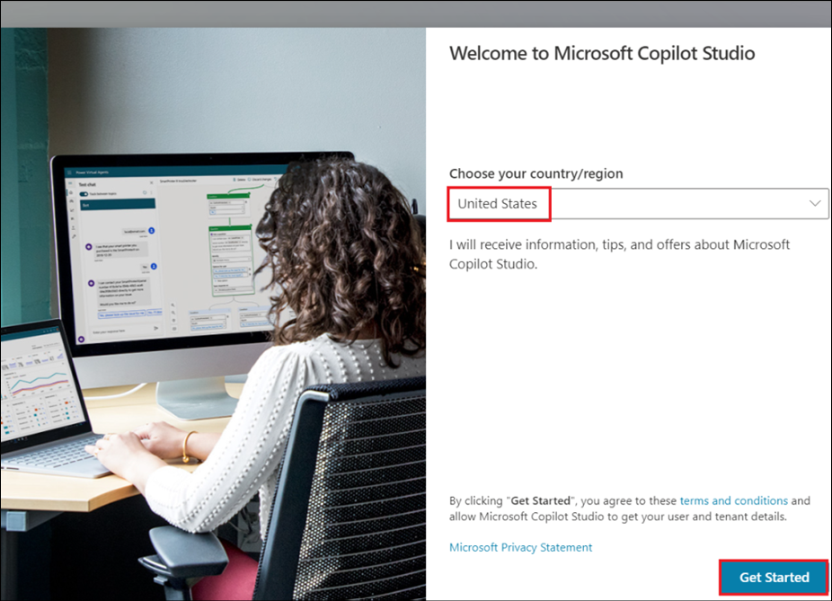

# Laboratorio 2A: Adición de una acción conversacional para Copilot para Microsoft 365

**Objetivo**

Microsoft Copilot ofrece experiencias innovadoras para interactuar con
contenidos y recursos de toda la organización. En algunas situaciones,
se requieren respuestas e interacción con sistemas externos. Con
Microsoft Copilot Studio, puede crear un tema de conversación que puede
publicarse como un plugin de Copilot. Una vez que el administrador del
inquilino apruebe el plugin, podrá añadirlo a las experiencias de chat
M365 de su organización.

Los Plugins estarán disponibles en Microsoft Copilot en producción, si
la organización tiene licencia válida para los mismos.

En este laboratorio aprenderemos a crear una acción conversacional.

Duración del laboratorio - 15 minutos

## Ejercicio 1: Configuración del entorno

1.  Desde la VM, haz clic con el botón derecho del ratón en el reloj
    situado en la esquina inferior derecha de la pantalla.

2.  Seleccione **Adjust date and time**.

    

3.  En la pantalla de Configuración que se abre, haz clic en **Sync
    now** en Additional settings.

    

4.  Esto se encarga de sincronizar la hora en caso de que la
    sincronización automática no funcione.

    

## Ejercicio 2: Crear un plugin conversacional

1.  Abra un navegador y escriba +++https://copilotstudio.microsoft.com/+++ en la barra de direcciones.

2.  Inicie sesión con las **credenciales** proporcionadas en la pestaña
    **Resources** de su VM Lab.

    

3.  Una vez iniciada la sesión, en la página Bienvenido a Microsoft
    Copilot Studio, deje el país como **United States** y haga clic en
    **Get Started**.

    

4.  Seleccione **Skip** en la pantalla de **bienvenida**.

    

5.  En la página de creación de Copilot que se abre, haga clic en los 3
    puntos junto a **Create** en la parte superior derecha y haga clic
    en **Cancel copilot creation** y haga clic en **Leave** en el cuadro
    de diálogo de confirmación.

    

    

6.  Se abre la página **de inicio de** Copilot Studio.

    

7.  En el panel izquierdo de la pantalla de inicio, seleccione
    **Copilots**.

    

8.  Seleccione **Copilot for Microsoft 365**.

    

9.  Seleccione **Extensions** o **Actions**, cualquiera de las cuales
    aparece en la interfaz de usuario.

    

10. Seleccione **+ Add extension** o **+ Add action**.

    

11. Seleccione **New Action**.

    

12. Seleccione **Conversational** en el panel **New Action**.

    

13. Escriba el nombre de la acción como **+++Conversational action+++**. Seleccione **Create**.

    

14. Una vez lista, la acción creada se abre en el lienzo de Autor.
    Seleccione **Topics**.

    

15. Seleccione **Allow** si aparece una ventana emergente para permitir
    la copia.

16. Nombra el tema como +++Holiday list+++

    

17. En la descripción del nodo Trigger, proporcione una descripción
    clara de cómo el plugin conversacional puede ayudar al usuario y qué
    puede hacer. Que este tema ayude al usuario a encontrar la lista de
    días festivos del año 2024.

    Escriba +++**This plugin helps to retrieve the list of holidays for the year 2024**.+++ en la descripción del nodo Trigger.

    

    Esta descripción tiene un propósito funcional y es utilizada por el
Microsoft Copilot para determinar si invocar su plugin o no.

18. Añada un **mensaje de nodo** con una lista de vacaciones/ días festivos.

    ```
    
    - New Year's Day - January 1
    
    - Martin Luther King, Jr.'s Birthday (Third Monday of January) - January
      15, 2024
    
    - Washington's Birthday or Presidents' Day (third Monday of February) -
      February 19
    
    - Memorial Day (last Monday of May) - May 27
    
    - Juneteenth Day - June 19
    
    - Independence Day - July 4
    
    - Labor Day (first Monday of September) - September 2
    
    - Columbus Day (Second Monday of October) - October 14
    
    - Veterans Day or Veterans Day - November 11
    
    - Thanksgiving Day (fourth Thursday of November): November 28
    
    - Christmas Day - December 25
    
    ```

    

19. Haga clic en **Save** para guardar la acción.

    

    

## Ejercicio 3: Publicación de la acción conversacional en Microsoft Copilot

1.  La publicación de su plugin conversacional crea un nuevo plugin en
    el registro Dataverse para su Tenant. Una vez que esté disponible,
    el administrador del Tenant deberá aprobarlo para que esté
    disponible para los usuarios en el catálogo de plugins de Microsoft
    Copilot.

2.  Haga clic en **Publish**.

    

3.  Seleccione **Publish**.

    

4.  Seleccione **Publish** en el cuadro de diálogo **Publish latest
    content**.

    

5.  El estado de publicación se muestra en la pantalla.

    

    >[!note] **Nota:** La publicación debe realizarse rápidamente. La
disponibilidad real en el Centro de administración de Microsoft puede
tardar hasta 4 horas.

6.  Su administrador puede encontrar la aplicación integrada **Dataverse
    and Microsoft Copilot** Studio en el Centro de administración de
    Microsoft, en **Configuración** y, a continuación, en **Integrations
    to be reviewed and approved**.

    >[!Alert] **Importante:** Para que el administrador lo incluya en el centro de
administración, la empresa deberá ser titular de una licencia Copilot
válida.

7.  Una vez que el administrador del inquilino apruebe la aplicación
    integrada de Dataverse y Microsoft Copilot Studio, debería aparecer
    en la lista de complementos del usuario en su interfaz de usuario de
    Microsoft Copilot.

**Resumen:**

En este laboratorio hemos aprendido a crear una acción conversacional y
a publicarla.
