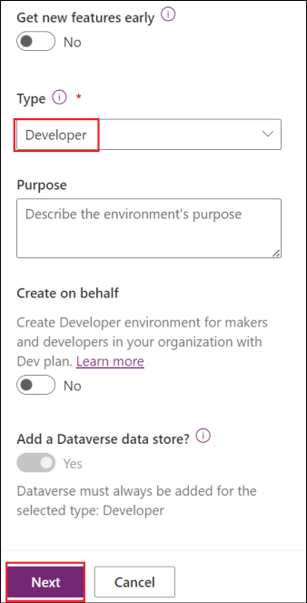
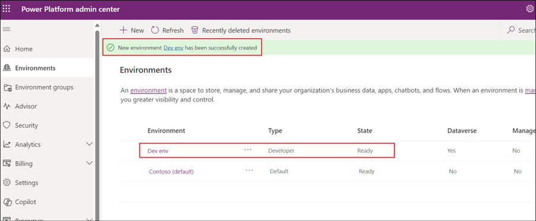
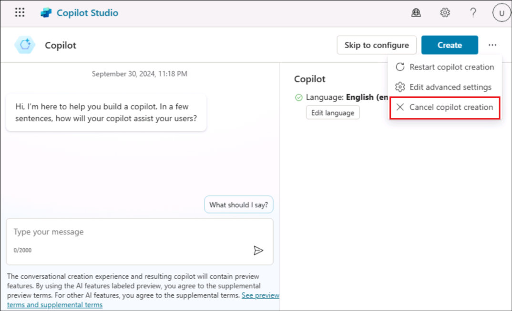
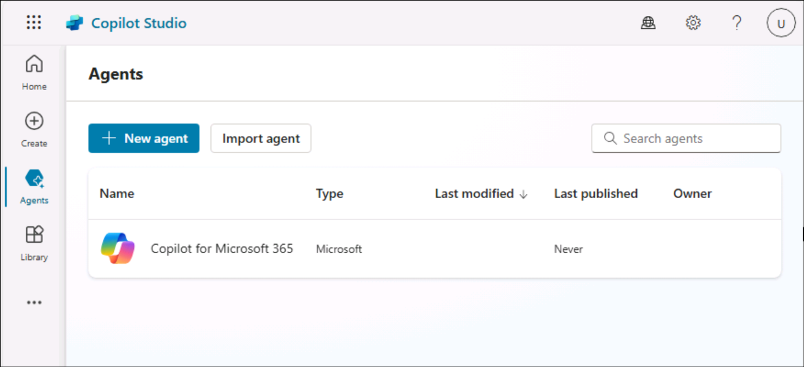

# Laboratorio 2A: Aggiunta di un'azione conversazionale a Copilot per Microsoft 365

**Obiettivo**

Microsoft Copilot offre un'esperienza di utilizzo dei contenuti e delle
risorse di tutta l'organizzazione. In alcune situazioni, sono necessarie
risposte e interazioni con sistemi esterni. Con Microsoft Copilot
Studio, è possibile creare un argomento di conversazione che può essere
pubblicato come Plugin Copilot. Una volta che il Tenant Admin ha
approvato il Plugin, questo può essere aggiunto alle esperienze di chat
M365 dell'organizzazione.

I plugin saranno disponibili in Microsoft Copilot in produzione, se
l'organizzazione dispone di una licenza valida per gli stessi.

In questo laboratorio impareremo a creare un'azione conversazionale.

Durata del laboratorio - 15 minuti

## Esercizio 1: Impostazione dell'ambiente

1.  Dalla macchina virtuale, fare clic con il pulsante destro del mouse
    sull'orologio nell'angolo inferiore destro dello schermo.

2.  Selezionare **Adjust date and time**.

    

3.  Nella schermata delle impostazioni che si apre, fare clic su **Sync
    now** sotto Impostazioni aggiuntive.

    

4.  Si occupa di sincronizzare l'ora nel caso in cui la sincronizzazione
    automatica non funzioni.

    

## Esercizio 2: Creare un plugin conversazionale

1.  Aprite un browser e digitate
    [+++https://copilotstudio.microsoft.com/+++](https://copilotstudio.microsoft.com/+++)
    nella barra degli indirizzi.

2.  Accedere con le **credenziali** fornite nella scheda **Resources**
    della VM del laboratorio.

    

3.  Una volta effettuato l'accesso, nella pagina Welcome to Microsoft
    Copilot Studio, lasciare il paese come **United States** e fare clic
    su **Get Started**.

    

4.  Selezionare **Skip** nella schermata di **Welcome**.

    

5.  Nella pagina di creazione del Copilot che si apre, fare clic sui 3
    punti accanto a **Create** in alto a destra e fare clic su **Cancel
    copilot creation** e su **Leave** nella finestra di dialogo di
    conferma.

    
    
    

6.  Si apre la pagina **Home** di Copilot Studio.

    

7.  Nel riquadro sinistro della schermata principale, selezionare
    **Copilot**.

    

8.  Selezionare **Copilot for Microsoft 365**.

    

9.  Selezionare **Extensions** o **Actions**, entrambe visualizzate
    nell'interfaccia utente.

    

10. Selezionare **+ Add Extension** o **+ Add Action**.

    

11. Selezionare **New action**.

    

12. Selezionate **Conversational** nel riquadro **New action**.

    

13. Indicare il nome dell'azione come **+++** **Conversational action
    +++**. Selezionare **Create**.

    

14. Una volta pronta, l'azione creata si apre nell'area di disegno
    Authoring. Selezionare **Topics**.

    

15. Selezionare **Allow** se appare un pop-up per consentire la copia.

16. Nominare l'argomento come +++ Holidaylist +++

    

17. Nella descrizione del nodo Trigger, fornire una descrizione chiara
    di come il plugin conversazionale può aiutare l'utente e di cosa può
    fare. Che questo argomento aiuti l'utente a trovare l'elenco delle
    festività dell'anno 2024.

    Digitare +++**This plugin helps to retrieve the list of holidays for
    the year 2024.**+++ nella descrizione del nodo Trigger.
    
    

    Questa descrizione ha uno scopo funzionale e viene utilizzata da
    Microsoft Copilot per determinare se richiamare o meno il plugin.
    
    ```
    
    - Capodanno - 1 gennaio
    
    - Compleanno di Martin Luther King, Jr. (terzo lunedì di gennaio) - 15
      gennaio 2024
    
    - Compleanno di Washington o Presidents' Day (terzo lunedì di
      febbraio) - 19 febbraio
    
    - Giorno della Memoria (ultimo lunedì di maggio) - 27 maggio
    
    - Giornata del Juneteenth - 19 giugno
    
    - Giorno dell'Indipendenza - 4 luglio
    
    - Festa del lavoro (primo lunedì di settembre) - 2 settembre
    
    - Columbus Day (secondo lunedì di ottobre) - 14 ottobre
    
    - Giorno dei Veterani o Giornata dei Veterani - 11 novembre
    
    - Giorno del Ringraziamento (quarto giovedì di novembre): 28 novembre
    
    - Giorno di Natale - 25 dicembre
    
    ```

    

18. Fare clic su **Save** per salvare l'azione.

    
    
    

## Esercizio 3: pubblicazione dell'azione conversazionale su Microsoft Copilot

1.  La pubblicazione del plugin conversazionale crea un nuovo plugin nel
    registro Dataverse per il tenant. Una volta disponibile,
    l'amministratore del tenant deve approvare il plugin per renderlo
    disponibile agli utenti nel catalogo dei plugin di Microsoft
    Copilot.

2.  Fare clic su **Publish**.

    

3.  Selezionare **Publish**.

    

4.  Selezionare **Publish** nella finestra di dialogo **Publish latest
    content**.

    

5.  Lo stato di pubblicazione viene visualizzato sullo schermo.

    

    >[!Note] **Nota:** la pubblicazione deve essere completata rapidamente. La
disponibilità effettiva nel Microsoft Admin Center può richiedere fino a
4 ore.

6.  L'amministratore può trovare l'applicazione integrata **Dataverse
    and Microsoft Copilot Studio** nel Microsoft Admin Center alla voce
    **Settings**, quindi **Integrations to be reviewed and approved**.

    >[!Alert] **Importante:** Affinché l'amministratore possa essere elencato nel
centro di amministrazione, l'azienda deve essere in possesso di una
licenza Copilot valida.

7.  Una volta che l'amministratore del tenant ha approvato
    l'applicazione integrata Dataverse e Microsoft Copilot Studio,
    questa dovrebbe comparire nell'elenco dei plugin dell'utente
    nell'interfaccia utente di Microsoft Copilot.

**Sintesi:**

In questo laboratorio abbiamo imparato a creare un'azione
conversazionale e a pubblicarla.
