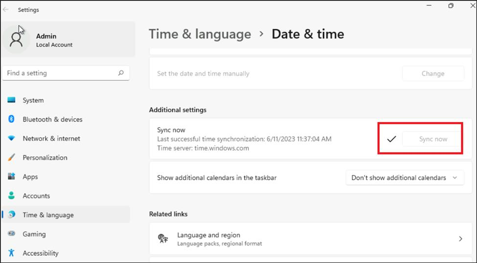

# Lab 2A: Copilot for Microsoft 365の会話アクションの追加

**目的**

Microsoft
Copilotは、組織全体のコンテンツやリソースにすぐにアクセスできる環境を提供します。状況によっては、回答や外部システムとの対話が必要になります。Microsoft
Copilot
Studioを使用すると、会話トピックを作成し、Copilotプラグインとして公開できます。テナント管理者がプラグインを承認すると、組織の
M365 チャット体験に追加できます。

プラグインは、組織が同じもののための有効なライセンスを持っている場合、本番のMicrosoft
Copilotで利用できるようになります。

このラボでは、カンバセーショナル・アクションの作成方法を学びます。

ラボの所要時間 - 15分

## 練習1：環境のセットアップ

1.  VMから画面右下の時計を右クリックする。

2.  **日付と時刻の調整\]を**選択します。

3.  開いた設定画面で、「追加設定」の「**今すぐ同期**」をクリックします。

4.  自動同期がうまくいかない場合に備えて、時刻の同期を行います。

## 練習 2: 開発環境の作成

1.  +++<https://admin.powerplatform.microsoft.com/+++>
    にログインしてください。

2.  左側のナビゲーション ウィンドウから **Environments**  を選択し、**+
    New をクリックします**。

> 

3.  開いたNew
    environmentウィンドウで、以下の詳細を入力し、\[**Next**\]をクリックします。

[TABLE]

> 
>
> 

4.  **Add** **Dataverse**
    ウィンドウで、デフォルトをそのまま使用し、**Saveをクリックします**。

> 

5.  新しく作成された環境は、管理センターに一覧表示され、その状態が
    \[Environments\] ウィンドウに表示されます。

6.  **status** is **readyになると**、環境を使用する準備が整います。この環境は、今後の演習で使用します。

> 

## 練習3：会話プラグインを作る

1.  ブラウザを開き、[アドレス](https://copilotstudio.microsoft.com/+++)バーに「+++https://copilotstudio.microsoft.com/+++」と入力する。

2.  Lab VM の **Resources**
    タブの下に提供されている**認証情報を**使用してサインインします。

3.  ログインしたら、\[Microsoft Copilot
    Studioへようこそ\]ページで、国を\[**United
    States\]**のままにして、\[**Get Started\]**をクリックします。

4.  **ようこそ」**画面で**「スキップ」を**選択します。

5.  開いたCopilot作成ページで、右上の**Createの**横にある3つの点をクリックし、**Cancel
    copilot
    creationを**クリックし、確認ダイアログで**Leaveを**クリックします。

6.  Copilot Studio**ホーム**画面が開きます。

7.  右上の **\[Environments**\] を選択し、**Dev env** 環境を選択します。

> 

8.  ホーム画面の左ペインから**Copilotを**選択します。

9.  **Copilot for Microsoft 365を**選択します。

10. 「アクション」タブを選択します

11. **\[新しいアクション\] または \[+ アクションの追加\] を選択します**

> 

12. **Newアクション**ペインで**Conversationalを**選択する。

13. アクションの名前を「+++Conversational
    **action+++」と**します。**Createを**選択する。

14. 準備ができたら、作成したアクションがオーサリングキャンバスで開きます。**トピックを**選択します。

15. コピーを許可するポップアップが表示されたら、**「許可**」を選択します。

16. トピック名を+++Holidaylist+++とする。

17. トリガーノードの説明では、会話プラグインがどのようにユーザーを助けることができるか、何ができるかを明確に説明してください。このトピックは、ユーザーが2024年の祝日のリストを見つけるのに役立ちます。

> +++この**プラグインは、2024年の祝日のリストを取得するのに役立ちます**。+++

この記述には機能的な目的があり、Microsoft
Copilotがプラグインを起動するかどうかを判断するために使用されます。

18. を追加します。**Send a message** 休日のリストを含むノード。

> \- New Year's Day - January 1
>
> \- Martin Luther King, Jr.'s Birthday (Third Monday of January) -
>
> January 15, 2024
>
> \- Washington's Birthday or Presidents' Day (third Monday of
>
> February) - February 19
>
> \- Memorial Day (last Monday of May) - May 27
>
> \- Juneteenth Day - June 19
>
> \- Independence Day - July 4
>
> \- Labor Day (first Monday of September) - September 2
>
> \- Columbus Day (Second Monday of October) - October 14
>
> \- Veterans Day or Veterans Day - November 11
>
> \- Thanksgiving Day (fourth Thursday of November): November 28
>
> \- Christmas Day - December 25

19. **Saveを**クリックしてアクションを保存します。

## 練習4：会話アクションをMicrosoft Copilotに公開する

1.  会話型プラグインを公開すると、テナントのDataverseレジストリに新しいプラグインが作成されます。そこで利用可能になると、テナント管理者はMicrosoft
    Copilotプラグインカタログでユーザーが利用できるようにプラグインを承認する必要があります。

2.  **Publishを**クリックする。

3.  **Publishを**選択する。

4.  **最新コンテンツの公開**ダイアログで**公開を**選択する。

5.  発行ステータスが画面に表示されます。

\[注】**注：**パブリッシュは迅速に完了する必要があります。Microsoft
Admin
Centerで実際に利用できるようになるまで、最大4時間かかることがあります。

6.  管理者は、Microsoft Admin
    Centerの**\[設定\]**、\[**統合\]の**順に表示される**DataverseとMicrosoft
    Copilot Studio**統合アプリを**確認し、承認します**。

\[注意\]
**重要です：**管理者が管理センターに表示するには、有効なCopilotライセンスを保有している必要があります。

7.  テナント管理者がDataverseとMicrosoft Copilot
    Studioの統合アプリを承認すると、Microsoft Copilot
    UIのユーザーのプラグインリストに表示されるようになります。

**概要**

このラボでは、会話アクションを作成し、それを公開する方法を学びました。
