# Laboratorio 2B: Adición de una acción de IA a Copilot para Microsoft 365

**Objetivo**

Los AI Plugins se pueden utilizar para ampliar Microsoft Copilot o
dentro de un copiloto personalizado como una acción de plugin. En este
laboratorio, aprenderemos a crear diferentes tipos de AI Plugins.

Los Plugins estarán disponibles en Microsoft Copilot en producción, si
la organización tiene licencia válida para los mismos.

Duración del laboratorio - 15 minutos

## Ejercicio 1: Generar contenidos o extraer información con las preguntas dinámicas del AI Builder

### Tarea 1: Vaya al Asistente para añadir una acción de aviso

1.  Inicie sesión en Copilot Studio en
    +++https://copilotstudio.microsoft.com+++ utilizando sus
    credenciales de inquilino en la pestaña Resources.

2.  Seleccione **Library** en el panel de navegación lateral.

    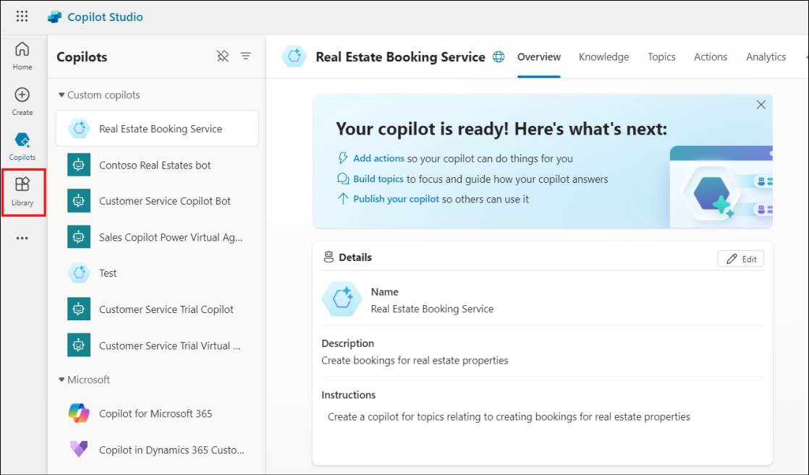

3.  Seleccione **+ Add an item**.

    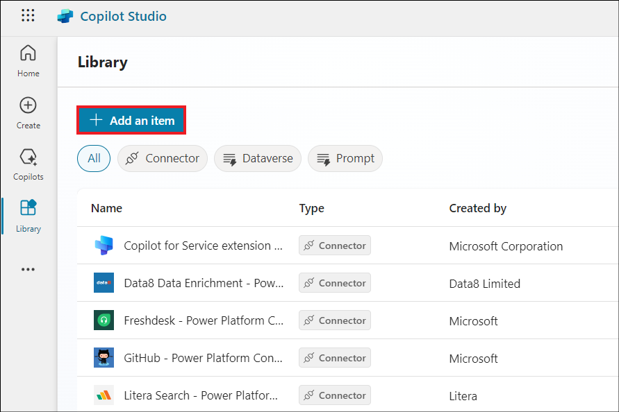

4.  Seleccione **Copilot for Microsoft 365**.

    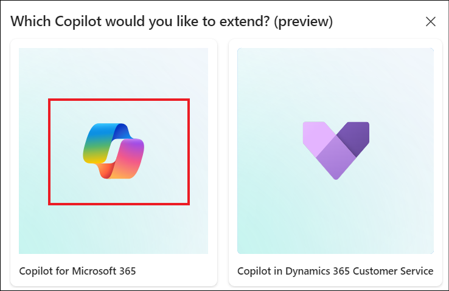

5.  Seleccione **New action**.

    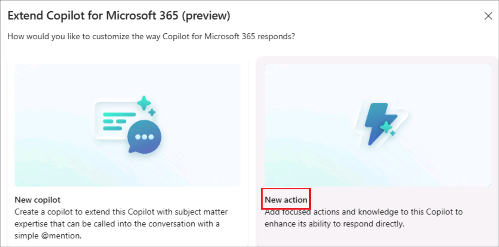

6.  Aparece el menú **New action**. Seleccione **Prompt**.

    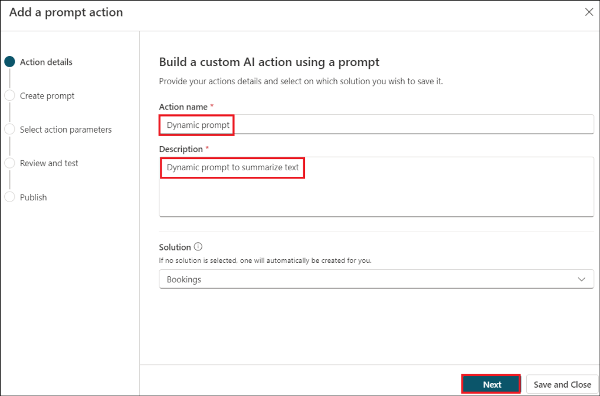

7.  Se abre el asistente **Add a prompt action**.

### Tarea 2: Generar contenidos o extraer información con las preguntas dinámicas del AI Builder

1.  Proporcione los siguientes datos y haga clic en **Next**.

    - Nombre - +++Dynamic **promptXX+++** (Sustituya **XX** por un
      número aleatorio para garantizar la unicidad)

    - Descripción - **++ Dynamic prompt to summarize text** +++

    

2.  Seleccione **Summarize text**.

    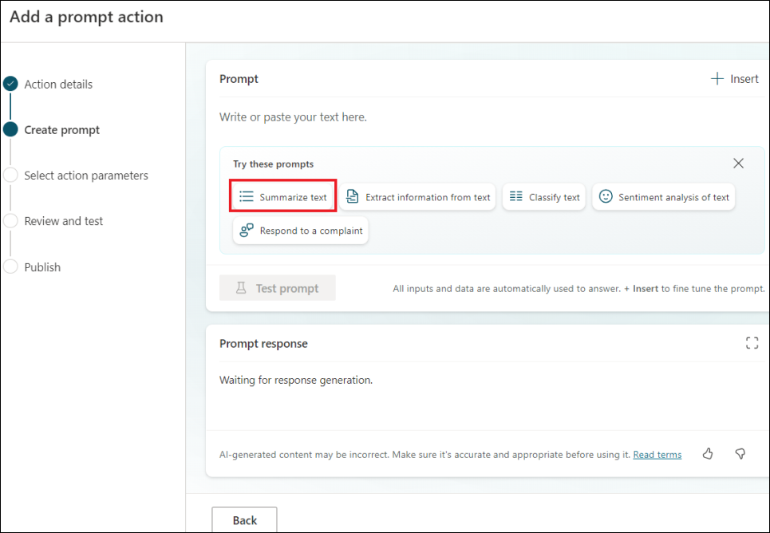

3.  Añadirá un prompt con un **texto** de valor dinámico.


4.  Haga clic en **Input** en Prompt Settings y añada el siguiente
    contenido en **Sample data**.

    ```
    Meet comfortably and confidently with customizable meeting views
    The meeting stage, or gallery, is at the core of the virtual meeting experience and can either hinder or enhance meeting efficiency depending on your needs. We’re excited to share how we’re evolving the default gallery experience in Teams meetings to give you a simpler, more predictable meeting presence—while enabling more controls that let you personalize the view to suit your preferences.
    First, let’s look at the new default gallery experience that will be applicable to all. The new gallery will place everyone in tiles of equal size (16:9 ratio) whether their video is turned on or off. Additionally, the new default gallery layout will be more consistent and predictable for all meetings, regardless of size and content shared.
    And when a Teams Room joins the meeting, the video of the room automatically enlarges, bridging the gap between remote and in-room participants. Remote attendees enjoy a clearer view and better connection, easily spotting who is speaking. Want a custom view? Simply tweak the tile size to your preference from the more options (...) menu by hovering on the room name. It's seamless, inclusive, and ensures everyone can be seen, no matter where they are.
    Next, let’s look at the controls that help you customize every meeting view to suit your needs.
    
    While the default gallery size for meetings will be 16 participants, you can customize the number of participants visible on your screen to best fit your preference. You can choose from 4, 9, 16, and 49 participants visible on the screen for gallery size.
    There are still a few default configurations that AI will optimize for to improve engagement and efficiency. For virtual participants, these are prioritizing those that have a raised hand and prioritizing the active speaker, enhancing their visibility so comments are not missed.
 
    ```
    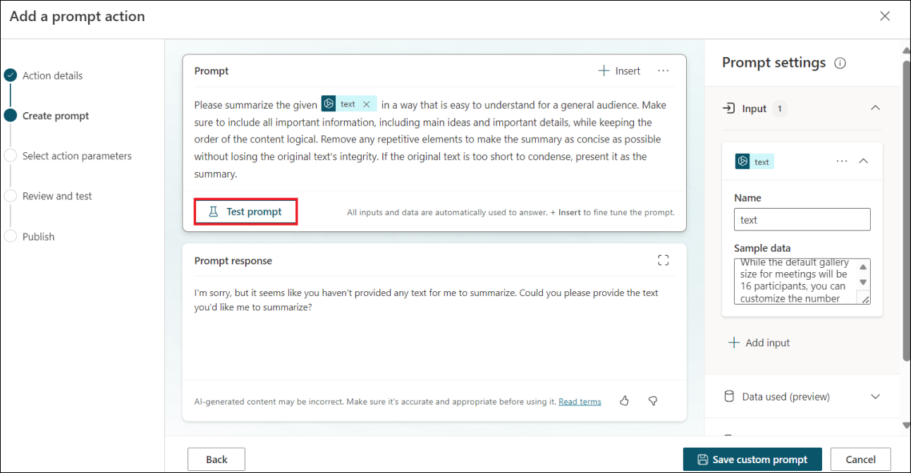

5.  Haga clic en **Test prompt**.

    

6.  Observe que se genera la respuesta Prompt, que resume el texto.

    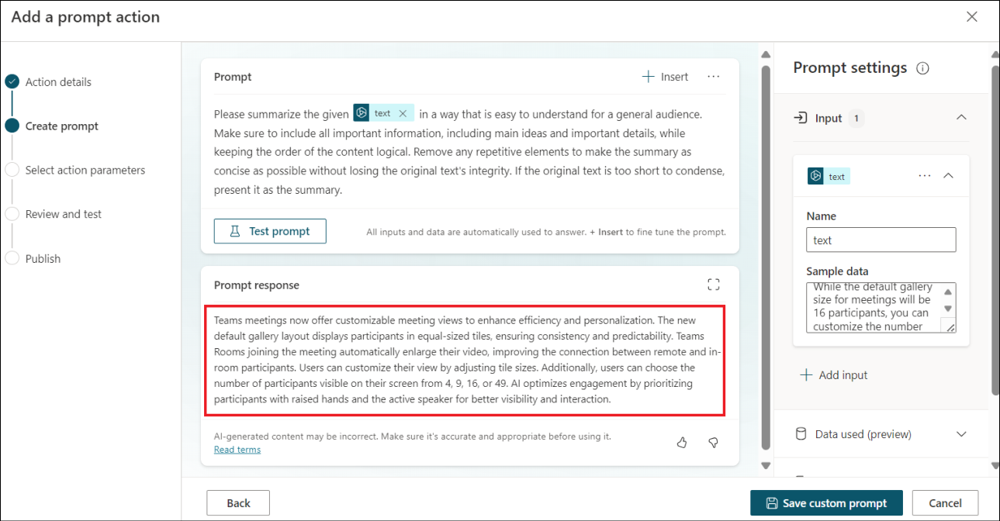

7.  Haga clic en **Save custom prompt**.

    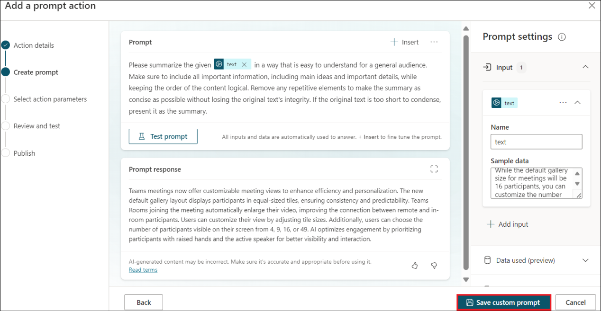

8.  Haga clic en **Next**.

    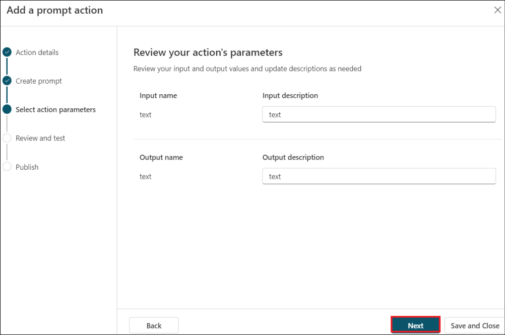

9.  Haga clic en **Publish**.

    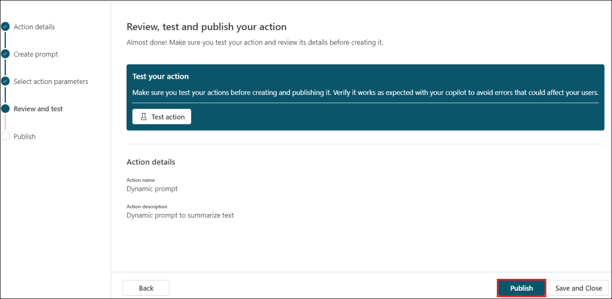

10. Una vez publicado, haga clic en **Go to details page** para ver los
    detalles.

    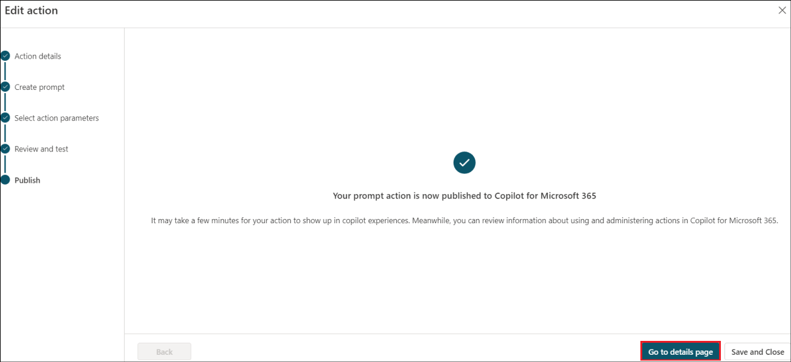

    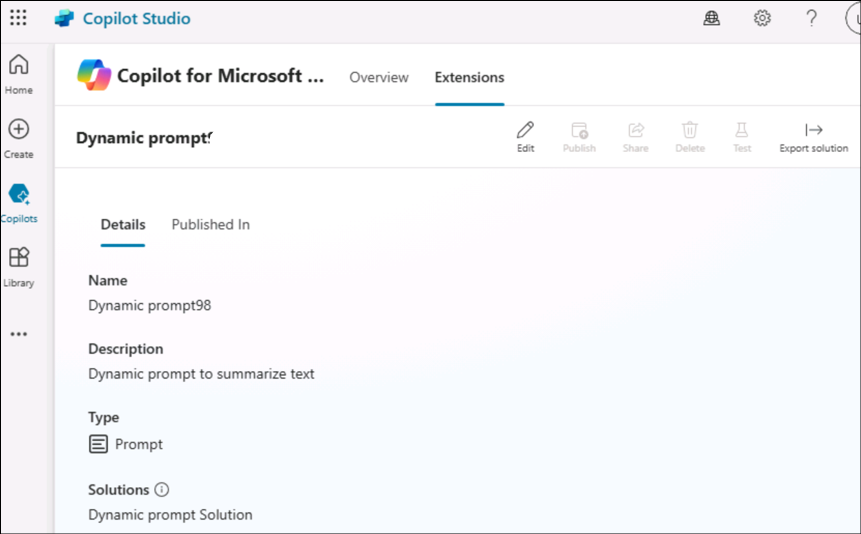

Su acción rápida ya está publicada en **Copilot para Microsoft 365**.
Aparecerá en las experiencias de Copilot solo si dispone de una licencia
de Copilot válida.

**Resumen:**

En este laboratorio, hemos aprendido a crear **acciones de IA**.
