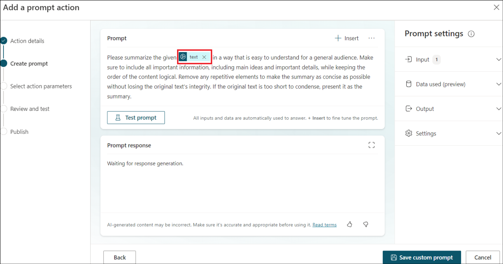

# Laboratorio 2B: Aggiunta di un'azione AI a Copilot per Microsoft 365

**Obiettivo**

I plugin AI possono essere utilizzati per estendere Microsoft Copilot o
per essere utilizzati all'interno di un copilot personalizzato come
azione plugin. In questo laboratorio impareremo a creare diversi tipi di
plugin AI.

I plugin saranno disponibili in Microsoft Copilot in produzione, se
l'organizzazione dispone di una licenza valida per gli stessi.

Durata del laboratorio - 15 minuti

## Esercizio 1: Generare contenuti o estrarre insight con i prompt dinamici di AI Builder

### Attività 1: Passare alla procedura guidata Aggiungi un'azione immediata

1.  Accedere a Microsoft Copilot Studio all'indirizzo
    [+++https://copilotstudio.microsoft.com+++]() utilizzando le
    credenziali dell'inquilino nella scheda Risorse.

2.  Selezionate **Library** dal pannello di navigazione laterale.


3.  Selezionare **+ Add an item**.


4.  Selezionare **Copilot for Microsoft 365**.


5.  Selezionare **New action**.


6.  Viene visualizzato il menu **New action**. Selezionare **Prompt**.


7.  Si apre la procedura guidata **Add a prompt action.**

### Attività 2: Generare contenuti o estrarre informazioni con i suggerimenti dinamici di AI Builder

1.  Fornite i dati sotto riportati e cliccate su **Next**.

    - Nome - +++ **Dynamic promptXX** **+++** (sostituire **XX** con un
      numero casuale per garantire l'unicità)

    - Descrizione - **+++Dynamic prompt to summarize text**+++


2.  Selezionare **Summarize text**.


3.  Aggiungerà un prompt con un **text** valore dinamico.



4.  Fare clic su **Input** sotto Prompt Settings e aggiungere il
    contenuto seguente nei **Sample data**.

```
Meet comfortably and confidently with customizable meeting views
The meeting stage, or gallery, is at the core of the virtual meeting experience and can either hinder or enhance meeting efficiency depending on your needs. We’re excited to share how we’re evolving the default gallery experience in Teams meetings to give you a simpler, more predictable meeting presence—while enabling more controls that let you personalize the view to suit your preferences.
First, let’s look at the new default gallery experience that will be applicable to all. The new gallery will place everyone in tiles of equal size (16:9 ratio) whether their video is turned on or off. Additionally, the new default gallery layout will be more consistent and predictable for all meetings, regardless of size and content shared.
And when a Teams Room joins the meeting, the video of the room automatically enlarges, bridging the gap between remote and in-room participants. Remote attendees enjoy a clearer view and better connection, easily spotting who is speaking. Want a custom view? Simply tweak the tile size to your preference from the more options (...) menu by hovering on the room name. It's seamless, inclusive, and ensures everyone can be seen, no matter where they are.
Next, let’s look at the controls that help you customize every meeting view to suit your needs.
 
While the default gallery size for meetings will be 16 participants, you can customize the number of participants visible on your screen to best fit your preference. You can choose from 4, 9, 16, and 49 participants visible on the screen for gallery size.
There are still a few default configurations that AI will optimize for to improve engagement and efficiency. For virtual participants, these are prioritizing those that have a raised hand and prioritizing the active speaker, enhancing their visibility so comments are not missed.

```


5.  Fare clic su **Test prompt**.


6.  Si noti che viene generata la risposta del prompt, che riassume il
    testo.


7.  Fare clic su **Save custom prompt**.


8.  Fare clic su **Next**.


9.  Fare clic su **Publish**.


10. Una volta pubblicato, fare clic su **Go to details page** per
    visualizzare i dettagli.


La vostra azione immediata è ora pubblicata su **Copilot for Microsoft
365**. Verrà visualizzata nelle esperienze Copilot solo se si dispone di
una licenza Copilot valida.

**Sintesi:**

In questo laboratorio abbiamo imparato a creare **azioni di intelligenza
artificiale**.
