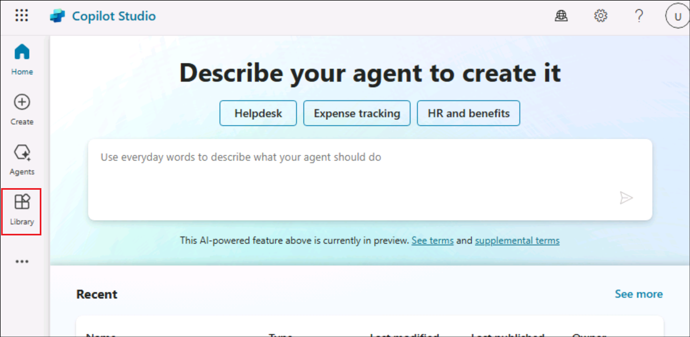
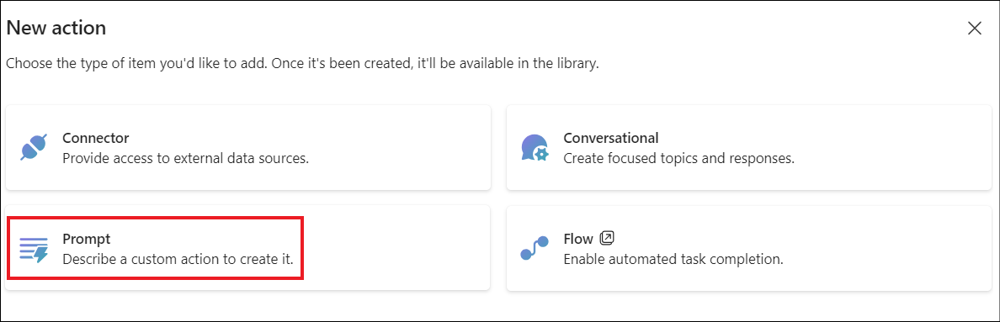

# **Lab 2B_Adding an AI action to Copilot for Microsoft 365**

**Objective**

AI Plugins can be used to extend Microsoft Copilot, or used within a
custom copilot as a plugin action. In this lab, we will learn about
creating different types of AI Plugins.

The Plugins will be available in the Microsoft Copilot in production, if
the organization has valid license for the same.

Lab duration – 15 minutes

## **Exercise 1: Generate content or extract insights with AI Builder dynamic prompts**

### Task 1: Navigate to the Add a prompt action wizard

1.  Sign into Copilot Studio at
    +++https://copilotstudio.microsoft.com+++ using your admin tenant
    credentials.

2.  Select **Library** on the side navigation pane.

3.  Select **+ Add an item**. You're prompted to select a Microsoft
    Copilot to extend.

4.  Select **Copilot for Microsoft 365**.

5.  A **New action** menu appears. Select **Prompt**.

6.  The **Add a prompt action** wizard opens.

### Task 2: Generate content or extract insights with AI Builder dynamic prompts

1.  Provide the below details and click on **Next**.

- Name - +++**Dynamic prompt**+++

- Description - +++**Dynamic prompt to summarize text**+++

2.  Select **Summarize text**.

3.  It will add a prompt with a dynamic value **text**.

![]](./media/image7.png)

4.  Click on the **Input** under Prompt Settings add the below content
    in the **Sample data**.

> **Meet comfortably and confidently with customizable meeting views**
>
> **The meeting stage, or gallery, is at the core of the virtual meeting
> experience and can either hinder or enhance meeting efficiency
> depending on your needs. We’re excited to share how we’re evolving the
> default gallery experience in Teams meetings to give you a simpler,
> more predictable meeting presence—while enabling more controls that
> let you personalize the view to suit your preferences.**
>
> **First, let’s look at the new default gallery experience that will be
> applicable to all. The new gallery will place everyone in tiles of
> equal size (16:9 ratio) whether their video is turned on or off.
> Additionally, the new default gallery layout will be more consistent
> and predictable for all meetings, regardless of size and content
> shared.**
>
> **And when a Teams Room joins the meeting, the video of the room
> automatically enlarges, bridging the gap between remote and in-room
> participants. Remote attendees enjoy a clearer view and better
> connection, easily spotting who is speaking. Want a custom view?
> Simply tweak the tile size to your preference from the more options
> (...) menu by hovering on the room name. It's seamless, inclusive, and
> ensures everyone can be seen, no matter where they are.**
>
> **Next, let’s look at the controls that help you customize every
> meeting view to suit your needs.**
>
> **  
> While the default gallery size for meetings will be 16 participants,
> you can customize the number of participants visible on your screen to
> best fit your preference. You can choose from 4, 9, 16, and 49
> participants visible on the screen for gallery size.**
>
> **There are still a few default configurations that AI will optimize
> for to improve engagement and efficiency. For virtual participants,
> these are prioritizing those that have a raised hand and prioritizing
> the active speaker, enhancing their visibility so comments are not
> missed.**
>

5.  Click on **Test prompt**.

6.  Notice that the Prompt response, summarizing the text is generated.

7.  Click on **Save custom prompt**.

8.  Click on **Next**.

9.  Click on **Publish.**

10. Once published, click on **Go to details page** to view the details.

Your prompt action is now published to **Copilot for Microsoft 365**. It
will show up in copilot experiences only if you have a valid Copilot
license.

## **Exercise 2: Create Custom automation with Power Automate flows**

Power Automate flow plugins let you define flows that can be called from
AI surfaces in Power Platform. Flow plugins use the new **Run from
Copilot** trigger and **Respond to Copilot** action to define custom
processes that can be invoked with natural language.

1.  Select **+ Add action**. Select **Flow** in the New action menu that
    open up.

2.  The flow editor automatically opens with the **Run from
    Copilot** trigger and **Respond to Copilot** action present. Rename
    the flow as +++**Get Weather forecast for next day**+++

3.  Click on the **Run a flow from Copilot/Skills** node. The details
    pane opens up. Click on **+ Add an input**.

4.  Select Text and name it as **City**.

5.  Similarly, add another input of type **Number** and name it as
    **Zipcode**.

6.  Click on the **+** symbol between **Run a flow from Copilot** and
    the **Respond to Copilot** nodes and select **Add an action**.

7.  Select **MSN Weather**.

8.  Select **Get the forecast for tomorrow** option.

9.  Add the **City** and **Zipcode** input parameters to **Location**.

10. Click on **Respond to copilot** action and select **Add an output**.

11. Add a Text output variable and name it as +++**Weather
    condition**+++. Add the output variable **Conditions**.

12. Click on **Save**.

13. Click on **Test**.

**Note:** This might take some time to get reflected. Wait for 5 to 10
minutes if you are not able to start the flow after clicking on
**Test**.

14. In the **Test Flow** pane, select the checkbox for **Manually** and
    then click on **Next**.

15. In the **Run flow** panel, select **MSN Weather** and click on
    **Continue**.

16. Enter +++**Redmond**+++ for city and +++**98004**+++ for **Zipcode**
    and select **Run flow**.

17. Once the execution is completed, a success message is obtained.
    Click on **Done**.

**Note:** The AI uses the title and description of the flow to determine
when to invoke the flow plugins. Ensure your flows run correctly, as
only tested flows show up as available plugins in Microsoft Copilot.

18. The created flow is listed in the **Library**.

19. After you create your action, enable it for use in Microsoft
    Copilot.

**Summary:**

In this lab, we have learnt to create **AI actions**.
