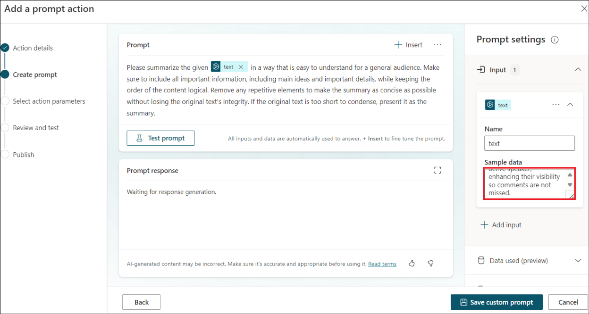

# Lab 2B: Microsoft 365のCopilotにAIアクションを追加する

**目的**

AIプラグインは、Microsoft
Copilotを拡張するために使用したり、プラグインアクションとしてカスタムCopilot内で使用したりできます。この実習ラボでは、さまざまな種類の
AI プラグインの作成について学習します。

プラグインは、組織が同じもののための有効なライセンスを持っている場合、本番のMicrosoft
Copilotで利用できるようになります。

ラボの所要時間 - 15分

## 演習1：AI Builderの動的プロンプトでコンテンツを生成し、インサイトを抽出する

### タスク 1：プロンプトアクションの追加ウィザードに移動する

1.  Resources］タブにあるテナント認証情報を使用して、+++https://CopilotStudio.microsoft.com+++にサインインします。

2.  サイドナビゲーションペインから**「ライブラリ**」を選択する。

    

3.  **+Add an Item** を選択する

    

4.  **新しいアクションを**選択します。

    

5.  **新しいアクション**メニューが表示されます。**Prompt を**選択する。

    

6.  **プロンプトアクションの追加**ウィザードが開きます。

### タスク 2: AI Builderの動的プロンプトを使用してコンテンツを生成またはインサイトを抽出する

1.  以下の詳細を入力し、「**次へ**」をクリックします。

    - 名前 - +++Dynamic **promptXX+++
      (**一意性を確保するため、XXを乱数に置き換える)

    - 説明 - +++**Dynamic prompt to summarize text+++**

    

2.  **テキストの要約を**選択します。

    

3.  これは、動的な値の**テキストを**持つプロンプトを追加します。

    

4.  プロンプト設定\]の\[**入力\]**をクリックし、**\[サンプルデータ**\]に以下の内容を追加します。

    ```
    Meet comfortably and confidently with customizable meeting views
    The meeting stage, or gallery, is at the core of the virtual meeting experience and can either hinder or enhance meeting efficiency depending on your needs. We’re excited to share how we’re evolving the default gallery experience in Teams meetings to give you a simpler, more predictable meeting presence—while enabling more controls that let you personalize the view to suit your preferences.
    First, let’s look at the new default gallery experience that will be applicable to all. The new gallery will place everyone in tiles of equal size (16:9 ratio) whether their video is turned on or off. Additionally, the new default gallery layout will be more consistent and predictable for all meetings, regardless of size and content shared.
    And when a Teams Room joins the meeting, the video of the room automatically enlarges, bridging the gap between remote and in-room participants. Remote attendees enjoy a clearer view and better connection, easily spotting who is speaking. Want a custom view? Simply tweak the tile size to your preference from the more options (...) menu by hovering on the room name. It's seamless, inclusive, and ensures everyone can be seen, no matter where they are.
    Next, let’s look at the controls that help you customize every meeting view to suit your needs.
    
    While the default gallery size for meetings will be 16 participants, you can customize the number of participants visible on your screen to best fit your preference. You can choose from 4, 9, 16, and 49 participants visible on the screen for gallery size.
    
    There are still a few default configurations that AI will optimize for to improve engagement and efficiency. For virtual participants, these are prioritizing those that have a raised hand and prioritizing the active speaker, enhancing their visibility so commen

    ```

    

5.  **テストプロンプトを**クリックします。

    

6.  本文を要約したプロンプトの応答が生成されていることに注目してください。

    

7.  **Save custom prompt\]**をクリックします。

    

8.  **「次へ」**をクリックする。

    

9.  **Publishを**クリックする。

    

10. 公開されたら、「**詳細ページへ」を**クリックして詳細をご覧ください。

    

    

    プロンプトアクションがCopilot for Microsoft 365に公開されました。有効な Copilot ライセンスがある場合にのみ、Copilot エクスペリエンスに表示されます。

**概要**

このラボでは、**AIアクションの**作成について学んだ。
