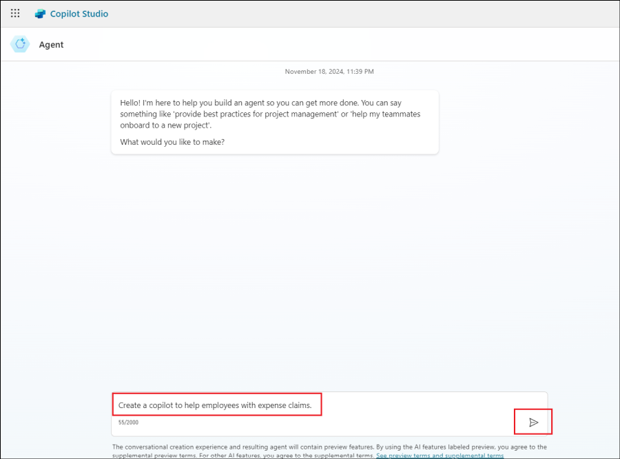
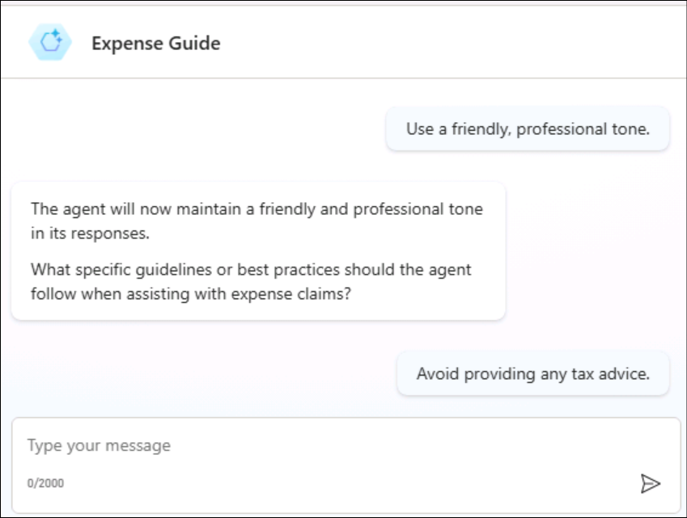
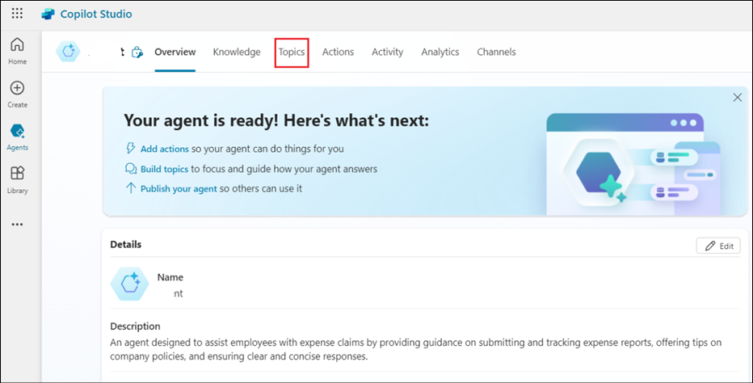
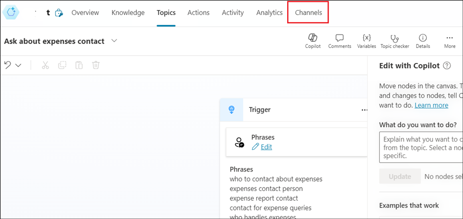
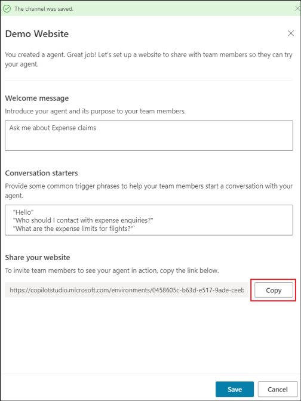

# Laboratorio 3A: Creación de su primer Copilot con Copilot Studio

**Objetivo:**

En este laboratorio, seguirá los pasos para crear, desplegar y probar su
primer Copilot para gestionar una solicitud habitual de un cliente.

## Ejercicio 1: Construya su primer Copilot

### Tarea 1: Iniciar sesión para crear un Copilot

1.  Desde un navegador, abra la url -
    +++https://copilotstudio.microsoft.com/+++.

2.  Inicie sesión con las credenciales proporcionadas en la pestaña
    **Resources** de su Lab VM.

    

3.  Seleccione Copilots en el panel izquierdo. Y, a continuación, haga
    clic en **+ New Copilot**.

    

4.  Seleccione **Skip to configure**.

    

5.  En la página Create a Copilot, introduzca el **nombre** como **+++
    Customer service +++** y haga clic en **Create**.

    

6.  Espere a que se cree el Copilot.

7.  Si no se encuentra en la página del Copilot **CustomerService**,
    haga clic en **Copilots** en el panel izquierdo.

    

8.  Haga clic en **Customer service**.

    >[!Note] **Nota:** Si la página no se actualiza automáticamente, vuelva a abrir
la URL +++https://copilotstudio.microsoft.com/+++ 

    

### Tarea 2: Visita rápida a la interfaz de usuario

### Tarea 3: Probar una conversación en el panel Test Copilot (¡Hola!)

Ahora vamos a probar el bot utilizando una de las cuatro lecciones
preconstruidas que se incluyen al crear un nuevo bot.

1.  Haga clic en **Test** para abrir el panel **Test your Copilot** si
    aún no está abierto.

    

2.  Seleccione los tres puntos en el cuadro de diálogo **Test your
    Copilot** disponible en la parte derecha. Cambie **Track between
    topics** para **activarla**.

    

3.  En la ventana **Ask your question or describe what you need**,
    situada en la parte inferior del Test Copilot, escriba:
    **+++Hello+++** y, a continuación, selecciona el botón **Send**.

    

El Copilot ofrece un saludo en el panel Test copilot.

Además, se abre la página Topics (independientemente de la página en la
que estuviera antes) y puede ver el tema del saludo abierto en la
ventana del lienzo de creación, con el contorno verde y una marca de
verificación añadida para cada parte del diseño de la conversación
cuando se utiliza en el chat de prueba. (Esto es lo que hace la función
de seguimiento; si no la activó, no verá ningún cambio en la selección
de páginas y verá el resaltado verde en el tema de saludo sólo si ya lo
había abierto desde la página Temas).

   

>[!Note] **Nota:** Si aparece un prompt que le da la opción de seleccionar
Allow/Block que Copilot vea el texto y las imágenes copiadas, haga clic
en **Allow**.

    

4.  En el Copilot de prueba, introduce el siguiente mensaje y pulsa Send
    +++ **stores near me+++**.

Seleccione **Redmond**.

Observe que se abre un nuevo tema en el lienzo de creación. Ha activado uno de los temas predefinidos (Lección 2).

    

5.  Observe que el Copilot responde con la dirección de una tienda en la
    localidad de Redmond.

    

## Ejercicio 2: Edita su conversación

Ahora, vamos a hacer un cambio en esa conversación añadiendo otra
ubicación de la tienda. Primero hacemos una copia para que después
puedas volver a las Lecciones tal y como fueron escritas si quieres.

### Tarea 1: Haz una copia del tema

1.  Haga clic en **Test** en la esquina superior derecha para quitarte
    de encima el Copilot de prueba por ahora.

    

2.  Seleccione **Topics** en el menú de la parte superior para abrir la
    lista de **Topics**.

    

3.  Pase el ratón por encima de la fila del tema predefinido **Lesson
    2 - A simple topic with a condition and variable**. Seleccione el
    icono **More actions** y, a continuación, **Make a copy**.

    

    Se abre la página Topics con la versión copiada de la lección.

    

### Tarea 2: Editar la copia del tema

1.  Ahora se encuentra en la página de **setup** del tema copiado. En
    esta página se introduce el **Name** del tema (que aparecerá ante
    sus clientes) y **Trigger phrases**.

2.  Seleccione el texto actual en el campo **Name**, bórrelo y escriba
    para renombrar el tema a +++ **Get store locations +++**.

3.  Seleccione **Save** en la esquina superior derecha de la página.

    

4.  Imaginemos que ha abierto una nueva tienda en Bellevue. Para añadir
    la información de la tienda a su Copilot, necesita editar el diseño
    del tema en el lienzo de creación. El lienzo de creación contiene
    todo el texto y la lógica de la conversación sobre las ubicaciones
    de las tiendas. En la parte superior, verá un recordatorio de las
    frases desencadenantes, que se añaden y editan en la página
    **Setup**.

5.  Desplácese por la página para ver el diseño de la conversación.

    Cada una de las casillas conectadas que ves se llama "node". Puede  ver que el Copilot muestra un mensaje en un nodo **Message** que dice que
está encantado de ayudar a encontrar la ubicación de una tienda y luego
pregunta en un nodo **Question** en qué ubicación está interesado el
usuario. (Puede volver a abrir el Copilot de prueba para ver que es
igual que la conversación que mantuvó en el Ejercicio 1). A
continuación, vuelve a cerrar el Copilot de prueba).

6.  Desplácese hasta el nodo Pregunta que pregunta " Which location are
    you interested in?¨ Vamos a añadir otra opción aquí.

    >[!Note] **Nota:** Si los nodos ya existentes tienen **Incompatible type
comparison error**, haga clic en el campo **Object** y seleccione una
localización en un nodo (basado en la localización en el nodo Mensaje
correspondiente), asegurándose de que las 3 localizaciones existentes
están disponibles en un nodo de condición.

    

7.  En "Redmond" "Seattle" "Kirkland", seleccione la **+ New option**.

    

    Se añade un nuevo nodo **Condición** bajo el nodo Pregunta.

8.  En el nodo Pregunta (**NO** en el nodo Condición), escriba
    **+++Bellevue+++** en la casilla vacía recién añadida en **Options
    for user**.

    **Bellevue** también se añade automáticamente en el nodo Condition.

    

    >[!Note] **\[Nota:** La sección **Options for user** controla qué botones son
visibles para los usuarios en la ventana de chat, y siempre necesitan
ser emparejados con una condición, o el botón no funcionará. Las
Condiciones, sin embargo, pueden manejar al usuario escribiendo algo que
no se muestra en un botón. Así, por ejemplo, si se eliminara el botón
Bellevue **Options for user**, no se eliminaría el nodo Condición de
Bellevue, que se utilizaría si el usuario escribe "Bellevue" cuando se
le pregunta por una ubicación.

    Ahora dígale al Copilot qué mensaje debe mostrar si el usuario
selecciona **Bellevue**.

9.  Seleccione el **icono +** bajo el nodo de condición Bellevue.

    

10. En las opciones que aparecen, seleccione **Send a message**.

    

Esto añade un nuevo nodo de Mensaje conectado a la condición de
Bellevue.

11. En el nodo Message, introduce la información sobre la ubicación de
    la tienda: +++ Our Bellevue store is in 1234 Bellevue Way, Bellevue,
    WA 98123+++.

    

    >[!Note] **\[Nota:** Puede dar formato al texto del mensaje utilizando los
botones de formato que aparecen mientras escribe. Incluso puede
sustituir el nombre de la ubicación por el valor de la variable
pva_StoreLocation utilizando el control *{x}*.

Ahora vas a terminar la conversación. Dado que la conversación termina
de la misma manera independientemente de la ubicación que el usuario
haya elegido, vamos a enlazar con un nodo compartido de **End of
conversation**. Este nodo inicia el tema del sistema Fin de la
conversación.

12. Primero, aleja el zoom si es necesario para ver el nodo **End of
    conversation** en su pantalla. (**Zoom out** está en la barra de
    utilidades a la izquierda del lienzo de creación).

    

    

13. En la parte superior derecha de la página, seleccione **Save** para
    guardar los cambios realizados.

    

### Tarea 3: Activar el tema y probar los cambios

Puede que recuerde que cuando hicimos una copia del tema de la Lección
2, la copia se creó en estado Desactivado. Esto significa que no puede
activar el tema en el Copilot de prueba (y si publicó su Copilot, sus
usuarios tampoco podrían activarlo). Ahora estamos listos para activar
el tema editado.

1.  Seleccione **Topics** en la lista del menú superior para volver a la
    lista de Temas.

    

2.  Selecciona el conmutador **de Status** de Activado a **Desactivado**
    para **Lesson 2 - A simple topic with a condition and variable** y
    selecciona el conmutador **de Estado** de Desactivado **a Activado**
    para **Get store locations**. Ahora, puede probar la conversación
    que ha editado.

    

    

3.  Haga clic en **Test** en la parte superior derecha.

    

4.  Asegúrese de que el conmutador **Track between topics** está en la
    posición **Activado**.

    

5.  En el Test copilot, introduzca +++**Is there a store near me?**+++ y
    seleccione el botón **Enviar**.

    

    Observa que, aunque no es exactamente igual que las frases
desencadenantes del tema, " **Is there a store near me**?" funciona para
desencadenar el tema porque Microsoft Copilot Studio entiende que
significa lo mismo que las frases desencadenantes.

6.  Cuando se le pida que seleccione una ubicación, seleccione la
    ubicación de Bellevue en el chat de prueba. (Es posible que tenga
    que utilizar la flecha de la derecha en pantalla para ver la opción
    de Bellevue).

    

    El Copilot responde con la información de localización de la tienda de
Bellevue. Observe que la conversación continúa en el tema del sistema
**End of conversation**. Siéntase libre de seguir conversando con el
Copilot de pruebas.

   

## Ejercicio 3: Publique su Copilot en el sitio de demostración para probarlo

Microsoft Copilot Studio proporciona un sitio web de demostración para
que pueda invitar a cualquiera a probar su Copilot enviándole la URL.
Este sitio web de demostración es útil para recopilar comentarios con el
fin de mejorar el contenido del Copilot antes de activarlo para sus
clientes reales.

1.  Cierra la ventana Prueba su Copilot seleccionando el icono **Test**
    en la parte superior derecha.

    

2.  Selecciona **Settings**.

    

3.  En el panel Settings, en la página **Segurity**, seleccione
    **Authentication**.

    

4.  Asegúrese de que la opción **no authentication** está seleccionada.
    Si no es así, selecciónela y haga clic en **GuaSaverdar**
    (confirmando que desea habilitar el acceso al Copilot para cualquier
    persona).

    

5.  Seleccione **Save** en el cuadro de diálogo Save this configuration?
    diálogo.

    

6.  **Cierre** el panel Settings.

    

7.  Haga clic en **Channels**.

    

8.  En la parte superior de la página, seleccione **Publish**.

    

9.  En la página **Publish**, seleccione **Publish** y publique su
    Copilot. La publicación tardará aproximadamente un minuto.

    

    

10. Verá un mensaje en la parte superior de la pantalla cuando finalice
    la publicación.

    

11. Una vez publicado su Copilot, compruebe el **Publish status** en la
    página **Channels**.

    

12. Seleccione el canal **Demo website**. Este es un canal apropiado
    para que los usuarios prueben su Copilot.

    

13. Haga clic en la opción **Start free trial**.

    

14. Vuelva a hacer clic en la opción **Demo website**.

    

15. En el panel Sitio web de demostración, introduzca el mensaje de
    bienvenida como +++ **Ask me about the Stores +++** Seleccione
    **Save**.

    

16. Haga clic en **Copy** para copiar el enlace al sitio web de
    demostración de Copilot en el portapapeles.

    

17. En una nueva pestaña del navegador, vaya a la URL que ha copiado
    para abrir el sitio web de demostración, que debería tener un
    aspecto similar al siguiente.

    

18. Puede compartir la URL del **sitio web de demo** con su equipo.

**Resumen:**

En este laboratorio ha aprendido a construir, probar y publicar un
Copilot.
