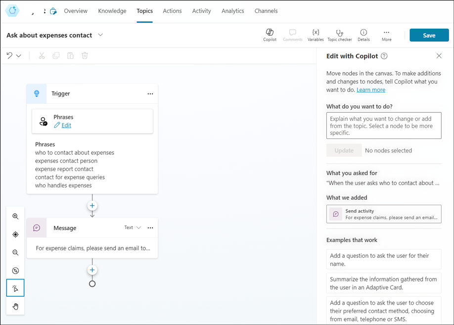

# **Laboratorio 3A - Creare il primo agente con Copilot Studio**

**Obiettivo:**

In questo laboratorio si procede alla creazione, al deployment e al test
del primo agente in grado di rispondere alle domande dei dipendenti
sulle politiche di spesa di un'azienda fittizia.

## **Esercizio 1: Creare il primo agente**

### **Attività 1: accedere per creare un agente**

1.  Da un browser, aprire l'url -
    +++https://copilotstudio.microsoft.com/+++.

2.  Accedere con le credenziali fornite nella scheda **Resources** della
    VM del laboratorio.

    

3.  Dal menu di sinistra, selezionare **Agents** e poi selezionare **+ New agent.**

    

4.  Inserite il seguente prompt.

    +++Create a copilot to help employees with expense claims.+++

    

5.  Aggiungete altre istruzioni come,

    - +++Use a friendly, professional tone+++. *(Usate un tono amichevole e
      professionale.)*
    
    - +++Avoid providing any tax advice+++. *(Evitare di fornire consulenza
      fiscale.)*

        

6.  Al termine, fare clic su **Create** in alto a destra per creare
    l'agente.

    

7.  Nel riquadro **Test your agent**, immettere il messaggio
    +++Hello+++. Esaminare la risposta, che dovrebbe essere un messaggio
    appropriato.

    

8.  Ora provate la seguente prompt: +++Who should I contact about
    submitting an expense claim?+++

    

    La risposta può essere appropriata, ma è piuttosto generica. In
un'organizzazione reale, si vorrebbe che l'agente fornisse un indirizzo
e-mail o un numero di telefono da contattare.

9.  Chiudere il riquadro **Test your agent**.

### **Attività 2: Gestire gli argomenti nel proprio agente**

1.  Selezionare **Topics** dal menu superiore dell'agente.

    

2.  Nella pagina Topics, nel menu **+ Add a topic**, selezionare
    Argomento > **Create from description with copilot.**

    

3.  Nella finestra di dialogo **Create a description with copilot**,
    nominare il nuovo argomento come +++Ask about expenses contact+++ e
    inserire il seguente testo per indicare a Copilot cosa deve fare
    l'argomento: +++When the user asks who to contact about expense claims, tell them to send an email to finance@contoso.com+++

4.  Selezionare **Create**.

    

5.  Viene creato un nuovo argomento chiamato **Ask about expenses
    contact** e aperto nell'area di disegno, dove dovrebbe assomigliare
    a questo..

    

    Il nuovo argomento dovrebbe essere attivato da frasi che richiedono un
contatto per le spese e rispondere con un messaggio che indica
all'utente di inviare un'e-mail all'indirizzo appropriato.

6.  Utilizzare il pulsante **Save** (in alto a destra) per salvare il
    nuovo argomento nel Copilot.

    

7.  Aprite il riquadro **Test** e inserite il seguente prompt

    +++Who should I contact about submitting an expense claim?+++

    

### **Attività 3: Pubblicare il Copilot**

Ora che si dispone di un Copilot funzionante, è possibile pubblicarlo
per consentirne l'utilizzo. I canali disponibili per la distribuzione
del copilot dipendono dal tipo di autenticazione che si desidera
utilizzare per limitarne l'accesso. In questo caso, si abilita l'accesso
a chiunque e si pubblica il copilot per utilizzarlo in una pagina web
dimostrativa.

1.  Nascondere il riquadro **Test your copilot**. Quindi, nella parte
    superiore della pagina, selezionare la scheda **Channels** ed
    esaminare i canali a cui è possibile distribuire il copilot. I
    canali disponibili dipendono dalle impostazioni di autenticazione
    del copilot.

    

2.  Selezionare **Settings** nella parte superiore della pagina.

    

3.  Nel riquadro **Settings**, nella pagina **Security**, selezionare
    **Authentication**. Selezionare l'opzione **No authentication** e
    **salvare** le modifiche alla configurazione.

    

4.  Chiudere il riquadro **Settings**. Quindi, visualizzare la pagina
    **Channels**.

5.  Nella parte superiore della pagina, selezionare **Publish**. Quindi,
    nella pagina **Publish**, selezionare **Publish** e pubblicare il
    Copilot. La pubblicazione richiederà circa un minuto.

    

    

6.  Dopo che il copilot è stato pubblicato, verificare lo **stato di
    pubblicazione** nella pagina **Channels**.

7.  Selezionare il canale **Demo website**. Si tratta di un canale
    appropriato per consentire agli utenti di testare il Copilot.

    

8.  Nel riquadro Demo website, inserire le seguenti impostazioni:

    Messaggio di benvenuto: +++Ask me about Expense claims+++
    
    Avviamento alla conversazione:
    
    ```
    
    "Hello"
    
    "Who should I contact with expense enquiries?"
    
    "What are the expense limits for flights?"
    ```

9.  Selezionare **Save** per salvare le impostazioni.

    

10. Quindi **copiare** negli appunti il link al sito web demo di
    Copilot.

    

11. In una nuova scheda del browser, navigare all'URL copiato per aprire
    il sito web dimostrativo, che dovrebbe avere un aspetto simile a
    questo.

    

**Sintesi**:

In questo laboratorio abbiamo imparato a creare e pubblicare un
agente.
