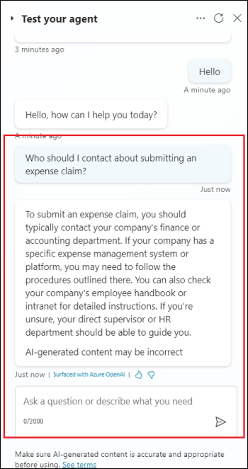

# Laboratorio 3A: costruzione del primo copilota con Copilot Studio

**Obiettivo:**

In questo laboratorio, si procede alla creazione, al deployment e al
test del primo Copilot per gestire una richiesta comune dei clienti.

## Esercizio 1: costruire il primo Copilot

### Attività 1: accedere per creare un Copilot

1.  Da un browser, aprire l'url -
    +++https://copilotstudio.microsoft.com/+++[.](https://copilotstudio.microsoft.com/+++)

2.  Accedere con le credenziali fornite nella scheda **Resources** della
    VM del laboratorio.

    

3.  Selezionare Copilot dal pannello di sinistra. Quindi fare clic su
    **+ New copilot**.

    

4.  Selezionare **Skip to configure**.

    

5.  Nella pagina Creare un Copilot, inserire il **nome +++** **Customer
    service +++** e fare clic su **Create**.

    

6.  Attendere la creazione del Copilot.

7.  Se non ci si trova nella pagina del copilot **del CustomerService**,
    fare clic su **Copilots** dal pannello di sinistra.

    

8.  Cliccare su **Customer service**.

    >[!Note] **Nota:** se la pagina non viene aggiornata automaticamente, aprire
nuovamente l'url +++*https://copilotstudio.microsoft.com/*+++ per
ottenere [l'elenco dei copilot creati in Microsoft Copilot
Studio.](https://copilotstudio.microsoft.com/+++)

    

### Attività 2: fare un rapido giro dell'interfaccia utente

### Attività 3: provare una conversazione nel riquadro Test Copilot (Ciao!)

Ora proviamo il bot utilizzando una delle quattro lezioni precostituite
incluse quando si crea un nuovo bot.

1.  Fare clic su **Test** per aprire il riquadro **Test your copilot**,
    se non è già aperto.

    

2.  Selezionare i tre punti nella finestra di dialogo **Test your
    copilot** disponibile sul lato destro. **Attivare** la **Track
    between topics**.

    

3.  Al prompt **Ask your question or describe what you need** nella
    parte inferiore del Copilot di prova, digitare: **+++Hello+++** e
    selezionare il pulsante **Send**.

Il Copilot offre un saluto nel riquadro Test copilot.

Inoltre, si apre la pagina Argomenti (indipendentemente dalla pagina in
cui ci si trovava prima) e si può vedere l'argomento di saluto aperto
nell'area di disegno, con un contorno verde e un segno di spunta
aggiunto per ogni parte del progetto di conversazione quando viene
utilizzato nella chat di prova. (Questo è ciò che fa la funzione di
tracciamento; se non è stata attivata, non si vedranno le modifiche alla
selezione della pagina e si vedranno le evidenziazioni verdi
nell'argomento di saluto solo se lo si è già aperto dalla pagina
Argomenti).

    

    >[!Note] **Nota:** se viene richiesto di selezionare l'opzione Consenti/blocca
a Copilot di vedere il testo e le immagini copiate, fare clic su
**Allow**.

    

4.  Nel Copilot di prova, inserite il seguente messaggio e premete Invia
    +++**stores near me+++**.

    Selezionare **Redmond**.

    Si noti che si apre un nuovo argomento nell'area di disegno. È stato
attivato uno degli argomenti precostituiti (Lezione 2).

    

5.  Osservate che il Copilot risponde con l'indirizzo del negozio di
    Redmond.

    

## Esercizio 2: Modificare la conversazione

Ora, modifichiamo questa conversazione aggiungendo un'altra posizione
del negozio. Facciamo prima una copia, in modo da poter tornare alle
Lezioni come sono state scritte, se lo si desidera.

### Attività 1: Fare una copia del tema

1.  Fare clic su **Test** nell'angolo in alto a destra per togliere di
    mezzo il Copilot di prova per il momento.

    

2.  Selezionare **Topics** dal menu in alto per aprire l'elenco
    **Topics.**

    

3.  Passare il mouse sulla riga dell'argomento precostruito **Lesson 2 -
    A simple topic with a condition and variable**. Selezionare l'icona
    **More actions**, quindi **Make a copy**.

    

    La pagina degli argomenti si apre con la versione copiata della lezione.

    

### Attività 2: modificare la copia dell'argomento

1.  Ora si trova la pagina di **Setup** dell'argomento copiato. In
    questa pagina si inserisce il **nome** dell'argomento (che appare ai
    clienti) e le **Trigger phrases**.

2.  Selezionate il testo corrente nel campo **Nome**, cancellatelo e
    digitate per rinominare l'argomento in +++**Get store
    locations+++**.

3.  Selezionare **Save** nell'angolo superiore destro della pagina.

    

4.  Immaginiamo di aver aperto un nuovo negozio a Bellevue. Per
    aggiungere le informazioni sul negozio al Copilot, è necessario
    modificare il progetto dell'argomento nell'area di disegno. L'area
    di disegno contiene tutto il testo e la logica della conversazione
    sulle sedi dei negozi. In alto, è presente un promemoria delle frasi
    di attivazione, che vengono aggiunte e modificate nella pagina
    **Setup**.

5.  Scorrete la pagina per vedere il design della conversazione.

    Ciascuna delle caselle collegate si chiama "nodo". Si può notare che il
Copilot visualizza un messaggio in un nodo **Message**, in cui afferma
di essere felice di aiutare a trovare un punto vendita, e poi chiede in
un nodo **Question** quale sia il punto vendita a cui l'utente è
interessato. (Si può riaprire il copilot di prova per vedere che la
conversazione è identica a quella dell'Esercizio 1). Quindi chiudere
nuovamente il copilot di prova).

6.  Scorrete fino al nodo Domanda che chiede "A quale località siete
    interessati?". Qui aggiungeremo un'altra opzione.

    >[!Note] **Nota:** se i nodi già esistenti presentano un **errore di confronto
di tipo incompatibile**, fare clic sul campo **Object** e selezionare
una posizione in un nodo (in base alla posizione nel nodo Messaggio
corrispondente), assicurandosi che tutte e 3 le posizioni esistenti
siano disponibili in un nodo condizione.

    

7.  Sotto "Redmond" "Seattle" "Kirkland", selezionare **+ New option**.

    

    Sotto il nodo Domanda viene aggiunto un nuovo nodo **Condition**.

8.  Nel nodo Domanda (**NON** nel nodo Condizione), digitate
    **+++Bellevue+++** nella casella vuota appena aggiunta sotto
    **Options for user**.

    **Bellevue** viene aggiunto automaticamente anche nel nodo Condizioni.

    

    >[!Note] [**Nota:** la sezione **Options for user** controlla quali pulsanti
sono visibili agli utenti nella finestra di chat e deve sempre essere
abbinata a una condizione, altrimenti il pulsante non funziona. Le
Condizioni, invece, possono gestire la digitazione da parte dell'utente
di qualcosa che non è mostrato in un pulsante. Per esempio, se si
dovesse eliminare il pulsante Bellevue **Options for user**, non si
eliminerebbe il nodo Condizione Bellevue, che verrebbe utilizzato se
l'utente digitasse "Bellevue" quando gli viene chiesto un luogo.

    Ora si indica al Copilot il messaggio da visualizzare se l'utente
seleziona **Bellevue**.

9.  Selezionare l'**icona +** sotto il nodo delle condizioni di
    Bellevue.

    

10. Tra le opzioni visualizzate, selezionare **Send a message**.

    

    Questo aggiunge un nuovo nodo Messaggio collegato alla condizione
Bellevue.

11. Nel nodo Messaggio, inserire le informazioni sulla posizione del
    negozio: +++ Our Bellevue store is in 1234 Bellevue Way, Bellevue,
    WA 98123+++.

    

    >[!Note] **Nota:** è possibile formattare il testo del messaggio utilizzando i
pulsanti di formattazione che appaiono durante la digitazione. È anche
possibile sostituire il nome della posizione con il valore della
variabile *pva_StoreLocation* utilizzando il controllo *{x}*.

    A questo punto, la conversazione verrà conclusa. Poiché la conversazione
termina allo stesso modo, indipendentemente dalla posizione scelta
dall'utente, ci collegheremo a un nodo condiviso **End of
conversation**. Questo nodo avvia l'argomento di sistema **End of
conversation**.

12. Per prima cosa, se necessario, ridurre lo zoom per vedere il nodo
    **End of conversation** sullo schermo. (Lo **zoom out** si trova
    nella barra delle utilità a sinistra dell'area di disegno).

    
    
    

13. In alto a destra della pagina, selezionare **Save** per salvare le
    modifiche apportate.

    

### Attività 3: Attivare l'argomento e testare le modifiche apportate

Si potrebbe ricordare che quando abbiamo creato una copia dell'argomento
della Lezione 2, la copia è stata creata in uno stato Off. Ciò significa
che non è possibile attivare l'argomento nel copilot di prova (e se si
pubblica il copilot, nemmeno gli utenti possono attivarlo). Ora siamo
pronti ad attivare l'argomento modificato.

1.  Selezionare la voce **Topics** dal menu in alto per tornare
    all'elenco degli argomenti.

    

2.  Selezionate la levetta **Status** da On a **Off** per la **Lesson
    2 - A simple topic with a condition and variable** e selezionate la
    levetta **Status** da Off a **On** per **Get store locations**. Ora
    è possibile testare la conversazione modificata.

    

    

3.  Fare clic su **Test** in alto a destra.

    

4.  Assicurarsi che la levetta **Track between topics** sia impostata su
    **On**.

    

5.  Nel Copilot di prova, inserite +++**Is there a store near me?**+++ e
    selezionate il pulsante **Send.**

    

    Si noti che, anche se non è esattamente uguale alle frasi di attivazione
dell'argomento, "C'è un negozio vicino a me?" funziona per attivare
l'argomento perché Microsoft Copilot Studio capisce che ha lo stesso
significato delle frasi di attivazione.

6.  Quando viene chiesto di selezionare una località, selezionare la
    località di **Bellevue** nella chat di prova. (Potrebbe essere
    necessario utilizzare la freccia destra sullo schermo per
    visualizzare l'opzione Bellevue).

    

Il Copilot risponde con le informazioni sulla posizione del negozio di
Bellevue. Si noti che la conversazione continua nell'argomento di
sistema **End of conversation**. Sentitevi liberi di continuare a
chattare con il copilot di prova.

    

## Esercizio 3: pubblicare il copilot sul sito demo per testarlo

Microsoft Copilot Studio fornisce un sito web dimostrativo che consente
di invitare chiunque a testare il copilot inviandogli l'URL. Questo sito
web dimostrativo è utile per raccogliere feedback e migliorare il
contenuto di Copilot prima di attivarlo per i clienti reali.

1.  Chiudere la sezione Test your Copilot selezionando l'icona **Test**
    in alto a destra.

    

2.  Selezionare **Settings**.

    

3.  Nel riquadro Impostazioni, nella pagina **Security**, selezionare
    **Authentication**.

    

4.  Assicurarsi che sia selezionata l'opzione **No authentication**. In
    caso contrario, selezionarla e fare clic su **Save** (confermando di
    voler abilitare l'accesso al Copilot per chiunque).

    

5.  Selezionare **Save** nella finestra di dialogo Salva questa
    configurazione? dialogo.

    

6.  **Chiudere** il riquadro Impostazioni.

    

7.  Fare clic su **Channels**.

    

8.  Nella parte superiore della pagina, selezionare **Publish**.

    

9.  Nella pagina **Publish**, selezionare **Publish** e pubblicare il
    Copilot. La pubblicazione richiederà circa un minuto.

    
    
    

10. Al termine della pubblicazione viene visualizzato un messaggio nella
    parte superiore dello schermo.

    

11. Dopo che il copilot è stato pubblicato, verificare **Publish
    status** nella pagina **Channels**.

    

12. Selezionare il canale **Demo website**. Si tratta di un canale
    appropriato per consentire agli utenti di testare il Copilot.

    

13. Fare clic sull'opzione **Start free trial**.

    

14. Fare nuovamente clic sull'opzione **Demo website**.

    

15. Nel riquadro del sito web demo, inserire il messaggio di benvenuto
    come **+++Ask me about the Stores+++** Selezionare **Save**.

    

16. Fare clic su **Copy** per copiare negli appunti il link al sito web
    demo di Copilot.

    

17. In una nuova scheda del browser, navigare all'URL copiato per aprire
    il sito web dimostrativo, che dovrebbe avere un aspetto simile a
    questo.

    

18. È possibile condividere l'URL del **demo website** con il proprio
    team.

**Sintesi:**

In questo laboratorio avete imparato a costruire, testare e pubblicare
un Copilot.
