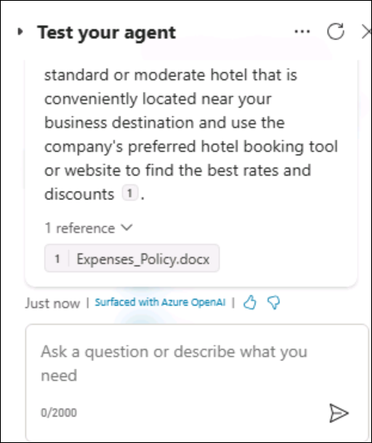
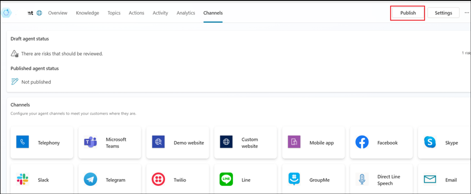

# **Lab 3A_Building your first copilot with Copilot Studio**

**Objective:**

In this lab, you go through the steps of creating, deploying, and
testing your first copilot to handle a common customer request.

## **Exercise 1: Build your first copilot**

### **Task 1: Sign in to create a copilot**

1.  From a browser, open the url -
     +++https://copilotstudio.microsoft.com/+++.

2.  Sign in with the Office 365 Tenant Credentials provided under the
    **Home** tab of your Lab VM.

3.  Select Copilots from the left pane. And then click on **+ New
    copilot**.

4.  Select **Skip to configure**.

5.  On the Create a copilot page, enter the **name** as +++**Customer
    service+++** and click on **Create**.

6.  Click on **Create**.

7.  Wait for the Copilot to get created.

8.  Click on **Skip** on the Welcome to Copilot Studio dialog.

9.  Click on **Copilots** from the left pane.

10. Click on **Customer service**.

**Note:** If the page does not get refreshed automatically, open the url
+++https://copilotstudio.microsoft.com/+++ again to get the created
copilot listed in the Copilot Studio.

### **Task 2: Take a quick tour of the user interface**

### **Task 3: Try out a conversation in the Test Copilot pane (Hello!)**

Now let's try out the bot using one of the four pre-built lessons
included when you create a new bot.

1.  Click on **Test** to open the **Test your copilot** pane if it’s not
    open already.

2.  Select the three dots in the **Test your copilot** dialog available
    at the right side. Toggle the **Track between topics** to switch it
    **on**.

3.  At the **Ask your question or describe what you need** prompt at the
    bottom of the Test copilot, type: +++**Hello**+++ and then select
    the **Send** button.

> The copilot offers a greeting in the Test copilot pane.
>
> Additionally, the **Topics** page opens (no matter which page you were
> on before) and you can see the greeting topic open in the authoring
> canvas window, with green outline and a checkmark added for each part
> of the conversation design when it's used in the test chat. (This is
> what the **Tracking** feature does; if you didn't turn this on, you
> don't see any changes to the page selection and you see the green
> highlights in the greeting topic only if you already opened it from
> the Topics page.)

**Note:** If there is a prompt which gives you the option to select
Allow/Block Copilot from seeing the copied text and images, click on
Allow.

4.  In the Test copilot, enter the following message and
    press Send +++**stores near me**+++.

> Select **Redmond**.
>
> Notice that a new topic opens in the authoring canvas. You have
> triggered one of the prebuilt topics (Lesson 2).
>
![]> (./media/image16.png)

5.  Observe that the copilot answers with a store address in the Redmond
    location.

> 

## **Exercise 2: Edit your conversation**

Now, let's make a change to that conversation by adding another store
location. We make a copy first so that later you can go back to the
Lessons as they were written if you want to.

### **Task 1: Make a copy of the topic**

1.  Click on **Test** at the top right corner to put the Test copilot
    out of your way for now.

2.  Select **Topics** from the menu items at the top to open
    the **Topics** list.

3.  Hover your mouse over the row for the prebuilt topic **Lesson 2 - A
    simple topic with a condition and variable**. Select the **More
    actions** icon, then **Make a copy**.

The Topics page opens with the copied version of the lesson.

### **Task 2: Edit the copy of the topic**

1.  You're now looking at the **Setup** page for the copied topic. This
    page is where you enter the topic **Name** (which appears to your
    customers) and the **Trigger phrases**.

2.  Select the current text in the **Name** field, delete it, and type
    to rename the topic to +++**Get store locations**+++.

3.  Select **Save** in the upper right corner of the page.

4.  Click on **Save** in the pop up.

> ![A blue square with a red square with a white text Description
> automatically (./media/image23.png)
>
> Let's imagine you opened a new store in Bellevue. To add the store
> info to your copilot, you need to edit the topic design in the
> authoring canvas. The authoring canvas contains all the text and logic
> for the conversation about store locations. At the top, you see a
> reminder of the trigger phrases, which are added and edited on
> the **Setup** page.

5.  Scroll down the page to see the conversation design.

> Each of the connected boxes you see is called a "node." You can see
> that the copilot displays a message in a **Message** node that it's
> happy to help find a store location and then asks in
> a **Question** node which location the user is interested in. (You can
> reopen the test copilot to see that this is the same as the
> conversation you had in Exercise 1. Then close the test copilot
> again.)

6.  Scroll to the Question node that asks "Which location are you
    interested in?" We're going to add another option here.

> **Note:** If the already existing nodes has got **Incompatible type
> comparison error**, click on the **Object** field and select one
> location in a node(based on the location in the corresponding Message
> node), ensuring that all the 3 existing locations are available in one
> condition node.
>

7.  Under "Redmond" "Seattle" "Kirkland," select **+ New option**.

A new **Condition** node is added under the Question node.

8.  In the Question node (**NOT** in the Condition node),
    type +++**Bellevue**+++ in the newly added empty box under **Options
    for user**.

**Bellevue** is automatically added for you in the Condition node too.

> **Note**
>
> The **Options for user** section controls what buttons are visible to
> users in the chat window, and always need to be matched with a
> condition, or the button won't work. The Conditions, however, can
> handle the user typing something that is not shown in a button. So for
> instance if you wereto delete the Bellevue **Options for
> user** button, it would not delete the Bellevue Condition node, which
> would be used if the user types "Bellevue" when asked for a location.

Now tell the copilot what message to display if the user
selects **Bellevue**.

9.  Select the **+ icon** underneath the Bellevue condition node.

10. From the options that appear, select **Send a message**.

This adds a new Message node connected to the Bellevue condition.

11. In the Message node, enter the store location info: +++Our Bellevue
    store is in 1234 Bellevue Way, Bellevue, WA 98123+++.

**Note**

> You can format the message text using the formatting buttons that
> appear while you're typing. You can even replace the name of the
> location with the value of the pva_StoreLocation variable by using the
> {*x*} control.
>
> You're now going to end the conversation. Since the conversation ends
> the same way no matter which location the user chose, we're going to
> link to a shared **End of conversation** node. This node starts
> the **End of conversation** system topic.

12. First, zoom out if necessary to see the **End of conversation** node
    on your screen. (**Zoom out** is in the utility bar on the left of
    the authoring canvas.)

11. At the top right of the page, select **Save** to save the changes
    you made.

### **Task 3: Turn on your topic and test your changes**

You might recall that when we made a copy of the Lesson 2 topic, the
copy was created in an Off state. This means you can't trigger the topic
in the test copilot (and if you published your copilot, your users
couldn't trigger it either). We're ready to turn on the edited topic
now.

1.  Select the **Topics** from the top menu list to return to the Topics
    list.

2.  Select the **Status** toggle from On to **Off** for **Lesson 2 - A
    simple topic with a condition and variable** and select
    the **Status** toggle from Off to **On** for **Get store
    locations**. Now, you can test the conversation you edited.

3.  Click on **Test** from the top right.

4.  Make sure the **Track between topics** toggle is set to
    the **On** position.

5.  In the Test copilot, enter +++**Is there a store near me?**+++ and
    select the **Send** button.

>
> Notice that even though it isn't exactly the same as the trigger
> phrases in the topic, "Is there a store near me?" works to trigger the
> topic because Microsoft Copilot Studio understands that it means the
> same thing as the trigger phrases.

6.  When asked to select a location, select the **Bellevue** location in
    the test chat. (You might need to use the onscreen right arrow to
    see the Bellevue option.)

>
> The copilot replies with location info for Bellevue store. Notice that
> the conversation continues in the **End of conversation** system
> topic. Feel free to keep chatting with the test copilot.
>

## **Exercise 3: Publish your copilot to the demo site for testing**

Microsoft Copilot Studio provides a demo website so that you can invite
anyone to test your copilot by sending them the URL. This demo website
is useful to gather feedback to improve the copilot content before you
activate the copilot for your real customers.

1.  Close the Test your Copilot by selecting the **Test** icon on the
    top right.

2.  Select **Settings**.

3.  In the Settings pane, on the **Security** page, select
    **Authentication**.

4.  Ensure that the option for **No authentication** is selected. If not
    select it and click on **Save** (confirming that you want to enable
    access to the copilot for anyone).

5.  **Close** the Settings pane.

6.  Click on **Channels**.

7.  At the top of the page, select **Publish**. 

9.  You see a message at the top of the screen when publishing is
    complete.

10. After your copilot has been published, verify the **Publish
    status** on the **Channels** page.

11. Select the **Demo website** channel. This is an appropriate channel
    for users to test your copilot.

12. In the Demo website pane, enter the Welcome message as +++**Ask me
    about the Stores**+++ Select **Save**.

13. Click on **Copy** to copy the link to your copilot demo website to
    the clipboard.

14. In a new browser tab, navigate to the URL you copied to open the
    demo website, which should look similar to this.

15. You can share the URL of the **demo website** with your team.

**Summary:**

In this lab, you have learnt to build, test and publish a copilot.
