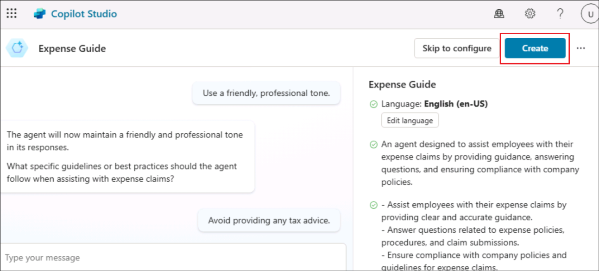
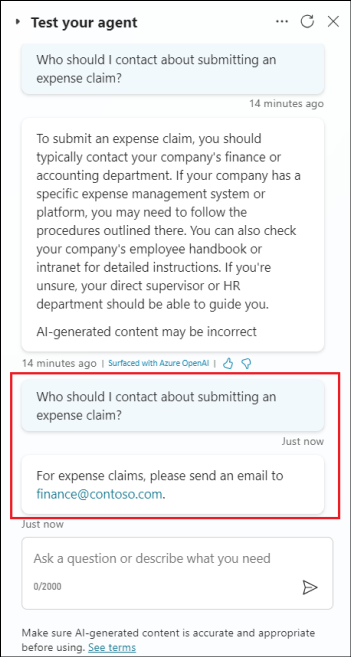
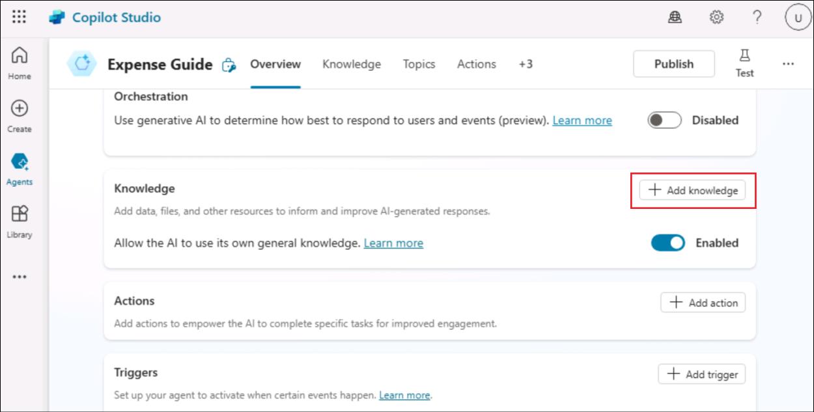
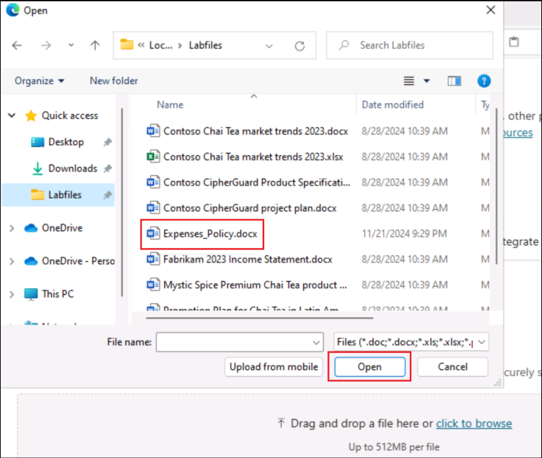
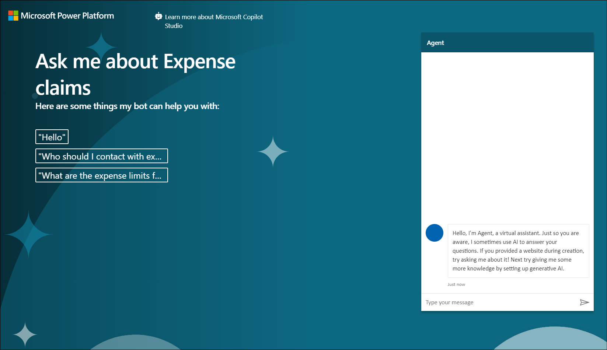

# **ラボ 3A - Copilot Studio を使用した最初のエージェントの構築**

**目的：**

このラボでは、架空の企業の経費ポリシーに関する従業員の質問に答えることができる最初のエージェントを作成、デプロイ、およびテストする手順を実行します。

## **演習 1: 最初のエージェントを作成する**

### **タスク 1: サインインしてエージェントを作成する**

1.  ブラウザから、URL -
    +++https://copilotstudio.microsoft.com/+++を開きます。

2.  ラボ VM の **\[Resources**\]
    タブで指定された資格情報でサインインします。

    

3.  ラボ 2A で作成した Dev env **環境を使用していることを確認します**
    。環境が存在しない場合は、**ラボ 2A の演習 2**
    をやり直してから、このラボの残りの演習を続行してください。

    

4.  左側のメニューから \[**Agents**\] を選択し、 **+ New
    agent\]を選択します。**

    

5.  次のプロンプトを入力します。

    +++Create a copilot to help employees with expense claims.+++

    

6.  次に、エージェントの名前を提案します。それを受け入れるか、選択に従って名前を変更するように指示します。

    

7.  次のようないくつかの指示をさらに追加します。

    - フレンドリーでプロフェッショナルな口調を使用してください。
    
    - 税金に関するアドバイスを提供することは避けてください。
  
      +++Use a friendly, professional tone+++

      +++Avoid providing any tax advice+++

    

8.  完了したら、右上の「**Create**」をクリックしてエージェントを作成します。

    

9.  エージェントが作成され、メッセージ「**Your agent is
    ready**」で開きます。

    

10. \[**Test your agent**\] ウィンドウで、プロンプト +++Hello+++
    を入力します。応答を確認します
    (適切なメッセージである必要があります)。

    

11. 次に、次のプロンプトを試してください - +++Who should I contact about submitting an expense claim?+++

    

    応答は適切かもしれませんが、かなり一般的です。実際の組織では、ユーザーが連絡する電話番号のメール
アドレスをエージェントに提供する必要があります。

12. **Test your agent** ウィンドウを閉じます。

### **タスク 2: エージェントのトピックを管理する**

1.  エージェントの上部メニューから \[Topics\] を選択します。

    

2.  \[Topics\] ページの **+ Add a topic**\] メニューで、 \[Topic\] \>
    \[Create from description with copilot\] を選択します。

    

3.  **Create a description with
    copilot**ダイアログボックスで、新しいトピックに +++Ask about
    expenses contact+++ という名前を付け、以下のテキストを入力して
    copilot にトピックの動作を指示します： +++When the user asks who to contact about expense claims, tell them to send an email to test <finance@contoso.com>+++ に電子メールを送信するよう伝えます。

4.  **Create** を選択します

    

5.  **Ask about expenses
    contact**」という名前の新しいトピックが作成され、オーサリングキャンバスで開かれます。

    

新しいトピックは、経費の連絡先について尋ねるフレーズによってトリガーされ、適切なアドレスに電子メールを送信するようにユーザーに指示するメッセージで応答する必要があります。

6.  **「Save** 」ボタン(右上)を使用して、新しいトピックをcopilotに保存します。

    

7.  **\[Test**\] ウィンドウを開き、次のプロンプトを入力します

    +++Who should I contact about submitting an expense claim?+++

    

### タスク 3: Generative AI 応答のナレッジ ソースを追加する

ユーザーが入力すると予想されるすべての入力に対してトピックを追加できますが、すべての質問を想定することは現実的には期待できません。現在、エージェントは*会話ブースティング*トピックを使用して言語モデルからAI応答を生成しますが、これにより一般的な回答が得られます。ジェネレーティブAIの応答をより*関連性の高い情報を提供するために*根拠となる知識のソースを提供する必要があります。

1.  \[**Test your agent**\] **ウィンドウを閉じ**
    てページをより簡単に表示し、\[**Overview**\]
    タブを選択し、\[**Knowledge** \]
    タブ**まで下にスクロールし**て、エージェントで定義されているナレッジ
    ソースを確認します (現在は存在しないはずです)。

    

2.  \+ **Add
    knowledgeを選択し**、エージェントに追加できる複数の種類のナレッジ
    ソースをメモします。

    

3.  \[**Upload files**\]セクションで、\[**click to
    browse**\]オプションを選択します。

    

4.  C:\Labfiles **に移動し**
    、**Expenses_Policy**ドキュメントをアップロードします。

    

5.  「**Add」をクリックして**、ドキュメントをナレッジソースとして追加します。

    

    **注**:
    ファイルをアップロードした後、インデックスが作成されるまで待つ必要があり、10分(またはそれ以上)かかる場合があります。

6.  ファイルの準備ができたら、\[**Topics**\]
    ページを表示し、**Conversational boosting**
    システムのトピックを開きます。このトピックは不明なインテントによってトリガーされ、アップロードしたファイルなどのナレッジを含むデータソースに基づいてgenerative
    AI応答を作成しようとします。

    **注**:
    追加したカスタムナレッジソースに関連する回答が見つからない場合、トピックでは言語モデルに固有のナレッジを使用して、より一般的な回答を提供する場合があります。トピックが返すgenerative
    AI 応答をより詳細に制御する場合は、検索を特定のナレッジ
    ストアに制限するように構成できます。

7.  **Test** ペインを展開し、会話を再開します。次に、次のプロンプトを入力します。

    +++What's the expense limit for a hotel stay?+++

    回答は、アップロードしたナレッジソースの情報に基づいており、引用文献を含める必要があります。

    

8.  次のようなフォローアップの質問をしてみてください。

    +++What about flights?+++

    +++What guidelines are there for entertainment expenses?+++

### **タスク 4: エージェントを公開する**

    これで機能するエージェントができたので、他のユーザーが使用できるように公開できます。エージェントを配信するために使用できるチャネルは、エージェントへのアクセスを制限するために使用する認証のタイプによって異なります。この場合は、すべてのユーザーに対してアクセスを有効にし、デモ
Web ページで使用するためにエージェントを公開します。

1.  **Test your agent** ウィンドウを非表示にします** 。

2.  ページの上部にある \[**Settings**\] を選択します。

    

3.  **Settings** ウィンドウの **\[Security**\]
    ページで、\[**Authentication\**] を選択します**。次に、\[**No authentication**\] のオプションを選択し 、
    設定への変更を保存します。

    

4.  \[**Settings**\] ウィンドウ** を閉じます。

5.  次に、ページの上部にある **\[Channels**\]
    タブを選択し、copilotをデプロイできるチャネルを確認します。使用可能なチャネルは、copilotの認証設定によって異なります。

    

6.  ページの上部にある **\[Publish\]** を選択します。次に、
    **\[Publish\]** ページで **Publish**
    を選択し、copilotを発行します。出版には1分ほどかかります。

    

    

7.  copilotが公開されたら、\[**Channels**\] ページで**Publish
    status** を確認します。

8.  **Demo
    website**チャネルを選択します。これは、ユーザーがcopilotをテストするのに適したチャネルです。

    

9.  プロンプトが表示されたら\[**Start free trial**\]をクリックし、\[チャンネル\]ページから\[デモWebサイト\]を再度クリックします。

    

10. デモ Web サイト ウィンドウで、次を入力します。

    歓迎メッセージ: +++Ask me about Expense claims+++
会話のきっかけ:

    ```
    "Hello"
    "Who should I contact with expense enquiries?"
    "What are the expense limits for flights?"
    ```


12. \[**Save**\] を選択して 設定を保存します。

    

12. 次に
    **、copilotのデモWebサイトへのリンクをクリップボード**にコピーします。

    

13. 新しいブラウザのタブで、コピーしたURLに移動してデモウェブサイトを開き、以下のように見えます。

    

**概要：** 
このラボでは、エージェントを作成して公開する方法と、エージェントにナレッジ ソースを追加する方法を学習しました

