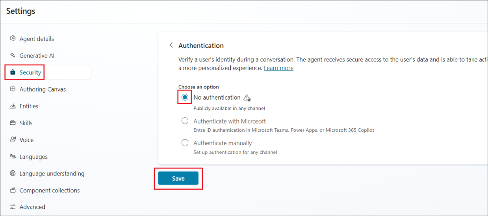

# **Lab 3A - Building your first agent with Copilot Studio**

**Objective:**

In this lab, you go through the steps of creating, deploying, and
testing your first agent that can answer employee questions about
expense policies in a fictional corporation.

## **Exercise 1: Build your first agent**

### **Task 1: Sign in to create an agent**

1.  From a browser, open the url -
    +++https://copilotstudio.microsoft.com/+++.

2.  Sign in with the credentials provided under the **Resources** tab of
    your Lab VM.

    

3.  Ensure that you are on the **Dev env** environment created in Lab
    2A. If the environment is not present, please redo **Exercise 2 of
    Lab 2A** and then continue with the remaining exercises of this lab.

    

4.  From the left menu, select **Agents** and then select **+ New agent**.

    

6.  Enter the following prompt.

    +++Create a copilot to help employees with expense claims.+++

    

7.  Next, it suggest a name for the agent. Accept it or instruct it to
    rename it as per your choice.

    

8.  Add few more instructions like,

    - Use a friendly, professional tone.
    
    - Avoid providing any tax advice.

    

9.  When you’re done, click on **Create** on the top right to create the
    agent.

    

10.  The agent gets created, and gets opened with a message, **Your agent
    is ready**.

    

11. In the **Test your agent** pane, enter the prompt +++Hello+++.
    Review the response, which should be an appropriate message.

    

12. Now try the following prompt - +++Who should I contact about submitting an expense claim?+++

    

    The response may be appropriate, but it’s fairly generic. In a real
organization, you’d want the agent to provide an email address of phone
number for the user to contact.

13. Close the **Test your agent** pane.

### **Task 2: Manage topics in your agent**

1.  Select Topics from the top menu of the agent.

    

2.  In the Topics page, in the **+ Add a topic** menu, select Topic **Create from description with copilot**.

    

3.  In the **Create a description with copilot** dialog box, name the new topic as +++Ask about expenses contact+++ and enter the following text to tell copilot what the topic should do: +++When the user asks who to contact about expense claims, tell them to send an email to test finance@contoso.com+++.

4.  Select **Create**.

    

5.  A new topic named **Ask about expenses contact** gets created and
    opened in the authoring canvas, where it should look similar to
    this.

    

    The new topic should be triggered by phrases that ask about a contact
for expenses, and respond with a message telling the user to send an
email to the appropriate address.

6.  Use the **Save** button (at the top right) to save the new topic in
    your copilot.

    

7.  Open the **Test** pane, and enter the following prompt

    +++Who should I contact about submitting an expense claim?+++

    

### Task 3: Add a knowledge source for Generative AI responses

You can add topics for all of the inputs that you expect a user to
enter; but you can’t realistically expect to anticipate every question
that will be asked. Currently, your agent uses a *Conversation
boosting* topic to generate AI responses from a language model, but this
results in generic answers. You need to provide a source of knowledge in
which the generative AI responses can be *grounded* to provide more
relevant information.

1.  Close the **Test your agent** pane to see the page more easily, then
    select the **Overview** tab and scroll down to the **Knowledge** tab
    to see the knowledge sources defined in your agent (currently there
    should be none).

    

2.  Select **+ Add knowledge**, and note the multiple types of knowledge
    source that you can add to your agent.

    

3.  In the **Upload files** section, select **click to browse** option.

    

4.  Navigate to **C:\Labfiles** and upload the **Expenses_Policy**
    document.

    

5.  Click on **Add** to add the document as the knowledge source.

    

    **Note**: After uploading the file, you will need to wait while it is indexed, which may take 10 minutes (or longer). Click on the **Knowledge** tab to check if the **Status** is still **in progress** or **Ready**.

6.  When the file is ready, view the **Topics** page and open
    the **Conversational boosting** system topic. Recall that this topic
    is triggered by an unknown intent, and then tries to create a
    generative AI response based on data sources containing knowledge,
    such as the file you uploaded.

    **Note**: If no relevant answer is found in the custom knowledge sources
you have added, the topic may use the knowledge inherent in the language
model to provide a more generic answer. You can configure the topic to
restrict its search to specific knowledge stores if you want greater
control over the generative AI responses it returns.

7.  Expand the **Test** pane and restart the conversation. Then enter
    the following prompt:

    +++What's the expense limit for a hotel stay?+++

    The response should be based on the information in the knowledge source
you uploaded, and include a citation reference.

    

8.  Try asking some follow-up questions, such as:

     +++What about flights?+++
    
     +++What guidelines are there for entertainment expenses?+++

### **Task 4: Publish your agent**

Now that you have a working agent, you can publish it for people to
use. The available channels through which you can deliver your agent
depend on the type of authentication you want to use to restrict access
to it. In this case, you’ll enable access for anyone and then publish
the agent for use in a demo web page.

1.  Hide the **Test your agent** pane.

2.  Select **Settings** at the top of the page.

    

3.  In the **Settings** pane, on the **Security** page,
    select **Authentication**. Then select the option for **No
    authentication** and **Save** the changes to the configuration.

    

4.  Close the **Settings** pane.

5.  Then, at the top of the page, select the **Channels** tab and review
    the channels to which you can deploy your copilot. The available
    channels depend on the authentication settings for your copilot.

    

6.  At the top of the page, select **Publish**. Then, on
    the **Publish** page, select **Publish**, and publish your copilot.
    Publishing will take a minute or so.

    

    

7.  After your copilot has been published, verify the **Publish
    status** on the **Channels** page.

8.  Select the **Demo website** channel. This is an appropriate channel
    for users to test your copilot.

    

9.  Click on **Start free trial** if prompted and click on Demo website
    from the Channels page again.

    

10. In the Demo website pane, enter the following settings:

    Welcome message: +++Ask me about Expense claims+++
    
    Conversation starters:

    ```
    "Hello"
    
    "Who should I contact with expense enquiries?"
    
    "What are the expense limits for flights?"\
    ```

11. Select **Save** to save the settings.

    

12. Then **Copy** the link to your copilot demo website to the
    clipboard.

    

13. In a new browser tab, navigate to the URL you copied to open the
    demo website, which should look similar to this.

    

**Summary:**

In this lab, we have learnt to create and publish an agent and adding a knowledge source to the agent.
