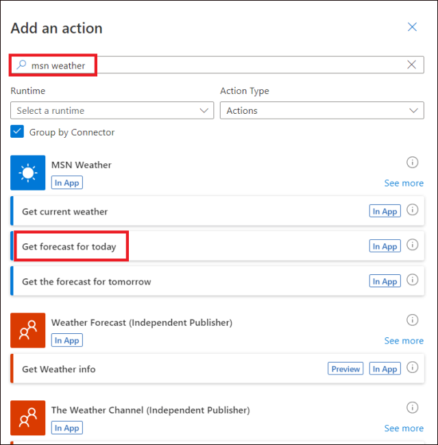
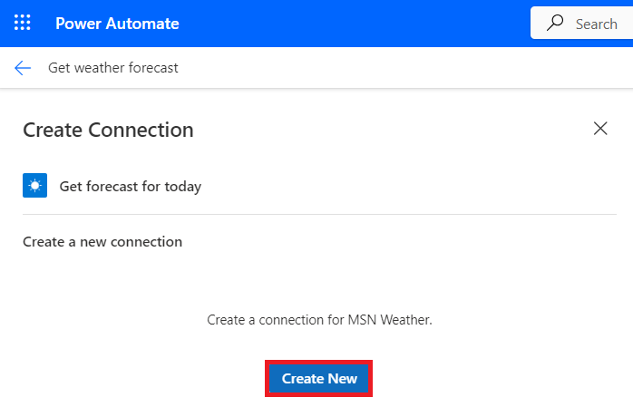
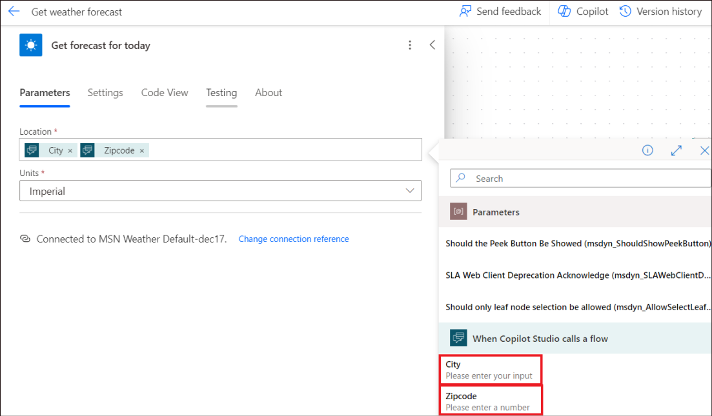
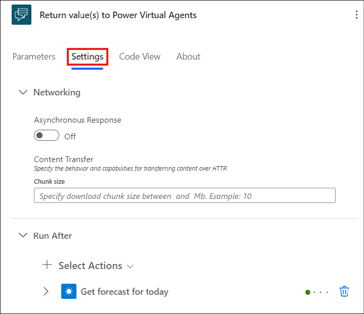

# Laboratorio 3B_Crear un flujo e invocarlo desde un tema Copilot

**Objetivo**

En este laboratorio, aprenderá a crear un flujo que obtenga una
previsión meteorológica y a utilizar un nodo Llamar a una acción en un
tema del Copilot para invocar el flujo cuando un cliente pregunte por el
tiempo.

**Duración:** 30 minutos

## Ejercicio 1: Crear un flujo para utilizarlo con un Copilot

1.  Inicie sesión en
    +++**https://copilotstudio.microsoft.com/**+++    con sus credenciales de usuario si aún no lo ha hecho.

2.  Abra el Copilot **de Customer Service**.

    

3.  Haga clic en **Topics**, abra el tema – **Get store locations**.

    

4.  Haga clic en el símbolo + para añadir un nodo después de cualquier
    nodo existente, seleccione **call an action** y luego **Create a
    flow**.

    >[!Note]**\[Nota:** Esta acción no añadirá nada aquí, sólo abrirá la página de
creación de flujo en Power Automate con la plantilla adecuada.

    

5.  El Power Automate se abre con la plantilla básica necesaria para un
    Copilot.

    

## Ejercicio 2: Crear el flujo en el portal de Power Automate

1.  Nombra el flujo que se acaba de abrir como, +++**Get weather forecast**+++

    

2.  Haga clic en el nodo **When Copilot Studio calls a flow**. En el
    panel de detalles del nodo que se abre, haga clic en **+ Add an
    input**.

    

3.  Elija una entrada de **Text** y nómbrela como **+++City+++**.

    

4.  Haga clic en **+ Add an input** para añadir otro campo de entrada.

    

5.  Seleccione una entrada **numérica** y nómbrela como
    **+++Zipcode+++**. Haga clic en el símbolo **de retroceso (\<\<)**
    de la esquina derecha para salir del panel de detalles del nodo.

    
    
    

7.  Haga clic en **Add an action**  a un nodo de adición después de
    **When Copilot Studio calls a flow** nodo.

    

8.  Busca +++**msn** **weather+++** y selecciona **Get forecast for
    today** en **MSN Weather**.

    

    >[!Note] **\[Nota:** Si se le pide que cree una nueva conexión, seleccione **Create new**.

    

8.  En la acción **Get forecast for today**, en el cuadro **Location**,
    seleccione **Add dynamic content** y, a continuación, seleccione
    **City** y **Zipcode**.

    

    

9.  **City** y el **Zipcode** se pasarán a este nodo como entrada.

    

10. Haga clic en **Return value(s) to Power Virtual Agents**. En el
    panel de detalles del nodo que se abre, haga clic en **+ Add an
    output**.

    

11. En la pestaña Return value(s) to Microsoft Copilot
    Studio **Parameters**, añada los siguientes parámetros y variables
    de salida.

    |    |    |    |
    |:-----|:----|:------|
    |  Output Parameter Name  |   Type | Variable   |
    | +++day_summary+++   |  Text  |    Day Summary|
    | +++Location+++   |  Text  | Location|
    |  +++chance_of_rain+++  |  Number  | Day Rain Chance|

    **\[Nota:** Seleccione **Add dynamic content**, haga clic en **See
    more** junto a **Get forecast for today** para ver las opciones
    variables anteriores.

    

    

    

13. Haga clic en **Save draft** para guardar el flujo.

    

14. Busque un mensaje de éxito como en la siguiente captura de pantalla.

    

15. Haga clic en **Publish** y busque un mensaje de éxito.

    

    

## Ejercicio 3: Desactivar las respuestas asíncronas en el flujo

Los flujos que quiera utilizar en un bot deben devolver valores en
tiempo real, o de forma sincrónica. Los flujos que se ejecutan en
segundo plano, o de forma asíncrona, pueden provocar un error cuando su
bot intente ejecutarlos. En lugar de ejecutar el flujo, el bot dirá: "
Something unexpected happened. We're looking into it. Error code: 3000."

Al crear un flujo desde Microsoft Copilot Studio, **las respuestas
asíncronas** están desactivadas por defecto. Si ha modificado un flujo
existente que tiene activadas las respuestas asíncronas, deberá cambiar
la configuración.

1.  Seleccione la pestaña **Settings** en el panel **Return value(s) to
    Power Virtual Agents**.

    

2.  Asegúrese de que la respuesta asíncrona está **desactivada**.

    

## Ejercicio 4: Llamar a un flujo desde un tema

1.  Vuelva a la página de Microsoft Copilot Studio, seleccione **Done**
    en la ventana emergente **Save and refresh**.

    

2.  Seleccione **Topics**. Haga clic en **+ Add -\> Topic -\> From
    blank**.

    

3.  Nombre el tema como +++**Get weather+++**. Haga clic en **Edit**
    bajo Phrases para añadir las frases desencadenantes.

    

4.  Añade las siguientes **frases desencadenantes**:

    - +++**will it rain**+++

    - +++**today's forecast**+++

    - +++**get weather**+++

    - +++**what's the weather**+++

    Introduzca la frase y haga clic en el símbolo **+** para añadirla.

    

    Del mismo modo, añada también las demás frases.

    

5.  Después del nodo Trigger, añade un nodo **Message** e introduce el
    mensaje como **+++I can help you with that+++**.

    

6.  A continuación, añada un nodo **Add a question**.

    

7.  Añade la pregunta +++**What is your city?**+++

    |  **Property**  |  **Value**  |
    |:----------|:----------|
    |  Question  |  +++What is your city?+++  |
    |  Identify  |   Select **User’s entire response** |
    |  Save Response as  | Click on **Var1** to open the Variable properties tab and provide the variable name as +++**city**+++   |

    

8.  Añade otro nodo de pregunta y proporciona los siguientes detalles.

    |  **Property**  |  **Value**  |
    |:----------|:----------|
    |  Question  |  +++What is your Zipcode?+++  |
    |  Identify  |   Select **Number** |
    |  Save Response as  | Click on **Var1** to open the Variable properties tab and provide the variable name as +++**Zipcode**+++   |

    

9.  Seleccione **Add node** (**+**) bajo el nodo de pregunta
    **Zipcode**. En la ventana de selección de nodos, seleccione **Call
    an action** y, a continuación, seleccione el flujo que creó
    anteriormente, **Get weather forecast**.

    

10. Asigne las entradas de flujo a las variables de salida de los nodos
    de la pregunta. **City (text)** obtiene su valor de la variable
    **city** y **Zipcode (número)** obtiene su valor de la variable
    **Zipcode**.

    

11. Debajo del nodo de flujo, añada un nodo de **Message** y, a
    continuación, introduzca un mensaje que utilice las salidas del
    flujo como se indica a continuación.

    +++Today's forecast for+++ < Select X and choose location > +++:+++  < Select X and choose day_summar y> +++Chance of rain is+++ < Select X and choose chance_of_rain. >

    

13. Haga clic en **Save** para guardar el tema.

    

## Ejercicio 5: Ponga a prueba la fluidez y el tema

1.  En **Test your Copilot**, type +++**get weather**+++ y haga clic en
    enviar. Introduce la ciudad **+++Redmond+++** y **el código postal
    +++98004+++** según las preguntas del Copilot.

    

2.  Tras enviar el código postal, se invocará su flujo y el copiloto le
    proporcionará los detalles meteorológicos de la región específica.

    

**Resumen:**

En este laboratorio, hemos aprendido a crear un flujo e invocarlo desde
un tema.
