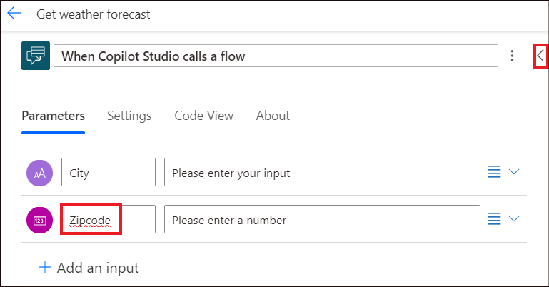
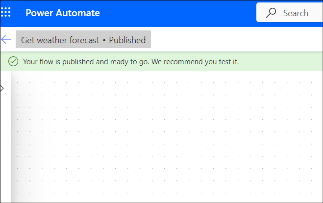

# Laboratorio 3B - Creare un flusso e richiamarlo da un argomento Copilot

**Obiettivo**

In questo laboratorio, imparerete a creare un flusso che recupera le
previsioni del tempo e a utilizzare un nodo Call an action in un
argomento Copilot per invocare il flusso quando un cliente chiede
informazioni sul tempo.

**Durata:** 30 minuti

## Esercizio 1: Creare un flusso da utilizzare con un Copilot

1.  Accedere a
    +++**https://copilotstudio.microsoft.com/**+++
    utilizzando le proprie credenziali utente se non si è già effettuato
    il login.

2.  Aprire il agent **Agent**.

    

3.  Cliccate su **Topics**, aprite l'argomento - **Ask about expenses contact**.

    

4.  Fare clic sul simbolo + per aggiungere un nodo dopo un nodo
    esistente, selezionare **call an action** e quindi **Create a
    flow**.

    >[!Note] [**Nota:** questa azione non aggiungerà nulla qui, ma aprirà solo la
pagina di creazione del flusso su Power Automate con il modello
appropriato.

    

5.  Power Automate viene aperto con il modello di base richiesto per un
    Copilot.

    

## Esercizio 2: Autorizzare il flusso sul portale Power Automate

1.  Nominare il flusso che è stato appena aperto come, **+++Get weather
    forecast**+++.

    

2.  Fare clic sul nodo **When Copilot Studio calls a flow**. Nel
    riquadro dei dettagli del nodo che si apre, fare clic su **+ Add an
    input**.

    

3.  Scegliere un input di **Text** e denominarlo **+++City+++**.

    

4.  Fare clic su **+ Add an input** per aggiungere un altro campo di
    input.

    

5.  Selezionare un input **Number** e denominarlo +++**Zipcode**+++.
    Fare clic sul simbolo **back (<)** nell'angolo destro per uscire
    dal riquadro dei dettagli del nodo.

    

6.  Fare clic su **Add an action** a un nodo add dopo il nodo **When
    Copilot Studio calls a flow**.

    

7.  Cercate +++**msn weather**+++ e selezionate **Get forecast for
    today** sotto **MSN Weather**.

    

    >[!Note] [**Nota:** se viene richiesto di creare una nuova connessione,
selezionare **Create New**.

    

8.  Nell'azione **Get forecast for today**, nella casella **Location**
    selezionare **Add dynamic content**, quindi selezionare **City** e
    **Zipcode**.

    
    
    

9.  **City** e **Zipcode** saranno passati a questo nodo come input.

    

10. Fare clic su nodo **Return value(s) to Power Virtual Agents**. Nel
    riquadro dei dettagli del nodo che si apre, fare clic su **+ Add an
    output**.

    

11. Nella scheda **Parameters** di Microsoft Copilot Studio, aggiungere
    i seguenti parametri e variabili di uscita.

	| Nome del parametro di uscita	| Tipo	| Variabile
	|:------|:-------|:------|
	|+++day_summary+++	|	Text |	Day Summary |
	|	+++Location+++|	Text |	Location |
	|	+++chance_of_rain+++| Text	| Day Rain Chance	|

    >[!Note] **Nota:** selezionare **Add dynamic content**, fare clic su **See
    more** accanto a **Get forecast for today** per vedere le opzioni
    variabili di cui sopra.

    

    
    
    

16. Fare clic su **Save Draft** per salvare il flusso.

    

17. Cercate un messaggio di successo come nella schermata sottostante.

    

18. Fare clic su **Publish** e cercare un messaggio di successo.

    
    
    

## Esercizio 3: Disattivare le risposte asincrone nel flusso

I flussi da utilizzare in un bot devono restituire valori in tempo
reale, o in modo sincrono. I flussi eseguiti in background, o in modo
asincrono, possono causare un errore quando il bot tenta di eseguirli.
Invece di eseguire il flusso, il bot dirà: "È successo qualcosa di
imprevisto. Stiamo verificando. Codice di errore: 3000."

Quando si crea un flusso da Microsoft Copilot Studio, le **asynchronous
responses** sono disattivate per impostazione predefinita. Se si
modifica un flusso esistente in cui le risposte asincrone sono attivate,
è necessario modificare l'impostazione.

1.  Selezionare la scheda **Settings** nel riquadro **Return value(s) to
    Power Virtual Agents**.

    

2.  Assicurarsi che la risposta asincrona sia impostata su **Off**.

    

## Esercizio 4: Chiamare un flusso da un argomento

1.  Tornare alla pagina di Microsoft Copilot Studio, selezionare
    **Done** su **Save & refresh**.

    

2.  Selezionare **Topics**. Fare clic su **+ Add -\> Topic -\> From
    blank**.

    

3.  Assegnare all'argomento il nome di +++**Get weather**+++. Fare
    clic su **Edit** sotto Phrases per aggiungere le frasi di
    attivazione.

    

4.  Aggiungete le seguenti **frasi di attivazione**:

    - +++**will it rain**+++

    - +++**today's forecast**+++

    - +++**get weather**+++

    - +++**what's the weather**+++

 	Inserite la frase e cliccate sul simbolo **+** per aggiungerla.

    

    Allo stesso modo, aggiungete anche le altre frasi.
    
    

5.  Dopo il nodo Trigger, aggiungete un nodo **Message** e inserite il
    messaggio come **+++I can help you with that+++**.

    

6.  Quindi, aggiungere un nodo **Ask a question**.

    

7.  Aggiungete la domanda +++**What is your city?**+++

	| Proprietà	| Valore	|
	|:-------|:------|
	| Question	|+++What is your city?+++	|
	|	Identify | Selezionare User’s entire response	|
	| Save Response as		| Fare clic su Var1 per aprire la scheda Proprietà della variabile e fornire il nome della variabile come +++city+++.|

    

9.  Aggiungere un altro nodo di domanda e fornire i seguenti dettagli.

    | Proprietà	| Valore	|
	|:-------|:------|
	| Question	| +++What is your Zipcode?+++	|
	|	Identify | Selezionare Number	|
	| Save Response as		| Fare clic su Var1 per aprire la scheda Proprietà variabile e fornire il nome della variabile come +++Zipcode+++.|

    

11. Selezionare **Add node (+)** sotto il nodo Domanda **Zipcode**.
    Nella finestra di selezione dei nodi, selezionare **Call an
    action**, quindi selezionare il flusso creato in precedenza, **Get
    weather forecast**.

    

12. Assegnare gli input del flusso alle variabili di output dei nodi
    domanda. **City (text)** riceve il valore dalla variabile **city** e
    **Zipcode (numero)** riceve il valore dalla variabile **Zipcode**.

    

13. Sotto il nodo del flusso, aggiungere un nodo **Message**, quindi
    inserire un messaggio che utilizzi le uscite del flusso, come
    indicato di seguito.

    +++Today's forecast for+++ < Select X and choose location > +++:+++  < Select X and choose day_summar y> +++Chance of rain is+++ < Select X and choose chance_of_rain. >

    

13. Fare clic su **Save** per salvare l'argomento.

    

## Esercizio 5: Test del flusso e dell'argomento

1.  In **Test your Copilot**, digitare +++**get** **weather+++** e fare
    clic su invia. Indicare la città **+++Redmond+++** e il **Zipcode
    +++98004+++** come richiesto dal Copilot.

    

2.  Dopo aver inviato il codice di avviamento postale, il flusso verrà
    richiamato e il Copilot fornirà i dettagli meteo della regione
    specifica.

    

**Sintesi:**

In questo laboratorio abbiamo imparato a creare un flusso e a
richiamarlo da un argomento.
