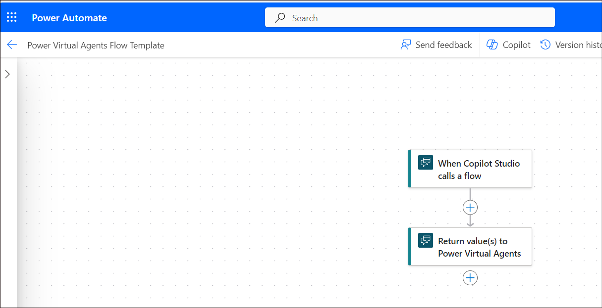
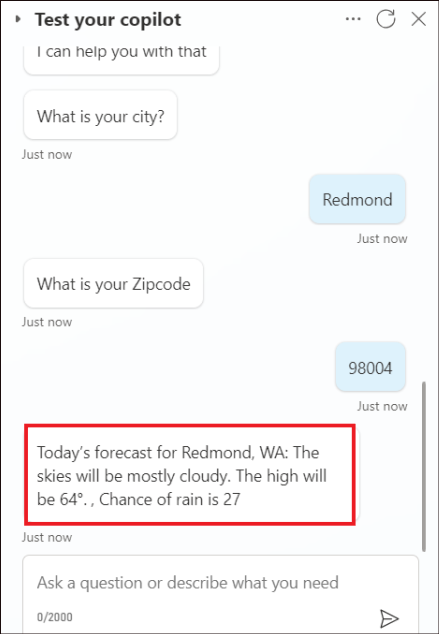

# **Lab 3B_Create a flow and invoke it from a copilot topic**

**Objective**

In this lab, you will learn how to create a flow that fetches a weather
forecast and use a Call an action node in a copilot topic to invoke the
flow when a customer asks about the weather.

**Duration:** 30 minutes

## Exercise 1: Create a flow to use with a copilot

1.  Login to +++**https://copilotstudio.microsoft.com/**+++ using your
    user credentials if not logged in already.

2.  Open the **Customer service** copilot.

    

3.  Click on **Topics**, open the topic – **Get store locations**.

    

4.  Click on + symbol to add a node after any existing node, select
    **call an action** and then **Create a flow**.

    >[!Note] **Note:** This action will not add anything here but will only open the flow creation page on Power Automate with the proper template.

    

5.  The Power Automate is opened with the basic template required for a
    Copilot.

    

## Exercise 2: Author the flow on the Power Automate portal

1.  Name the flow that just got opened as, +++**Get weather
    forecast**+++

    

2.  Click on the node, **When Copilot Studio calls a flow**. In the node
    details pane that opens, click on **+ Add an input**.

    

3.  Choose a **Text** input and name it as +++**City**+++.

    

4.  Click on **+ Add an input** to add another input field.

    

5.  Select a **Number** input and name it as +++**Zipcode**+++. Click on
    the **back(<<)** symbol on the right corner to come out of the node
    details pane.

    

6.  Click on **Add an action** to a add node after the **When Copilot
    Studio calls a flow** node.

    

7.  Search for +++**msn weather**+++ and select **Get forecast for
    today** under **MSN Weather**.

    

    >[!Note] **Note:** If asked to create a new connection, select **Create New**.

    

8.  In the **Get forecast for today** action, in the **Location** box,
    select **Add dynamic content**, and then
    select **City** and **Zipcode**.

    

    

9.  **City** and **Zipcode** will be passed on to this node as input.

    

10. Click on **Return value(s) to Power Virtual Agents** node. In the
    node details pane that opens, click on **+ Add an output**.

    

11. In the Return value(s) to Microsoft Copilot Studio **Parameters** tab, add the following output parameters and variables.

    |    |    |    |
    |:-----|:----|:------|
    |  Output Parameter Name  |   Type | Variable   |
    | +++day_summary+++   |  Text  |    Day Summary|
    | +++Location+++   |  Text  | Location|
    |  +++chance_of_rain+++  |  Text  | Day Rain Chance|
    
    >[!Note] **Note:** Select **Add dynamic content**, click on **See more** next to **Get forecast for today** to see the above variable options

    

    

    

12. Click on **Save Draft** to save the flow.

    

13. Look for a success message as in the screenshot below.

    

14. Click on **Publish** and look for a success message.

    

    

**Exercise 3: Turn off asynchronous responses in the flow**

    Flows that you want to use in a bot must return values in real time, or synchronously.
Flows that run in the background, or asynchronously, may cause an error
when your bot tries to run them. Instead of running the flow, the bot
will say, "Something unexpected happened. We're looking into it. Error
code: 3000."

    When you create a flow from Microsoft Copilot Studio, **asynchronous
responses** are turned off by default. If you modified an existing flow
that has asynchronous responses turned on, you'll need to change the
setting.

1.  Select the **Settings** tab in the **Return value(s) to Power
    Virtual Agents** pane.

    

2.  Ensure that Asynchronous response is set to **Off**.

    

## Exercise 4: Call a flow from a topic

1.  Go back to Microsoft Copilot Studio page, select **Done** on **Save
    & refresh** pop up.

    

2.  Select **Topics**. Click on **+ Add -\> Topic -\> From blank**.

    

3.  Name the topic as +++**Get weather**+++. Click on **Edit** under
    Phrases to add in the Trigger phrases.

    

4.  Add the following **trigger phrases**:

    - +++**will it rain**+++
    
    - +++**today's forecast**+++
    
    - +++**get weather**+++
    
    - +++**what's the weather**+++

    Enter the phrase and then click on **+** symbol to add it.

    

    Similarly, add the other phrases as well.

    

5.  After the Trigger node, add a **Message** node and enter the message
    as +++**I can help you with that**+++.

    

6.  Next, add an **Ask a question** node.

    

7.  Add the question +++**What is your city?**+++

    |  **Property**  |  **Value**  |
    |:----------|:----------|
    |  Question  |  +++What is your city?+++  |
    |  Identify  |   Select **User’s entire response** |
    |  Save Response as  | Click on **Var1** to open the Variable properties tab and provide the variable name as +++**city**+++   |

    

9.  Add another question node and provide the following details.

    |  **Property**  |  **Value**  |
    |:----------|:----------|
    |  Question  |  +++What is your Zipcode?+++  |
    |  Identify  |   Select **Number** |
    |  Save Response as  | Click on **Var1** to open the Variable properties tab and provide the variable name as +++**Zipcode**+++   |

    

10.  Select **Add node** (**+**) under the **Zipcode** question node.

    In the node selection window, select **Call an action**, and then select the flow you created earlier, **Get weather forecast**.

    

11. Assign the flow inputs to the output variables from the question
    nodes. **City (text)** gets its value from the variable **city** and
    **Zipcode (number)** gets its value from the variable **Zipcode**.

    

12. Under the flow node, add a **Message** node, and then enter a
    message that uses the flow's outputs as below.

    +++Today's forecast for+++ <Select X and choose location> +++:+++  <Select X and choose day_summary> +++Chance of rain is+++ <Select X and choose chance_of_rain.>+++
    
   

13. Click on **Save** to save the topic.

    

## Exercise 5: Test your flow and topic

1.  In **Test your Copilot**, type +++**get weather**+++ and click send.
    Give the City as +++**Redmond**+++ and **Zipcode** as
    +++**98004**+++ as per the questions from the copilot.

    

2.  After sending the Zipcode, your flow will be invoked and the weather
    details of the specific region is provided by the copilot.

    

**Summary:**

In this lab, we have learnt to create a flow and invoke it from a topic.
