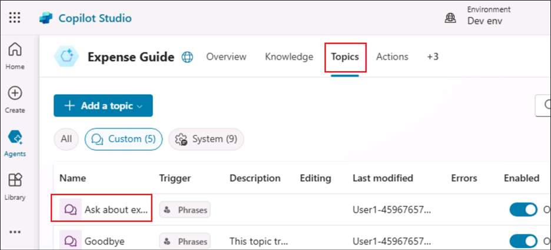

# Lab 3B_フローを作成して Copilot トピックから呼び出す

**目的**

この実習ラボでは、天気予報をフェッチするフローを作成し、Copilot
トピックで Call an action
ノードを使用して、顧客が天気について質問したときにフローを呼び出す方法を学習します。

**所要時間**30分

## 練習1：Copilotで使用するフローを作成する

1.  まだログインしていない場合は、ユーザー認証情報を使用して
    [+++https://copilotstudio.microsoft.com/+++](https://copilotstudio.microsoft.com/**+++)
    にログインしてください。

2.  ラボ 3A **で作成したエージェントを開きます**。

    

3.  \[**Topics**\]**をクリックし**、トピックを開いて– **expenses
    contactについて尋ねます。**

    

4.  既存のノードの後にノードを追加するには、+マークをクリックし、**アクションを呼び出すを**選択し、**フローを作成します**。

    [注意: このアクションはここには何も追加せず、Power Automateのフロー作成ページを適切なテンプレートで開くだけです。

    

5.  Copilot に必要な基本テンプレートで Power Automate を開きます。

    

## 練習2：Power Automateポータル上でフローを作成する

1.  オープンしたばかりのフローに、+++**Get weather
    forecast+++という**名前をつける。

    

2.  **Copilot
    Studioがフローを呼び出すときに**、ノードをクリックします。開いたノードの詳細ペインで、**+
    Add an input** をクリックします。

    

3.  **テキスト**入力を選択し、名前を**「++**City+++」とする。

    

4.  **入力**フィールドを追加するには、**「+ Add an
    input**」をクリックします。

    

5.  **Number**入力を選択し、名前を「++**Zipcode**+++」とする。右隅にある**戻る(\<\<)**マークをクリックして、ノードの詳細ペインから出ます。

    

6.  **Copilot Studioがフロー**ノードを**呼び出したら**、\[**Add action**
    to a add node\]をクリックします。

    

7.  **+++msn weather+++を**検索し、**MSN Weatherの**下の**Get forecast
    for todayを**選択する。

    

    [注意：新しい接続を作成するよう求められたら、"Create New "を選択してください。

    

8.  **今日の予報を取得する**アクションで、**場所**ボックスで**ダイナミックコンテンツを追加を**選択し、都市と**郵便番号を**選択する。

    

    

9.  **市区**町村と**郵便**番号は入力としてこのノードに渡される。

    

10. **Power Virtual Agents** ノードの **\[Return value(s)\]
    を**クリックします。開いたノードの詳細ペインで、\[**+ Add an
    output\]** をクリックします。

    

11. Microsoft Copilot Studio
    **Parametersへの**戻り値\]タブで、以下の出力パラメータと変数を追加します。

    |  出力パラメータ名  | タイプ   |  可変  |
    |:----|:-----|:-------|
    |  +++day_summary+++  |  テキスト  | 一日のまとめ   |
    |  +++Location+++  |  テキスト  | 所在地   |
    |  +++chance_of_rain+++  |  テキスト  | 降水確率   |

    [注】注：ダイナミックコンテンツの追加を選択し、今日の予報を入手するの隣にある詳細を見るをクリックすると、上記の変数オプションが表示されます。

    

    

    

12. **Save Draftを**クリックしてフローを保存する。

    

13. 下のスクリーンショットのような成功のメッセージを探してください。

    

14. **Publishを**クリックし、成功のメッセージを確認する。

    

    

## 練習3：フローの非同期応答をオフにする

ボットで使用するフローは、リアルタイム（同期）で値を返す必要があります。バックグラウンドで実行されるフローや非同期で実行されるフローは、ボットが実行しようとするとエラーが発生する可能性があります。フローを実行する代わりに、ボットは「予期しないことが発生しました。現在調査中です。エラーコードは3000."

Microsoft Copilot
Studioからフローを作成する場合、**非同期**応答はデフォルトでオフに設定されています。非同期応答がオンになっている既存のフローを変更した場合は、設定を変更する必要があります。

1.  **Power Virtual Agents
    への戻り値］**ペインの**［設定］**タブを選択します。

    

2.  Asynchronous responseが**Offに**設定されていることを確認する。

    

## 練習 4: トピックからフローを呼び出す

1.  Microsoft Copilot Studioページに戻り、**\[Save &
    refresh\]**ポップアップで\[**Done\]**を選択します。

    

2.  **トピックを**選択します。**追加」→「トピック」→「空白から**」をクリックします。

    

3.  トピック名を「+++Get **weather+++」と**する。フレーズ\] の
    \[**編集\] を**クリックして、トリガー・フレーズを追加します。

    

4.  以下の**トリガーフレーズを**追加する：

    - +++will it rain+++

    - +++today's forecast+++

    - +++get weather+++

    - +++what's the weather+++

    フレーズを入力し、**+**マークをクリックして追加します。

    

    同様に、他のフレーズも加える。

    

5.  Triggerノードの後に**Message**ノードを追加し、「++++I **can help you
    with that+++」と**メッセージを入力する。

    

6.  次に、**Ask a question**ノードを追加します。

    

7.  **あなたの都市はどこですか？**

    |  プロパティ  |  価値  |
    |:-------|:--------|
    |  質問  |  +++What is your city?+++  |
    |  特定する  |  ユーザーの回答全体を選択  |
    | 応答を名前を付けて保存   |   Var1 をクリックして変数プロパティタブを開き、変数名を +++city+++ とする。 |

    

8.  別の質問ノードを追加し、以下の詳細を記入してください。

    |  プロパティ  |  価値  |
    |:-------|:--------|
    |  質問  |  +++What is your Zipcode?+++  |
    |  特定する  |  番号を選択  |
    | 応答を名前を付けて保存   |  Var1をクリックして変数プロパティタブを開き、変数名を+++Zipcode+++とする。 |

    

9.  **郵便番号の**質問ノードの下で**ノードの追加**（+）を選択します。ノード選択ウィンドウで、［**アクションを呼び出す］を**選択し、先ほど作成したフロー「**天気予報を取得**」を選択します。

    

10. 質問ノードからの出力変数にフロー入力を割り当てます。**City（テキスト）は**変数**cityから**値を取得し、**Zipcode（数値）は**変数**Zipcodeから**値を取得します。

    

11. フローノードの下に**Message**ノードを追加し、フローの出力を使用するメッセージを以下のように入力する。

    +++Today's forecast for < Select X and choose location > : < Select X and choose day_summar y> Chance of rain is < Select X and choose chance_of_rain. >+++.

    location、day-summary、chance_of_rain
のプレースホルダーを変数に置き換えて、x を選択し、次に vaiable name
を選択します

    

13. **\[保存\] を**クリックしてトピックを保存します。

    

## 練習5：フローとトピックをテストする

1.  **Copilotのテスト\]**に「+++get
    **weather+++」と**入力し、\[送信\]をクリックします。Copilotからの質問に従って、Cityを+++**Redmond**+++、**Zipcodeを**+++**98004**+++と入力します。

    

2.  郵便番号を送信すると、フローが起動され、Copilotによって特定の地域の天気の詳細が提供されます。

    

**概要**

このラボでは、フローを作成してトピックから呼び出す方法を学んだ。
