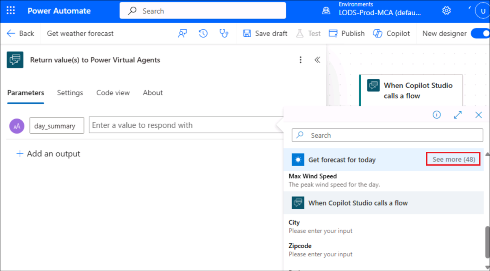
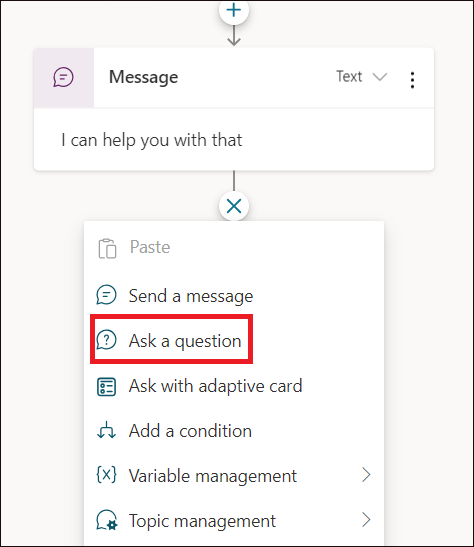
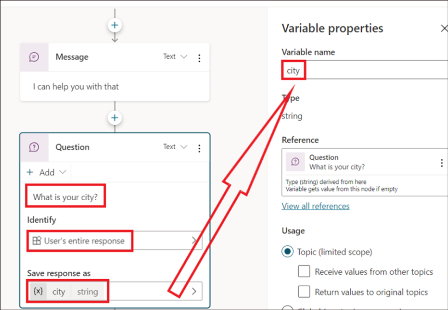
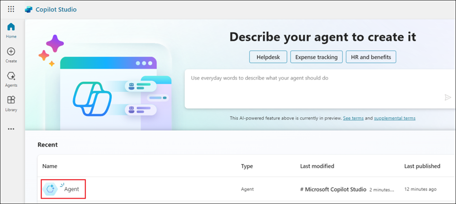

# **Lab 3B_Creating and deploying a Microsoft Copilot Studio copilot from Teams**

**Objective:**

In this lab, we will learn to create Copilots from Teams, add a channel
and send messages to it and then publish it.

**Lab duration:** 30 minutes

## **Exercise 1: Install the Copilot Studio app in Microsoft Teams**

1.  Open **Microsoft Teams** from the VM and sign in using your **Office
    365 tenant credentials**.

2.  Click on **Apps**. Search for +++**Copilot Studio**+++ and select
    **Microsoft Copilot Studio** and click on **Add**.

**Note:** If you are not able to find Copilot Studio, you will have to
search for and select **Power Virtual agent** and add it.

3.  Click on **Start now**.

## **Exercise 2: Create a new copilot in a team**

1.  Select **Contoso** and click on **Continue**.

2.  In the Create a copilot pane, provide the name of the Copilot as
    +++**HR Support Copilot**+++ and click on **Create**.

3.  A success message stating, **Your chatbot is provisioned** is
    obtained.

## **Exercise 3: Build an employee time-off topic for common time-off queries**

1.  Click on **Topics** from the left pane. Click on **+ New topic -\>
    From blank.**

**Note:** Close the Trigger phrases pane, if appears.

 

2.  Click on the **Details** icon.

3.  In the Details pane, provide the name as +++**Employee time off**+++
    and Description as +++**Employee time off topic for common time-off
    queries**+++.

4.  **Close** the Details pane.

5.  Click on the **Trigger phases.**

6.  Add in a trigger phrase, +++**I need help with time off**+++ and
    click on **+.**

7.  Add in the below trigger phrases.

- +++**Need information on time off**+++

- +++**I need help with time off**+++

- +++**How many days of paid vacation do I have**+++

- +++**What are the national holidays**+++

- +++**I need extended leave**+++

8.  Add a Message node and enter the text, +++*I can help with questions
    related to time-off+++*.

9.  As an HR employee, you know the most common time-off questions are
    about paid vacation time and national holidays. When a question node
    with user response options is added, the topic automatically gets a
    forked branch for each response.

10. Select the (**+**) icon below the message node, then select **Ask a
    question** to add a question node to the topic.

11. Enter *What information are you looking for?* in the **Ask a
    question** text box. The employee might ask this question.

12. Under **Options for user**, add +++Paid
    vacation*+++* and +++National Holidays*+++* as two options.

13. User choices are stored in a variable and the topic branches off,
    based on the option the user chooses. You can rename the variable to
    track it better in the topic.

14. On the variable, under **Save response as**, select the pencil icon
    to edit the variable properties.

15. The **Variable properties** pane opens. Rename the variable
    to +++*TimeoffType+++*. Close the **Variable properties** pane and
    you see the changes reflected in the authoring canvas.

16. Add a message node for the Paid vacation branch with this message to
    the user: +++**For paid vacation time-off, go to
    www.contoso.com/HR/PaidTimeOff**+++ to submit time-off requests.

17. Add a node by selecting the (**+**) icon to end the conversation
    with a survey. Select **End the conversation**, then **End with
    survey**. This survey is the customer satisfaction survey prebuilt
    in the copilot for use in topics.

18. In the *National Holidays* path, add a message node with the
    following text:

> National holidays for 2020:

1.  New Year's Day: January 1st

2.  Memorial Day: May 25th

3.  Independence day: July 4th

4.  Labor Day: September 7th

5.  Thanksgiving: November 26th - 27th

6.  Christmas Eve and Christmas Day: December 24th - 25th

19. Click on **Save**.

## **Exercise 4: Test copilot for expected behavior**

1.  Select the copilot icon at the bottom of the screen to launch the
    test copilot canvas.

2.  Type +++I need time off information+++ into the copilot chat.

3.  Select **Paid vacation**.

4.  You receive the response as per our configuration.

## **Exercise 5: Add channel and Team**

1.  Select **Teams** option in MS Teams.

2.  From the Teams, select **More options** and select **+ -\>**
    **Create team**.

3.  Name the team as +++**HR Team**+++ and select **Create**.

4.  Select **Skip** on ‘Add members to HR Team’ window.

5.  Select **More options** (…) infront of the **HR Team** and then
    select under **Add channel.**

6.  Provide the Channel name as +++**HR Experts**+++. Choose the Privacy
    as **Private** and click on **Create**.

7.  Select **Skip** on ‘Add members to the HR Experts channel’ window.

## **Exercise 6: Enhance topic to handle complex queries by escalating to HR experts**

1.  From the Teams app, select the Copilot Studio app(Power Virtual
    Agents), select **Copilots** tab and open the **HR Support
    Copilot**.

> **Note:** If Copilot Studio shortcut is not found, search for
> **Copilot Studio/Power Virtual Agents under Apps** and select
> **Open**)

2.  Select **Topics** from left pane and return to the topic you created
    earlier(**Employee time off**) and go to the authoring canvas.

3.  In the **Ask a question node**, add an option named ***Extended
    leave***.

4.  Under the Condition node of Extended leave, add a question node
    asking for a description for the issue and add the text +++**How
    would you describe the issue?***+++*

5.  Select **User’s entire response** under Identity and save the
    description in a variable named +++***Description**+++*.

6.  Select **Save**.

7.  Add a node under the question and select **Call an action**. Select
    **Create a flow** which launches the Power Automate within the
    Copilot Studio in Teams.

8.  Choose the **Power Virtual Agents Flow** Template option.

9.  Add a **Text** input field by clicking on **+ Add an input** in the
    first step. Replace the Input by **Description**.

10. Insert a **new step** and select **Add an action**.

11. Select **Microsoft Teams** under **Choose an operation**.

12. Select **Post message in a chat or channel**.

13. Provide the below details:

- Post as – **User**

- Post in – **Channel**

- Team – **HR Team**

- Channel – **HR Experts**

- Message **– Description** from **Dynamic Content**

14. Rename the flow as +++**Send a message to HR team**+++ and click on
    **Save**.

15. Click on **Close** to close the Power Automate and return to the
    Authoring canvas.

16. From the Authoring canvas, **add a node**(under the** Extended
    leave **branch) – **call an action** -\> **Send a message to HR
    team**.

17. Add in the input as **Description**.

18. Add in a message node with the message, +++**We notified the expert.
    They’ll reach out shortly**+++.

19. End the conversation \> End the survey.

20. Click on **Save** to save the topic.

21. A success message of **Topic saved** is obtained.

## **Exercise 7: Test your chatbot**

1.  Select **Test your chatbot** from the left pane.

2.  Send a message +++**I need help with time off**+++ and select
    Extended leave to answer the chatbot.

3.  Describe a reason for your leave extension. Here, we have given it
    as +++**I need extended leave of one month for travelling**+++.

4.  The bot replies with “We notified an expert…..” message.

## **Exercise 8: Check the message in Teams.**

1.  Click on Teams from the left menu of the MS Teams app.

2.  Select the **HR Experts** channel under the **HR Team** team. Notice
    that the message from the user to the bot has been sent here.

## **Exercise 9: Publish your copilot – Teams**

1.  Go back to Microsoft Copilot Studio app. Select the chatbot **HR
    Support Copilot**.

2.  Select Publish from the left pane.

3.  Click on **Publish**.

4.  Select Publish in the **Publish latest content?**

5.  Success message is obtained as in the screenshot below. Click on the
    **Availability options**.

6.  The **Add to Contoso** option adds the bot to the specific team.

7.  **Show to my team mates and shared users** makes the bot to appear
    under the Built by colleagues section.

8.  **Show to everyone in the org** submits the request to the admin to
    get the bot listed under the **Built by org** section.

> **Summary:**
>
> In this lab, we have learnt to add the Copilot Studio app to Teams and
> create a classic bot in Teams. We have also learnt to post a message
> to the Teams channel from the bot.
