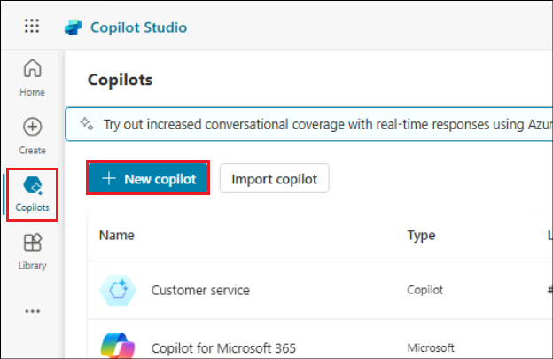

# ラボ3C：Copilot Studioを使用したGenAICopilotの構築

**目的**

このラボでは、自然言語理解（NLU）機能を拡張した Copilot
を作成し、ブーストする方法を学びます。AI-powered Copilot
のインテリジェントなオーサリングにより、新しいトピックを作成したり、既存のトピックを編集したりできます。Copilotに何をさせたいかを記述できます。また、一致するトピックがない場合は、Copilotが会話の応答を生成することもできます。

## 練習1：ジェネレーティブ・アンサーを有効にし、公開ウェブサイトを追加する

1.  まだログインしていない場合は、テナントの認証情報を使用して
    +++https://copilotstudio.microsoft.com/**+++
    にログインします。

2.  **Copilotを**選択し**、+ New copilotを**クリック**します。**

    

3.  プロンプトが表示されたら、**Skip to configureを**選択します。

    

4.  **+++Copilotforknowledge+++**と入力する。**知識の**追加を選択します。

    

5.  **公共ウェブサイト（Public Websites) を**選択する。

    

6.  **Public website
    link**」の下に「++\*\*https://www.microsoft.com/en-us/store/\*\*\*+++」
    と入力し、「**Add」を**クリックします。これは、Copilotが回答を生成するために使用するWebサイトになります。

    

7.  **Addを**クリックする。

    

8.  **作成**」をクリックする。

    

9.  Copilot が作成され、使用できる状態になっていることを確認します。

    

## 練習2：Copilotのテスト

1.  **テスト\]を**クリックして、\[**Copilotのテスト\]**ウィンドウを開きます。**+++What
    is your return policy?+++**

    

2.  Copilotはウェブサイトから情報を取得し、応答を返します。レスポンスには、その情報を見つけた場所へのリンクが表示され、フィードバックを提供することができます。

    

3.  **ホームに**戻るには**ホームを**クリックしてください。

    

**概要**

このラボでは、Copilotに対してGenerative
AIによる回答を可能にすることを学んだ。
