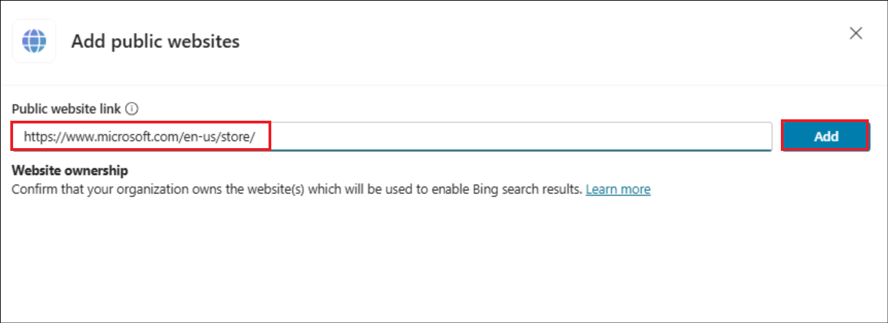
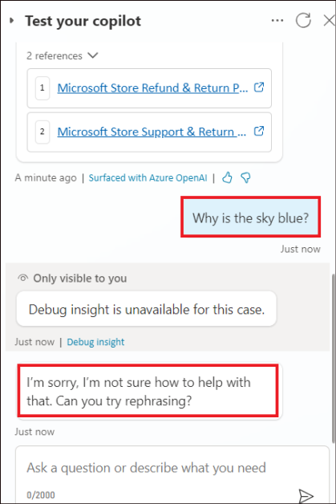

# **Lab 3C: Building a GenAI copilot with Copilot Studio**

**Objective**

In this lab, you will learn to create and boost a copilot with expanded
natural language understanding (NLU) capabilities. With intelligent
authoring of AI-powered copilots, create a new topic or edit an existing
one. You can describe what you want the copilot to do. Or, your copilot
can generate conversational responses, if there's no matching topic.

## **Exercise 1: Enable generative answers and add a public website**

1.  Login to
    +++**https://copilotstudio.microsoft.com/**+++
    using your tenant credentials if not already logged in.

2.  Select **Agents ** and then click on **+ New agent.**

    

3.  If prompted, select **Skip to configure**.

    

4.  Type +++**Copilotforknowledge**+++. Select **+ Add knowledge**.

    

5.  Select **Public websites**.

    

6.  Enter +++**https://www.microsoft.com/en-us/store/**+++ under
    **Public website link** and click on **Add**. This will be the website that
    the copilot will use for generating answers.

    

7.  Click on **Add**.

    

8.  Click on **Create**.

    

9.  Ensure that the copilot is created and ready to use.

    

## **Exercise 2: Test your copilot**

1.  Click on **Test** to open the **Test your copilot** pane. Type
    +++**What is your return policy?**+++

    

2.  The copilot retrieves information from the website and returns a
    response. The response provides a link to where it found that
    information and allows you to provide feedback.

    

3.  Try asking the copilot about something not on your fallback website.

    For example, type +++**Why is the sky blue?**+++. Since the copilot
can't find a relevant copilot topic or answer, it replies with a system
fallback topic and asks you to rephrase the question.

    

4.  Click on **Home** to navigate back to the Home page.

    

**Summary:**

In this lab, we have learnt to enable generative AI answering for a
copilot.
