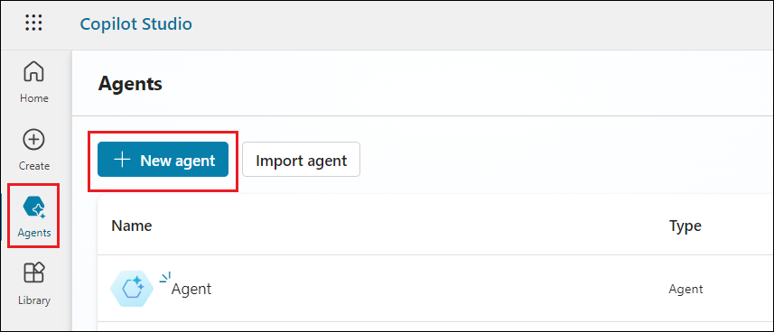
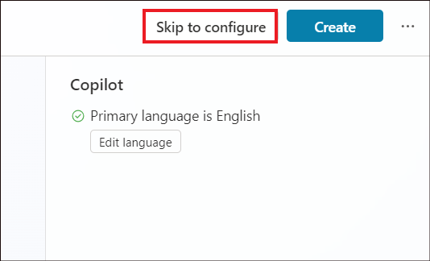
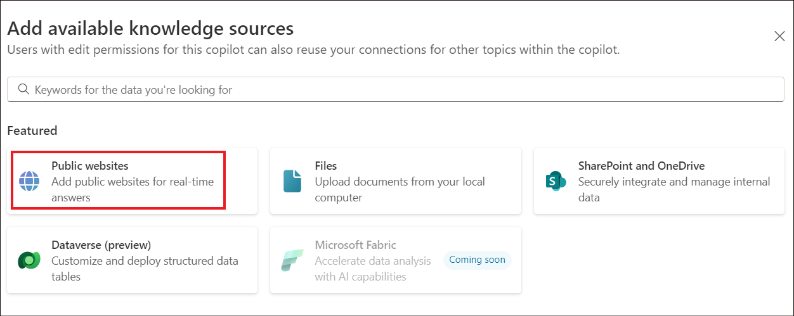
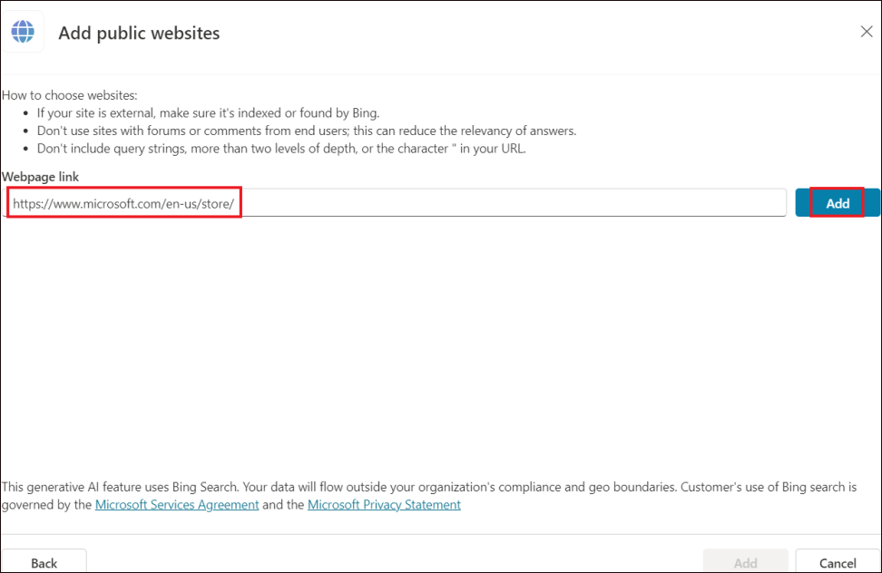
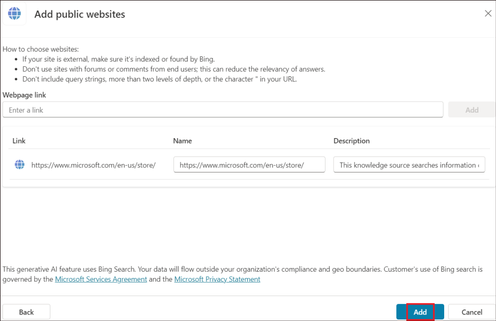
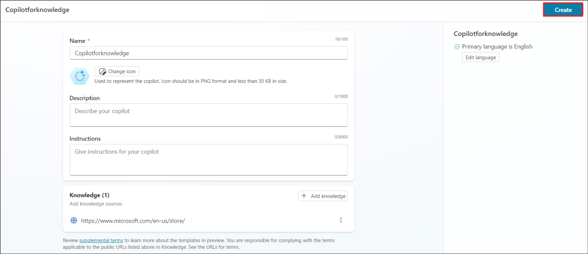
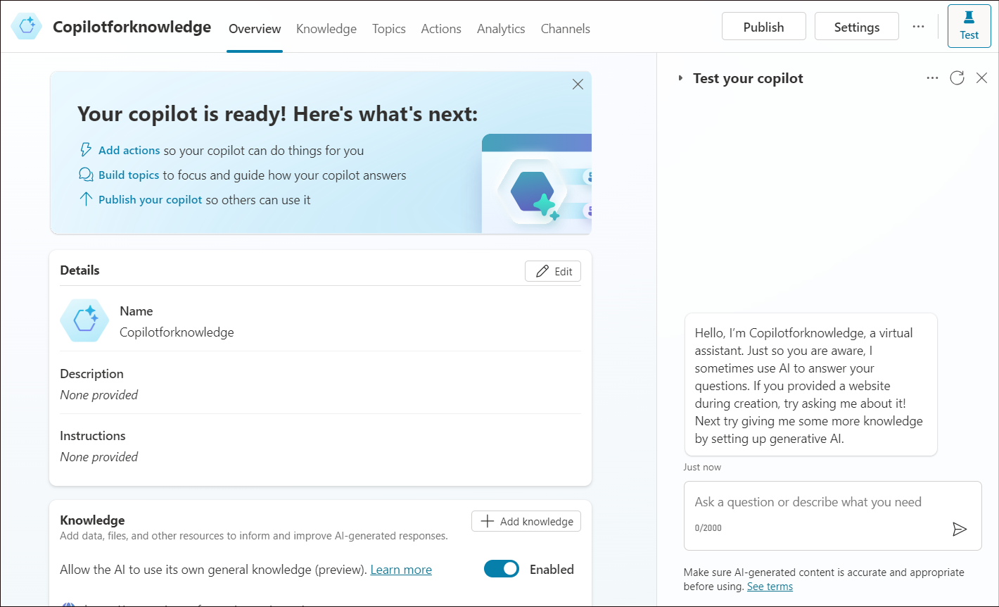
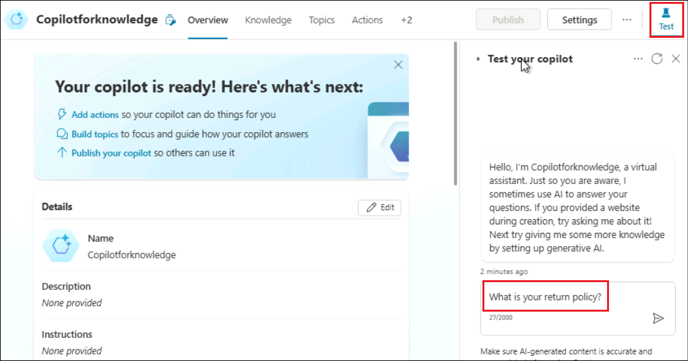
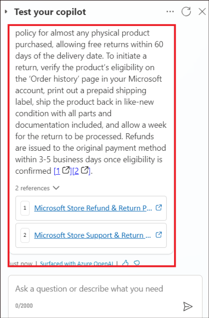
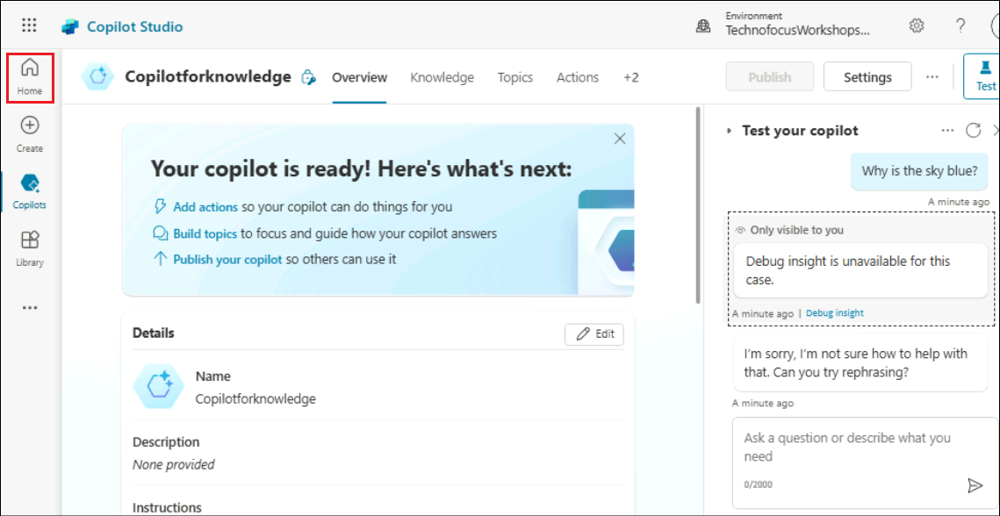

# Laboratorio 3C: Costruzione di un copilot GenAI con Copilot Studio

**Obiettivo**

In questo laboratorio imparerete a creare e potenziare un Copilot con
capacità estese di comprensione del linguaggio naturale (NLU - natural
language understanding). Con l'authoring intelligente dei Copilot
AI-powered, è possibile creare un nuovo argomento o modificarne uno
esistente. È possibile descrivere ciò che si desidera che il copilot
faccia. In alternativa, il copilot può generare risposte
conversazionali, se non c'è un argomento corrispondente.

## Esercizio 1: Abilitare le risposte generative e aggiungere un sito web pubblico

1.  Accedere a
    +++**https://copilotstudio.microsoft.com/**+++
    utilizzando le credenziali dell'inquilino, se non si è già
    effettuato l'accesso.

2.  Selezionare **Agents** e fare clic su **+ New agent**.

    

3.  Se richiesto, selezionare **Skip to configure**.

    

4.  Digitare **+++Copilotforknowledge+++**. Selezionare **+ Add
    knowledge**.

    

5.  Selezionare **Public websites**.

    

6.  Inserire
    +++**https://www.microsoft.com/en-us/store/**+++
    in **Public website link** e fare clic su **Add**. Questo sarà il
    sito web che Copilot utilizzerà per generare le risposte.

    

7.  Fare clic su **Add**.

    

8.  Fare clic su **Create**.

    

9.  Assicurarsi che il Copilot sia creato e pronto all'uso.

    

## Esercizio 2: prova del Copilot

1.  Fare clic su **Test** per aprire il riquadro **Test your copilot**.
    Digitare +++**What is your return policy?**+++

    

2.  Copilot recupera le informazioni dal sito web e restituisce una
    risposta. La risposta fornisce un link al sito in cui sono state
    trovate le informazioni e consente all'utente di fornire un
    feedback.

    

3.  Fare clic su **Home** per tornare alla pagina iniziale.

    

**Sintesi:**

In questo laboratorio abbiamo imparato ad abilitare la risposta dell'AI
generativa per un Copilot.
