Lab 1B: Empowering Project managers and IT workforce

Objective:

Copilot for Microsoft 365 serves as an AI-powered writing assistant
understands context, suggests phrases, and helps generate content, all
of which can enhance the quality of your work. In this lab, you will
use:

- Microsoft Copilot to summarize the information in a product spec and
  create a project plan to implement the product.

- Copilot in PowerPoint to create a presentation based on the project
  plan that you created.

- Copilot in Word to modify a technical specification report.

Exercise \#1: Create a project plan using Microsoft Copilot

With Microsoft Copilot seamlessly integrates into Microsoft 365 and
offers a robust platform for IT professionals to enhance teamwork, share
insights, and accelerate problem-solving within the IT ecosystem. It
enables IT professionals to connect instantly, share information, and
coordinate efforts efficiently.

As the Director of IT at Adatum Corporation, you've been reviewing a
product specification report for the Contoso CipherGuard Sentinel X7
network security product. You plan to install this product, which
provides advanced security protection that is far beyond anything Adatum
has today.

In this exercise you will use Microsoft Copilot in Bing

- Analyze a product specification report for a new network security
  product that you plan to install.

- Update the project plan with information from the product spec report.

**Note**: At the end of this exercise, you must save your project plan
to your OneDrive account. The next exercise uses this file.

1.  If you have a Microsoft 365 tab open in your Microsoft Edge browser,
    then select it now; otherwise, open a new tab and enter the
    following
    URL: +++[**https://www.office.com**](https://www.office.com)+++ to
    go to the Microsoft 365 home page.

**Note**: You need to sign-in (if prompted) using the **Microsoft 365
Credentials** provided under the **Resources tab** on the right.

2.  Browse to the **C:\LabFiles** folder to select and upload a copy of
    **Contoso CipherGuard Product Specification report.docx** to
    **OneDrive**.

> **Note**: You can skip this step, if you have already uploaded a copy
> of all the documents (that you will be using in this hands-on lab
> session from **C:\LabFiles** as instructed in **Lab 0**)**.**

3.  Open and close the file **Contoso CipherGuard Product Specification
    report.docx** (which you uploaded to **OneDrive**) to get it in your
    Most Recently Used (MRU) file list

> 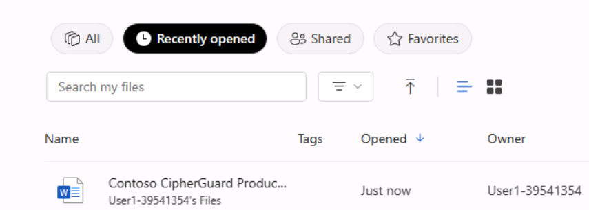 alt="A screenshot of a computer Description automatically generated" />

4.  In **Microsoft Edge**, navigate to Microsoft Bing by entering the
    following URL: +++[**https://bing.com**](https://bing.com)+++**.**

>  alt="A screenshot of a computer Description automatically generated" />

5.  On the **Microsoft Bing home page**, in the list of tabs that appear
    across the top of the page, select **Copilot**. Doing so
    opens **Microsoft Copilot**.

> 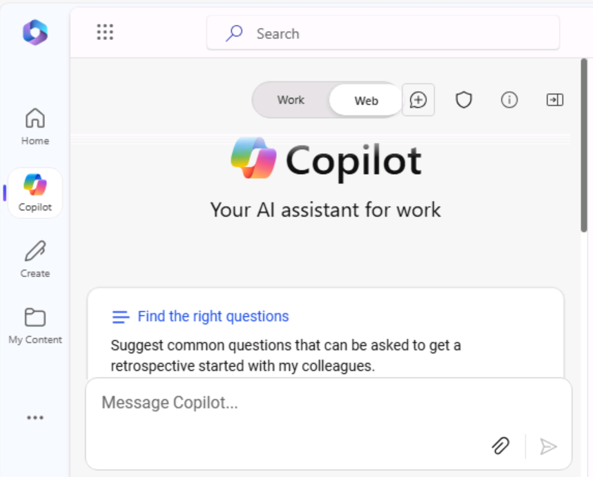
>
> **Note:** If you don’t see the list of tabs across the top of the
> page, please follow the steps below to view the list of tabs.

- Ensure you have signed-in using the **Microsoft 365 credentials**
  (available under the **Resources** tab).

> 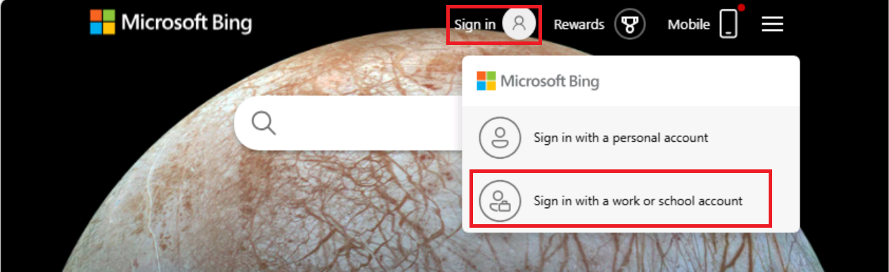 style="width:5.14864in;height:1.57919in" />

- Enable the option **Show menu bar** (in red highlight)

>  style="width:2.18413in;height:2.61283in" />

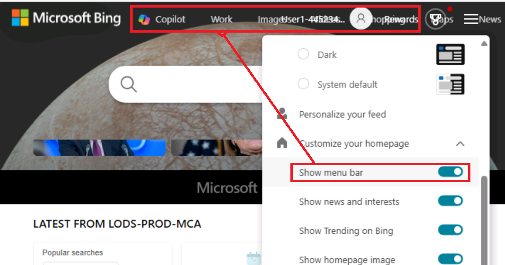

6.  Now select **Copilot**. Doing so opens Microsoft Copilot.

7.  On the **Copilot** page, in the **Work/Web** toggle switch at the
    top of the page, select **Work**.

8.  By default, the **Work** option limits Copilot's reach to your
    Microsoft 365 organizational data. However, since you also want
    Copilot to access the public web guidelines on installing a
    corporate network security product, you must enable the **Web
    content** plugin. To do so, in the prompt field at the bottom of the
    page, you should notice two icons - the paper clip icon, which is to
    attach files, and an icon of stacked blocks. This latter icon is the
    Plugins icon.

> 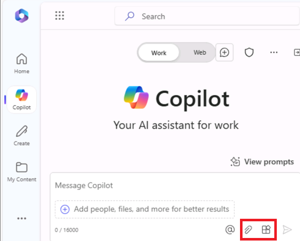 style="width:4.04972in;height:3.24658in" />

9.  Select this **Plugins** icon and enable **Web content** plugin.

> 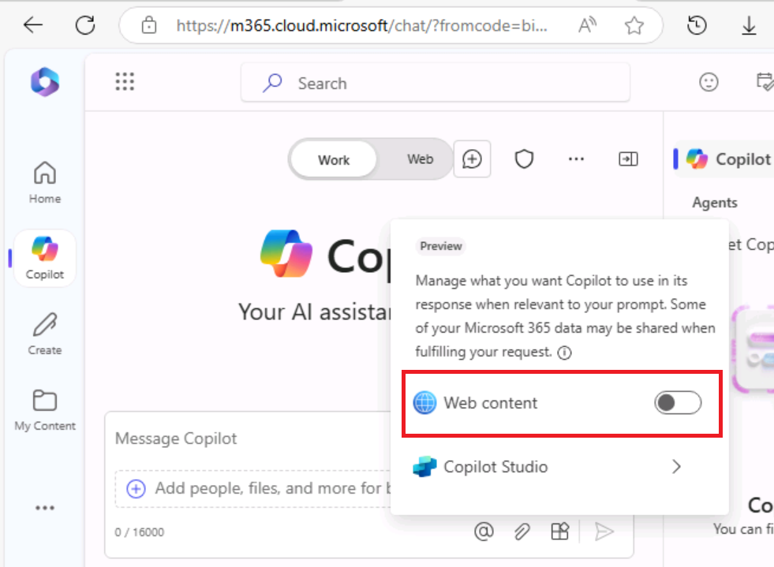 style="width:5.22119in;height:3.82674in" />
>
> 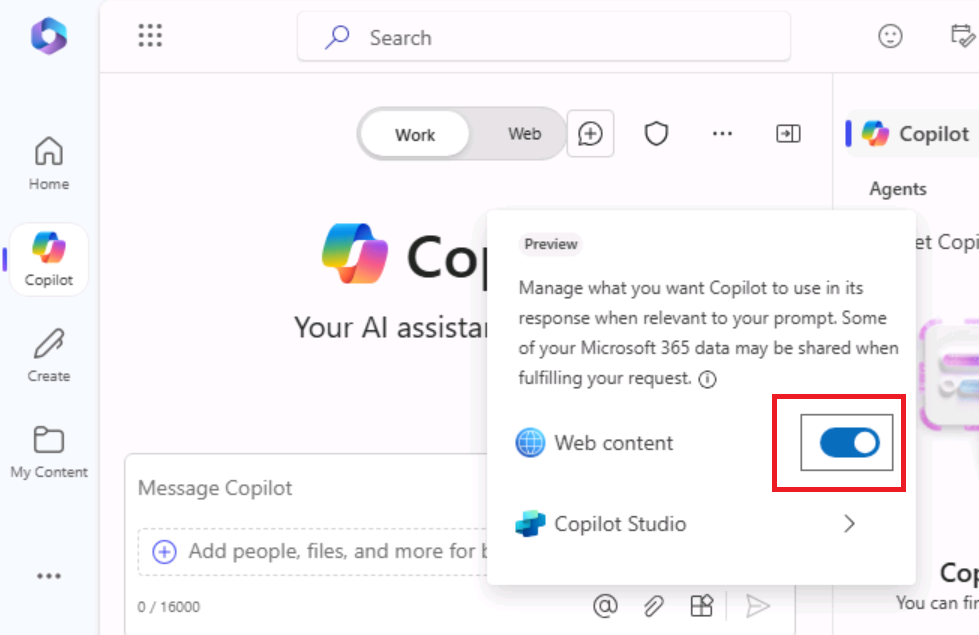

10. You're now ready to use Copilot. Enter the following prompt, which
    directs Copilot to access public web data through the **Web
    content** plugin to Microsoft Copilot, and then select
    the **Submit** arrow in the bottom corner of the prompt field:

> +++**I'm the Director of IT at Adatum Corporation. Create a project
> plan for installing a new network security product into a corporate
> network. Base this plan on IT industry guidelines for installing
> network security products**.+++
>
> 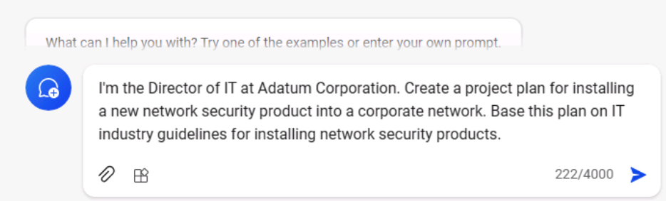 alt="A screenshot of a computer Description automatically generated" />

11. Review the project plan that Copilot created.

> 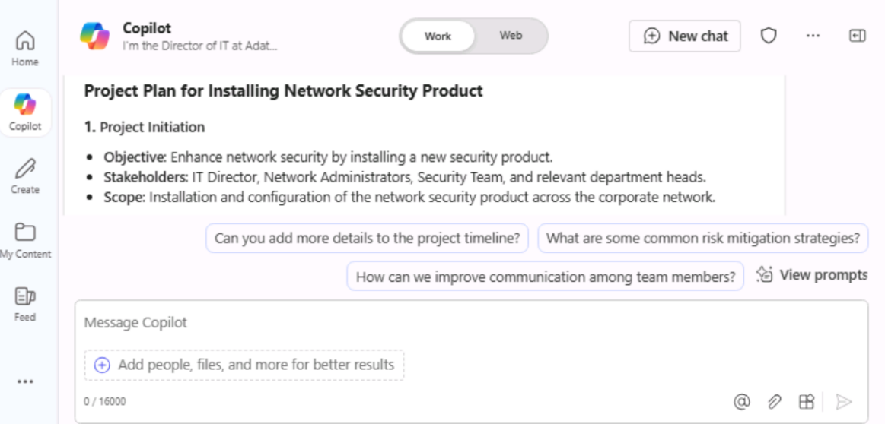 style="width:5.29691in;height:2.53986in" />

12. You aren't satisfied that it encompasses all the areas that it
    should. Enter the following prompt to have it amend its plan by
    including areas of specific interest to you. If any of the areas
    included in this prompt are already in Copilot's previous response,
    then remove them from this prompt so that Copilot doesn't duplicate
    them:

> +++**While that was a good start, I feel like it's missing important
> areas. Please add the following items to the existing list: testing
> and QA, training, communication, document and reporting, stakeholder
> analysis, project timeline, and risk assessment and mitigation.**+++
>
>  style="width:5.2923in;height:1.63377in" />
>
>  style="width:5.2797in;height:2.76307in" />

13. Review the amended project plan. You're happy with the breadth of
    topics covered, so now you want Copilot to update the plan with
    information from the product spec for the Contoso CipherGuard
    Sentinel X7 security product. Enter the following prompt, but don't
    submit it yet as you must first link the file to the prompt in the
    next step:

> +++**This version looks better. Please review the attached file, which
> is a product specification for the Contoso CipherGuard Sentinel X7
> security product, and update your project plan with information from
> this product spec**.+++
>
> 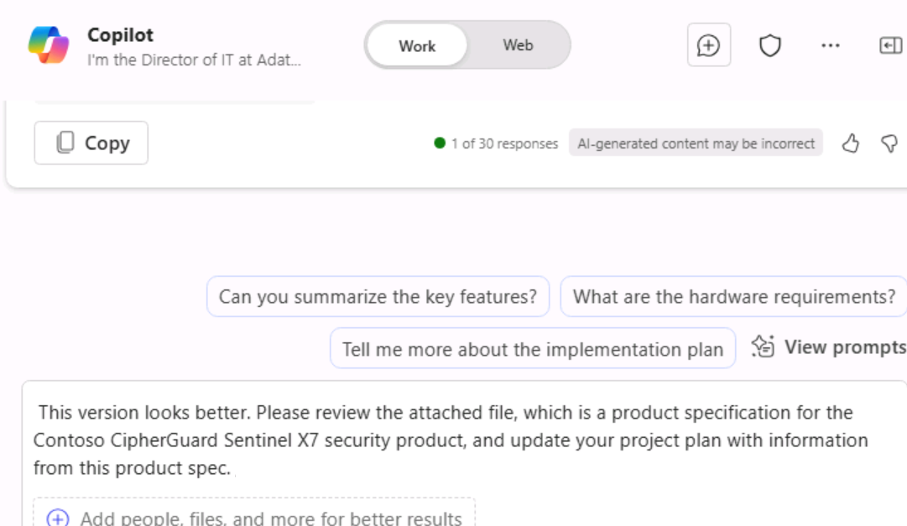 style="width:4.96736in;height:2.88116in" />

14. In the prompt field, enter a space after the prompt and then type a
    forward slash (/). You must enter the space before the forward slash
    so that Copilot recognizes it as a request to attach something to
    the prompt. Your next step depends on whether Copilot opens a window
    for you to select the file:

- If Copilot opens a window after you entered the forward slash (/),
  then select the **Files** tab. Doing so displays the list of MRU
  files. Select the **Contoso CipherGuard Product Specification** file
  and then select the **Submit** icon.

> 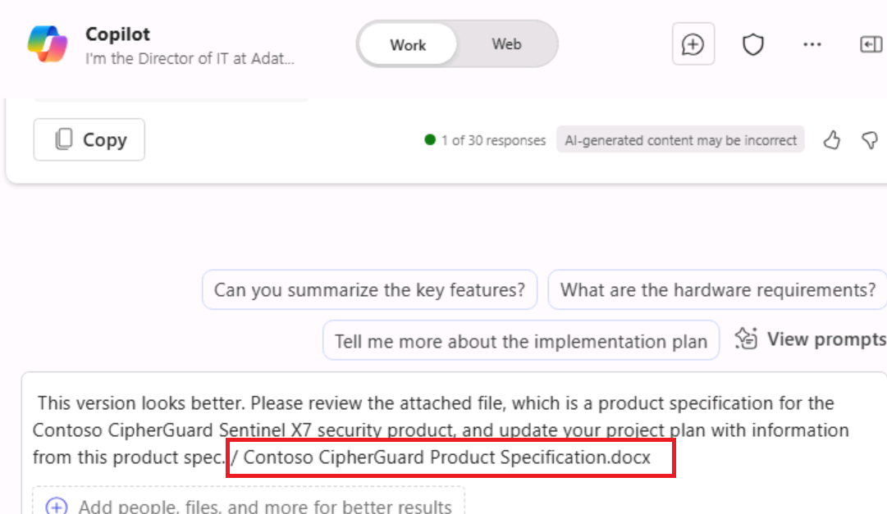 alt="A screenshot of a chat Description automatically generated" />

- If Copilot didn't do anything after you entered the forward slash (/),
  then you'll have to copy and paste in the link to the **Contoso
  CipherGuard Product Specification** file. To do so, locate the file in
  your OneDrive account, open it in **Word**, select
  the **Share** button that appears above the Word ribbon, select **Copy
  link** in the drop-down menu that appears, and then back in this
  prompt field, paste in the link following the forward slash and select
  the **Submit** icon.

> 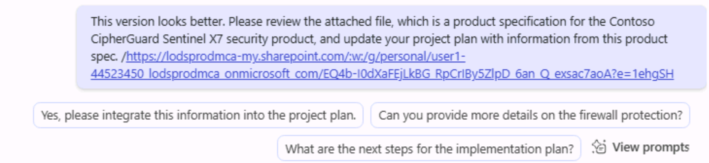 style="width:5.4962in;height:1.26892in" />
>
> **Note**: If Copilot is not able to directly access
> or review documents, Sign-out of the logged in user and sign-in once
> again and then continue from **step 9** once again.
>
> 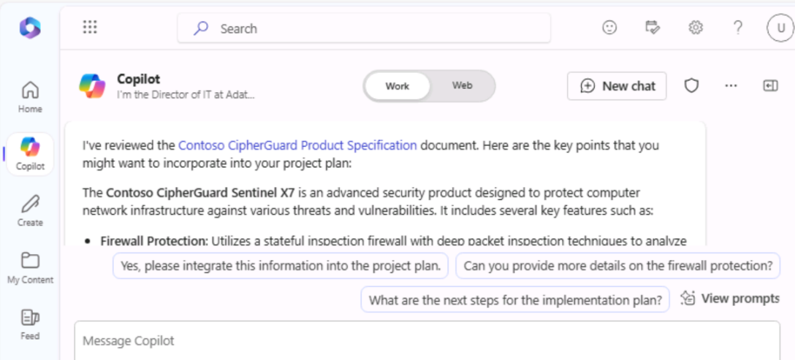 style="width:4.9422in;height:2.23975in" />
>
> **Note**: If you are unable to view and reference
> **Contoso CipherGuard Product Specification** document, then proceed
> to the next exercise. The project plan document is made available for
> you to proceed with the remaining lab activity.

15. Review how Copilot inserted features from the product spec into the
    project plan.

> 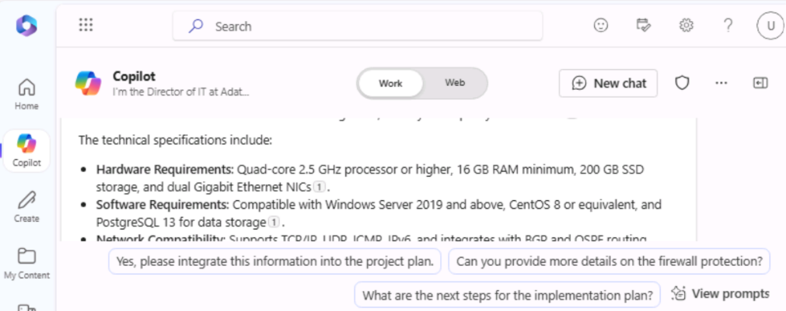 style="width:4.60359in;height:1.82385in" />

16. While this looks good, you feel that the project plan is lacking in
    specific details. To address this issue, enter the following prompt:

> **We're almost there. Please break down each item on the report into
> multiple detailed steps**.
>
>  style="width:4.77223in;height:2.13421in" />

17. Review the results.

>  style="width:4.42017in;height:1.89493in" />

18. Now that the project plan is created, you MUST save it to a Word
    document. **You'll use this project plan document in the next
    exercise**. At the bottom of Copilot's final response, select the
    **Copy** button to copy and paste the response in a **Word**
    document.

> 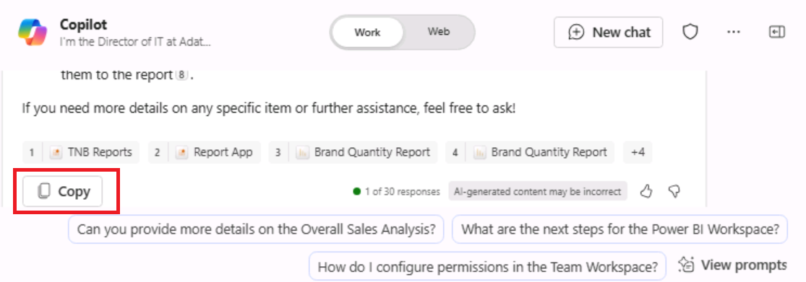 style="width:4.9051in;height:1.78819in" />

19. Save the file as **Contoso CipherGuard project plan.docx** in your
    OneDrive account that contains the product specification document
    that you used in this exercise. You'll use this file in the next
    exercise.

> 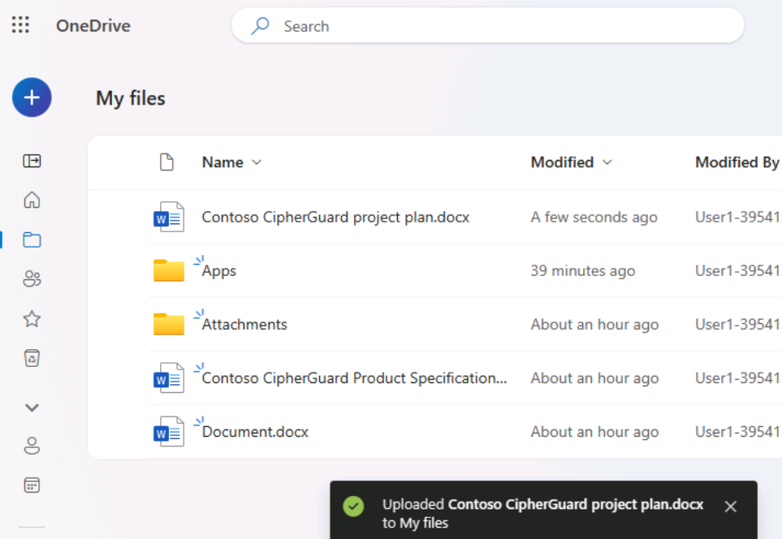 alt="A screenshot of a computer Description automatically generated" />
